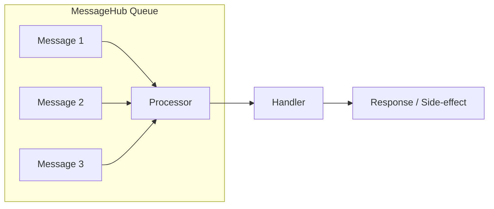
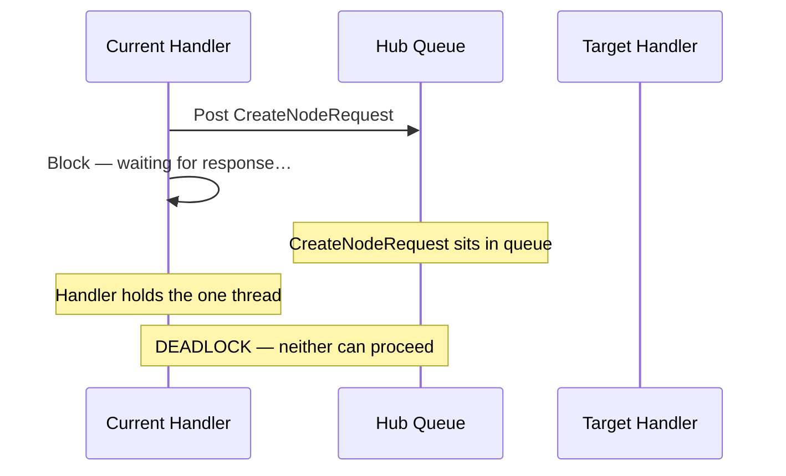

MeshWeaver's `MessageHub` is built on the **Actor Model**: every hub owns a private, single-threaded action block, and messages are processed one at a time in arrival order. That guarantee eliminates races and removes the need for locks on hub-local state — but it comes with a non-negotiable rule: **never block the hub thread**.

---

## Single-Threaded Processing

Each hub drains its internal queue sequentially. No two handlers run concurrently inside one hub.



The benefits fall out naturally:

| Guarantee | What it means in practice |
|---|---|
| No intra-hub races | State mutations inside a hub need no locks |
| Predictable order | Messages arrive and execute in FIFO order |
| Simple state management | Immutable record updates are enough |
| Safe reactive composition | `IObservable<T>` chains run in the same serialised block |

---

## The Deadlock Trap

### Why `AwaitResponse` to Self Deadlocks

`AwaitResponse` (now **obsolete** — see below) posts a request and synchronously blocks the calling thread until the reply arrives:

```csharp
// ⚠️ Obsolete API — do not use in new code
var response = await hub.AwaitResponse(
    new CreateNodeRequest(node),
    o => o.WithTarget(hub.Address));
```

When the caller *is* the hub's own handler, every step of that sequence fights itself:



1. Handler A is running (it owns the single thread).
2. Handler A posts a `CreateNodeRequest` targeting the same hub.
3. Handler A blocks, waiting for the response.
4. The request sits in the queue — but the queue's thread is blocked by Handler A.
5. Neither side can proceed. The hub is permanently wedged.

This is not a timing edge case — it is a structural certainty whenever a handler awaits a response from its own hub.

---

## The Fix: Reactive Streams (the Modern API)

> **The `AwaitResponse` and `RegisterCallback` APIs are `[Obsolete]`.** All hub-reachable code must use `IObservable<T>` end-to-end — no `await`, no `Task<T>`, no `TaskCompletionSource`. Tests may use `.FirstAsync().ToTask()` at the boundary; production code never does.

The correct pattern for any write that produces a side effect is `stream.Update(...)`, which returns a cold `IObservable<T>`. Subscribe in the handler; the framework serialises the write through the owning hub's action block without blocking anything.

```csharp
// CORRECT — reactive, non-blocking
.WithClickAction(ctx =>
{
    workspace.GetMeshNodeStream(nodePath)
        .Update(node => node with { Content = updatedContent })
        .Subscribe(
            _ => ctx.NavigateTo(overviewUrl),
            ex => logger.LogWarning(ex, "Update failed for {Path}", nodePath));
    // Returns immediately; the subscribe callback fires when the update lands
    return Task.CompletedTask;
});
```

**How this resolves the deadlock problem:**

1. The click handler builds the observable chain and subscribes — then returns immediately.
2. The hub's action block is free to process the next message.
3. When the `Update` reaches the owning hub (which may be the same hub), it runs as an ordinary queued message — no thread blocked, no deadlock possible.

For waiting on work completion, observe the resulting node state rather than blocking:

```csharp
// Wait for a node to reach a target state — no blocking
workspace.GetMeshNodeStream(nodePath)
    .Where(node => node.Content is MyContent c && c.Status == MyStatus.Done)
    .Take(1)
    .Timeout(TimeSpan.FromSeconds(30))
    .Subscribe(
        node => HandleCompletion(node),
        ex => logger.LogWarning(ex, "Timed out waiting for {Path}", nodePath));
```

---

## Cross-Hub Calls

When calling a *different* hub, there is no single-thread conflict. Use `hub.Observe(request, o => o.WithTarget(otherAddress))`:

```csharp
// Safe — different hub address, no shared single thread
hub.Observe<CreateNodeResponse>(
    new CreateNodeRequest(node),
    o => o.WithTarget(otherHubAddress))
.Subscribe(
    response => HandleResponse(response),
    ex => logger.LogError(ex, "Cross-hub call failed"));
```

The response arrives as an observable emission; the subscriber runs inside the *receiving* hub's action block, not the caller's — so neither side blocks.

---

## Decision Guide

| Scenario | Correct pattern |
|---|---|
| Mutate a node on this hub | `workspace.GetMeshNodeStream(path).Update(n => n with {...}).Subscribe(...)` |
| Mutate a node on a different hub | Same API — `GetMeshNodeStream` auto-dispatches cross-hub |
| Wait for a state change | `GetMeshNodeStream(path).Where(predicate).Take(1).Timeout(...).Subscribe(...)` |
| Call a different hub and handle the reply | `hub.Observe<TResponse>(request, o => o.WithTarget(addr)).Subscribe(...)` |
| Test boundary only | `await stream.FirstAsync().ToTask()` is acceptable |

---

## Debugging a Wedged Hub

### Symptoms

- The application silently hangs on a specific action (button click, form submit).
- No exception is thrown; execution simply stops.
- Logs show a message was posted but no handler fired.

### Finding the Cause

Search for patterns that block the hub thread:

```csharp
// Red flags — search for these in hub-reachable code
await hub.AwaitResponse(...)           // Obsolete + deadlock risk
hub.AwaitResponse(...).Result          // Even worse — sync-over-async
Task.Result / Task.Wait()              // Blocks the action block
```

Check [DebuggingMessageFlow.md](DebuggingMessageFlow.md) for trace tags that reveal where a message stopped flowing.

### Prevention

- **No `async`/`await` in hub handlers** — return `IObservable<T>`, not `Task<T>`.
- **No `TaskCompletionSource` in hub code** — if you find one, replace it with an observable chain.
- **Subscribe immediately in the handler body** — cold observables silently do nothing if not subscribed (the framework logs a `MeshWeaver.Mesh.RequireSubscribe` warning at GC time).

> Full patterns and the mistake ledger live in [AsynchronousCalls.md](AsynchronousCalls.md).

---

## Summary

The Actor Model gives MeshWeaver hubs thread-safety and predictable ordering for free — as long as handlers never block the single thread. The rule is simple: **return `IObservable<T>`, subscribe, and let the framework serialise writes**. Every deadlock in this codebase traces back to a handler that broke that rule.
