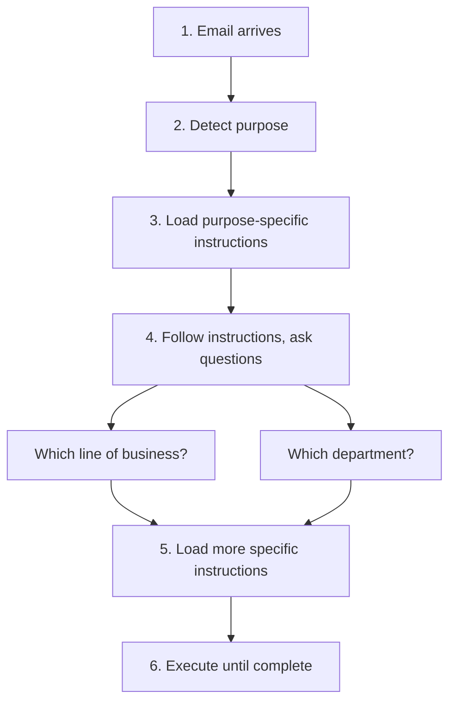
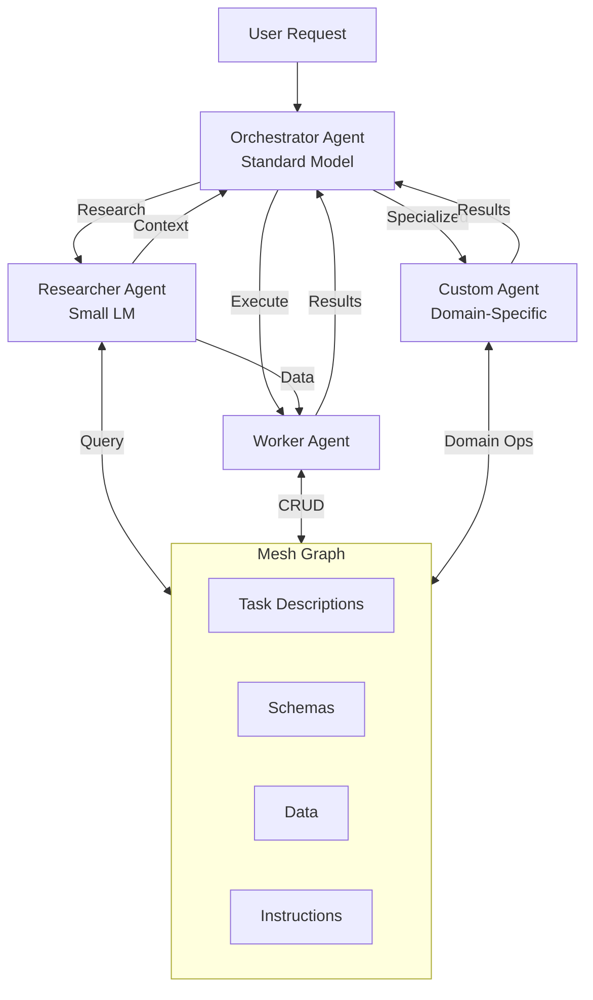
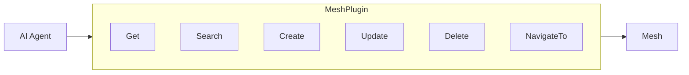
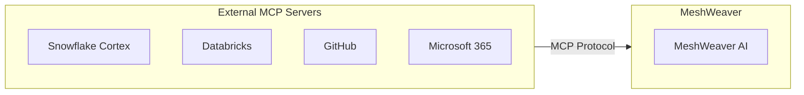
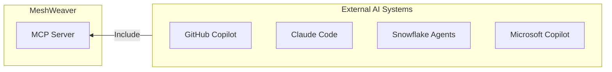

> **Scope:** this page is the *technical architecture* — how agents are defined, what tools they get, and how they collaborate inside the mesh. For the concepts-and-philosophy companion (what agentic AI is, traps, human-in-the-loop), see [Agentic AI — concepts](/Doc/AI/AgenticAI).

MeshWeaver integrates AI agents as first-class citizens. Agents can query data, navigate structures, execute tasks, and collaborate with one another — all through the same unified mesh references that every other component uses.
<svg xmlns="http://www.w3.org/2000/svg" viewBox="0 0 760 400" style="width:100%;max-width:760px;height:auto;display:block;margin:20px auto;">
  <defs>
    <marker id="ah" markerWidth="8" markerHeight="8" refX="6" refY="3" orient="auto">
      <path d="M0,0 L0,6 L8,3 Z" fill="currentColor" fill-opacity=".55"/>
    </marker>
    <marker id="ahw" markerWidth="8" markerHeight="8" refX="6" refY="3" orient="auto">
      <path d="M0,0 L0,6 L8,3 Z" fill="#fff" fill-opacity=".85"/>
    </marker>
  </defs>
  <rect x="270" y="155" width="220" height="90" rx="12" fill="#1e88e5"/>
  <text x="380" y="192" text-anchor="middle" font-family="sans-serif" font-size="14" font-weight="bold" fill="#fff">Mesh Graph</text>
  <text x="380" y="212" text-anchor="middle" font-family="sans-serif" font-size="11" fill="#fff" fill-opacity=".85">Instructions · Schemas · Data</text>
  <text x="380" y="230" text-anchor="middle" font-family="sans-serif" font-size="11" fill="#fff" fill-opacity=".85">Skills · Documentation</text>
  <rect x="20" y="30" width="150" height="52" rx="10" fill="#5c6bc0"/>
  <text x="95" y="52" text-anchor="middle" font-family="sans-serif" font-size="12" font-weight="bold" fill="#fff">Orchestrator</text>
  <text x="95" y="70" text-anchor="middle" font-family="sans-serif" font-size="10" fill="#fff" fill-opacity=".85">Standard Model</text>
  <rect x="20" y="120" width="150" height="52" rx="10" fill="#43a047"/>
  <text x="95" y="142" text-anchor="middle" font-family="sans-serif" font-size="12" font-weight="bold" fill="#fff">Researcher</text>
  <text x="95" y="160" text-anchor="middle" font-family="sans-serif" font-size="10" fill="#fff" fill-opacity=".85">Small LM</text>
  <rect x="20" y="210" width="150" height="52" rx="10" fill="#f57c00"/>
  <text x="95" y="232" text-anchor="middle" font-family="sans-serif" font-size="12" font-weight="bold" fill="#fff">Worker</text>
  <text x="95" y="250" text-anchor="middle" font-family="sans-serif" font-size="10" fill="#fff" fill-opacity=".85">CRUD · Execute</text>
  <rect x="20" y="300" width="150" height="52" rx="10" fill="#8e24aa"/>
  <text x="95" y="322" text-anchor="middle" font-family="sans-serif" font-size="12" font-weight="bold" fill="#fff">Custom Agent</text>
  <text x="95" y="340" text-anchor="middle" font-family="sans-serif" font-size="10" fill="#fff" fill-opacity=".85">Domain-Specific</text>
  <line x1="170" y1="56" x2="270" y2="185" stroke="currentColor" stroke-opacity=".4" stroke-width="1.5" marker-end="url(#ah)"/>
  <line x1="270" y1="180" x2="170" y2="145" stroke="currentColor" stroke-opacity=".4" stroke-width="1.5" marker-end="url(#ah)"/>
  <line x1="170" y1="146" x2="270" y2="190" stroke="currentColor" stroke-opacity=".4" stroke-width="1.5" marker-end="url(#ah)"/>
  <line x1="270" y1="195" x2="170" y2="235" stroke="currentColor" stroke-opacity=".4" stroke-width="1.5" marker-end="url(#ah)"/>
  <line x1="170" y1="236" x2="270" y2="200" stroke="currentColor" stroke-opacity=".4" stroke-width="1.5" marker-end="url(#ah)"/>
  <line x1="170" y1="325" x2="270" y2="220" stroke="currentColor" stroke-opacity=".4" stroke-width="1.5" marker-end="url(#ah)"/>
  <line x1="270" y1="215" x2="170" y2="320" stroke="currentColor" stroke-opacity=".4" stroke-width="1.5" marker-end="url(#ah)"/>
  <rect x="590" y="30" width="150" height="52" rx="10" fill="#26a69a"/>
  <text x="665" y="52" text-anchor="middle" font-family="sans-serif" font-size="12" font-weight="bold" fill="#fff">Claude Code</text>
  <text x="665" y="70" text-anchor="middle" font-family="sans-serif" font-size="10" fill="#fff" fill-opacity=".85">GitHub Copilot</text>
  <rect x="590" y="120" width="150" height="52" rx="10" fill="#26a69a"/>
  <text x="665" y="142" text-anchor="middle" font-family="sans-serif" font-size="12" font-weight="bold" fill="#fff">MS Copilot</text>
  <text x="665" y="160" text-anchor="middle" font-family="sans-serif" font-size="10" fill="#fff" fill-opacity=".85">Snowflake · AWS</text>
  <rect x="590" y="210" width="150" height="52" rx="10" fill="#e53935"/>
  <text x="665" y="232" text-anchor="middle" font-family="sans-serif" font-size="12" font-weight="bold" fill="#fff">External MCP</text>
  <text x="665" y="250" text-anchor="middle" font-family="sans-serif" font-size="10" fill="#fff" fill-opacity=".85">Snowflake · GitHub</text>
  <rect x="590" y="300" width="150" height="52" rx="10" fill="#e53935"/>
  <text x="665" y="322" text-anchor="middle" font-family="sans-serif" font-size="12" font-weight="bold" fill="#fff">Databricks</text>
  <text x="665" y="340" text-anchor="middle" font-family="sans-serif" font-size="10" fill="#fff" fill-opacity=".85">Microsoft 365</text>
  <line x1="590" y1="56" x2="490" y2="185" stroke="currentColor" stroke-opacity=".4" stroke-width="1.5" marker-end="url(#ah)"/>
  <line x1="490" y1="180" x2="590" y2="145" stroke="currentColor" stroke-opacity=".4" stroke-width="1.5" marker-end="url(#ah)"/>
  <line x1="590" y1="146" x2="490" y2="190" stroke="currentColor" stroke-opacity=".4" stroke-width="1.5" marker-end="url(#ah)"/>
  <line x1="490" y1="195" x2="590" y2="235" stroke="currentColor" stroke-opacity=".4" stroke-width="1.5" marker-end="url(#ah)"/>
  <line x1="490" y1="200" x2="590" y2="320" stroke="currentColor" stroke-opacity=".4" stroke-width="1.5" marker-end="url(#ah)"/>
  <line x1="590" y1="230" x2="490" y2="200" stroke="currentColor" stroke-opacity=".4" stroke-width="1.5" marker-end="url(#ah)"/>
  <line x1="590" y1="325" x2="490" y2="210" stroke="currentColor" stroke-opacity=".4" stroke-width="1.5" marker-end="url(#ah)"/>
  <text x="185" y="20" text-anchor="middle" font-family="sans-serif" font-size="11" fill="currentColor" fill-opacity=".55">Internal Agents</text>
  <text x="575" y="20" text-anchor="middle" font-family="sans-serif" font-size="11" fill="currentColor" fill-opacity=".55">External AI / MCP</text>
  <text x="380" y="380" text-anchor="middle" font-family="sans-serif" font-size="11" fill="currentColor" fill-opacity=".55">Bidirectional MCP</text>
  <line x1="270" y1="245" x2="270" y2="350" stroke="currentColor" stroke-opacity=".25" stroke-width="1" stroke-dasharray="4,3"/>
  <line x1="490" y1="245" x2="490" y2="350" stroke="currentColor" stroke-opacity=".25" stroke-width="1" stroke-dasharray="4,3"/>
  <line x1="270" y1="350" x2="490" y2="350" stroke="currentColor" stroke-opacity=".25" stroke-width="1"/>
  <text x="380" y="370" text-anchor="middle" font-family="sans-serif" font-size="10" fill="currentColor" fill-opacity=".4">MCP Server · MeshPlugin Tools</text>
</svg>

*The Mesh Graph is the central knowledge hub — internal agents discover context from it dynamically, and external AI systems connect to it via bidirectional MCP.*

# Design Philosophy

## Self-Guided Discovery

Traditional agent architectures front-load everything into a system prompt: schemas, business rules, examples, edge cases. As the domain grows, that prompt grows — fragile, expensive, and hard to maintain.

MeshWeaver agents take a different approach: **they find documentation as they go**. Rather than encoding all knowledge upfront, agents dynamically discover context from the mesh itself. The mesh is the system prompt.

### Example: Email Processing Workflow

The following diagram shows how an agent handles an incoming email without any domain knowledge baked in at start-up:



1. An email arrives and triggers agent processing.
2. The agent detects the email's purpose (inquiry, claim, request).
3. Based on purpose, it loads instructions from the mesh — e.g. `Insurance/Claims/Instructions`.
4. Those instructions guide the agent to gather more context: line of business, responsible department.
5. The agent loads department-specific instructions and schemas.
6. Execution continues with full context until the task completes.

Because instructions live in the mesh, updating business rules requires no code change and no prompt rewrite — just edit the relevant node.

## Agents as Data Elements

Agents are stored as ordinary nodes in the mesh hierarchy, alongside the data they act on:

```
Insurance/
  Claims/
    Agent/              <- Agents for this node
      Researcher
      Worker
      ClaimsProcessor   <- Custom agent for claims
    Submissions/
      ...
```

When a task is invoked, MeshWeaver selects the **lowest agent in the hierarchy that is marked as an entry agent**. This gives you:

- Problem-specific agents at the leaves for fine-grained control
- Generic fallback agents at higher levels for broad coverage
- The ability to override behaviour at any level without touching code

# Multi-Agent Collaboration

Agents rarely work alone. MeshWeaver orchestrates teams of specialised agents, each sized for its job:



## Agent Roles

| Agent | Model Size | Purpose |
|-------|------------|---------|
| **Orchestrator** | Standard | Understands the situation, plans the work, dispatches sub-tasks |
| **Researcher** | Small LM (GPT-3.5, Haiku) | Gathers context and searches data cheaply |
| **Worker** | Medium | Performs CRUD operations and executes dispatched write steps |
| **Custom** | Configurable | Domain-specific tasks — claims processing, underwriting, etc. |

Custom agents are ordinary Agent nodes in the mesh. They inherit from a base agent and add domain-specific instructions, tools, and behaviours — no code required.

# Custom Skills

Define **skills** to provide detailed, step-by-step instructions for specific operations. Skills live in the mesh alongside the data they operate on (a skill is "a thing that does something" — see [ChatCommands](/Doc/AI/ChatCommands)):

```
Insurance/Claims/
  Skill/
    import.md      <- /import skill instructions
    validate.md    <- /validate skill instructions
    assign.md      <- /assign skill instructions
```

**Example `/import` skill:**
```markdown
# Import Skill

This skill imports claims from external sources.

## Steps
1. Validate the source format (CSV, JSON, XML)
2. Map fields to Claims schema
3. Check for duplicates using claim reference number
4. Create new claim records
5. Trigger validation workflow

## Required Fields
- claimReference, policyNumber, lossDate, description
```

Skills are context-aware and discoverable. An agent handling a claims task will find and follow `Insurance/Claims/Skill/import.md` automatically — no wiring needed.

# MeshPlugin Tools

Agents interact with the mesh through `MeshPlugin`, which exposes a concise set of operations:



## Read Operations

**Get** — Retrieve a node or its children by path:
```
Get("@Insurance/Claims/CLM-2024-001")     -> Returns claim JSON
Get("@Insurance/Claims/*")                -> Returns all claims (children)
```

**Get with Unified Path prefixes** — Access schemas and data models without knowing the underlying storage:
```
Get("@Cornerstone/schema/")             -> JSON Schema for content type
Get("@Cornerstone/schema/Pricing")      -> Schema for a specific named type
Get("@Cornerstone/model/")              -> Full data model with all types
```

**Search** — Query with GitHub-style syntax:
```
Search("nodeType:Claim status:Open")        -> All open claims
Search("name:*property*")                   -> Name contains 'property'
Search("lob:Commercial", "@Insurance")      -> Commercial LOB under Insurance
```

## Write Operations

**Create** — Create new nodes:
```
Create('{"id": "CLM-2024-002", "namespace": "Insurance/Claims",
  "name": "Property Damage Claim", "nodeType": "Claim",
  "content": {"status": "Open"}}')
```

**Update** — Modify existing nodes. The canonical workflow is Get → modify → Update:
```
// 1. Get existing: result = Get("@Insurance/Claims/CLM-2024-001")
// 2. Modify the JSON
// 3. Pass as array:
Update('[{"id": "CLM-2024-001", "namespace": "Insurance/Claims",
  "name": "Updated Claim", "nodeType": "Claim",
  "content": {"status": "Closed"}}]')
```

**Delete** — Remove nodes by path:
```
Delete('["Insurance/Claims/CLM-2024-002"]')
```

## Navigation

**NavigateTo** — Display a node's view in the UI:
```
NavigateTo("@Insurance/Claims/CLM-2024-001")  -> Shows claim detail view
```

## Path Shorthand & Unified Path

The `@` prefix is a convenient shorthand. Unified Path prefixes let agents address specific resource types without knowing the underlying structure:

| Syntax | Returns |
|--------|---------|
| `@Insurance/Claims/CLM-001` | Full node JSON |
| `@Insurance/Claims/*` | Direct children |
| `@Cornerstone/schema/` | Content type JSON Schema |
| `@Cornerstone/schema/TypeName` | Schema for a specific named type |
| `@Cornerstone/model/` | Full data model |

# Including External MCP Servers

MeshWeaver supports the **Model Context Protocol (MCP)** so agents can reach out to any compatible external tool provider:



**Available integrations:**

| Server | Capabilities |
|--------|-------------|
| **Snowflake Cortex** | AI/ML functions, document processing |
| **Databricks** | Unity Catalog, ML models, notebooks |
| **GitHub** | Repository access, code search, issue management |
| **Microsoft 365** | Email, calendar, documents, Teams |
| **Any MCP server** | Any compatible tool provider |

Tools from external MCP servers appear automatically in agent context — no additional wiring required.

# Exposing MeshWeaver as an MCP Server

The relationship is bidirectional. MeshWeaver also acts as an MCP server, so external AI systems can include MeshWeaver as a tool provider:



**Common use cases:**

- **GitHub Copilot / Claude Code**: Read task descriptions and prompts from MeshWeaver, then execute using external agents
- **Microsoft Copilot**: Query live business data while composing Word documents or emails
- **Snowflake Agents**: Access organisational context and workflows
- **Custom integrations**: Any MCP-compatible AI system

### MCP Server Tools

The MCP server exposes the same operations as the internal MeshPlugin, so external AI systems get full mesh access:

| Tool | Description |
|------|-------------|
| **Get** | Retrieve nodes by path. Supports `@` shorthand, `/*` for children, and Unified Path prefixes (`schema:`, `model:`) |
| **Search** | Query nodes using GitHub-style syntax with optional base path scoping |
| **Create** | Create new nodes from JSON MeshNode objects |
| **Update** | Update existing nodes (pass a JSON array of complete MeshNode objects) |
| **Delete** | Delete nodes by path (pass a JSON array of path strings) |
| **NavigateTo** | Returns a browser URL to view a node in the MeshWeaver UI |

> **External vs. internal NavigateTo**: When called from an external system, `NavigateTo` returns a URL such as `https://app.example.com/node/Insurance%2FClaims` rather than rendering inline, because external consumers operate outside the MeshWeaver UI.

**Example — Claude Code using MeshWeaver MCP:**
```
Get("@Cornerstone/Claims/*")              -> List all claims
Get("@Cornerstone/schema/")               -> Get content type schema
Search("nodeType:Claim status:Open")      -> Find open claims
Create('{"id": "CLM-NEW", ...}')          -> Create a claim
```

# Alternative AI APIs

Some platforms provide dedicated APIs alongside MCP for direct AI access:

| Platform | API Type | Example use case |
|----------|----------|-----------------|
| **Snowflake** | SQL (Cortex functions) | `SELECT SNOWFLAKE.CORTEX.SENTIMENT(text)` |
| **Azure OpenAI** | REST API | Direct model access |
| **Databricks** | REST / SDK | Model serving endpoints |
| **AWS Bedrock** | REST API | Foundation models |

These APIs are used when a hub needs to invoke AI from an external system directly:

```sql
-- Snowflake Cortex via SQL
SELECT
  claim_id,
  SNOWFLAKE.CORTEX.SUMMARIZE(description) as summary,
  SNOWFLAKE.CORTEX.SENTIMENT(customer_feedback) as sentiment
FROM claims
WHERE status = 'Open'
```

# Agent Context Discovery

At runtime, an agent builds its context from the mesh — no pre-loaded knowledge required:

1. **Task Descriptions** — Markdown nodes that explain what needs to be done
2. **Data Schemas** — NodeType definitions with field metadata and validation rules
3. **Custom Skills** — `/skill` instruction nodes for specific operations
4. **Domain Knowledge** — Documentation distributed throughout the hierarchy

This keeps agents thin at start-up and rich in context by the time they act.

# Summary of Benefits

| Benefit | How it works |
|---------|-------------|
| **Adaptability** | Agents read instructions from the mesh; update rules without touching code |
| **Hierarchical override** | Deploy specialised agents at any level; generic agents fall back naturally |
| **Collaboration** | Orchestrator + researcher + worker pattern keeps each model sized for its task |
| **Custom agents** | Create domain-specific Agent nodes without writing new agent code |
| **Bidirectional MCP** | Connect any external AI tool inbound; expose MeshWeaver outbound |
| **Transparency** | Every agent action is a mesh operation — observable, auditable, reproducible |
