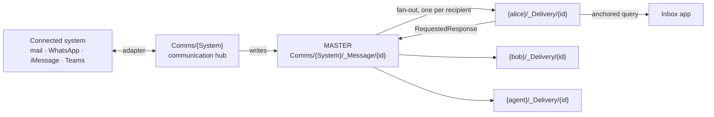

# The Communication Hub

Everything a person, an agent or an external system needs to be told — an approval to grant, a
question to answer, a job that finished — is **one message type family, delivered through one
fan-out, and read from one anchored inbox**. This page is the architecture: the participant
registry, the message types, the master-plus-copies delivery model, the per-system hub, and the
settings surface that registers a provider.

It generalises what already ships. [Notifications](/Doc/Architecture/Notifications) is the
special case where nothing is expected back; this page is the general case where something is.

## 1. The shape, in one picture



Three nouns carry the whole design:

| Noun | Is | Lives at |
|---|---|---|
| **Participant** | anyone or anything that can send or receive — a person, an agent, an external system, or a *configured channel account* (a mailbox, a WhatsApp number, an iMessage handle) | `Comms/_Participant/{id}` |
| **Message** | one typed communication — `ApprovalRequest`, `Notification`, `InformationRequest`, … | master at `Comms/{System}/_Message/{id}` |
| **Delivery** | one recipient's copy of a message, carrying *that party's* state | `{party}/_Delivery/{id}` |

## 2. Participants — the registry

🚨 **Every endpoint is registered, including the configured channel accounts themselves.** The
mailbox the platform sends from, the WhatsApp number it answers on, the iMessage handle — these are
not configuration buried in `appsettings`; they are participants, with the same identity shape as a
person. That is what lets an inbox row say *who* a message came from and *over what*, uniformly,
and what lets a reply be routed back the way it arrived.

```csharp
public record Participant
{
    [Key] public string Id { get; init; } = Guid.NewGuid().ToString();

    /// <summary>Display name — "Work mailbox", "Approvals bot", a person's display name.</summary>
    public string Name { get; init; } = string.Empty;

    /// <summary>WHAT this participant is — a <see cref="ParticipantKind"/> constant.</summary>
    public string Kind { get; init; } = ParticipantKind.Person;

    /// <summary>HOW it is reached — a <see cref="TransportKind"/> constant.</summary>
    public string Transport { get; init; } = TransportKind.InApp;

    /// <summary>The address ON that transport — the id a human recognises.</summary>
    /// <remarks>An email address, an E.164 phone number, a Teams conversation id, a handle.</remarks>
    public string? Address { get; init; }

    /// <summary>The party's mesh partition, when it has one. Null for a purely external party.</summary>
    [MeshNode] public string? MeshAddress { get; init; }

    /// <summary>Which way traffic may flow — a <see cref="TransportDirection"/> constant.</summary>
    public string Direction { get; init; } = TransportDirection.Both;

    /// <summary>A REFERENCE to the credential, never the secret itself.</summary>
    [Browsable(false)] public string? CredentialRef { get; init; }

    public bool Enabled { get; init; } = true;
}
```

### 🚨 These vocabularies are STRING CONSTANTS, never enums

Every closed vocabulary here — the kind, the transport, the direction — is a `static class` of
`const string`, **named exactly as the enum would have been**:

```csharp
public static class TransportKind
{
    public const string InApp    = "InApp";
    public const string Email    = "Email";
    public const string Teams    = "Teams";
    public const string WhatsApp = "WhatsApp";
    public const string IMessage = "IMessage";
    public const string Sms      = "Sms";
    public const string Webhook  = "Webhook";
    public const string Log      = "Log";
}

public static class ParticipantKind
{
    public const string Person         = "Person";
    public const string Agent          = "Agent";
    public const string System         = "System";
    public const string ChannelAccount = "ChannelAccount";
}
```

🚨 **And these sets are a starting point, never the permitted set.** A module, a satellite or a
customer deployment declares its **own** constants class and puts its own transport in the same
field — no registration, no allow-list, no change to core. That is what makes the hub extensible at
all: a channel nobody here has heard of is carried, stored, queried and rendered like any other, and
routed to whoever declared it.

The general rule, the two obligations it imposes on consumers (never validate against the platform's
own set; never let an unknown value take a meaningful default), and when an `enum` is still correct
are in **[Open Vocabularies Are String Constants](/Doc/Architecture/OpenVocabulariesAsStringConstants)**
— policy `open-vocabulary-string-constants`.

`Address` is the field the inbox row renders beside the transport glyph — a masked mail address or
phone number. **`CredentialRef` names a credential; it never carries one.** The hub resolves it, the
same encapsulation the plugin registry uses — see [Plugin Registry](/Doc/Architecture/PluginRegistry).

### Participant vs. NotificationChannel — two different things, both kept

`NotificationChannel` (`{user}/_NotificationChannel/{id}`) already exists and **stays**. The
distinction is worth stating because collapsing them is the obvious mistake:

- a **Participant** is an *identity* — this mailbox exists, this number is ours;
- a **NotificationChannel** is a *preference* — "reach me at this one".

A channel references a participant. `TransportKind` is the shared vocabulary, so the existing
`NotificationChannelKind` **enum** is converted to those constants and gains `WhatsApp`, `IMessage`,
`Sms`, `Webhook`, `Log`.

🚨 **That conversion is the migration the rule is built for.** `NotificationChannelKind` is a
`public` enum in `MeshWeaver.Mesh.Contract`; keeping the name and the member spellings means every
`NotificationChannelKind.Email` at every call site is untouched — only the declaration and the field
type change. Widening it *as an enum* would instead have broken every exhaustive `switch` under
`-warnaserror`, including in in-mesh NodeType sources that no `dotnet build` type-checks.

## 3. Message types — a family, not a switch

A message is a **node whose content type names what it is**. Adding a kind is adding a node type,
not editing a dispatcher:

| Type | Expects a reply | Terminal states |
|---|---|---|
| `Notification` | no | *(read)* |
| `ApprovalRequest` | yes, from each addressee | `Approved` · `Declined` · `Withdrawn` · `Expired` |
| `ApprovalResponse` | — | *(folds into its request)* |
| `InformationRequest` | yes | `Answered` · `Withdrawn` · `Expired` |
| `InformationResponse` | — | *(folds into its request)* |

Shared content: `ConversationId`, `From` (participant), `To` (participants), `Subject`, `Body`,
`About` (the node the message concerns), `CreatedAt`, `DueAt`; a response adds `InReplyTo`.

### 🚨 These are NODE CONTENT types, not wire messages

This is the one place the design can be misread into the exact antipattern the repo forbids. A type
called `ApprovalRequest` looks like the `XxxRequest`/`XxxResponse` pair that
[Data Access Patterns](/Doc/Architecture/DataAccessPatterns) rules out — and it is **not** one.

- ❌ There is no `IRequest<ApprovalResponse>`, no `hub.Post(new ApprovalRequest(...))`, no bespoke
  handler pair. A wire verb that mutates state races the watcher and wedges a hub.
- ✅ `ApprovalRequest` is the **content of a node**. It is created with `CreateNodeRequest` and
  changed with `GetMeshNodeStream(path).Update(...)`, like everything else.
- ✅ A state transition is a **`RequestedX` field plus the owning hub's watcher**: granting approval
  writes `RequestedResponse = Approve` on the recipient's own copy; the master's hub reacts.

The names describe *what the message is about*, which is domain vocabulary, not a transport verb.

## 4. Master plus copies — and why the copies are mandatory

One master, N deliveries:

- the **master** holds the payload and the *aggregate* — who was asked, who has answered, what the
  outcome is. It is owned by exactly one hub, so folding responses has a single writer and
  concurrent answers can never clobber each other.
- a **delivery copy** holds *one party's* state — `ReadAt`, `RequestedResponse`, `RespondedAt`,
  `DismissedAt` — and a reference to the master. It lands in **that party's own partition**.

### 🚨 The copies are what make the inbox legal

Fan-out sounds like the thing this codebase spent August eliminating. It is the opposite, and the
distinction is exact: [Cross-Schema Fan-Out Elimination](/Doc/Architecture/CrossSchemaFanOutElimination)
is about **unanchored queries on a render path**, not about writes.

Consider the alternative — one shared row per message and an inbox that asks *"every message where I
am a recipient"*. That query names no partition, so `PostgreSqlCrossSchemaQueryProvider` emits one
`UNION ALL` over every partition schema. That is precisely the shape measured on 2026-08-31 seizing
both production portals, and measured again on the bell at **4 476 rows across 201 of 201 schemas,
9–10 s per render, filtered to 0 rows in memory** on an idle replica.

With a per-party copy the inbox is `namespace:{me}/_Delivery` — **one schema, pinned, no registry
lookup**. The copy is not a convenience; it is the mechanism that keeps the read anchored. The
`_Delivery` segment routes the copy to the partition's satellite table exactly as `_Notification` does
today ([Postgres Schema Architecture](/Doc/Architecture/PostgresSchemaArchitecture)).

Two rules inherited from the bell, and both are load-bearing:

- 🚨 **One leg per partition, never a `namespace:A|B` alternation.** A single concrete `namespace:`
  pins to one schema; an alternation leaves the path null, takes the fan-out route, and is narrowed
  by intersection with `searchable_schemas` — which excludes `Admin`, so the platform lane would
  vanish silently.
- 🚨 **Write-side fan-out is bounded and off the render path.** N copies on send, where N is the
  recipient count. If N is ever unbounded the message is addressed to a *group participant*, which
  is expanded at read time by the group's own hub — never by a query with no partition.

### Who can see a copy

Nothing special. The copy lives under the party's path, so `RlsNodeValidator` falls through to the
ordinary path-based permission fold and the answer is already right — the addressee, plus whoever
can read their partition. This is the same reasoning as
[Addressed Notifications](/Doc/Architecture/AddressedNotifications); no satellite access rule is
needed, and adding one would be the bug.

## 5. The per-system communication hub

Each connected system gets one hub — `Comms/{System}` — and it owns four things:

1. **its participants** — the accounts it can send as and receive on;
2. **inbound**: external event → master message node;
3. **outbound**: master message → the transport;
4. **its credential**, resolved from `CredentialRef` and never leaving the hub.

The adapters are not new. The pipeline below the transport is already transport-agnostic — *inbound
message → find-or-create thread → agent → reply* — so a channel is an adapter onto it, not a second
pipeline ([Email Ingestion & Channels](/Doc/Architecture/EmailIngestionAndNotifications)). Email
(Graph subscription → `EmailInboundProcessor`) and Teams (Bot Framework → `TeamsInboundProcessor`)
exist; WhatsApp and iMessage are the same shape, and
[Webhook Inbox](/Doc/Architecture/WebhookInbox) is the generic, fail-closed inbound door.

Three constraints the hub inherits and must not quietly drop:

- 🚨 **Mail is DraftOnly by default.** `Email:AgentSend` defaults to `DraftOnly`, and in that mode
  the send tools are never handed to the model at all. An outbound `ApprovalRequest` over the mail
  transport **drafts**; a person sends. See [Executive Assistant](/Doc/AI/ExecutiveAssistant).
- 🚨 **Nothing async.** Adapters return `IObservable<T>`; every transport edge goes through
  `IIoPool` ([Asynchronous Calls](/Doc/Architecture/AsynchronousCalls),
  [Controlled IO Pooling](/Doc/Architecture/ControlledIoPooling)).
- 🚨 **A hub binds its configuration once.** Registering a participant changes what the *next*
  activation loads; the running one keeps serving what it holds until a `DisposeRequest` reaches it.
  Recycle the hub after a provider change — see
  [Stale State Until Recycle](/Doc/Architecture/StaleStateUntilRecycle).

## 6. The inbox surface

### 🚨 The inbox is an ARRAY OF QUERY STRINGS — everyone brings their own food

**The inbox owns the table, not the food.** It holds no schema for other people's items and knows
nothing about approvals, mail or chat. Every provider contributes **its own query string**; the
inbox runs them all and merges the rows into one list. That is the entire contract.

```text
inbox(viewer) = merge(
    "namespace:{viewer}/_Notification nodeType:Notification sort:CreatedAt-desc",   ← notifications
    "namespace:{viewer}/_Delivery     nodeType:… sort:CreatedAt-desc",              ← messages
    …one leg per provider, each contributed by the provider itself
)
```

🚨 **Installing a package installs its queries.** A package that creates things a person must act on
ships, as part of its installation, the query leg that finds them — alongside its node types and its
views. A provider that has to be taught about in the inbox's own code is a provider that will be
forgotten; the inbox must never carry a list of the packages it knows.

Like the dispatch chain, the legs are **durable** — contributed as nodes, so a package adds one by
installing a node and the inbox picks it up with no redeploy. Same rule, same reason:
[Open Vocabularies Are String Constants](/Doc/Architecture/OpenVocabulariesAsStringConstants).

🚨 **Every leg names ONE partition, and this is where the master-plus-copies design pays for
itself.** A leg must be anchored or it becomes the `UNION ALL` over every schema described in §4 —
so a leg reads the VIEWER's own partition. But an approval lives beside the document it approves,
which may be in any partition at all, so *"every approval where I am the approver"* is exactly the
unanchored query that cannot be allowed. The copy in the viewer's partition is what the leg finds.

**This is not aspirational — the shipped Approvals package already works this way.**
`ApprovalActions.Request` writes the approval as an `_Approval` satellite of the document (the
master, beside the content, inheriting its access) and then dispatches a `Notification` to the
approver (the copy, in the approver's own partition). The bell's existing leg finds the copy. The
Communication Hub generalises a shape that is already in production, rather than introducing one.

Two rules inherited from the bell, both load-bearing: one leg per partition and **never a
`namespace:A|B` alternation** (an alternation leaves the path null, takes the fan-out route, and is
narrowed by intersection with `searchable_schemas`, which excludes `Admin` — so the platform lane
would vanish silently); and the platform leg is issued only for a viewer `hub.IsGlobalAdmin()`
confirms positively.

### The row

One row per item, whatever the channel:

```text
✅  🏢 Acme AG → Counterparty   Retype 8 partition roots, 3 fields  ⚙️ Approvals/Workspace   2m
✉️  📄 A. Buyer (Acme AG)       Re: workshop follow-up              ✉️ a.buyer@acme.example  1h
💬  👤 B. Seller (Acme AG)      Question on the proposal            📱 +41 ·· ··· ·· ··      3h
```

Built from framework controls only — `Controls.DataGrid` with `PropertyColumnControl<T>`, composed
in `Controls.Stack`. 🚨 **No `StringBuilder`, no `Controls.Html(markup)` for the rows**: structured
data gets a control ([Data Binding](/Doc/GUI/DataBinding)).

🚨 **The transport marker is a glyph plus a localized tooltip, never a translated visible label.**
Chrome rendered inside a content flow follows the viewer, and the glyph says the same thing in every
language while the accessible name stays localized — dropping the label without one trades a
language bug for an accessibility bug. See
[Chrome and Content Language](/Doc/Architecture/ChromeAndContentLanguage).

Copies age out rather than accumulating; retention follows
[Notification Retention](/Doc/Architecture/NotificationRetention).

## 7. The settings screen — registering a provider

🚨 **Provider setup is a Settings tab ON THE INBOX NODE — it is never its own application.** The
communication module ships **no `App` record of its own**, so it mints no tile and appears nowhere in
the apps grid. A user who wants to connect WhatsApp opens the Inbox app and goes to its settings;
there is exactly one place to look, and the apps grid does not grow a second entry for something
that is not a second app.

That is a rule about what the module *declares*, not a filter applied afterwards. An `App` node
(`MeshWeaver.Mesh.Contract/App.cs`) is what puts a tile on the grid, and the Store stamps its
`Group` from the package `category` at install ([Apps Home](/Doc/Architecture/AppsHome)). Declaring
no `App` is the whole mechanism; there is nothing to hide.

The Settings area at `/{nodePath}/Settings` already assembles itself from tabs registered through
`AddSettingsMenuItems`, is permission-filtered, and is searchable by the fields inside a section, so
the tab is contributed from the **Inbox node type's** hub configuration and lands at
`/{inbox}/Settings/Providers` — see [Settings Page](/Doc/GUI/SettingsPage).

```csharp
// On the INBOX node type's configuration — not a standalone app, not the global settings page.
.AddSettingsMenuItems(_ => [
    new SettingsMenuItemDefinition(
        Id: "Providers",
        Label: "Providers",                      // localized
        Group: "Communication",
        Order: 20,
        ContentBuilder: BuildProvidersTab,
        Keywords: ["whatsapp", "imessage", "email", "mailbox", "teams",
                   "phone number", "provider", "channel", "connect"])
])
```

The tab renders the participant registry as a `DataGrid` and edits a row with the `Edit` macro over
`Participant` — `[UiControl<T>]`, `[Description]` and `[Editable(false)]` on the record decide the
form, so there are no hand-built selects. Connecting a provider that needs consent hands the user
the just-in-time consent link rather than failing: a tool answering *"I don't have access to your
mailbox and calendar yet"* is the consent step, not a missing capability.

🚨 **`Transport` is a string, so its picker comes from the MESH, not from the type.** An `enum`
property renders as a dropdown automatically (`PickableEnumType`); a `string` would render as a
free-text box, and hard-coding the platform's constants into a `Select` would re-close the
vocabulary in the UI — the exact thing
[Open Vocabularies Are String Constants](/Doc/Architecture/OpenVocabulariesAsStringConstants)
forbids. The field therefore carries `[Dimension]` **without** `Options`, which streams the members
live from dimension nodes (`EditorExtensions` → `GetStream(host, dimensionAttribute)`), so a module
that adds a transport adds a member node and its value appears in the picker with no change to
core. This is the shape the CRM package already uses for `Crm/CounterpartyType` and `Crm/Country`.

🚨 **The secret is never a form field.** A provider's credential is issued where it lives and stored
by reference; the tab shows whether a credential resolves, never its value.

## 8. Activities are participants, and a governed activity asks before it acts

An activity is a **player**, registered like any other: `Kind = Agent`, with its `MeshAddress` set to
the activity node. That is not decoration — it is what lets an activity be the `From` of an
`ApprovalRequest` and the `To` of the `ApprovalResponse` that unblocks it, with no special case
anywhere in the hub.

**A governed activity does not proceed on its own authority.** It raises an `ApprovalRequest`
naming its approvers, and waits. The approval arrives in the approver's inbox like any other
message; granting it writes `RequestedResponse = Approve` on the approver's own copy, the master's
hub folds it, and the activity's owner reacts to the folded outcome. The CRM retype that started
this design is the worked example: eight partition roots is a governed change, so it is an
`ApprovalRequest` with a visible record — not eight silent writes.

### 🚨 Blocked is a FIELD, not a new `ActivityStatus`

`ActivityStatus` is `Running · Succeeded · Warning · Failed · Cancelled` — there is no blocked
state, and **adding one would be the wrong fix twice over**. It is a `public` enum in
`MeshWeaver.Data.Contract`, so widening it makes every exhaustive `switch` non-exhaustive under
`-warnaserror` — in `src/` and in in-mesh sources no `dotnet build` type-checks — and it would
silently re-interpret `Running` for every existing consumer.

The codebase's own shape is an **intent/state pair on the node**: the activity carries
`AwaitingApproval = {master message path}` while `Status` stays `Running`, and a read-only view
shows "waiting" by checking the field. The owning hub is the only writer, which is what makes the
transition safe ([Activity Control Plane](/Doc/Architecture/ActivityControlPlane)).

### Startup reconciliation — ensure the deliveries exist, exactly once

Fan-out can be interrupted: the master lands, the process dies, and some recipients never got a
copy. Nobody is told, and the activity waits forever on an approval that is sitting in no inbox.

So **on activation, a hub reconciles what it owns**: for every message it holds that is still open,
every recipient in `To` that is not in `DeliveredTo` gets its copy made. This is not a new mechanism
— it is the established **wake-up recovery** rule, *drive any non-terminal state to valid, exactly
once*, applied to deliveries.

Four constraints, each of which has already cost something here:

- 🚨 **Read the hub's OWN first emission**, never a late `GetMeshNode` round-trip. A late read can
  land after subsequent writes and clobber them — the race behind the `check_inbox` phantom-drain.
- 🚨 **The delivery id is DETERMINISTIC — `hash(masterId, participantId)`, never minted per attempt.**
  This is the whole reason the reconcile is safe to re-run. An id minted per attempt turns every
  startup into a fresh copy for the same person, and a stale existence check makes it worse: that is
  exactly the duplicate-data shape of #2229. With a deterministic path the write converges through
  `CreateOrUpdateNodeRequest` and a re-run is a no-op.
- 🚨 **It is declarative convergence, not interruption-sniffing.** The reconcile asks "is there a
  recipient without a copy?", never "has this been Running too long?". That distinction is what
  makes it safe on a hub that IS the executor — such a hub is legitimately `Running` the moment it
  comes up, and a first-emission "Running ⇒ interrupted" rule would kill every fresh run.
- 🚨 **Once at activation — never a timer.** A periodic sweep that re-checks for missing deliveries
  is a watchdog, and a watchdog recovering from a state that "shouldn't happen" is the band-aid this
  repo forbids. Two self-healing observers also volley under load, which is the re-dispatch
  ping-pong.

🚨 **And a heal is a DEFECT SIGNAL, not routine.** The reconcile reports how many deliveries it had
to create. On a healthy system that number is zero; a non-zero count means the send path is losing
copies and is a bug to fix, not a cost to absorb. A reconcile whose heal count is never looked at
becomes the thing that hides the defect it was built to survive.

## 9. A log sink is just another address — and the ledger is the point

**Logging is not a separate mechanism that happens to look like notification. It is a participant.**
The console, Loki, the incident filer, the GitHub issue lane, the triage agent — each is a
`Participant` with `Kind = System` and its own transport. A `Critical` line is a message with
recipients, and it is delivered by the same fan-out as an approval.

The payoff is not tidiness. It is that **"have we already told this API about this?" becomes a
read instead of an inference.** Each delivery copy carries its own receipt:

```csharp
public record Delivery
{
    [MeshNode] public string Master { get; init; } = string.Empty;   // the message
    [MeshNode] public string Participant { get; init; } = string.Empty; // WHO this copy is for

    public DateTimeOffset? DeliveredAt { get; init; }   // null ⇒ not yet sent to this address
    public int Attempts { get; init; }
    public string? LastError { get; init; }
    public string? ExternalId { get; init; }            // the issue number, the message id, …
}
```

`DeliveredAt` per participant is the ledger. Before sending, the hub reads it; after sending, it
stamps it, together with the `ExternalId` the transport returned. Nothing has to remember, and
nothing has to guess from a log line whether a thing was already filed.

### 🚨 `_Delivery` is NOT `_Inbox` — two segments, two lifetimes

[Durable Streams Are Mesh Nodes](/Doc/Architecture/DurableStreamsViaMeshNodes) §4 already assigns
`{target}/_Inbox/{id}` a precise contract with three production consumers: an entry is
**write-once**, the consumer is a live children query taking `Initial | Added | Reset` processed with
`Concat`, and **the ack is a DELETE**. That is an at-least-once *work queue* — an entry's existence
is its lifetime.

A user's mailbox is the opposite: its items are **retained**, read, responded to, and age out.
Overloading `_Inbox` for both would break a shipped contract, so deliveries live at
`{party}/_Delivery/{id}` and `_Inbox` keeps its meaning. Both are used here, for different jobs —
the transport adapter consumes its outbound work from an `_Inbox`; the person reads their
`_Delivery` items. Retention for the latter follows
[Notification Retention](/Doc/Architecture/NotificationRetention).

🚨 **The consumer of an `_Inbox` must live on an ALWAYS-ON hub.** A drain armed on an on-demand
per-instance hub runs only while somebody is looking at that node — Plugins#777 is exactly that
defect. A fleet-wide transport drain belongs beside a hub warmer or in a host-level hosted service.

### What this does, and does not, fix about the incident flood

This design bears directly on the `RoutingGrain` issue flood — 46 open issues from one log site —
but only on part of it, and the part it misses matters more.

**It fixes the delivery half.** Fingerprint `54ecfdaea23fd110` opened **six** GitHub issues
(#5017–#5022) and `4d74fa633047b387` opened two, despite every issue footer promising *"recurrences
are folded into this issue rather than opening new ones"*. With a per-participant receipt, "already
filed to GitHub, issue #5017" is a stored fact on the delivery, not something re-derived per poll —
and a second file becomes impossible rather than merely unintended. It also gives the re-address a
place to stand: when an identity function changes, the ledger must be carried forward along the
`foldedFrom` edge, or the successor will re-file everything exactly as it did before.

**It does not fix the identity half, and must not be mistaken for it.** The flood's root cause is
that the 8-hex activation id survives normalization — `a0e2984b` normalizes to `a0e2{n}b`, leaving a
per-activation residue in the hash — so one log site mints ~40 distinct fingerprints. A hub with a
perfect ledger would deliver 40 genuinely distinct messages, faithfully and exactly once each. **The
identity function still has to be fixed**; the ledger only stops the same message being delivered
twice.

## 10. What this replaces, and what it leaves alone

- **Unchanged:** the bell, `Notification`, `NotificationRule`, the triage agent, and the addressed
  delivery model. A `Notification` is simply the member of the family that expects no reply.
- **Extended:** `NotificationChannelKind` → `TransportKind`, with the new transports.
- **New:** `Participant`, the request/response message types, the master record, `_Delivery` deliveries,
  and the per-system hub.

## 11. What is NOT established here

- **No measurement of copy volume.** The write-side fan-out is bounded by recipient count *by
  construction*; no production distribution has been sampled, because the feature does not exist yet.
- **WhatsApp and iMessage transports are asserted to fit the adapter shape, not demonstrated.**
  Email and Teams are shipping proof of the shape; the other two are designed against it.
- **Group participants are named, not designed.** Read-time expansion by a group's own hub is stated
  as the rule that keeps N bounded; the expansion itself is not specified.
- **Routing every log line through the hub is NOT proposed, and its cost is unmeasured.** §9 makes a
  log sink addressable; it does not say the hot logging path becomes node writes. Which severities
  are materialised as messages is an open decision, and the volume argument for it has not been made.
- **The ledger's behaviour across an identity re-address is a requirement, not a mechanism.** §9 says
  the receipt must be carried along `foldedFrom`; nothing implements that today, and the last
  re-address orphaned the fold — which is how the duplicate filings happened.
- **`ApprovalRequest` generalises the existing core `Approval`, which is not yet reconciled with it.**
  `MeshWeaver.Mesh.Contract/Approval.cs` models a *single* `Approver` with
  `Pending · Approved · Rejected` and no fan-out. Whether it becomes the payload of an
  `ApprovalRequest`, or is superseded by it, is not decided here — and it has **0 instances** in
  production, so nothing is migrating yet.

## Cross-references

- [Notifications](/Doc/Architecture/Notifications) — the reply-less member of the family, as it works today.
- [Addressed Notifications](/Doc/Architecture/AddressedNotifications) — why delivery is addressed, and the partition argument in full.
- [Cross-Schema Fan-Out Elimination](/Doc/Architecture/CrossSchemaFanOutElimination) — the census the anchoring rule comes from.
- [Email Ingestion & Channels](/Doc/Architecture/EmailIngestionAndNotifications) — the transport-agnostic ingest pipeline the adapters plug into.
- [Webhook Inbox](/Doc/Architecture/WebhookInbox) — the generic fail-closed inbound door.
- [Settings Page](/Doc/GUI/SettingsPage) — how the providers tab is contributed.
- [Data Access Patterns](/Doc/Architecture/DataAccessPatterns) — why these types are node content and never wire verbs.
