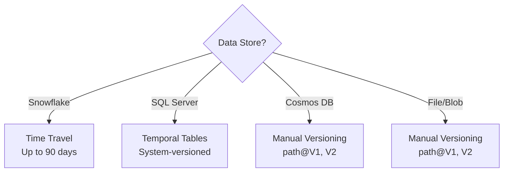

MeshWeaver takes a pragmatic stance on data versioning: rather than imposing a single strategy across all backends, it delegates to each store's native capabilities wherever they exist. The result is richer history, lower application complexity, and better performance than any cross-cutting shim could deliver.
<svg xmlns="http://www.w3.org/2000/svg" viewBox="0 0 760 300" style="width:100%;max-width:760px;height:auto;display:block;margin:20px auto;">
  <defs>
    <marker id="dv-arr" markerWidth="8" markerHeight="6" refX="8" refY="3" orient="auto">
      <polygon points="0 0,8 3,0 6" fill="currentColor" fill-opacity="0.5"/>
    </marker>
  </defs>
  <rect x="0" y="0" width="760" height="300" rx="12" fill="#1a1a2e" opacity="0.01"/>
  <text x="380" y="28" font-family="sans-serif" font-size="13" font-weight="bold" fill="currentColor" fill-opacity="0.7" text-anchor="middle">Versioning Strategy by Backend</text>
  <rect x="20" y="45" width="163" height="220" rx="10" fill="#1565c0"/>
  <text x="101" y="70" font-family="sans-serif" font-size="12" font-weight="bold" fill="#fff" text-anchor="middle">Snowflake</text>
  <rect x="34" y="80" width="135" height="22" rx="5" fill="#0d47a1"/>
  <text x="101" y="95" font-family="sans-serif" font-size="11" fill="#fff" text-anchor="middle">Time Travel</text>
  <text x="101" y="122" font-family="sans-serif" font-size="10" fill="#90caf9" text-anchor="middle">Retention: 1–90 days</text>
  <text x="101" y="140" font-family="sans-serif" font-size="10" fill="#90caf9" text-anchor="middle">Zero-copy clones</text>
  <text x="101" y="158" font-family="sans-serif" font-size="10" fill="#90caf9" text-anchor="middle">AT(TIMESTAMP =&gt; …)</text>
  <text x="101" y="176" font-family="sans-serif" font-size="10" fill="#90caf9" text-anchor="middle">Fail-safe 7 days</text>
  <rect x="34" y="222" width="135" height="28" rx="5" fill="#1e88e5"/>
  <text x="101" y="240" font-family="sans-serif" font-size="10" fill="#fff" text-anchor="middle">✦ Native — zero app</text>
  <text x="101" y="253" font-family="sans-serif" font-size="10" fill="#fff" text-anchor="middle">code required</text>
  <rect x="199" y="45" width="163" height="220" rx="10" fill="#2e7d32"/>
  <text x="280" y="70" font-family="sans-serif" font-size="12" font-weight="bold" fill="#fff" text-anchor="middle">SQL Server</text>
  <rect x="213" y="80" width="135" height="22" rx="5" fill="#1b5e20"/>
  <text x="280" y="95" font-family="sans-serif" font-size="11" fill="#fff" text-anchor="middle">Temporal Tables</text>
  <text x="280" y="122" font-family="sans-serif" font-size="10" fill="#a5d6a7" text-anchor="middle">Retention: unlimited</text>
  <text x="280" y="140" font-family="sans-serif" font-size="10" fill="#a5d6a7" text-anchor="middle">Row-level history</text>
  <text x="280" y="158" font-family="sans-serif" font-size="10" fill="#a5d6a7" text-anchor="middle">FOR SYSTEM_TIME AS OF</text>
  <text x="280" y="176" font-family="sans-serif" font-size="10" fill="#a5d6a7" text-anchor="middle">Auto on UPDATE/DELETE</text>
  <rect x="213" y="222" width="135" height="28" rx="5" fill="#43a047"/>
  <text x="280" y="240" font-family="sans-serif" font-size="10" fill="#fff" text-anchor="middle">✦ Native — zero app</text>
  <text x="280" y="253" font-family="sans-serif" font-size="10" fill="#fff" text-anchor="middle">code required</text>
  <rect x="378" y="45" width="163" height="220" rx="10" fill="#6a1b9a"/>
  <text x="459" y="70" font-family="sans-serif" font-size="12" font-weight="bold" fill="#fff" text-anchor="middle">Cosmos DB</text>
  <rect x="392" y="80" width="135" height="22" rx="5" fill="#4a148c"/>
  <text x="459" y="95" font-family="sans-serif" font-size="11" fill="#fff" text-anchor="middle">Manual Versioning</text>
  <text x="459" y="122" font-family="sans-serif" font-size="10" fill="#ce93d8" text-anchor="middle">Retention: unlimited</text>
  <text x="459" y="140" font-family="sans-serif" font-size="10" fill="#ce93d8" text-anchor="middle">Explicit snapshots</text>
  <text x="459" y="158" font-family="sans-serif" font-size="10" fill="#ce93d8" text-anchor="middle">path@V{n} pattern</text>
  <text x="459" y="176" font-family="sans-serif" font-size="10" fill="#ce93d8" text-anchor="middle">Version in document id</text>
  <rect x="392" y="222" width="135" height="28" rx="5" fill="#8e24aa"/>
  <text x="459" y="240" font-family="sans-serif" font-size="10" fill="#fff" text-anchor="middle">✦ App-managed —</text>
  <text x="459" y="253" font-family="sans-serif" font-size="10" fill="#fff" text-anchor="middle">explicit SaveVersion</text>
  <rect x="557" y="45" width="163" height="220" rx="10" fill="#e65100"/>
  <text x="638" y="70" font-family="sans-serif" font-size="12" font-weight="bold" fill="#fff" text-anchor="middle">Blob Storage</text>
  <rect x="571" y="80" width="135" height="22" rx="5" fill="#bf360c"/>
  <text x="638" y="95" font-family="sans-serif" font-size="11" fill="#fff" text-anchor="middle">Manual / Native</text>
  <text x="638" y="122" font-family="sans-serif" font-size="10" fill="#ffcc80" text-anchor="middle">Configurable retention</text>
  <text x="638" y="140" font-family="sans-serif" font-size="10" fill="#ffcc80" text-anchor="middle">Folder-per-entity</text>
  <text x="638" y="158" font-family="sans-serif" font-size="10" fill="#ffcc80" text-anchor="middle">current.json pointer</text>
  <text x="638" y="176" font-family="sans-serif" font-size="10" fill="#ffcc80" text-anchor="middle">Azure blob versioning</text>
  <rect x="571" y="222" width="135" height="28" rx="5" fill="#f57c00"/>
  <text x="638" y="240" font-family="sans-serif" font-size="10" fill="#fff" text-anchor="middle">✦ App-managed or</text>
  <text x="638" y="253" font-family="sans-serif" font-size="10" fill="#fff" text-anchor="middle">storage-native</text>
  <line x1="183" y1="155" x2="199" y2="155" stroke="currentColor" stroke-opacity="0.3" stroke-width="1" stroke-dasharray="4,3"/>
  <line x1="362" y1="155" x2="378" y2="155" stroke="currentColor" stroke-opacity="0.3" stroke-width="1" stroke-dasharray="4,3"/>
  <line x1="541" y1="155" x2="557" y2="155" stroke="currentColor" stroke-opacity="0.3" stroke-width="1" stroke-dasharray="4,3"/>
</svg>

*Four versioning strategies — native time-travel on the left, explicit path-based snapshots on the right.*

## Choosing a Strategy

Your data store determines the versioning model:



| Technology | Method | Retention | Query Syntax |
|------------|--------|-----------|---------------|
| Snowflake | Time Travel | 1–90 days | `AT(TIMESTAMP => ...)` |
| SQL Server | Temporal Tables | Unlimited | `FOR SYSTEM_TIME AS OF` |
| Cosmos DB | Manual | Unlimited | `path@V{n}` |
| Blob Storage | Manual / Native | Configurable | Folder or blob versioning |

---

## Snowflake: Time Travel

Snowflake's **Time Travel** gives you transparent, zero-effort history for any table — no triggers, no shadow tables, no ETL.

### Capabilities

| Feature | Description |
|---------|-------------|
| **Time Travel** | Query data as it existed at any point, up to 90 days in the past |
| **Fail-safe** | A 7-day recovery window after the Time Travel period expires |
| **Zero-Copy Cloning** | Instant snapshots with no data duplication |
| **Retention** | Configurable per table from 1 to 90 days |

### Querying Historical Data

```sql
-- Data as it was 1 hour ago
SELECT * FROM pricing
AT(OFFSET => -3600);

-- Data at a specific timestamp
SELECT * FROM pricing
AT(TIMESTAMP => '2024-01-15 10:00:00');

-- Data as it existed before a specific statement ran
SELECT * FROM pricing
BEFORE(STATEMENT => '01234567-89ab-cdef-0123-456789abcdef');
```

### Cloning for Snapshots

Zero-copy clones let you take an instant point-in-time snapshot without consuming additional storage:

```sql
CREATE TABLE pricing_q4_snapshot
CLONE pricing
AT(TIMESTAMP => '2024-12-31 23:59:59');
```

### MeshWeaver Integration

Access historical Snowflake data through versioned entity references:

```csharp
// Query a claim as it existed on a specific date
var historicalClaim = await hub.AwaitResponse(
    new GetDataRequest(
        new VersionedEntityReference(
            Collection: "Claim",
            Id: 12345,
            AsOf: new DateTime(2024, 6, 1)
        )
    ),
    o => o.WithTarget(new Address("Insurance/2024/Property"))
);
```

---

## SQL Server: Temporal Tables

SQL Server's **system-versioned temporal tables** automatically maintain a complete row-level history with no application-layer changes required after the initial schema setup.

### Creating a Temporal Table

```sql
CREATE TABLE Contracts
(
    Id INT PRIMARY KEY,
    Name NVARCHAR(100),
    Amount DECIMAL(18,2),
    ValidFrom DATETIME2 GENERATED ALWAYS AS ROW START,
    ValidTo   DATETIME2 GENERATED ALWAYS AS ROW END,
    PERIOD FOR SYSTEM_TIME (ValidFrom, ValidTo)
)
WITH (SYSTEM_VERSIONING = ON (HISTORY_TABLE = dbo.ContractsHistory));
```

### Querying Historical Data

```sql
-- Current data (unchanged syntax)
SELECT * FROM Contracts;

-- State at a specific point in time
SELECT * FROM Contracts
FOR SYSTEM_TIME AS OF '2024-06-01 12:00:00';

-- All rows that were active within a date range
SELECT * FROM Contracts
FOR SYSTEM_TIME BETWEEN '2024-01-01' AND '2024-12-31';

-- Complete change history
SELECT * FROM Contracts
FOR SYSTEM_TIME ALL;
```

### Why Temporal Tables Work Well Here

- History is captured automatically on every `UPDATE` and `DELETE` — no application code involved.
- The query optimizer understands temporal predicates and plans accordingly.
- The history table can be partitioned independently for cost control.
- Retention is unlimited by default; old rows stay until you explicitly purge them.

---

## Manual Versioning: Path Pattern

When the underlying store has no built-in history mechanism (Cosmos DB, Azure Blob Storage), MeshWeaver uses an explicit **path-based versioning** convention.

```mermaid
flowchart LR
    P[pricing/MS-2024] --> V1[pricing/MS-2024@V1]
    P --> V2[pricing/MS-2024@V2]
    P --> VN[pricing/MS-2024@V3]
    style P fill:#e1f5fe
    style V1 fill:#f5f5f5
    style V2 fill:#f5f5f5
    style VN fill:#c8e6c9
```

### Path Format

```
{path}@V{version}
```

The undecorated path always points to the **current** version; decorated paths are immutable snapshots:

| Path | Meaning |
|------|---------|
| `pricing/MS-2024` | Current version |
| `pricing/MS-2024@V1` | Version 1 (immutable) |
| `pricing/MS-2024@V2` | Version 2 (immutable) |
| `contracts/deal-123@V5` | Version 5 of deal-123 |

### Implementation Pattern

```csharp
// Save a new version
public async Task SaveVersionAsync(string path, object data)
{
    // Determine the next version number
    var current = await GetCurrentVersionAsync(path);
    var newVersion = current + 1;

    // Write the immutable versioned snapshot
    await SaveAsync($"{path}@V{newVersion}", data);

    // Advance the current pointer
    await SaveAsync(path, data);
}

// Read a specific historical version
public async Task<T> GetVersionAsync<T>(string path, int version)
{
    return await GetAsync<T>($"{path}@V{version}");
}
```

### Cosmos DB

Include the version in the document itself (and optionally in the partition key):

```json
{
  "id": "MS-2024@V3",
  "partitionKey": "pricing",
  "version": 3,
  "createdAt": "2024-03-15T10:00:00Z",
  "data": { }
}
```

### Blob Storage

Use a folder-per-entity layout with a `current.json` pointer, or enable **Azure Blob versioning** to get automatic version tracking at the storage layer:

```
pricing/
  MS-2024/
    current.json        ← always the latest version
    v1.json
    v2.json
    v3.json
```

---

## Version Metadata

Regardless of which storage technology is in use, each version snapshot should carry consistent metadata so the audit trail is human-readable:

```json
{
  "version": 3,
  "createdAt": "2024-03-15T10:00:00Z",
  "createdBy": "user@example.com",
  "comment": "Updated Q1 projections",
  "previousVersion": 2
}
```

---

## Best Practices

1. **Prefer native features.** Snowflake Time Travel and SQL Server temporal tables provide history at zero application cost — use them before reaching for manual versioning.
2. **Use consistent naming.** Manual versions always use the `@V{n}` suffix so path-parsing code has a single, unambiguous pattern to follow.
3. **Always record metadata.** Capture who created the version, when, and why — debugging and auditing are far easier with this context.
4. **Set retention policies.** Native Time Travel and blob versioning can accumulate storage costs; configure table-level retention in Snowflake and lifecycle rules in Azure Storage accordingly.
5. **Lean on point-in-time queries.** Reconstructing state as of a specific timestamp is the cleanest way to answer audit questions — avoid reconstructing it manually from event logs when the store offers `AS OF` semantics natively.
