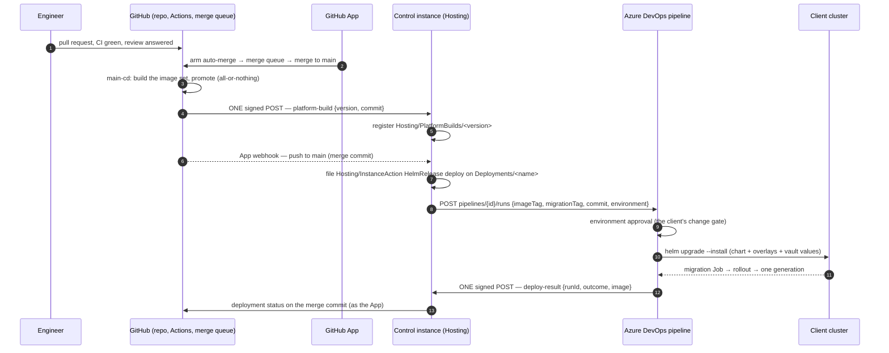

# Hybrid delivery — GitHub for code, Azure DevOps for the deploy

Many organisations arrive at MeshWeaver mid-migration: engineering works on GitHub — pull requests,
Actions, the merge queue — while the platform or change-management team still mandates that
**only an Azure DevOps pipeline may deploy**. The pipeline is where the service connection to the
cluster lives, where the environment approvals are audited, and where the ITIL change record is
attached. Nothing outside Azure DevOps holds a cluster credential, and that is a policy, not a
limitation to work around.

This page describes how a MeshWeaver instance is delivered in that situation. The short version:
**nothing about the fleet's model changes; one executor does.** The fleet already separates *what
a deploy is* (a `Hosting/InstanceAction` on the instance's `Deployments/<name>` record, on the
control instance) from *who runs it* (an executor lane that the control instance dispatches and
follows). Today the executor for a `HelmRelease` action is a GitHub workflow in the configuration
repository. In the hybrid scenario it is an Azure Pipelines run, and the **GitHub App is
responsible for triggering it** — the same App that is responsible for the merge to `main`.

## The rule in one sentence

> **The merge to `main` and the deploy that follows it are the same authority's two acts.** The
> GitHub App that arms the merge queue is the App whose webhook the control instance receives, and
> the control instance — acting as that App — is what queues the Azure Pipelines run. Nothing else
> may: not a runner holding a personal access token, not a CI trigger on the push, not a person
> with `az` on a laptop.

Three consequences follow, and the rest of the page is their mechanics:

1. **One trigger authority.** Whether a deploy happened, for which commit, and on whose approval is
   answered in one place — the action node on the control instance — regardless of which system
   executed it.
2. **The deploy runs on a sealed image set, never on a push.** A merge to `main` has no image yet;
   the run is queued when CD registers the set for that merge commit. A chart- or values-only
   change (no image moves) is the one case queued straight from the merge.
3. **No GitHub credential ever reaches the cluster, and no cluster credential ever reaches
   GitHub.** The two systems meet at the Azure DevOps REST API and at the control instance's
   webhook inbox — both HTTP, both signed, both recorded.

## The flow



Read it as three lanes with two hand-offs:

| Lane | Runs on | Owns | Hands off by |
|---|---|---|---|
| **Build** | GitHub Actions | the pull request gates, the merge queue, the image set (`main-cd.yml`) | one signed `platform-build` POST into the control instance's inbox — the existing [release event bus](../ReleaseEventBus) contract: *the pipeline ends with one call to memex* |
| **Decide** | the control instance | the `Deployments/<name>` record, the `HelmRelease` action, the pairing of a merge commit with a sealed set, the approval in the mesh where the record wants one | one `POST …/_apis/pipelines/{id}/runs` to Azure DevOps, the run id written onto the action node |
| **Apply** | Azure Pipelines | the service connection, the environment approval, `helm upgrade`, the migration Job, the rollout wait | one signed `deploy-result` POST back into the inbox; the control instance closes the action and stamps the merge commit |

## What exists today, and what this scenario adds

Present tense means it runs on the fleet now; the last column is what a hybrid installation needs
that the fleet's GitHub-only shape does not.

| Piece | Exists | The hybrid scenario adds |
|---|---|---|
| Merge to `main` through the GitHub App | `auto-arm.yml` arms every non-draft PR into the merge queue with a token minted from `meshweaver-cloud`; the steward re-queues on evidence — [The Merge Queue](../MergeQueue), [GitHub App Credentials](../GitHubAppCredentials) | nothing |
| CD publishes an all-or-nothing set and registers it | `main-cd.yml` promotes and ends with one signed `platform-build` POST; the control instance registers `Hosting/PlatformBuilds/<version>` — [Continuous Delivery Contract](../ContinuousDeliveryContract) | nothing |
| The App's webhook reaches the control instance | `POST /webhooks/github`, HMAC-verified, dispatched by `GitHubWebhookProcessor` on `push`, `workflow_run`, … — [Webhook Inbox](../WebhookInbox) | a `push`-to-default-branch branch that files a `HelmRelease` action on every record whose `repository` is the pushed repository |
| The deploy is an action on the record | `Hosting/InstanceAction` kind `HelmRelease`, `helmAction: capture \| adopt \| deploy`, dispatches the config repo's `helm-release.yml` and follows the run onto the node's log — [Operating from the portal](../OperatingFromThePortal) | a second **executor**: `azure-devops`, selected by the record (below) |
| The executor's credential lives on the control instance | the GitHub App private key, held only by the instance that holds the fleet registry | an Azure DevOps credential of the same standing: an Entra service principal (or workload identity) granted **Queue builds** on the one pipeline — never a personal access token |
| The pipeline reports back | `helm-release.yml`'s run is followed by the action; the migration Job is the evidence — [Deploying to AKS](../DeploymentAKS) § *The migration Job IS the evidence* | the pipeline's last stage POSTs one signed `deploy-result` into the inbox; the action follows the run by id until then |
| GitHub shows the outcome | — | the control instance, as the App, writes a GitHub **deployment status** on the merge commit (`environment: <deployment name>`, `state: success \| failure`, `log_url: <pipeline run>`) |

### The record selects the executor

The `Deployments/<name>` record already supplies the coordinates `helm-release.yml` needs
(`repository`, `namespace`, `helmRelease`). The hybrid record names the executor explicitly;
an absent block keeps today's behaviour.

```json
{
  "id": "contoso-prod",
  "namespace": "Deployments",
  "content": {
    "repository": "Contoso/memex-config",
    "namespace": "memex",
    "helmRelease": "memex",
    "pinnedImageTag": "3.0.0-ci.9098",
    "updatePolicy": "Continuous",
    "helmExecutor": {
      "kind": "azure-devops",
      "organization": "contoso",
      "project": "platform",
      "pipelineId": 42,
      "credentialKey": "Hosting:AzureDevOps:Credential",
      "reportTarget": "Hosting/PlatformBuilds"
    }
  }
}
```

| Field | Meaning | Refused when |
|---|---|---|
| `kind` | `github-workflow` (today's shape) or `azure-devops` | unknown |
| `organization` / `project` / `pipelineId` | the one pipeline this record may queue; a **definition id**, never a name — names are renamed, ids are not | any absent |
| `credentialKey` | the configuration key under which the control instance holds the Entra credential for Azure DevOps; the record names the key, never the value | the key is not set on this instance — the action refuses **naming the key**, exactly as a `HelmRelease` on an instance without the GitHub App credential does |
| `reportTarget` | the inbox target the pipeline's final POST lands in | not on the inbox allowlist |

The record is the ONE input, as it is for every other route — [Deployment](../Deployment) —
so a re-render of the client's overlays, a `Reconcile`, an `Audit` and the fleet console all read
the same executor block. Nobody discovers "this one deploys through DevOps" from a wiki.

## The trigger, precisely

Two events queue the pipeline, and it matters which one:

| Cause | Event the control instance acts on | Why not the other |
|---|---|---|
| **Application code merged** (an image moves) | the `platform-build` registration for that merge commit — after CD's promote sealed the set | a `push` webhook arrives ~20 minutes before an image exists; a pipeline queued on it runs `helm upgrade` against a tag the registry does not have yet, and helm reports a **successful** upgrade to an image that cannot pull |
| **Configuration merged** (chart values, overlays, a pin change in the config repo — no image moves) | the App's `push` webhook on the config repository's default branch | there is no set to wait for; the chart is read at deploy time — [Repository Topology](../RepositoryTopology) — so the change is effective on the next `helm upgrade` and nothing else |

The pairing is what the control instance owns: it holds the merge commit from the webhook and the
set from the registration, and files the action when **both** are present for the same commit. A
merge whose CD run failed therefore files nothing — and the hourly reconciler that heals a missing
set ([Continuous Delivery Contract](../ContinuousDeliveryContract) § *Property 2*) completes the
pair later, which then files the action. A merge that never gets a set is visible as a merge commit
with a webhook and no action, which is the state to alert on.

**A pinned record queues nothing on its own.** `updatePolicy: None` refuses the routed action
outright, the same rule as for a self-update routed Roll
([Self-Update on the Control Lane](../SelfUpdateControlLane)). `Continuous` queues one run per
sealed set; a tag the record does not pin parks the action at *awaiting approval* in the mesh
first. That approval and the Azure DevOps environment approval answer **different questions** and
both may stand: the mesh decides *which tag this instance takes*; the pipeline's environment
decides *whether production may be touched now*. What must not happen is the same question asked
twice — a person approving the tag in the mesh and then the identical tag again in DevOps learns
to click through both.

## Queueing the run

The control instance queues the run with the Azure DevOps Pipelines REST API, authenticated with an
Entra ID token for the Azure DevOps resource (its well-known application id is
`499b84ac-1321-427f-aa17-267ca6975798`), obtained for the service principal named by
`credentialKey`. The call is one POST:

```http
POST https://dev.azure.com/{organization}/{project}/_apis/pipelines/{pipelineId}/runs?api-version=7.1
Authorization: Bearer <entra token, scope 499b84ac-1321-427f-aa17-267ca6975798/.default>
Content-Type: application/json

{
  "resources": { "repositories": { "self": { "refName": "refs/heads/main" } } },
  "templateParameters": {
    "deployment":   "contoso-prod",
    "actionPath":   "Ops/Actions/helm-contoso-prod-9098",
    "imageTag":     "3.0.0-ci.9098",
    "migrationTag": "3.0.0-ci.9098",
    "commit":       "4e7641de2c…",
    "helmRelease":  "memex",
    "namespace":    "memex"
  }
}
```

The response carries the run `id` and `url`; the action node records both **before** it does
anything else, and follows `GET …/runs/{id}` until `state: completed`. Three things this mirrors
from the fleet's own measurements:

- **A 2xx proves the request was accepted, not that anything ran.** The inbox contract's lesson
  ([Webhook Inbox](../WebhookInbox) § *What a 2xx proves*) applies unchanged: an action with a run
  id and no terminal result after the pipeline's own timeout is an *unclaimed request*
  ([Unclaimed Control-Plane Requests](../UnclaimedControlPlaneRequests)), and reads as such —
  never as "probably fine".
- **The migration tag equals the image tag, by construction.** The pipeline's `--set` block insists
  on it for the same reason `helm-release.yml` does: a migration from a different build than the
  code that will run against it is how a schema lands half-applied
  ([The Self-Update Schema Wall](../SelfUpdateSchemaWall)).
- **The confirmation is the record's id, typed by the machine that resolved it.** The routed
  action declares its lane (`origin: "control-lane"`) rather than a `confirmation` a machine
  could only copy from itself — the same decision as for routed self-update Rolls.

## The pipeline

The Azure Pipelines definition is deliberately thin: it is the client's *glue*, and the logic it
invokes is the same the fleet's own lane invokes. A pipeline that carries deploy logic of its own is
a second implementation of the values layering, and two implementations drift.

```yaml
# azure-pipelines/memex-deploy.yml — the ONE definition this record may queue
parameters:
  - name: deployment
  - name: actionPath
  - name: imageTag
  - name: migrationTag
  - name: commit
  - name: helmRelease
  - name: namespace

trigger: none          # queued by the control instance only — never by a push

resources:
  repositories:
    - repository: chart              # the chart is PUBLIC and read at deploy time
      type: github
      name: Systemorph/MeshWeaver
      endpoint: github-readonly      # a GitHub service connection with read on the public repo
    - repository: config             # the client's overlays — GitHub, or Azure Repos until migrated
      type: github
      name: Contoso/memex-config
      endpoint: github-readonly

stages:
  - stage: Deploy
    jobs:
      - deployment: helm
        environment: memex-prod      # the environment carries the client's approvals and checks
        strategy:
          runOnce:
            deploy:
              steps:
                - checkout: chart
                - checkout: config
                - task: AzureKeyVault@2         # the vault half of the values — names in the record, values here
                  inputs:
                    azureSubscription: contoso-prod-arm
                    KeyVaultName: contoso-kv
                    SecretsFilter: helm-values-${{ parameters.helmRelease }}
                - task: HelmDeploy@1
                  inputs:
                    connectionType: Azure Resource Manager
                    azureSubscription: contoso-prod-arm      # the ONLY cluster credential, and it lives here
                    azureResourceGroup: contoso-prod
                    kubernetesCluster: contoso-aks
                    namespace: ${{ parameters.namespace }}
                    command: upgrade
                    chartType: FilePath
                    chartPath: MeshWeaver/deploy/helm
                    releaseName: ${{ parameters.helmRelease }}
                    install: true
                    waitForExecution: false      # helm applies, the next step OBSERVES — never --atomic --wait
                    valueFile: memex-config/deployments/aks/${{ parameters.namespace }}/values.${{ parameters.helmRelease }}.public.yaml
                    overrideValues: |
                      portal.image=<registry>/memex-portal-ai:${{ parameters.imageTag }}
                      migration.image=<registry>/memex-migration:${{ parameters.migrationTag }}
                - script: |                      # the migration Job is the evidence; a rollout ends at ONE generation
                    # (proposed) the platform's observer script — the same read helm-release.yml does
                    MeshWeaver/deploy/aks/scripts/wait-for-release.sh \
                      --namespace "${{ parameters.namespace }}" --release "${{ parameters.helmRelease }}"
                  displayName: Wait for the migration Job and one rollout generation
  - stage: Report
    condition: always()               # the report is sent on failure too — silence is the one outcome the control instance cannot read
    jobs:
      - job: report
        steps:
          - script: |
              # (proposed) the platform's report script — one HMAC-signed POST, the platform-build shape
              MeshWeaver/deploy/aks/scripts/report-deploy-result.sh \
                --inbox "$(CONTROL_INBOX_URL)" --secret "$(CONTROL_INBOX_SECRET)" \
                --action "${{ parameters.actionPath }}" --run "$(Build.BuildId)" \
                --outcome "$(Agent.JobStatus)" --image "${{ parameters.imageTag }}"
            displayName: One signed POST to the control instance
```

The two scripts the definition calls (`wait-for-release.sh`, `report-deploy-result.sh`) do not
exist in the tree yet; they are the observer and the reporter that `helm-release.yml` carries
inline today, lifted into `deploy/aks/scripts/` so that both executors run the ONE implementation.
The pipeline calls them at the chart checkout's ref — the same platform-script resolution rule every
satellite lane follows ([Platform Script Resolution](../PlatformScriptResolution)).

Four properties of that definition are load-bearing:

1. **`trigger: none`.** The pipeline runs when the control instance queues it and at no other time.
   A CI trigger on the GitHub repository would queue it on the push — before the image exists — and
   would make the pipeline a second trigger authority beside the App.
2. **`waitForExecution: false`, then an observer step.** Helm applies; the caller observes. A fixed
   `--atomic --wait` reverts a correct upgrade that is still inside its startup gate
   ([Applying Is Not Rolling Out](../ApplyingIsNotRollingOut)). The observer reads the migration
   Job's completion (`Database migration completed. Version: N`) and waits for **one generation** —
   a previous-generation pod still in rotation is not done.
3. **The environment carries the approvals.** `environment: memex-prod` is where the client's
   change management attaches its checks — required approvers, business hours, a ServiceNow gate.
   The control instance sees the run as *in progress* while an approval is pending, which is the
   correct reading.
4. **`condition: always()` on the report.** A failed deploy that reports nothing is
   indistinguishable, from the control instance, from a pipeline that never started. The report
   carries the outcome; the action node's terminal state is written from it, and the deployment
   status on the merge commit follows.

## Credentials — who holds what

| Credential | Held by | Grants | Never held by |
|---|---|---|---|
| GitHub App private key (`meshweaver-cloud` or the client's own App) | the control instance; CI mints per-run installation tokens | merge queue arming, deployment statuses on commits, the webhook signature | the pipeline, the cluster |
| Entra service principal for Azure DevOps | the control instance, under the key the record names | **Queue builds** on the one pipeline id, **View builds** to follow it | GitHub Actions, any runner |
| Azure Resource Manager service connection | the Azure DevOps project | `helm upgrade` against the cluster, Key Vault read | the control instance, GitHub |
| Control-inbox HMAC secret | the control instance and the pipeline's variable group (secret) | the pipeline's one signed POST | GitHub |
| GitHub read on the chart and the config repo | an Azure DevOps GitHub service connection, read only | `checkout` | — |

Two of the fleet's rules hold unchanged and are the reason the table has no PAT in it. A personal
access token has no owner, no expiry anyone watches, and fails indistinguishably from a scope
problem — that is why core CI mints every GitHub credential from an App
([GitHub App Credentials](../GitHubAppCredentials)); the Azure DevOps side is held to the same
standard with an Entra service principal or workload identity federation. And **the instance that
executes a `HelmRelease` is the one holding the executor credential** — anywhere else refuses
naming the missing key, never a silent downgrade to "dispatch skipped".

## Why the App, and not the two obvious alternatives

**Not the Azure Pipelines GitHub App with a CI trigger on `main`.** It works, and it is the wrong
shape here for three reasons. It queues on the push, so the run either races the image set or has to
poll the registry itself — logic the pipeline should not carry. It makes the pipeline a trigger
authority of its own, so "did this commit deploy?" is answered by correlating two systems by hand.
And it bypasses the record: an instance with `updatePolicy: None` still deploys.

**Not a GitHub Actions job at the end of CD that calls Azure DevOps with a token.** This keeps a
single trigger but puts the Azure DevOps credential on a GitHub runner, where every workflow of the
repository can reach it, and it violates the contract that *nothing runs after the one call to
memex* — the platform-build POST is the pipeline's last act, so the control instance is the only
place a follow-on decision can live. It also leaves the deploy invisible to the mesh: no action
node, no approval, no `Ops/Status`.

The App-through-the-control-instance shape is the one that keeps the fleet's invariants: one record,
one action per deploy, the executor credential on the instance that owns the action, and every
outcome written where the next reader — a person, an agent, the fleet console — already looks.

## Stages of migration — the same record throughout

The scenario is not a special case; it is one column of a table whose other columns the fleet
already runs. An organisation moves left to right without changing its record's shape, only its
`helmExecutor` and its `repository`.

| | Not migrated | Hybrid (this page) | On GitHub |
|---|---|---|---|
| Source and pull requests | Azure Repos | GitHub | GitHub |
| Merge to `main` | Azure Repos branch policy | the GitHub App and the merge queue | the GitHub App and the merge queue |
| Image set | the fleet's CD (the platform is built by the platform, whichever repo hosts the client's config) | same | same |
| Deploy trigger | the `platform-build` registration alone (no App webhook; the config repo is not on GitHub) | the App webhook + the registration, paired on the commit | same |
| Executor | `azure-devops` pipeline | `azure-devops` pipeline | `github-workflow` — the config repo's `helm-release.yml` |
| Cluster credential | the pipeline's service connection | the pipeline's service connection | the config repo's OIDC federation |
| Outcome | action node + `Ops/Status` | action node + `Ops/Status` + a deployment status on the merge commit | same |

The "not migrated" column is worth stating because it is the entry point most organisations are at:
their config overlays live in Azure Repos and there is no GitHub App on their side at all. The
control instance still owns the action, still queues the pipeline, still follows it — the only
trigger is the registration, and the pipeline checks the overlays out of Azure Repos instead of
GitHub. Moving the config repo to GitHub later changes the `repository` field and the checkout, and
adds the webhook; nothing about the deploy changes.

## What this scenario does NOT change

- **The image set is built once, by the fleet's CD**, and verified by image tag, never by a green
  tick ([Continuous Delivery Contract](../ContinuousDeliveryContract)). A client pipeline never
  builds a portal image.
- **Self-update stays a control-lane act.** An instance on `Continuous` announces a selected tag to
  the control instance, which files the action — the executor is the only thing the record swaps
  ([Self-Update on the Control Lane](../SelfUpdateControlLane)).
- **The migration is a run-once Job that `helm upgrade` mints**, never a Deployment to roll
  ([Deploying to AKS](../DeploymentAKS) § *Migration under self-update*). The pipeline's observer
  step reads that Job; a crash-looping migration pod is a failed deploy, reported as one.
- **Operations and diagnostics go through the control instance**
  ([Operating from the portal](../OperatingFromThePortal)). The pipeline is an executor, not an
  admin surface: `Sample`, `Logs`, `Audit`, `Reconcile` are unchanged and do not go through Azure
  DevOps.
- **Recycling after a roll is still the last step of the change set.** A `HelmRelease` that
  succeeded proves the image is running, not that every per-node hub re-read its NodeType —
  [Stale State Until Recycle](../StaleStateUntilRecycle).

## Related

- [Deployment](../Deployment) — the router; the record is the ONE input for every route
- [Operating from the portal, not the cluster](../OperatingFromThePortal) — the `HelmRelease`
  action this page gives a second executor
- [Self-Update on the Control Lane](../SelfUpdateControlLane) — the announce-then-route model the
  trigger reuses
- [The Release Event Bus](../ReleaseEventBus) — *the pipeline ends with one call to memex*
- [Webhook Inbox](../WebhookInbox) — what a 2xx proves, and the signed report the pipeline sends
- [Repository Topology](../RepositoryTopology) — the chart is public and read at deploy time
- [GitHub App Credentials](../GitHubAppCredentials) — why there is no PAT anywhere in this design
- [Applying Is Not Rolling Out](../ApplyingIsNotRollingOut) — why the pipeline observes rather
  than `--atomic --wait`
