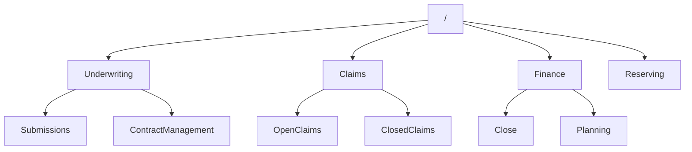
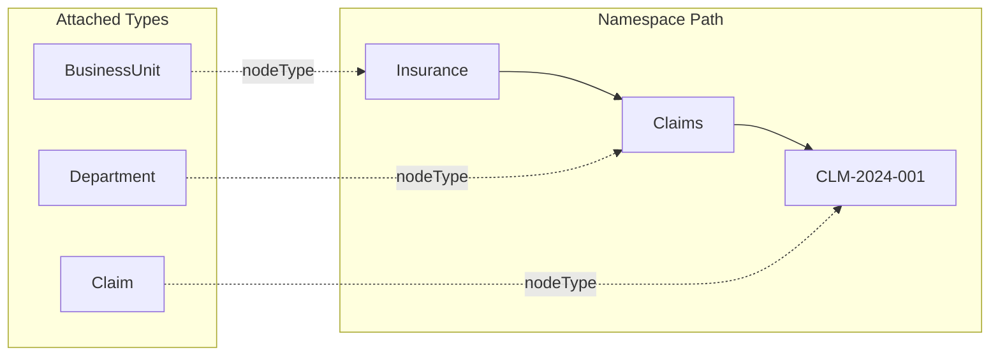

The mesh graph is a **hierarchical, self-describing data store** where types are not just schema annotations — they are living data elements that configure hubs, drive rendering, and version independently of one another. Understanding this model unlocks the rest of MeshWeaver's architecture.

---

# Core Concepts

## The MeshNode

Every element in the mesh — data records, type definitions, users, threads, configuration — is a `MeshNode`:

```csharp
public record MeshNode(
    string Id,           // Local identifier within its namespace
    string? Namespace    // Parent path (null for root)
)
{
    public string Path => $"{Namespace}/{Id}";  // Full canonical path
    public string? NodeType { get; init; }       // Path of this node's type definition
    public object? Content { get; init; }        // Typed payload
}
```

The `Path` is the node's unique address in the mesh. It is also how the portal builds URLs: navigate to `https://your-host/Insurance/Claims/CLM-2024-001` and the mesh resolves, instantiates, and renders that exact node.

**Concrete examples:**

| Id | Namespace | Resulting Path |
|----|-----------|----------------|
| `Submissions` | `Insurance/Underwriting` | `Insurance/Underwriting/Submissions` |
| `CLM-2024-001` | `Insurance/Claims` | `Insurance/Claims/CLM-2024-001` |
| `Planning` | `Finance` | `Finance/Planning` |

---

# Namespace Hierarchy

Namespaces follow the pattern `a/b/c/d`, forming a tree rooted at `/`. Here is an insurance company example:



Each level is itself a node with its own type, content, and access policy. The hierarchy is not just organizational sugar — it determines hub instantiation, access inheritance, and query scope.

## Path Navigation

| Path | Namespace | Id |
|------|-----------|-----|
| `Underwriting` | `/` | `Underwriting` |
| `Underwriting/Submissions` | `Underwriting` | `Submissions` |
| `Claims/CLM-2024-001` | `Claims` | `CLM-2024-001` |
| `Finance/Close` | `Finance` | `Close` |

## Navigating along the edges — the populated frontier

A node's place in the graph is defined by its path, so its **edges** are its real ancestors (above)
and the real nodes below it. But a path segment is not necessarily a node: `a/b/node` can exist with
neither `a` nor `a/b` being a real node — they are pure namespace groupings. Navigation must *skip
those empty segments*.

The two query scopes that walk the graph's edges:

| Direction | Scope | Returns |
|---|---|---|
| **Above** | `path:{p} scope:ancestors` | the real ancestor nodes (empty segments are absent — they are not nodes) |
| **Below** | `namespace:{p} scope:nextLevel` | the **next populated level**: the nearest real nodes below `p`, skipping empty intermediate segments |

`scope:nextLevel` (the *populated frontier*) returns each node strictly below `p` for which no other
node sits between it and `p`. So at the root of the example above, `nextLevel` returns
`Underwriting`, `Claims`, `Finance`, `Reserving`; but if only `Underwriting/Submissions/Q1` existed
(with `Submissions` not a real node), `nextLevel` of `Underwriting` would surface
`Underwriting/Submissions/Q1` directly. On Postgres this is one indexed anti-join — see
[Query Syntax](/Doc/DataMesh/QuerySyntax) → `scope:nextLevel`. The Search area's **graph navigator**
([Mesh Search](/Doc/GUI/MeshSearch)) renders exactly these two edges and re-roots on click.

---

# Types as First-Class Data

> **The central idea:** In MeshWeaver, data types *are* data. A `Claim` type is not just a class or a schema file — it is a node stored in the mesh at a known path, queryable like any other node.

When you define a type like `Claim`, it lives at `Type/Claim` and configures every instance node that references it.



## NodeTypes Are Nodes Too

Because a type *is* a node, you interact with it using exactly the same tools as any data node:

- It has a **path** (`Type/Claim`), a `Name`, an `Icon`, and `Content` (its `NodeTypeDefinition`). Its own `nodeType` is the literal `"NodeType"`.
- You can **navigate to it** in the portal, **query for it** (`nodeType:NodeType`), version it, and grant fine-grained access on it — the same machinery that serves data instances.
- A node's `nodeType` field is **the path of the type node**, not an opaque string tag. Follow it to reach the full definition. The portal's **Settings → Metadata** view renders it as a clickable link to the type's `Configuration` area.

This is what "self-describing" means in practice: to understand how `Insurance/Claims/CLM-2024-001` behaves, open its `nodeType` — `Type/Claim` — and read the same fields you would read on any other node.

## NodeType Configuration

Each NodeType node specifies:

| Component | Purpose |
|-----------|---------|
| **Data Model** | Field definitions and validation rules |
| **Views** | Layout configurations for different rendering contexts |
| **Handlers** | Custom message handlers registered on the node's hub |
| **Hub Configuration** | How to assemble the `MessageHub` for instances |

The source files live alongside the type definition:

```
Type/
  Claim/
    Source/
      dataModel.json    ← Field definitions (claimNumber, lossDate, status, …)
      views.json        ← UI layouts (ClaimDetail, ClaimSummary, ClaimEdit)
```

## Type Attachment

Any node can reference a type via its `nodeType` field:

```json
{
  "id": "CLM-2024-001",
  "namespace": "Insurance/Claims",
  "nodeType": "Type/Claim",
  "content": {
    "claimNumber": "CLM-2024-001",
    "policyNumber": "POL-12345",
    "lossDate": "2024-03-15",
    "status": "Open",
    "reserveAmount": 50000
  }
}
```

The referenced type determines:

- Which fields are valid (data model)
- How the node renders in the portal (views)
- What operations are available (handlers and hub configuration)

---

# Semantic Versioning

The hierarchical namespace provides a natural home for semantic versioning. Breaking changes live in a sibling subtree, and both versions serve traffic simultaneously until migration is complete.

```
Insurance/
  ClaimsProcessing/
    V1/                  ← Version 1 of the domain
      Claim
      Reserve
    V2/                  ← Version 2 with breaking changes
      Claim
      Reserve
      Subrogation        ← New entity introduced in V2
```

## Why This Matters

1. **Parallel serving** — V1 and V2 run side by side; clients migrate at their own pace.
2. **Gradual migration** — redirect consumers one by one rather than coordinating a big-bang cutover.
3. **Type evolution** — add fields, rename entities, split types — all without breaking existing references.
4. **API stability** — old paths keep working as long as the V1 subtree exists.

## Version Pattern

```
{Vendor}/{Domain}/V{Major}/
```

**Examples:**
- `Insurance/ClaimsProcessing/V1`
- `Insurance/Underwriting/V2`
- `MeshWeaver/Core/V3`

---

# Hub Instantiation

<svg xmlns="http://www.w3.org/2000/svg" viewBox="0 0 760 300" style="width:100%;max-width:760px;height:auto;display:block;margin:20px auto;">
  <defs>
    <marker id="harr" markerWidth="8" markerHeight="6" refX="8" refY="3" orient="auto">
      <path d="M0,0 L8,3 L0,6 Z" fill="#90caf9"/>
    </marker>
    <marker id="harr2" markerWidth="8" markerHeight="6" refX="8" refY="3" orient="auto">
      <path d="M0,0 L8,3 L0,6 Z" fill="#a5d6a7"/>
    </marker>
  </defs>
  <rect x="10" y="120" width="120" height="46" rx="10" fill="#1e88e5"/>
  <text x="70" y="140" text-anchor="middle" fill="#fff" font-family="sans-serif" font-size="12" font-weight="700">URL Path</text>
  <text x="70" y="156" text-anchor="middle" fill="#fff" font-family="sans-serif" font-size="10">Insurance/Claims/…</text>
  <line x1="130" y1="143" x2="158" y2="143" stroke="#90caf9" stroke-width="1.5" marker-end="url(#harr)"/>
  <rect x="160" y="120" width="120" height="46" rx="10" fill="#1565c0"/>
  <text x="220" y="140" text-anchor="middle" fill="#fff" font-family="sans-serif" font-size="12" font-weight="700">Resolve Node</text>
  <text x="220" y="156" text-anchor="middle" fill="#fff" font-family="sans-serif" font-size="10">storage lookup</text>
  <line x1="280" y1="143" x2="308" y2="143" stroke="#90caf9" stroke-width="1.5" marker-end="url(#harr)"/>
  <rect x="310" y="120" width="130" height="46" rx="10" fill="#6a1b9a"/>
  <text x="375" y="140" text-anchor="middle" fill="#fff" font-family="sans-serif" font-size="12" font-weight="700">Find NodeType</text>
  <text x="375" y="156" text-anchor="middle" fill="#fff" font-family="sans-serif" font-size="10">follow nodeType field</text>
  <line x1="440" y1="143" x2="468" y2="143" stroke="#90caf9" stroke-width="1.5" marker-end="url(#harr)"/>
  <rect x="470" y="90" width="270" height="106" rx="12" fill="none" stroke="#43a047" stroke-opacity=".6" stroke-width="1.5"/>
  <text x="605" y="112" text-anchor="middle" fill="#a5d6a7" font-family="sans-serif" font-size="12" font-weight="700">Build MessageHub</text>
  <rect x="482" y="120" width="108" height="32" rx="8" fill="#2e7d32"/>
  <text x="536" y="133" text-anchor="middle" fill="#fff" font-family="sans-serif" font-size="10" font-weight="600">Data Sources</text>
  <text x="536" y="146" text-anchor="middle" fill="#c8e6c9" font-family="sans-serif" font-size="9">schema + fields</text>
  <rect x="600" y="120" width="128" height="32" rx="8" fill="#2e7d32"/>
  <text x="664" y="133" text-anchor="middle" fill="#fff" font-family="sans-serif" font-size="10" font-weight="600">Msg Handlers</text>
  <text x="664" y="146" text-anchor="middle" fill="#c8e6c9" font-family="sans-serif" font-size="9">custom operations</text>
  <rect x="482" y="158" width="108" height="32" rx="8" fill="#1b5e20"/>
  <text x="536" y="171" text-anchor="middle" fill="#fff" font-family="sans-serif" font-size="10" font-weight="600">View Defs</text>
  <text x="536" y="184" text-anchor="middle" fill="#c8e6c9" font-family="sans-serif" font-size="9">layout areas</text>
  <rect x="600" y="158" width="128" height="32" rx="8" fill="#1b5e20"/>
  <text x="664" y="171" text-anchor="middle" fill="#fff" font-family="sans-serif" font-size="10" font-weight="600">Child Hub Config</text>
  <text x="664" y="184" text-anchor="middle" fill="#c8e6c9" font-family="sans-serif" font-size="9">nested paths</text>
  <line x1="375" y1="166" x2="375" y2="240" stroke="#7986cb" stroke-width="1.2" stroke-opacity=".5" stroke-dasharray="4 3"/>
  <rect x="310" y="240" width="130" height="46" rx="10" fill="#283593"/>
  <text x="375" y="258" text-anchor="middle" fill="#fff" font-family="sans-serif" font-size="11" font-weight="600">Type/Claim</text>
  <text x="375" y="273" text-anchor="middle" fill="#c5cae9" font-family="sans-serif" font-size="9">nodeType = "NodeType"</text>
  <text x="375" y="108" text-anchor="middle" fill="#7986cb" font-family="sans-serif" font-size="9" font-style="italic">type node</text>
</svg>

*Path resolution: the platform walks from URL to node to type definition, then assembles a fully-configured MessageHub.*

When the platform resolves a path, it follows a deterministic sequence:

1. **Resolve the node** from the path (storage lookup or virtual template match).
2. **Locate the NodeType** referenced by `nodeType`.
3. **Build a `MessageHub`** configured with:
   - Data sources for the type's schema
   - Registered message handlers
   - View definitions for layout areas
   - Child hub configuration for nested paths

## Template Nodes

Nodes can serve as **templates** for virtual instances. Rather than pre-creating thousands of leaf nodes, you declare a single template node:

```json
{
  "id": "claim",
  "addressSegments": 2,
  "nodeType": "Type/Claim"
}
```

This template matches any path with two additional segments below it, for example:
- `Insurance/Claims/CLM-2024-001`
- `Insurance/Claims/CLM-2024-002`

Virtual nodes inherit the template's full hub configuration. The mesh instantiates them on demand — no pre-population required.

---

# Query Patterns

The hierarchy is fully queryable. See [Unified Path](../../DataMesh/UnifiedPath) for the complete syntax reference.

```
// Direct children of Claims
namespace:Insurance/Claims

// All descendants, recursively
path:Insurance scope:descendants

// Find by type across the entire mesh
nodeType:Type/Claim

// Combine filters
namespace:Insurance/Claims nodeType:Type/Claim status:Open
```

See also: [Query Syntax Reference](../../DataMesh/QuerySyntax)

---

# Summary: Why This Model Works

| Property | What It Enables |
|----------|----------------|
| **Self-describing** | Types are queryable data — no out-of-band schema registry needed |
| **Flexible hierarchy** | Any depth, any branching factor; the tree fits the domain |
| **Built-in versioning** | Semantic versions are just namespace segments |
| **Dynamic configuration** | Change type behaviour by updating the type node — no code deployment |
| **Discoverability** | Browse and link to types exactly as you would browse to data |
