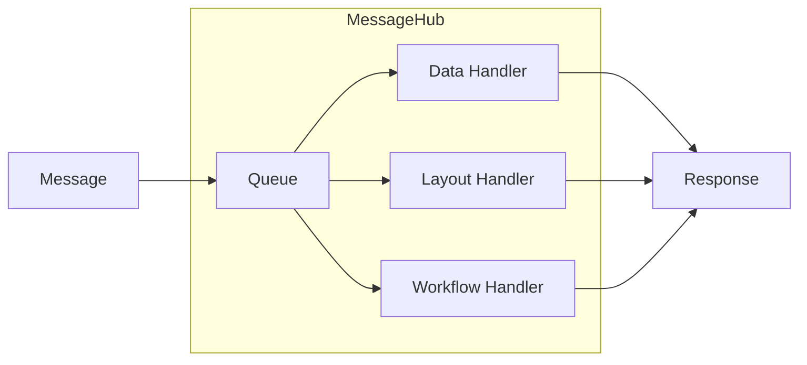
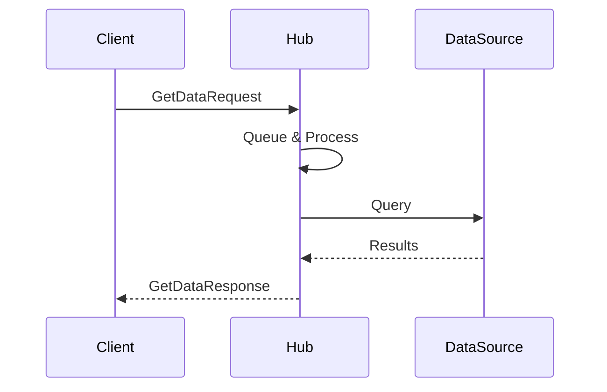

MeshWeaver is built on a **message-passing actor model**. Every unit of work — data retrieval, UI rendering, workflow execution — travels as a typed message to a **MessageHub**, which processes it single-threaded. The result is predictable execution order, clean state isolation, and straightforward horizontal scale.

## Architecture Overview

MessageHubs can be deployed across any cloud environment (Azure, AWS, on-premise) and communicate through a central message bus. Each hub owns its own queue; nothing runs concurrently inside a single hub.
<svg viewBox="0 0 760 340" xmlns="http://www.w3.org/2000/svg" style="width:100%;max-width:760px;height:auto;display:block;margin:20px auto;" font-family="sans-serif" font-size="13">
  <defs>
    <marker id="arr" markerWidth="8" markerHeight="8" refX="6" refY="3" orient="auto">
      <path d="M0,0 L0,6 L8,3 z" fill="currentColor" fill-opacity=".6"/>
    </marker>
  </defs>
  <rect x="290" y="10" width="180" height="50" rx="10" fill="#1e88e5"/>
  <text x="380" y="32" text-anchor="middle" fill="#fff" font-weight="bold">Message Bus</text>
  <text x="380" y="50" text-anchor="middle" fill="#fff" font-size="11">(Central Router)</text>
  <line x1="200" y1="35" x2="290" y2="35" stroke="currentColor" stroke-opacity=".5" stroke-width="1.5" marker-end="url(#arr)"/>
  <line x1="470" y1="35" x2="560" y2="35" stroke="currentColor" stroke-opacity=".5" stroke-width="1.5" marker-end="url(#arr)"/>
  <line x1="380" y1="60" x2="380" y2="110" stroke="currentColor" stroke-opacity=".5" stroke-width="1.5" marker-end="url(#arr)"/>
  <rect x="30" y="10" width="170" height="100" rx="10" fill="#26a69a"/>
  <text x="115" y="38" text-anchor="middle" fill="#fff" font-weight="bold">Hub A</text>
  <text x="115" y="56" text-anchor="middle" fill="#fff" font-size="11">Queue → Handler</text>
  <text x="115" y="72" text-anchor="middle" fill="#fff" font-size="11">(Data)</text>
  <text x="115" y="90" text-anchor="middle" fill="rgba(255,255,255,.7)" font-size="10">Cloud / On-Premise</text>
  <rect x="560" y="10" width="170" height="100" rx="10" fill="#5c6bc0"/>
  <text x="645" y="38" text-anchor="middle" fill="#fff" font-weight="bold">Hub B</text>
  <text x="645" y="56" text-anchor="middle" fill="#fff" font-size="11">Queue → Handler</text>
  <text x="645" y="72" text-anchor="middle" fill="#fff" font-size="11">(Layout)</text>
  <text x="645" y="90" text-anchor="middle" fill="rgba(255,255,255,.7)" font-size="10">Cloud / On-Premise</text>
  <rect x="295" y="110" width="170" height="100" rx="10" fill="#8e24aa"/>
  <text x="380" y="138" text-anchor="middle" fill="#fff" font-weight="bold">Hub C (Parent)</text>
  <text x="380" y="156" text-anchor="middle" fill="#fff" font-size="11">Queue → Handler</text>
  <text x="380" y="174" text-anchor="middle" fill="#fff" font-size="11">(Workflow)</text>
  <line x1="320" y1="210" x2="210" y2="270" stroke="currentColor" stroke-opacity=".5" stroke-width="1.5" marker-end="url(#arr)"/>
  <line x1="440" y1="210" x2="550" y2="270" stroke="currentColor" stroke-opacity=".5" stroke-width="1.5" marker-end="url(#arr)"/>
  <rect x="100" y="270" width="220" height="60" rx="10" fill="#f57c00"/>
  <text x="210" y="296" text-anchor="middle" fill="#fff" font-weight="bold">Child Hub (Sync)</text>
  <text x="210" y="314" text-anchor="middle" fill="#fff" font-size="11">Background / Long-running</text>
  <rect x="440" y="270" width="220" height="60" rx="10" fill="#e53935"/>
  <text x="550" y="296" text-anchor="middle" fill="#fff" font-weight="bold">Child Hub (Jobs)</text>
  <text x="550" y="314" text-anchor="middle" fill="#fff" font-size="11">Cache warm / Indexing</text>
</svg>
*MessageHub topology: hubs communicate via a central message bus; each hub processes its queue single-threaded and may delegate to child hubs.*

@@content:message-flow.svg

---

## How It Works

### 1. Hub Allocation

Every MessageHub has a unique **Address** that the routing layer uses to deliver messages. When a hub starts it:

- Registers a unique **Address** for routing
- Spins up a **Queue** for serialised message processing
- Wires up **Handlers** for each message type it owns
- Optionally spawns **child hubs** for background or long-running work

### 2. Message Processing Pipeline

Messages enter the hub's queue and are dispatched to the matching handler — one at a time, in arrival order.

| Handler Type | Responsibility |
|---|---|
| **Data Handlers** | Retrieve and modify data from connected sources |
| **Layout Handlers** | Produce UI components for the Blazor front-end |
| **Workflow Handlers** | Orchestrate multi-step business processes |

### 3. Request / Response Pattern

Every interaction follows a typed request/response contract. The caller sends a request message; the hub processes it and replies with a strongly-typed response — no shared memory, no callbacks, no locks.

---

## Key Concepts

### Single-Threaded Processing

Each hub processes exactly one message at a time. This design:

- **Eliminates intra-hub race conditions** — no shared-state synchronisation needed
- **Makes execution deterministic** — message N always completes before message N+1
- **Simplifies handler code** — handlers read and write hub state without locks

### Hierarchical Routing

A hub may spawn child hubs and delegate work to them. Typical uses:

- **Synchronisation** — streaming changes from external data sources asynchronously
- **Long-running jobs** — keeping the parent hub responsive while work continues in a child
- **Background processing** — periodic tasks, cache warming, index maintenance

### Data Source Integration

Handlers connect to the appropriate backing store for the domain:

| Category | Examples |
|---|---|
| **Analytics platforms** | Snowflake, Databricks |
| **Transactional stores** | SQL Server, Cosmos DB |
| **Binary / file storage** | Azure Blob Storage |

---

## Common Message Types

| Message | Purpose |
|---|---|
| `GetDataRequest` | Retrieve data by reference |
| `DataChangeRequest` | Create, update, or delete entities |
| `SubscribeRequest` | Stream ongoing data changes to the caller |
| `ClickedEvent` | UI interaction forwarded from the Blazor layer |

---

## Benefits at a Glance

| Benefit | How the model delivers it |
|---|---|
| **Scalability** | Hubs distribute across clouds; add capacity by adding hubs |
| **Isolation** | Each hub manages its own state — no cross-hub shared memory |
| **Flexibility** | Any data source plugs in via a handler registration |
| **Testability** | Message exchanges are explicit and easy to assert in tests |
| **Observability** | Every message has a traceable path through the system |
