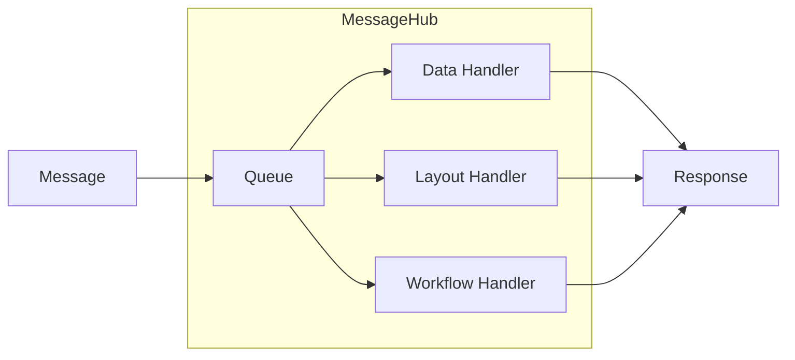
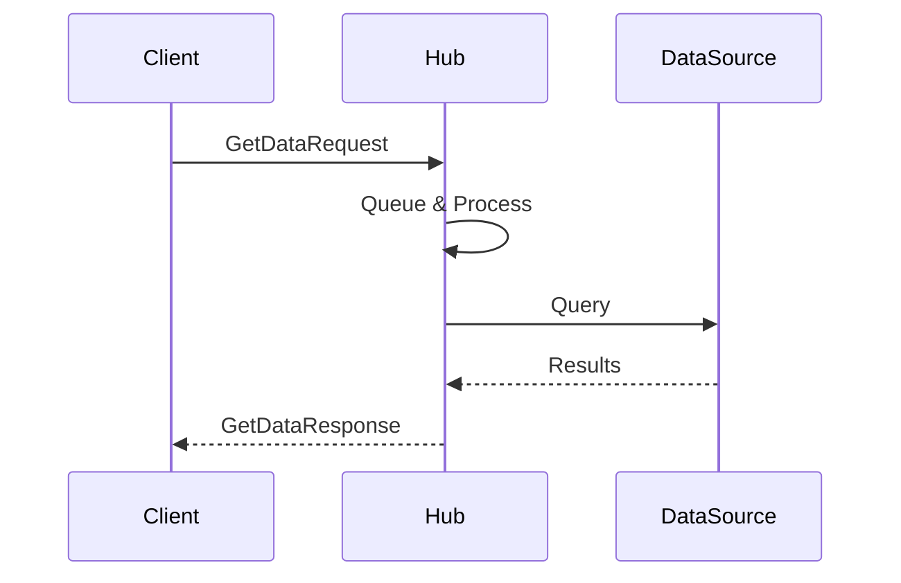

MeshWeaver is built on a **message-passing actor model**. Every unit of work — data retrieval, UI rendering, workflow execution — travels as a typed message to a **MessageHub**, which processes it single-threaded. The result is predictable execution order, clean state isolation, and straightforward horizontal scale.

## Architecture Overview

MessageHubs can be deployed across any cloud environment (Azure, AWS, on-premise) and communicate through a central message bus. Each hub owns its own queue; nothing runs concurrently inside a single hub.

@@content:message-flow.svg

---

## How It Works

### 1. Hub Allocation

Every MessageHub has a unique **Address** that the routing layer uses to deliver messages. When a hub starts it:

- Registers a unique **Address** for routing
- Spins up a **Queue** for serialised message processing
- Wires up **Handlers** for each message type it owns
- Optionally spawns **child hubs** for background or long-running work

### 2. Message Processing Pipeline

Messages enter the hub's queue and are dispatched to the matching handler — one at a time, in arrival order.

| Handler Type | Responsibility |
|---|---|
| **Data Handlers** | Retrieve and modify data from connected sources |
| **Layout Handlers** | Produce UI components for the Blazor front-end |
| **Workflow Handlers** | Orchestrate multi-step business processes |

### 3. Request / Response Pattern

Every interaction follows a typed request/response contract. The caller sends a request message; the hub processes it and replies with a strongly-typed response — no shared memory, no callbacks, no locks.

---

## Key Concepts

### Single-Threaded Processing

Each hub processes exactly one message at a time. This design:

- **Eliminates intra-hub race conditions** — no shared-state synchronisation needed
- **Makes execution deterministic** — message N always completes before message N+1
- **Simplifies handler code** — handlers read and write hub state without locks

### Hierarchical Routing

A hub may spawn child hubs and delegate work to them. Typical uses:

- **Synchronisation** — streaming changes from external data sources asynchronously
- **Long-running jobs** — keeping the parent hub responsive while work continues in a child
- **Background processing** — periodic tasks, cache warming, index maintenance

### Data Source Integration

Handlers connect to the appropriate backing store for the domain:

| Category | Examples |
|---|---|
| **Analytics platforms** | Snowflake, Databricks |
| **Transactional stores** | SQL Server, Cosmos DB |
| **Binary / file storage** | Azure Blob Storage |

---

## Common Message Types

| Message | Purpose |
|---|---|
| `GetDataRequest` | Retrieve data by reference |
| `DataChangeRequest` | Create, update, or delete entities |
| `SubscribeRequest` | Stream ongoing data changes to the caller |
| `ClickedEvent` | UI interaction forwarded from the Blazor layer |

---

## Benefits at a Glance

| Benefit | How the model delivers it |
|---|---|
| **Scalability** | Hubs distribute across clouds; add capacity by adding hubs |
| **Isolation** | Each hub manages its own state — no cross-hub shared memory |
| **Flexibility** | Any data source plugs in via a handler registration |
| **Testability** | Message exchanges are explicit and easy to assert in tests |
| **Observability** | Every message has a traceable path through the system |
