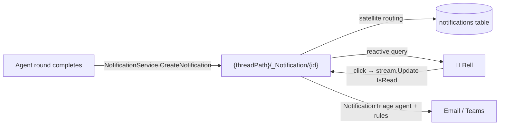

# Notifications

A notification is **just a mesh node** — a satellite under the thing it notifies about. Nothing about the pipeline is special-cased: creation is a node create, the bell is a reactive query, mark-as-read is a `stream.Update`, and routing to external channels is an agent reading rule nodes. Everything composes from primitives you already know.



## 1. Emitting — a satellite create

When a thread round reaches a terminal state, `ThreadExecution.EmitCompletionNotification` creates a `Notification` node under the thread (the same surface is open to any feature):

```csharp
NotificationService.CreateNotification(
        meshService,
        mainNodePath: threadPath,                    // satellite of the thread
        title: $"\"{threadName}\" is ready",
        message: preview,                            // first 120 chars of the response
        type: NotificationType.General,
        targetNodePath: threadPath,                  // where clicking navigates
        createdBy: agentName,
        icon: "/static/NodeTypeIcons/chat.svg")
    .Subscribe(_ => { }, ex => logger.LogWarning(ex, "notification failed"));
```

The node lands at **`{mainNodePath}/_Notification/{id}`** with `MainNode = mainNodePath` — so access control resolves from the main node ("who can read the thread can see its notifications"), and the `_Notification` path segment routes persistence to the dedicated **`notifications`** satellite table. Creation is fire-and-forget: a failed notification never fails the round.

## 2. The bell — a reactive query

The portal's notification center subscribes once and re-renders on every change — new notifications appear without polling, and the unread badge is just a count over the same emission:

```csharp
MeshQuery.Query<MeshNode>(
        MeshQueryRequest.FromQuery("nodeType:Notification sort:CreatedAt-desc"))
    .Subscribe(change =>
    {
        notifications = change.Items?.ToList() ?? [];
        InvokeAsync(StateHasChanged);
    });
```

This is the **set** side of CQRS — a query is right here because the bell wants *all* notifications the user can see, live. (For one specific thread's notifications: `path:{threadPath}/_Notification scope:children nodeType:Notification` — filtering by `nodeType` keeps the result robust when other satellite types live under the same thread.)

## 3. Mark-as-read — `stream.Update`, like everything else

Clicking a notification navigates to its `TargetNodePath` and flips the scalar through the canonical mutation API:

```csharp
Hub.GetMeshNodeStream(node.Path)
    .Update(n => n with { Content = ((Notification)n.Content!) with { IsRead = true } })
    .Subscribe(_ => { }, ex => Logger.LogWarning(ex, "mark-read failed"));
```

A scalar flip is race-safe across mirrors (RFC 7396 merges object keys), so the bell, the panel, and any other reader converge on the next emission.

## 4. Routing beyond the bell — rules, channels, triage

Where a notification *also* goes is the user's data, not code:

| Node type | Lives at | Holds |
|---|---|---|
| `NotificationRule` | `{user}/_NotificationRule/…` | Plain-English routing intent ("approvals → Teams immediately", "thread completions → email digest"), with `order` precedence |
| `NotificationChannel` | `{user}/_NotificationChannel/…` | A channel: `kind` (`InApp` / `Email` / `Teams`), optional `target`, `enabled` |

The **[NotificationTriage](/Agent/NotificationTriage)** agent reads the recipient's rules and channels, applies them to the event, and dispatches to the chosen channels — email delivery rides [Sending Email](/Doc/Architecture/SendingEmail). Users manage their rules and channels in settings — see [Notification Preferences](/Doc/GUI/NotificationPreferences).

## Cross-references

- [Satellite Entity Patterns](/Doc/Architecture/SatelliteEntityPatterns) — the satellite shape notifications follow.
- [Thread Operations](/Doc/Architecture/ThreadOperations) — where completion emission sits in the round lifecycle.
- [CQRS — Queries vs. Content Access](/Doc/Architecture/CqrsAndContentAccess) — why the bell queries but mark-as-read streams.
- Implementation: `src/MeshWeaver.Graph/NotificationService.cs` · `src/MeshWeaver.Blazor.Portal/Components/NotificationCenter.razor` / `NotificationCenterPanel.razor`.
