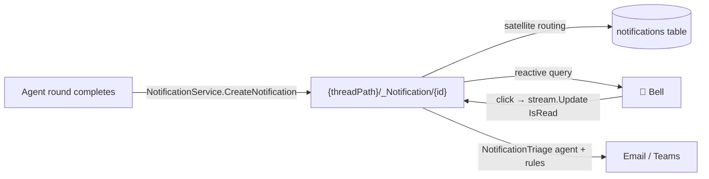

# Notifications

A notification is **just a mesh node** — a satellite under the thing it notifies about. Nothing about the pipeline is special-cased: creation is a node create, the bell is a reactive query, mark-as-read is a `stream.Update`, and routing to external channels is an agent reading rule nodes. Everything composes from primitives you already know.


```mermaid
flowchart LR
    A[Agent round completes] -->|NotificationService.CreateNotification| B["{threadPath}/_Notification/{id}"]
    B -->|satellite routing| C[(notifications table)]
    B -->|reactive query| D[🔔 Bell]
    D -->|click → stream.Update IsRead| B
    B -->|NotificationTriage agent + rules| E[Email / Teams]
```

## 1. Emitting — a satellite create

When a thread round reaches a terminal state, `ThreadExecution.EmitCompletionNotification` creates a `Notification` node under the thread (the same surface is open to any feature):

```csharp
NotificationService.Dispatch(
        hub,
        recipient: addressee,                        // WHO it is for — null means the platform operators
        mainNodePath: threadPath,                    // WHAT it is about
        title: $"\"{threadName}\" is ready",
        message: preview,                            // first 120 chars of the response
        type: NotificationType.ChatReady,
        targetNodePath: threadPath,                  // where clicking navigates
        createdBy: agentName,
        icon: "/static/NodeTypeIcons/chat.svg")
    .Subscribe(_ => { }, ex => logger.LogWarning(ex, "notification failed"));
```

🚨 **The node lands at `{addressee}/_Notification/{id}`** with `MainNode = the addressee`, and the `_Notification` path segment routes persistence to that partition's dedicated **`notifications`** satellite table. The entity the notification is ABOUT is a reference on the content (`TargetNodePath`). `recipient: null` means the PLATFORM — the `Admin` partition, read-scoped to `hub.IsGlobalAdmin()`. Creation is fire-and-forget in the sense that a failed notification never fails the round — but the observable is COLD, so it must still be subscribed: a discarded `Dispatch` writes nothing at all.

🚨 **Who can see it is decided by the PATH.** No `SatelliteAccessRule` is registered for `Notification`, so `RlsNodeValidator` falls through to the ordinary path-based permission fold on the notification's own path. Under the addressed model that is the *correct* answer — the addressee, plus whoever can read their partition — which is why no rule is needed. Before addressing it was the wrong one: an "Update available" notification written under a plugin record reached every viewer who could read the plugin catalog. See [Addressed Notifications](/Doc/Architecture/AddressedNotifications).

## 2. The bell — a reactive query

The portal's notification center subscribes once and re-renders on every change — new notifications appear without polling, and the unread badge is just a count over the same emission:

```csharp
// One live feed, two ANCHORED legs — the shell's NotificationFeed.ForViewer.
NotificationFeed.ForViewer(Hub, MeshQuery, Access)
    .Subscribe(items =>
    {
        notifications = items;
        InvokeAsync(StateHasChanged);
    });
```

Behind it, `NotificationQueries.For(viewer, viewerIsGlobalAdmin)` yields the legs, each built by core's `NotificationService.BellQuery`:

```text
namespace:{viewer}/_Notification nodeType:Notification sort:CreatedAt-desc
namespace:Admin/_Notification    nodeType:Notification sort:CreatedAt-desc   ← global admins only
```

This is the **set** side of CQRS — a query is right here because the bell wants *all* notifications addressed to the viewer, live. (For one specific thread's notifications: `path:{threadPath}/_Notification scope:children nodeType:Notification`.)

🚨 **Each leg names ONE partition, and that is not merely an optimisation.** The previous spelling — a bare `nodeType:Notification sort:CreatedAt-desc` — named no partition and UNIONed every partition schema on the server, per circuit, on every notification write anywhere: measured on memex-cloud at **4 476 rows across 201 of 201 schemas, 9–10 s per render, filtered to 0 rows in memory**, on an idle replica. And because `Admin` is excluded from `public.searchable_schemas`, that fan-out could never read `admin.notifications` at all, so **every platform-admin notification was written and shown to nobody**.

🚨 **Two queries, never one `namespace:A|B` alternation.** A single concrete `namespace:` folds into `ParsedQuery.Path` and pins to one schema without consulting `searchable_schemas`; an alternation leaves `Path` null, takes the fan-out route, and is narrowed by INTERSECTION with that registry — which excludes `Admin`, so it would drop the platform bell again, silently. Pinned by `NotificationBellLegsTest`.

🚨 **The platform leg is issued only for a viewer `hub.IsGlobalAdmin()` confirms POSITIVELY** — the one canonical platform-admin predicate, never an ad-hoc role-name or root-scope check — and the gate fails CLOSED. RLS refuses those rows to a non-admin independently; the gate decides what is even asked for. See [Addressed Notifications](/Doc/Architecture/AddressedNotifications) and [Cross-Schema Fan-Out Elimination](/Doc/Architecture/CrossSchemaFanOutElimination).

## 3. Mark-as-read — `stream.Update`, like everything else

Clicking a notification navigates to its `TargetNodePath` and flips the scalar through the canonical mutation API:

```csharp
Hub.GetMeshNodeStream(node.Path)
    .Update(n => n with { Content = ((Notification)n.Content!) with { IsRead = true } })
    .Subscribe(_ => { }, ex => Logger.LogWarning(ex, "mark-read failed"));
```

A scalar flip is race-safe across mirrors (RFC 7396 merges object keys), so the bell, the panel, and any other reader converge on the next emission.

## 4. Channels per feature — where a notification goes

Every notification is raised for a **feature** — a stable, open-vocabulary key (`NotificationFeatures`: `approvals`, `inbox`, `triage`, `accessGranted`, `chatReady`, `system`; a module may raise its own). 🚨 Open, but not free-form: the key is the node id of each person's preference, so it must be a camel-case identifier (`^[a-z][a-zA-Z0-9]*$`, `NotificationFeatures.IsValidKey`). A key outside that alphabet is **rejected** where it enters (`Raise` errors, `PathFor` throws, the settings tab gives it no row) — never slugged, because a lossy slug would make two features share one preference node. A notification raised without one gets the feature its `NotificationType` implies (the three approval types → `approvals`, and so on), and the bell row records it (`Notification.Feature`; read it through `FeatureOf()`, which covers rows written before the key existed).

Each person chooses, **per feature**, which channels reach them. The choice is an ordinary node in their own partition:

| Node type | Lives at | Holds |
|---|---|---|
| `NotificationFeaturePreference` | `{user}/_Settings/Notifications/{feature}` | `bell`, `teams`, `email` — the channels for that feature |

`NotificationChannelPreferences.Resolve` (and `Fold`, over the two reads) is the one rule, pure and unit-tested:

- the person's node for the feature, when it exists, is taken **as written**;
- otherwise the default — **the bell and Teams, for every feature**. The bell and email of a feature that had a legacy per-category row (`NotificationSettings` at `{user}/_Settings/Notifications`) keep what that row says, so a bell someone had switched off stays off and approval / access-grant emails stay on; a newer feature gets no email by default.

🚨 **Absent is not unreadable, and the difference is the privacy property.** Both preference nodes are read AUTHORITATIVELY — existence from a synced query (they usually do not exist, and a point read of an absent path NotFound-storms the owner), content from `GetMeshNodeStream(path)`, never from the query's possibly-trailing snapshot (`NotificationFeaturePreferenceNodeType.ReadAuthoritative`, a `PreferenceRead<T>` of `Absent` / `Found` / `Unreadable`). A node that exists but cannot be read — a timeout, a fault, content that will not type — **fails closed**: the bell only, never Teams or email on a choice we could not see (`NotificationChannelPreferences.FailClosed`), logged at Warning. Reading it as absent would switch the default Teams channel on for a person who had switched it off.

The **Notifications** settings tab shows one section per feature (the platform's `NotificationFeatures.BuiltIn` plus every `NotificationFeatureDescriptor` a module registers) and binds the standard node-content editor straight to that feature's node. The node is created on first view **seeded with the effective preference** — the legacy row read from its authoritative stream — so opening the tab changes no delivery; a legacy row that exists but cannot be read refuses the seed (the tab says so) rather than persisting a value nobody saw.

### Delivery — `NotificationService.Raise`

`Raise(hub, NotificationRequest)` is the feature-aware entry point; `Dispatch` / `DispatchLocalizable` forward to it with the feature their type implies. It resolves the recipient's preference for the feature and runs one independent leg per channel, reporting what each did (`NotificationChannelResult`):

- **Bell** (`InApp`) — the addressed row, stamped with the feature.
- **Email** — the profile address, unchanged, including the deferral to triage for a person who authored routing rules.
- **Any other channel** — handed to every registered **`INotificationChannelDeliverer`** for it (each ISOLATED: one that throws is its own skip and cannot mask another's delivery), with the text rendered in the recipient's own language and an absolute link. Core cannot send to Teams itself; the Teams module (MeshWeaver.Plugins, `TeamsNotificationDeliverer`) registers the deliverer, posting through the Memex bot into the conversation the person opened by messaging it.

🚨 **A channel the recipient cannot be reached on is a SKIP, logged at Debug — never an error to the raiser.** No deliverer installed, the bot not configured, or the person never having messaged the bot each come back as `Skipped` with the reason, and the other legs are unaffected. A leg that throws is logged at Warning and reported as a skip for the same reason.

A notification with **no recipient** addresses the platform operators' bell and reaches no other channel — it has no person, so no preference, no mailbox and no Teams. An emitter that needs a person's attention (an approval, say) must address the people: the Hosting approval notice enumerates the eligible global administrators and raises one `approvals` notification each.

## 5. Routing beyond the bell — rules, channels, triage

Where a notification *also* goes is the user's data, not code:

| Node type | Lives at | Holds |
|---|---|---|
| `NotificationRule` | `{user}/_NotificationRule/…` | Plain-English routing intent ("approvals → Teams immediately", "thread completions → email digest"), with `order` precedence |
| `NotificationChannel` | `{user}/_NotificationChannel/…` | A channel: `kind` (`InApp` / `Email` / `Teams`), optional `target`, `enabled` |

The **[NotificationTriage](/Agent/NotificationTriage)** agent reads the recipient's rules and channels, applies them to the event, and dispatches to the chosen channels — email delivery rides [Sending Email](/Doc/Architecture/SendingEmail). Users manage their rules and channels in settings — see [Notification Preferences](/Doc/GUI/NotificationPreferences).

This whole lane — the two node types plus the `NotificationTriageService` watcher that starts the agent — ships as the **`MeshWeaver.Notifications.Channels` module** ([Modules](/Doc/Architecture/Modules)); the bell and the deterministic email preferences stay core. The watcher self-skips unless `Email:Enabled`.

## Cross-references

- [Satellite Entity Patterns](/Doc/Architecture/SatelliteEntityPatterns) — the satellite shape notifications follow.
- [Thread Operations](/Doc/Architecture/ThreadOperations) — where completion emission sits in the round lifecycle.
- [CQRS — Queries vs. Content Access](/Doc/Architecture/CqrsAndContentAccess) — why the bell queries but mark-as-read streams.
- [Addressed Notifications](/Doc/Architecture/AddressedNotifications) — where notifications actually live today, and the design that lets the bell name its partition.
- [Notification Preferences](/Doc/GUI/NotificationPreferences) — the per-feature channel choice, as a person sees it.
- Implementation: `src/MeshWeaver.Graph/NotificationService.cs` (core) · `src/MeshWeaver.Mesh.Contract/NotificationFeature.cs` (the feature vocabulary, the preference rule and the channel seam) · `memex/Memex.Portal.Shared/Settings/NotificationsSettingsTab.cs` (the tab) · `src/MeshWeaver.Blazor.Portal/Components/NotificationCenter.razor` / `NotificationCenterPanel.razor` and `NotificationQueries.cs` (**MeshWeaver.Plugins** — the Blazor portal shell lives there).
