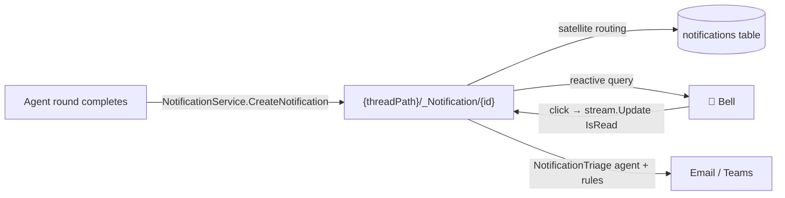

# Notifications

A notification is **just a mesh node** — a satellite under the thing it notifies about. Nothing about the pipeline is special-cased: creation is a node create, the bell is a reactive query, mark-as-read is a `stream.Update`, and routing to external channels is an agent reading rule nodes. Everything composes from primitives you already know.


```mermaid
flowchart LR
    A[Agent round completes] -->|NotificationService.CreateNotification| B["{threadPath}/_Notification/{id}"]
    B -->|satellite routing| C[(notifications table)]
    B -->|reactive query| D[🔔 Bell]
    D -->|click → stream.Update IsRead| B
    B -->|NotificationTriage agent + rules| E[Email / Teams]
```

## 1. Emitting — a satellite create

When a thread round reaches a terminal state, `ThreadExecution.EmitCompletionNotification` creates a `Notification` node under the thread (the same surface is open to any feature):

```csharp
NotificationService.Dispatch(
        hub,
        recipient: addressee,                        // WHO it is for — null means the platform operators
        mainNodePath: threadPath,                    // WHAT it is about
        title: $"\"{threadName}\" is ready",
        message: preview,                            // first 120 chars of the response
        type: NotificationType.ChatReady,
        targetNodePath: threadPath,                  // where clicking navigates
        createdBy: agentName,
        icon: "/static/NodeTypeIcons/chat.svg")
    .Subscribe(_ => { }, ex => logger.LogWarning(ex, "notification failed"));
```

🚨 **The node lands at `{addressee}/_Notification/{id}`** with `MainNode = the addressee`, and the `_Notification` path segment routes persistence to that partition's dedicated **`notifications`** satellite table. The entity the notification is ABOUT is a reference on the content (`TargetNodePath`). `recipient: null` means the PLATFORM — the `Admin` partition, read-scoped to `hub.IsGlobalAdmin()`. Creation is fire-and-forget in the sense that a failed notification never fails the round — but the observable is COLD, so it must still be subscribed: a discarded `Dispatch` writes nothing at all.

🚨 **Who can see it is decided by the PATH.** No `SatelliteAccessRule` is registered for `Notification`, so `RlsNodeValidator` falls through to the ordinary path-based permission fold on the notification's own path. Under the addressed model that is the *correct* answer — the addressee, plus whoever can read their partition — which is why no rule is needed. Before addressing it was the wrong one: an "Update available" notification written under a plugin record reached every viewer who could read the plugin catalog. See [Addressed Notifications](/Doc/Architecture/AddressedNotifications).

## 2. The bell — a reactive query

The portal's notification center subscribes once and re-renders on every change — new notifications appear without polling, and the unread badge is just a count over the same emission:

```csharp
// One live feed, two ANCHORED legs — the shell's NotificationFeed.ForViewer.
NotificationFeed.ForViewer(Hub, MeshQuery, Access)
    .Subscribe(items =>
    {
        notifications = items;
        InvokeAsync(StateHasChanged);
    });
```

Behind it, `NotificationQueries.For(viewer, viewerIsGlobalAdmin)` yields the legs, each built by core's `NotificationService.BellQuery`:

```text
namespace:{viewer}/_Notification nodeType:Notification sort:CreatedAt-desc
namespace:Admin/_Notification    nodeType:Notification sort:CreatedAt-desc   ← global admins only
```

This is the **set** side of CQRS — a query is right here because the bell wants *all* notifications addressed to the viewer, live. (For one specific thread's notifications: `path:{threadPath}/_Notification scope:children nodeType:Notification`.)

🚨 **Each leg names ONE partition, and that is not merely an optimisation.** The previous spelling — a bare `nodeType:Notification sort:CreatedAt-desc` — named no partition and UNIONed every partition schema on the server, per circuit, on every notification write anywhere: measured on memex-cloud at **4 476 rows across 201 of 201 schemas, 9–10 s per render, filtered to 0 rows in memory**, on an idle replica. And because `Admin` is excluded from `public.searchable_schemas`, that fan-out could never read `admin.notifications` at all, so **every platform-admin notification was written and shown to nobody**.

🚨 **Two queries, never one `namespace:A|B` alternation.** A single concrete `namespace:` folds into `ParsedQuery.Path` and pins to one schema without consulting `searchable_schemas`; an alternation leaves `Path` null, takes the fan-out route, and is narrowed by INTERSECTION with that registry — which excludes `Admin`, so it would drop the platform bell again, silently. Pinned by `NotificationBellLegsTest`.

🚨 **The platform leg is issued only for a viewer `hub.IsGlobalAdmin()` confirms POSITIVELY** — the one canonical platform-admin predicate, never an ad-hoc role-name or root-scope check — and the gate fails CLOSED. RLS refuses those rows to a non-admin independently; the gate decides what is even asked for. See [Addressed Notifications](/Doc/Architecture/AddressedNotifications) and [Cross-Schema Fan-Out Elimination](/Doc/Architecture/CrossSchemaFanOutElimination).

## 3. Mark-as-read — `stream.Update`, like everything else

Clicking a notification navigates to its `TargetNodePath` and flips the scalar through the canonical mutation API:

```csharp
Hub.GetMeshNodeStream(node.Path)
    .Update(n => n with { Content = ((Notification)n.Content!) with { IsRead = true } })
    .Subscribe(_ => { }, ex => Logger.LogWarning(ex, "mark-read failed"));
```

A scalar flip is race-safe across mirrors (RFC 7396 merges object keys), so the bell, the panel, and any other reader converge on the next emission.

## 4. Routing beyond the bell — rules, channels, triage

Where a notification *also* goes is the user's data, not code:

| Node type | Lives at | Holds |
|---|---|---|
| `NotificationRule` | `{user}/_NotificationRule/…` | Plain-English routing intent ("approvals → Teams immediately", "thread completions → email digest"), with `order` precedence |
| `NotificationChannel` | `{user}/_NotificationChannel/…` | A channel: `kind` (`InApp` / `Email` / `Teams`), optional `target`, `enabled` |

The **[NotificationTriage](/Agent/NotificationTriage)** agent reads the recipient's rules and channels, applies them to the event, and dispatches to the chosen channels — email delivery rides [Sending Email](/Doc/Architecture/SendingEmail). Users manage their rules and channels in settings — see [Notification Preferences](/Doc/GUI/NotificationPreferences).

This whole lane — the two node types plus the `NotificationTriageService` watcher that starts the agent — ships as the **`MeshWeaver.Notifications.Channels` module** ([Modules](/Doc/Architecture/Modules)); the bell and the deterministic email preferences stay core. The watcher self-skips unless `Email:Enabled`.

## Cross-references

- [Satellite Entity Patterns](/Doc/Architecture/SatelliteEntityPatterns) — the satellite shape notifications follow.
- [Thread Operations](/Doc/Architecture/ThreadOperations) — where completion emission sits in the round lifecycle.
- [CQRS — Queries vs. Content Access](/Doc/Architecture/CqrsAndContentAccess) — why the bell queries but mark-as-read streams.
- [Addressed Notifications](/Doc/Architecture/AddressedNotifications) — where notifications actually live today, and the design that lets the bell name its partition.
- Implementation: `src/MeshWeaver.Graph/NotificationService.cs` (core) · `src/MeshWeaver.Blazor.Portal/Components/NotificationCenter.razor` / `NotificationCenterPanel.razor` and `NotificationQueries.cs` (**MeshWeaver.Plugins** — the Blazor portal shell lives there).
