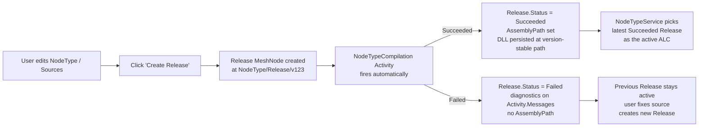

# NodeType Release Redesign

This document is the design proposal for first-class Release MeshNodes. It
supersedes the implicit edit-then-invalidate-cache compile flow with an
explicit, observable, version-pinned release pipeline.

---

## Why the old flow breaks down

The current NodeType compile flow is implicit and entirely process-local:

1. A user edits a `NodeType` or one of its `Source/` children.
2. The change-feed fires `NodeTypeService.InvalidateCache(nodeTypePath)`, which
   clears in-memory dictionaries.
3. The next access triggers a Roslyn compile and loads the result into a
   process-local `AssemblyLoadContext` (ALC).

That sounds simple, but there are four failure modes that compound one another.

**The ALC key mismatch.** Release-based ALCs are keyed in `_loadContexts` by
`release.Path`. `InvalidateCache` looks up by `nodeName`, finds nothing, skips
the GC sweep, and `File.Delete` on the cached `.dll` throws
`UnauthorizedAccessException`. This is why
`CodeEditRecompileTest` (`test/MeshWeaver.Hosting.Monolith.Test`) is still `[Skip]`-ed.

**No observable feedback.** Users have no signal while a compile is running,
when it finishes, or whether it succeeded. Diagnostics are read on demand via
`GetCompilationError(nodeTypePath)` — a polled, in-memory dictionary.

**No rollback.** Old assemblies are deleted before the new compile starts. If
the new compile fails, there is nothing to fall back to.

**No history.** Once a compile succeeds, the previous version is gone. There
is no audit trail of what changed and when.

> **The redesign goal:** treat releases as first-class, observable, versioned
> MeshNodes so the framework's existing Activity Control Plane machinery handles
> progress, cancellation, diagnostics, and rollback automatically.

---

## The model



Each Release is a `MeshNode` of type `Release` at
`{nodeTypePath}/Release/{version}`. Versions are user-supplied or auto-stamped
(timestamp + short hash). A Release owns its own `.dll` on disk at a path that
is stable for the `(nodeTypePath, version)` pair. Releases accumulate; old ones
remain as history.

---

## Schema

```csharp
public sealed record Release : ActivityLog("NodeTypeRelease")
{
    /// <summary>
    /// The NodeType this release was built from. Stable across the release's
    /// lifetime; a release belongs to exactly one NodeType.
    /// </summary>
    public required string NodeTypePath { get; init; }

    /// <summary>
    /// User-supplied version label (e.g. "1.2.0", "feature-x"). When null,
    /// auto-stamped by the create handler with a timestamp + 8-char hash of
    /// the compilation inputs.
    /// </summary>
    public string? Version { get; init; }

    /// <summary>
    /// Release notes — markdown body the author writes to describe the
    /// release. Surfaces in the UI release history list and at the top of
    /// the Release detail view.
    /// </summary>
    public MarkdownContent? Notes { get; init; }

    /// <summary>
    /// Snapshot of the compilation inputs at release time. Stored on the
    /// release so a future replay can verify the inputs match. Same hash
    /// used to derive the disk path.
    /// </summary>
    public required string Code { get; init; }
    public string? HubConfiguration { get; init; }
    public IReadOnlyList<ContentCollectionConfig>? ContentCollections { get; init; }
    public required string FrameworkVersion { get; init; }
    public required string ContentHash { get; init; }    // 16-char base64

    /// <summary>
    /// Filesystem path of the compiled DLL. Set when the compile activity
    /// terminates with <c>Succeeded</c>; null on failure. Path is
    /// <c>{cacheDir}/{nodeTypePath-sanitized}/{version}/Release.dll</c>.
    /// </summary>
    public string? AssemblyPath { get; init; }
    public string? PdbPath { get; init; }

    // Inherited from ActivityLog:
    //   Status            — Pending → Compiling → Succeeded / Failed
    //   RequestedStatus   — control plane (e.g. set to Cancelled to abort)
    //   Messages          — Roslyn diagnostics during compile
    //   Start, End        — when compile started / finished
    //   ReturnValue       — JsonElement of the AssemblyPath (also set above)
}
```

`Release` derives from `ActivityLog` so the existing
[Activity Control Plane](/Doc/Architecture/ActivityControlPlane) machinery — observable progress
via `workspace.GetMeshNodeStream(releasePath)`, cancellation via
`RequestedStatus = Cancelled`, and real-time message streaming — comes for free.

---

## Lifecycle

### 1. Create-release request

```csharp
public sealed record CreateReleaseRequest(string NodeTypePath, string? Version, MarkdownContent? Notes)
    : IRequest<CreateReleaseResponse>;

public sealed record CreateReleaseResponse(string ReleasePath, string? Error = null)
{
    public bool Success => string.IsNullOrEmpty(Error);
}
```

The handler at the mesh hub:

1. Reads the current `NodeTypeDefinition` and `Source/` content of `NodeTypePath`.
2. Computes `ContentHash` over those inputs.
3. Creates a `Release` MeshNode at
   `{NodeTypePath}/Release/{Version ?? autostamp()}` with `Status = Compiling`.
4. Posts back `CreateReleaseResponse` with the release path immediately
   (just-start, matching the `ScriptDispatch.StartScript` pattern).
5. The Release's hub fires the compile asynchronously.

### 2. Compile activity (per release)

Each Release MeshNode's hub watches its own `MeshNodeReference` stream via
`hub.WatchControlPlane(...)`. When `RequestedStatus = Compiling` (set on
create), it fires the Roslyn compile in the background:

```csharp
hub.RegisterForDisposal(hub.WatchControlPlane(requested =>
{
    if (requested != ActivityStatus.Compiling) return;
    Observable.FromAsync(ct => CompileReleaseAsync(hub, ct))
        .Subscribe(
            assemblyPath =>
                hub.GetWorkspace().UpdateMeshNode(curr =>
                    curr.Content is Release r
                        ? curr with { Content = r with {
                            Status = ActivityStatus.Succeeded,
                            AssemblyPath = assemblyPath } }
                        : curr),
            ex =>
                hub.GetWorkspace().UpdateMeshNode(curr =>
                    curr.Content is Release r
                        ? curr with { Content = r with {
                            Status = ActivityStatus.Failed,
                            Messages = r.Messages.Add(new LogMessage(ex.Message, LogLevel.Error)) } }
                        : curr));
}));
```

Roslyn diagnostics flow into `Release.Messages` (inherited from `ActivityLog`)
during the compile, using the same per-Activity logger pattern as the kernel.

### 3. Resolution: which release is active?

`NodeTypeService.GetCachedConfiguration(nodeTypePath)` becomes a stream-backed
read keyed off the release feed:

```csharp
public NodeTypeConfiguration? GetCachedConfiguration(string nodeTypePath) =>
    GetActiveReleaseStream(nodeTypePath)
        .Take(1)
        .Select(release => release?.AssemblyPath is { } path ? LoadConfig(path) : null)
        .Wait(); // sync read for the cached path; observable variant for hot paths
```

`GetActiveReleaseStream` returns the latest succeeded release:

```csharp
private IObservable<Release?> GetActiveReleaseStream(string nodeTypePath) =>
    meshService.Query<MeshNode>(
            MeshQueryRequest.FromQuery($"namespace:{nodeTypePath}/Release nodeType:Release"))
        .Select(change => change.Items
            .Select(n => n.Content as Release)
            .Where(r => r is { Status: ActivityStatus.Succeeded, AssemblyPath: not null })
            .OrderByDescending(r => r!.Start)
            .FirstOrDefault());
```

**The active release is always the latest Succeeded one.** Failed compiles
never become active; users keep running on the previous release until they
ship a fix in a new release.

### 4. ALC management

`CompilationCacheService` becomes Release-keyed:

- `GetOrCreateLoadContextForRelease(release)` keys `_loadContexts` by
  `release.Path` (already does this, but loads from a version-stable folder
  rather than a hash-stable one).
- **DLL path:** `{cacheDir}/{nodeTypePath-sanitized}/{version}/Release.dll`.
  The path is stable for the same `(NodeTypePath, Version)` pair. Re-running a
  compile against an existing version overwrites in place but never deletes a
  different version's DLL.
- **Switching active release:** when a new Release becomes the latest Succeeded,
  the previous release's ALC stays in `_loadContexts` until explicitly unloaded.
  `NodeTypeService` calls `cacheService.UnloadContext(prevRelease.Path)` when
  the active release advances. The DLL on disk is **kept** — only the ALC is
  disposed. New per-node hub activations bind to the new release's ALC; existing
  per-node hubs stay on the previous ALC until they are recycled.
- **`InvalidateCache(nodeTypePath)` is deleted.** Releases are immutable and
  durable — there is nothing to invalidate. The replacement is "create a new
  release," which the user does explicitly.

### 5. UI surfaces

| View | Path | Content |
|---|---|---|
| Release history | `{nodeTypePath}/Release/*` | List of Releases — Status, Version, CreatedAt, Notes preview |
| Release detail | `{nodeTypePath}/Release/{version}` | Full Notes (rendered markdown), full Activity log, DLL/PDB download links |
| Create release form | NodeType detail page | Version field (optional), Notes textarea (markdown), Submit button |

On submit, the form posts `CreateReleaseRequest`, navigates to the new Release's
detail view, and the user watches the compile happen in real time via the
Activity Control Plane subscription.

---

## Migration plan

The redesign is invasive but strictly additive: Release MeshNodes are introduced
alongside the existing cache, readers are flipped one consumer at a time, and
the old implicit path is deleted last.

| Phase | What | Risk |
|---|---|---|
| 0 | Add `Release` content type + `CreateReleaseRequest`/`Response` + handler. | Low — new code, no existing consumers. |
| 1 | Add `UnloadContext(release.Path)` callsite in `CompilationCacheService` when the active release advances (no new behaviour, just gives `NodeTypeService` the hook it needs). | Low |
| 2 | Wire compile-Activity to the Release node (extend `NodeTypeCompilationActivity` to emit on a `Release` content node, not a generic `Activity` node). | Medium — Activity Control Plane changes. |
| 3 | Add `INodeTypeService.GetActiveReleaseStream` reactive read; default `GetCachedConfiguration` to consult releases when present, falling back to the in-memory cache when not. | Medium — read-path change, but additive (fallback preserves current behaviour). |
| 4 | UI: Release history + detail + create-release form. | Medium — UI work. |
| 5 | Back-compat shim: existing NodeTypes without Releases auto-release on first compile, writing a Release MeshNode with the auto-stamped version. | Medium |
| 6 | Delete `InvalidateCache`, `_compilationErrors`, `_compilingInProgress` from `NodeTypeService`. The whole implicit-invalidation path goes away. | High — fan-out across many call sites. |

`CodeEditRecompileTest` un-skips at phase 3. The test rewrites itself as:
_create V1 release → read V1 → create V2 release → read V2 marker_. This
exercises the explicit-release path with no `InvalidateCache` call and no
file-delete race.

---

## Open questions for review

1. **Version naming default.** When the user omits Version, the suggested
   auto-stamp format is `{yyyyMMddHHmmss}-{8charContentHash}` — sortable and
   unique.

2. **Garbage collection.** Releases accumulate indefinitely. A TTL, "keep last
   N," or explicit-delete policy is probably needed, but deferred as a
   follow-up.

3. **Cross-instance compilation.** Releases are MeshNodes, so they replicate
   across instances. Compiled DLLs on disk are per-instance. A Release that
   succeeded on instance A still needs to compile on instance B. This should be
   idempotent: same inputs → same content hash → same release ID → same target
   path → already-compiled is a no-op.

4. **Failed releases — keep or drop?** Proposal: keep (Status=Failed) and
   surface them in history. The Notes and Activity messages explain why the
   compile failed, which is useful for triage.

5. **Concurrent create-release.** Two users creating a release for the same
   NodeType simultaneously will get different auto-stamped versions (timestamp
   differs). Both compile independently; the latest Succeeded wins active
   status. This is probably fine.
