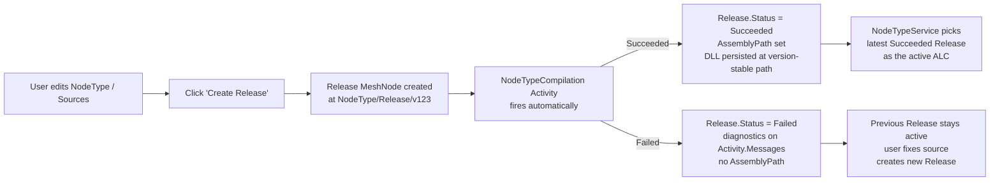

---
Name: NodeType Release Redesign
Category: Documentation
Description: Design for first-class Release MeshNodes — replaces the implicit edit-then-invalidate-cache compile flow with explicit, timestamped, version-pinned Release nodes that own their own ALCs and DLLs on disk.
Icon: <svg xmlns="http://www.w3.org/2000/svg" width="24" height="24" viewBox="0 0 24 24" fill="none" stroke="currentColor" stroke-width="2" stroke-linecap="round" stroke-linejoin="round"><path d="M21 16V8a2 2 0 0 0-1-1.73l-7-4a2 2 0 0 0-2 0l-7 4A2 2 0 0 0 3 8v8a2 2 0 0 0 1 1.73l7 4a2 2 0 0 0 2 0l7-4A2 2 0 0 0 21 16z"/><polyline points="3.27 6.96 12 12.01 20.73 6.96"/><line x1="12" y1="22.08" x2="12" y2="12"/></svg>
---

# NodeType Release Redesign — design proposal

## Why this exists

The current NodeType compile flow is implicit and process-local:

- User edits a `NodeType` or its `Source/` children → the change-feed fires
  `NodeTypeService.InvalidateCache(nodeTypePath)` → in-memory dicts get cleared
  → next access compiles → assembly loaded into a process-local `AssemblyLoadContext`.
- "Refresh" relies on `AssemblyLoadContext.Unload()` + `GC.Collect()` releasing the
  file lock so `File.Delete` on the cached `.dll` succeeds. On Windows this is
  flaky: release-based ALCs are keyed by `release.Path` in `_loadContexts`, but
  `InvalidateCache(nodeName)` looks up by `nodeName`, finds nothing, skips the
  GC sweep, and `File.Delete` fails with `UnauthorizedAccessException`
  ([CodeEditRecompileTest stays `[Skip]`-ed because of this](../../test/MeshWeaver.Hosting.Monolith.Test/CodeEditRecompileTest.cs)).
- The user has no observable signal of "is this version compiling / did it
  succeed / what's the diagnostic output." Diagnostics are read on demand
  through `GetCompilationError(nodeTypePath)` — a polled, in-memory dict.
- Old assemblies are deleted on the way to a new compile; if the new compile
  fails we have nothing to fall back to.

The redesign treats releases as first-class, observable, versioned entities.

## The model



Each Release is a `MeshNode` of type `Release` at
`{nodeTypePath}/Release/{version}`. Versions are user-supplied or auto-stamped
(timestamp + short hash). A Release owns its own `.dll` on disk; the disk
path is stable per `(nodeTypePath, version)`. Releases accumulate; old ones
stay around as history.

## Schema

```csharp
public sealed record Release : ActivityLog("NodeTypeRelease")
{
    /// <summary>
    /// The NodeType this release was built from. Stable across the release's
    /// lifetime; a release belongs to exactly one NodeType.
    /// </summary>
    public required string NodeTypePath { get; init; }

    /// <summary>
    /// User-supplied version label (e.g. "1.2.0", "feature-x"). When null,
    /// auto-stamped by the create handler with a timestamp + 8-char hash of
    /// the compilation inputs.
    /// </summary>
    public string? Version { get; init; }

    /// <summary>
    /// Release notes — markdown body the author writes to describe the
    /// release. Surfaces in the UI release history list and at the top of
    /// the Release detail view.
    /// </summary>
    public MarkdownContent? Notes { get; init; }

    /// <summary>
    /// Snapshot of the compilation inputs at release time. Stored on the
    /// release so a future replay can verify the inputs match. Same hash
    /// used to derive the disk path.
    /// </summary>
    public required string Code { get; init; }
    public string? HubConfiguration { get; init; }
    public IReadOnlyList<ContentCollectionConfig>? ContentCollections { get; init; }
    public required string FrameworkVersion { get; init; }
    public required string ContentHash { get; init; }    // 16-char base64

    /// <summary>
    /// Filesystem path of the compiled DLL. Set when the compile activity
    /// terminates with <c>Succeeded</c>; null on failure. Path is
    /// <c>{cacheDir}/{nodeTypePath-sanitized}/{version}/Release.dll</c>.
    /// </summary>
    public string? AssemblyPath { get; init; }
    public string? PdbPath { get; init; }

    // Inherited from ActivityLog:
    //   Status            — Pending → Compiling → Succeeded / Failed
    //   RequestedStatus   — control plane (e.g. set to Cancelled to abort)
    //   Messages          — Roslyn diagnostics during compile
    //   Start, End        — when compile started / finished
    //   ReturnValue       — JsonElement of the AssemblyPath (also set above)
}
```

`Release` derives from `ActivityLog` so the existing
[Activity Control Plane](ActivityControlPlane) machinery — observable
progress via `workspace.GetMeshNodeStream(releasePath)`, cancellation via
`RequestedStatus = Cancelled`, message streaming — works for free.

## Lifecycle

### 1. Create-release request

```csharp
public sealed record CreateReleaseRequest(string NodeTypePath, string? Version, MarkdownContent? Notes)
    : IRequest<CreateReleaseResponse>;

public sealed record CreateReleaseResponse(string ReleasePath, string? Error = null)
{
    public bool Success => string.IsNullOrEmpty(Error);
}
```

Handler at the mesh hub:

1. Reads the current `NodeTypeDefinition` + `Source/` content of `NodeTypePath`.
2. Computes `ContentHash` over inputs.
3. Creates a `Release` MeshNode at
   `{NodeTypePath}/Release/{Version ?? autostamp()}` with `Status = Compiling`.
4. Posts back `CreateReleaseResponse` with the release path immediately
   (just-start; matches `ScriptDispatch.StartScript` pattern).
5. The Release's hub fires the compile asynchronously.

### 2. Compile activity (per release)

Each Release MeshNode's hub watches its own `MeshNodeReference` stream via
`hub.WatchControlPlane(...)`. When `RequestedStatus = Compiling` (set on
create), it fires the Roslyn compile in the background:

```csharp
hub.RegisterForDisposal(hub.WatchControlPlane(requested =>
{
    if (requested != ActivityStatus.Compiling) return;
    Observable.FromAsync(ct => CompileReleaseAsync(hub, ct))
        .Subscribe(
            assemblyPath =>
                hub.GetWorkspace().UpdateMeshNode(curr =>
                    curr.Content is Release r
                        ? curr with { Content = r with {
                            Status = ActivityStatus.Succeeded,
                            AssemblyPath = assemblyPath } }
                        : curr),
            ex =>
                hub.GetWorkspace().UpdateMeshNode(curr =>
                    curr.Content is Release r
                        ? curr with { Content = r with {
                            Status = ActivityStatus.Failed,
                            Messages = r.Messages.Add(new LogMessage(ex.Message, LogLevel.Error)) } }
                        : curr));
}));
```

Diagnostics flow into `Release.Messages` (inherited from `ActivityLog`)
during the compile via the same per-Activity logger pattern as the kernel.

### 3. Resolution: which release is active?

`NodeTypeService.GetCachedConfiguration(nodeTypePath)` becomes a stream-backed
read keyed off the release feed:

```csharp
public NodeTypeConfiguration? GetCachedConfiguration(string nodeTypePath) =>
    GetActiveReleaseStream(nodeTypePath)
        .Take(1)
        .Select(release => release?.AssemblyPath is { } path ? LoadConfig(path) : null)
        .Wait(); // sync read for the cached path; observable variant for hot paths
```

`GetActiveReleaseStream` queries the latest succeeded release:

```csharp
private IObservable<Release?> GetActiveReleaseStream(string nodeTypePath) =>
    meshService.ObserveQuery<MeshNode>(
            MeshQueryRequest.FromQuery($"namespace:{nodeTypePath}/Release nodeType:Release"))
        .Select(change => change.Items
            .Select(n => n.Content as Release)
            .Where(r => r is { Status: ActivityStatus.Succeeded, AssemblyPath: not null })
            .OrderByDescending(r => r!.Start)
            .FirstOrDefault());
```

The active release **is the latest Succeeded one**. Failed compiles don't
become active; users keep running on the previous release until they ship
a fix in a new release.

### 4. ALC management

`CompilationCacheService` becomes Release-keyed:

- `GetOrCreateLoadContextForRelease(release)` keys `_loadContexts` by
  `release.Path` (already does this, but loads from a version-stable folder
  rather than a hash-stable one).
- DLL path: `{cacheDir}/{nodeTypePath-sanitized}/{version}/Release.dll`.
  Same path forever for the same `(NodeTypePath, Version)` pair —
  re-running a compile against an existing version overwrites in place but
  never deletes a different version's DLL.
- **Switching active release** (a new Release becomes the latest Succeeded):
  the previous release's ALC stays in `_loadContexts` until it's explicitly
  unloaded. `NodeTypeService` calls `cacheService.UnloadContext(prevRelease.Path)`
  when the active release advances. The DLL on disk is **kept** — only the
  ALC is disposed. New per-node hub activations bind to the new release's
  ALC; existing per-node hubs stay on the previous ALC until they're recycled.
- `InvalidateCache(nodeTypePath)` is **deleted** — there's nothing to
  invalidate; releases are immutable and durable. The closest replacement is
  "create a new release" (which the user does explicitly).

### 5. UI surfaces

- **Release history view** at `{nodeTypePath}/Release/*` — a list of
  Releases with their Status, Version, CreatedAt, Notes preview.
- **Release detail view** at `{nodeTypePath}/Release/{version}` — full
  notes (rendered markdown), full Activity log (Messages), download links
  for the DLL/PDB.
- **"Create release" form** on the NodeType detail page — Version field
  (optional), Notes textarea (markdown), Submit button. On click, posts
  `CreateReleaseRequest`, navigates to the new Release's detail view, the
  user watches the compile happen in real time via the Activity Control Plane
  subscription.

## Migration plan

The redesign is invasive but additive: introduce Release MeshNodes alongside
the existing cache, then flip readers one consumer at a time, then delete
the old path.

| Phase | What | Risk |
|---|---|---|
| 0 | Add `Release` content type + `CreateReleaseRequest`/`Response` + handler. | Low — new code, no existing consumers. |
| 1 | New `CompilationCacheService.GetOrCreateLoadContextForRelease` already exists; add `UnloadContext(release.Path)` callsite when active release advances (no new behaviour, just gives `NodeTypeService` a hook to call). | Low. |
| 2 | Wire compile-Activity to the Release node (extend `NodeTypeCompilationActivity` from Step 4 of the Activity Control Plane plan to emit on a `Release` content node, not just a generic `Activity` node). | Medium — Activity Control Plane changes. |
| 3 | Add `INodeTypeService.GetActiveReleaseStream` reactive read; default `GetCachedConfiguration` to consult releases when present, fall back to the existing in-memory cache when not. | Medium — read-path change, but additive (fallback preserves current behaviour). |
| 4 | UI: Release history + detail + create-release form. | Medium — UI work. |
| 5 | Migration: existing NodeTypes without Releases are auto-released on first compile (back-compat shim writes a Release MeshNode with the auto-stamped version). | Medium. |
| 6 | Delete `InvalidateCache`, `_compilationErrors`, `_compilingInProgress` from `NodeTypeService`. The whole "implicit invalidation" path goes. | High — fan-out across many call sites. |

`CodeEditRecompileTest` un-skips at phase 3: the test rewrites itself as
"create V1 release → read V1 → create V2 release → read V2 marker", which
exercises the explicit-release path with no `InvalidateCache` call and no
file-delete race.

## Open questions for review

1. **Version naming default.** When user omits Version, what's the auto-stamp
   format? Suggest `{yyyyMMddHHmmss}-{8charContentHash}` — sortable + unique.
2. **Garbage collection.** Releases accumulate forever. Do we need a TTL /
   "keep last N" / explicit delete? Probably yes, but as a follow-up.
3. **Cross-instance.** Releases are MeshNodes — they ride the standard
   replication. Compiled DLLs on disk are per-instance. A Release that
   succeeded on instance A still needs to compile on instance B when it
   gets there. Does the compile run idempotently per instance? (Probably
   yes, since the inputs hash the same → same release ID → same target
   path → already-compiled = no-op.)
4. **Failed releases — keep or drop?** Proposal: keep (Status=Failed),
   surface in history. The Notes + Activity messages explain why it failed,
   useful for triage.
5. **Concurrent create-release.** Two users create a release for the same
   NodeType at the same time. They'd get different versions (auto-stamp
   includes timestamp). Both compile, both win independently. Latest
   Succeeded wins active status. Probably fine.
