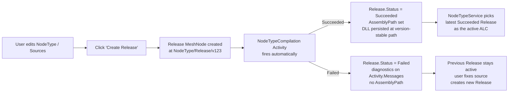

# NodeType Release Redesign

This document is the **original design proposal** for first-class Release MeshNodes,
which superseded the implicit edit-then-invalidate-cache compile flow with an
explicit, observable, version-pinned release pipeline.

> 🚨 **This design SHIPPED, under different names and a different trigger.** Read the
> sections below as the historical rationale, not as an API reference — and never
> copy their code. What actually exists today:
>
> | In this proposal | What shipped |
> |---|---|
> | `Release : ActivityLog` | **`NodeTypeRelease`** (`MeshWeaver.Graph.Configuration`) — a plain record, not an `ActivityLog`. It mirrors the compile's terminal `Status` and links the run via `CompilationActivityPath`. |
> | `CreateReleaseRequest` / `CreateReleaseResponse` | The trigger is a **`stream.Update` control-plane field**: set `NodeTypeDefinition.RequestedReleaseAt` (+ `RequestedReleaseForce`) via `workspace.GetMeshNodeStream(nodeTypePath).Update(...)`, or call `hub.RequestNodeTypeRelease(...)`. A `CreateNodeTypeReleaseRequest`/`Response` pair still exists as legacy plumbing — **never post one from new code** (see [Request via stream.Update](/Doc/Architecture/RequestViaStreamUpdate)). |
> | `NodeTypeService.GetCachedConfiguration` / `GetActiveReleaseStream` | **`NodeTypeService` no longer exists.** The active release is the **`NodeTypeDefinition.LatestReleasePath`** field on the NodeType node — read it directly, do **not** resolve the active release with a `Query` (that round-trip is exactly what the field replaced). `RequestedReleasePath` pins a specific historical release. |
> | `InvalidateCache` on `NodeTypeService` | `ICompilationCacheService.InvalidateCache(nodeName)` — still present, on the cache service. |
> | `AssemblyPath` as the durable artefact | `AssemblyPath` is a **process-local hint**; the cross-silo durable reference is `AssemblyCollection` + `AssemblyContentPath` (content-collection blob) plus `AssemblyStoreVersion`. |
>
> **The C# blocks below violate current platform rules** (`Observable.FromAsync`, a
> blocking `.Wait()`, an unsubscribed `UpdateMeshNode`). They are annotated in place
> and kept only to show what was proposed. See
> [Asynchronous Calls](/Doc/Architecture/AsynchronousCalls) and
> [Controlled I/O Pooling](/Doc/Architecture/ControlledIoPooling).

---

## Why the old flow breaks down

The current NodeType compile flow is implicit and entirely process-local:

1. A user edits a `NodeType` or one of its `Source/` children.
2. The change-feed fires `NodeTypeService.InvalidateCache(nodeTypePath)`, which
   clears in-memory dictionaries.
3. The next access triggers a Roslyn compile and loads the result into a
   process-local `AssemblyLoadContext` (ALC).

That sounds simple, but there are four failure modes that compound one another.

**The ALC key mismatch.** Release-based ALCs are keyed in `_loadContexts` by
`release.Path`. `InvalidateCache` looks up by `nodeName`, finds nothing, skips
the GC sweep, and `File.Delete` on the cached `.dll` throws
`UnauthorizedAccessException`. This is what kept
`CodeEditRecompileTest` (`test/MeshWeaver.Hosting.Monolith.Test`) skipped at the time.
*(It runs today — the test is no longer skipped.)*

**No observable feedback.** Users have no signal while a compile is running,
when it finishes, or whether it succeeded. Diagnostics are read on demand via
`GetCompilationError(nodeTypePath)` — a polled, in-memory dictionary.

**No rollback.** Old assemblies are deleted before the new compile starts. If
the new compile fails, there is nothing to fall back to.

**No history.** Once a compile succeeds, the previous version is gone. There
is no audit trail of what changed and when.

> **The redesign goal:** treat releases as first-class, observable, versioned
> MeshNodes so the framework's existing Activity Control Plane machinery handles
> progress, cancellation, diagnostics, and rollback automatically.

---

## The model


```mermaid
graph LR
    A[User edits NodeType / Sources] --> B[Click 'Create Release']
    B --> C[Release MeshNode created<br/>at NodeType/Release/v123]
    C --> D[NodeTypeCompilation Activity<br/>fires automatically]
    D -->|Succeeded| E[Release.Status = Succeeded<br/>AssemblyPath set<br/>DLL persisted at version-stable path]
    D -->|Failed| F[Release.Status = Failed<br/>diagnostics on Activity.Messages<br/>no AssemblyPath]
    E --> G[NodeTypeService picks<br/>latest Succeeded Release<br/>as the active ALC]
    F --> H[Previous Release stays active<br/>user fixes source<br/>creates new Release]
```

Each Release is a `MeshNode` of type `Release` at
`{nodeTypePath}/Release/{version}`. Versions are user-supplied or auto-stamped
(timestamp + short hash). A Release owns its own `.dll` on disk at a path that
is stable for the `(nodeTypePath, version)` pair. Releases accumulate; old ones
remain as history.

---

## Schema

> 🚨 **Proposed shape, not the shipped one.** The real type is `NodeTypeRelease`
> (`MeshWeaver.Graph.Configuration`) — a plain record that does **not** derive from
> `ActivityLog`. It carries `Status` as a mirrored string plus `CompilationActivityPath`
> (the link to the live message log), and adds `AssemblyCollection` /
> `AssemblyContentPath` / `AssemblyStoreVersion` for cross-silo activation and
> `SourceVersions` / `TestVersions` snapshots. Code against that type.

```csharp
public sealed record Release : ActivityLog("NodeTypeRelease")
{
    /// <summary>
    /// The NodeType this release was built from. Stable across the release's
    /// lifetime; a release belongs to exactly one NodeType.
    /// </summary>
    public required string NodeTypePath { get; init; }

    /// <summary>
    /// User-supplied version label (e.g. "1.2.0", "feature-x"). When null,
    /// auto-stamped by the create handler with a timestamp + 8-char hash of
    /// the compilation inputs.
    /// </summary>
    public string? Version { get; init; }

    /// <summary>
    /// Release notes — markdown body the author writes to describe the
    /// release. Surfaces in the UI release history list and at the top of
    /// the Release detail view.
    /// </summary>
    public MarkdownContent? Notes { get; init; }

    /// <summary>
    /// Snapshot of the compilation inputs at release time. Stored on the
    /// release so a future replay can verify the inputs match. Same hash
    /// used to derive the disk path.
    /// </summary>
    public required string Code { get; init; }
    public string? HubConfiguration { get; init; }
    public IReadOnlyList<ContentCollectionConfig>? ContentCollections { get; init; }
    public required string FrameworkVersion { get; init; }
    public required string ContentHash { get; init; }    // 16-char base64

    /// <summary>
    /// Filesystem path of the compiled DLL. Set when the compile activity
    /// terminates with <c>Succeeded</c>; null on failure. Path is
    /// <c>{cacheDir}/{nodeTypePath-sanitized}/{version}/Release.dll</c>.
    /// </summary>
    public string? AssemblyPath { get; init; }
    public string? PdbPath { get; init; }

    // Inherited from ActivityLog:
    //   Status            — Pending → Compiling → Succeeded / Failed
    //   RequestedStatus   — control plane (e.g. set to Cancelled to abort)
    //   Messages          — Roslyn diagnostics during compile
    //   Start, End        — when compile started / finished
    //   ReturnValue       — JsonElement of the AssemblyPath (also set above)
}
```

`Release` derives from `ActivityLog` so the existing
[Activity Control Plane](/Doc/Architecture/ActivityControlPlane) machinery — observable progress
via `workspace.GetMeshNodeStream(releasePath)`, cancellation via
`RequestedStatus = Cancelled`, and real-time message streaming — comes for free.

---

## Lifecycle

### 1. Create-release request

> 🚨 **Superseded — do not write a request type for this.** The shipped trigger is a
> `stream.Update` control-plane field: set `NodeTypeDefinition.RequestedReleaseAt` (with
> `RequestedReleaseForce` for "bypass the sources-unchanged short-circuit") through
> `workspace.GetMeshNodeStream(nodeTypePath).Update(...)`, or call
> `hub.RequestNodeTypeRelease(...)`. The per-NodeType hub's watcher reacts and dispatches
> the compile, idempotently, off the last-handled stamp.

```csharp
// ❌ HISTORICAL shape. The legacy `CreateNodeTypeReleaseRequest`/`Response` pair still
//    exists as plumbing — never post one from new code.
public sealed record CreateReleaseRequest(string NodeTypePath, string? Version, MarkdownContent? Notes)
    : IRequest<CreateReleaseResponse>;

public sealed record CreateReleaseResponse(string ReleasePath, string? Error = null)
{
    public bool Success => string.IsNullOrEmpty(Error);
}
```

The handler at the mesh hub:

1. Reads the current `NodeTypeDefinition` and `Source/` content of `NodeTypePath`.
2. Computes `ContentHash` over those inputs.
3. Creates a `Release` MeshNode at
   `{NodeTypePath}/Release/{Version ?? autostamp()}` with `Status = Compiling`.
4. Posts back `CreateReleaseResponse` with the release path immediately
   (just-start, matching the `ScriptDispatch.StartScript` pattern).
5. The Release's hub fires the compile asynchronously.

### 2. Compile activity (per release)

Each Release MeshNode's hub watches its own `MeshNodeReference` stream via
`hub.WatchControlPlane(...)`. When `RequestedStatus = Compiling` (set on
create), it fires the Roslyn compile in the background:

> 🚨 **Do not copy this block.** `Observable.FromAsync` is forbidden outside `IoPool`
> (it runs the prologue on the subscribing thread — i.e. the hub's action block — with no
> concurrency bound); the Roslyn compile is a blocking leaf and belongs on
> `pool.InvokeBlocking(...)`. And `UpdateMeshNode` here is **never subscribed**, so the
> write would silently not happen — the shipped code composes
> `GetMeshNodeStream(path).Update(...).Subscribe(_ => { }, ex => …)`.

```csharp
hub.RegisterForDisposal(hub.WatchControlPlane(requested =>
{
    if (requested != ActivityStatus.Compiling) return;
    Observable.FromAsync(ct => CompileReleaseAsync(hub, ct))   // ❌ FORBIDDEN — use IIoPool
        .Subscribe(
            assemblyPath =>
                hub.GetWorkspace().UpdateMeshNode(curr =>
                    curr.Content is Release r
                        ? curr with { Content = r with {
                            Status = ActivityStatus.Succeeded,
                            AssemblyPath = assemblyPath } }
                        : curr),
            ex =>
                hub.GetWorkspace().UpdateMeshNode(curr =>
                    curr.Content is Release r
                        ? curr with { Content = r with {
                            Status = ActivityStatus.Failed,
                            Messages = r.Messages.Add(new LogMessage(ex.Message, LogLevel.Error)) } }
                        : curr));
}));
```

Roslyn diagnostics flow into `Release.Messages` (inherited from `ActivityLog`)
during the compile, using the same per-Activity logger pattern as the kernel.

### 3. Resolution: which release is active?

> 🚨 **Superseded — and the proposal below is the shape that was rejected.** Resolving
> the active release with a `Query` is eventually consistent (stale right after a
> compile) and costs a round-trip, and the `.Wait()` is a blocking sync-over-async read
> that deadlocks on a hub. What shipped instead: the answer is a **field on the NodeType
> node** — `NodeTypeDefinition.LatestReleasePath`, written by the compile watcher after a
> successful compile and **preserved across failed compiles**, so consumers keep loading
> the last-known-good release. Read it off `GetMeshNodeStream(nodeTypePath)`; never query
> for it. `RequestedReleasePath`, when set, pins activation to a specific historical
> release instead (production pinning / rollback).

The proposal was for `NodeTypeService.GetCachedConfiguration(nodeTypePath)` to become a
stream-backed read keyed off a release feed:

```csharp
// ❌ HISTORICAL — do not copy. `.Wait()` blocks the caller; the Query below is
//    eventually consistent. Read NodeTypeDefinition.LatestReleasePath instead.
public NodeTypeConfiguration? GetCachedConfiguration(string nodeTypePath) =>
    GetActiveReleaseStream(nodeTypePath)
        .Take(1)
        .Select(release => release?.AssemblyPath is { } path ? LoadConfig(path) : null)
        .Wait(); // sync read for the cached path; observable variant for hot paths

private IObservable<Release?> GetActiveReleaseStream(string nodeTypePath) =>
    meshService.Query<MeshNode>(
            MeshQueryRequest.FromQuery($"namespace:{nodeTypePath}/Release nodeType:Release"))
        .Select(change => change.Items
            .Select(n => n.Content as Release)
            .Where(r => r is { Status: ActivityStatus.Succeeded, AssemblyPath: not null })
            .OrderByDescending(r => r!.Start)
            .FirstOrDefault());
```

**The active release is always the latest Succeeded one.** That property did survive:
failed compiles never become active, and users keep running on the previous release until
they ship a fix in a new one.

### 4. ALC management

`CompilationCacheService` becomes Release-keyed:

- `GetOrCreateLoadContextForRelease(release)` keys `_loadContexts` by
  `release.Path` (already does this, but loads from a version-stable folder
  rather than a hash-stable one).
- **DLL path:** `{cacheDir}/{nodeTypePath-sanitized}/{version}/Release.dll`.
  The path is stable for the same `(NodeTypePath, Version)` pair. Re-running a
  compile against an existing version overwrites in place but never deletes a
  different version's DLL.
- **Switching active release:** when a new Release becomes the latest Succeeded,
  the previous release's ALC stays in `_loadContexts` until explicitly unloaded.
  `NodeTypeService` calls `cacheService.UnloadContext(prevRelease.Path)` when
  the active release advances. The DLL on disk is **kept** — only the ALC is
  disposed. New per-node hub activations bind to the new release's ALC; existing
  per-node hubs stay on the previous ALC until they are recycled.
- **`InvalidateCache(nodeTypePath)` is deleted.** Releases are immutable and
  durable — there is nothing to invalidate. The replacement is "create a new
  release," which the user does explicitly.

### 5. UI surfaces

| View | Path | Content |
|---|---|---|
| Release history | `{nodeTypePath}/Release/*` | List of Releases — Status, Version, CreatedAt, Notes preview |
| Release detail | `{nodeTypePath}/Release/{version}` | Full Notes (rendered markdown), full Activity log, DLL/PDB download links |
| Create release form | NodeType detail page | Version field (optional), Notes textarea (markdown), Submit button |

On submit, the form posts `CreateReleaseRequest`, navigates to the new Release's
detail view, and the user watches the compile happen in real time via the
Activity Control Plane subscription.

---

## Migration plan

The redesign is invasive but strictly additive: Release MeshNodes are introduced
alongside the existing cache, readers are flipped one consumer at a time, and
the old implicit path is deleted last.

| Phase | What | Risk |
|---|---|---|
| 0 | Add `Release` content type + `CreateReleaseRequest`/`Response` + handler. | Low — new code, no existing consumers. |
| 1 | Add `UnloadContext(release.Path)` callsite in `CompilationCacheService` when the active release advances (no new behaviour, just gives `NodeTypeService` the hook it needs). | Low |
| 2 | Wire compile-Activity to the Release node (extend `NodeTypeCompilationActivity` to emit on a `Release` content node, not a generic `Activity` node). | Medium — Activity Control Plane changes. |
| 3 | Add `INodeTypeService.GetActiveReleaseStream` reactive read; default `GetCachedConfiguration` to consult releases when present, falling back to the in-memory cache when not. | Medium — read-path change, but additive (fallback preserves current behaviour). |
| 4 | UI: Release history + detail + create-release form. | Medium — UI work. |
| 5 | Back-compat shim: existing NodeTypes without Releases auto-release on first compile, writing a Release MeshNode with the auto-stamped version. | Medium |
| 6 | Delete `InvalidateCache`, `_compilationErrors`, `_compilingInProgress` from `NodeTypeService`. The whole implicit-invalidation path goes away. | High — fan-out across many call sites. |

`CodeEditRecompileTest` was to un-skip at phase 3, rewritten as:
_create V1 release → read V1 → create V2 release → read V2 marker_ — exercising the
explicit-release path with no `InvalidateCache` call and no file-delete race. It is
un-skipped and running today.

---

## Open questions for review

1. **Version naming default.** When the user omits Version, the suggested
   auto-stamp format is `{yyyyMMddHHmmss}-{8charContentHash}` — sortable and
   unique.

2. **Garbage collection.** Releases accumulate indefinitely. A TTL, "keep last
   N," or explicit-delete policy is probably needed, but deferred as a
   follow-up.

3. **Cross-instance compilation.** Releases are MeshNodes, so they replicate
   across instances. Compiled DLLs on disk are per-instance. A Release that
   succeeded on instance A still needs to compile on instance B. This should be
   idempotent: same inputs → same content hash → same release ID → same target
   path → already-compiled is a no-op.

4. **Failed releases — keep or drop?** Proposal: keep (Status=Failed) and
   surface them in history. The Notes and Activity messages explain why the
   compile failed, which is useful for triage.

5. **Concurrent create-release.** Two users creating a release for the same
   NodeType simultaneously will get different auto-stamped versions (timestamp
   differs). Both compile independently; the latest Succeeded wins active
   status. This is probably fine.

---

## 2026-09-01 — "handled" was never the same fact as "released" (MeshWeaver.Plugins#781)

**Measured state, `Publish/Deck` on memex-cloud, 2026-08-27:**

| field | value |
|---|---|
| `lastCompileSucceededAt` | `21:53:01.850Z` |
| `lastCompiledVersion` | `575` |
| `latestAssemblyPath` | `Publish_Deck/v575-…dll` |
| `requestedReleaseAt` | `21:52:59.898Z` |
| `lastReleaseRequestHandledAt` | `21:52:59.898Z` — consumed |
| `latestReleasePath` | `…/Release/20260826065548-neI3XM25` — **the previous morning** |

`compilationStatus: Ok`, `compiledSources` identical to `currentSourceVersions`, diagnostics clean.
Every single-field read is healthy. Only holding the RELEASE up against the BUILD shows it, and the
consequence is that every consumer following `LatestReleasePath` — the build protocol, a
release-pinned activation, the Configuration pane's "→ release" link — serves the PREVIOUS assembly
while the type reports Ok on the current one.

### The two facts the design conflated

`LastReleaseRequestHandledAt` is stamped **at dispatch**, on the same commit that flips to `Pending`.
That is correct as a re-fire guard and wrong as a delivery receipt, and the field was doing both
jobs. Between dispatch and a Release node existing there are three ways to end up with nothing, and
all three were **silent and indistinguishable from "no release was asked for"**:

1. `TryCreateReleaseNode`'s bound expired — it returned `null` through a bare
   `Timeout(_, Observable.Return(null))` with no log line at all.
2. The create faulted or was refused (it runs under the REQUESTER's identity for attribution, so a
   partition the requester cannot write refuses it) — logged at Warning, swallowed.
3. The request was answered by the build already in hand (#1707 slice 3) — which dispatches nothing,
   and therefore creates nothing.

In every case `ApplyCompileSuccess` stamps `LatestReleasePath = releasePath ?? def.LatestReleasePath`
— the previous build's release — and the trigger is spent.

**The state was also unrepairable from the outside.** A second, ordinary release request hit case 3:
the bytes ARE current, so the request was consumed again without producing anything. Only
`RequestedReleaseForce` escaped, and only if someone knew to look.

### The invariant

> **`LatestReleasePath` must never name a build older than `LastCompiledVersion` once
> `RequestedReleaseAt` has been consumed.**

It is answerable from the node alone, with no store probe: a release version is
`{yyyyMMddHHmmss}-{hash}` where the hash is minted from the build's DURABLE store coordinates
(`{Collection}/{ContentPath}`), which are exactly what `LatestAssemblyCollection` /
`LatestAssemblyPath` carry. Mint and check are now the same function applied twice
(`NodeTypeBuildState.ReleaseVersionHash`), so they cannot drift into disagreeing about what a
release version means.

### What was done

- `NodeTypeBuildState.ReleaseNamesBuild` — the cheap comparison, pure. **Inconclusive answers TRUE**
  in three cases, each deliberate: no release at all (absence is not staleness — an ADOPTED build has
  never had one, and calling that stale would put a compile back on every install), no durable
  coordinates (the Null-store path mints from a process-local location), and a version shape this
  mint did not produce.
- `IsSatisfiedByCurrentBuild` = `BuildInHandAnswersRequest` **and** `ReleaseNamesBuild`. The branch
  consumes the trigger on the same commit path a dispatch would use, so it can never re-fire —
  consuming it beside a release minted for other bytes is what made #781 permanent.
- `TryCutReleaseForBuildInHand` — when the bytes are right but the release is not, the release is cut
  **from those bytes**, no compile, under the same System execution scope the compile's own release
  create uses. A cut that does not land leaves the clause false, so the request falls through to the
  compile path and gets its release from the compile's terminal create; it is never consumed for
  nothing.
- The bound now **delivers its diagnostic** (an ERROR naming the type and the attempted release),
  which is the same rule `ReadBudget` states for nested read bounds: the inner bound is the only one
  that knows WHICH write starved, so it must say so rather than degrade to a null.

### The rule this leaves behind

A one-shot trigger must be consumed by the thing it asked for, not by the attempt. Where the two
cannot be made the same write, the gap needs a cheap end-state comparison that some later pass can
run — otherwise the failure is stable, self-consistent and invisible, and it is found by a human
noticing that a merged fix is not live.
