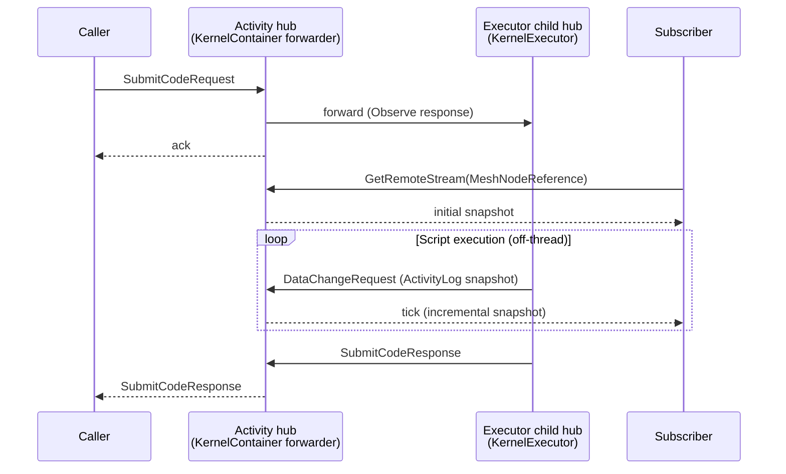

MeshWeaver runs C# scripts on a per-Activity Roslyn kernel hosted inside the mesh. Scripts have first-class access to the live `IMessageHub`, so they can post messages, mutate nodes, and stream results just like compiled hub handlers — but without a recompile cycle. This page covers (a) how to launch a script, (b) how to emit progress so subscribers see live updates, and (c) the architecture that keeps the host hub responsive while a script runs.

## The two ways to launch a script

### 1. From an executable Code node — `ExecuteScriptRequest`

The canonical way. Create a `Code` MeshNode with `IsExecutable = true`, then post `ExecuteScriptRequest` to the node's address. The node's hub (a) creates a fresh `Activity` MeshNode for this run, (b) submits the script to the kernel hosted at that activity, and (c) responds with the activity's path so the caller can subscribe to progress.

```csharp
var meshService = hub.ServiceProvider.GetRequiredService<IMeshService>();
await meshService.CreateNode(new MeshNode("daily-rollup", "rbuergi")
{
    Name = "Daily rollup",
    NodeType = "Code",
    Content = new CodeConfiguration
    {
        Code = @"
            Log.LogInformation(""Starting rollup..."");
            // ... real work ...
            Log.LogInformation(""Done — wrote {Count} rows"", 1234);
        ",
        IsExecutable = true,
    }
});

// Fire it. The response carries the ActivityLog path for live subscription.
hub.Observe<ExecuteScriptResponse>(
        new ExecuteScriptRequest(),
        o => o.WithTarget(new Address("rbuergi/daily-rollup")))
    .Take(1)
    .Subscribe(resp =>
    {
        var activityPath = resp.Message.ActivityLog!;   // e.g. rbuergi/daily-rollup/_Activity/{guid}
        // ... subscribe to progress, see next section ...
    });
```

Each call to `ExecuteScriptRequest` creates a **new** Activity node in the **user's home** (the partition root, e.g. `rbuergi/_Activity/{guid}`) — not nested under the Code node. The originating Code node is preserved on the Activity's `MainNode` and the `ActivityLog.HubPath`. Reasons:

1. The user's activity log is the natural place to find every script the user has run, regardless of which Code node it came from.
2. Routing is reliable for top-level satellite paths; deeply nested satellite paths require an extra MeshNode-materialization step that races `CreateNode` → `SubscribeRequest` and frequently times out.

Historical runs accumulate as siblings under `{partitionRoot}/_Activity/*`, and the Code node's `LastExecutedAt` field is stamped to the latest run. A "Run" button on Code views (rendered when the caller has `Permission.Execute`) wires this exact request.

### 2. From application code — `SubmitCodeRequest` directly

For one-off submissions (interactive markdown cells, REPL-style flows) where you already own an Activity hub address:

```csharp
hub.Post(
    new SubmitCodeRequest(@"Log.LogInformation(""hello""); 1 + 1") { Id = "cell-7" },
    o => o.WithTarget(activityAddress));
```

Progress flows into the activity hub's `ActivityLog` content the same way as for `ExecuteScriptRequest`.

### 3. From an MCP agent — `mcp__memex-prod__execute_script`

Agents call the same path as `ExecuteScriptRequest` but through the MCP tool surface. Same activity creation, same activity-log streaming. **Agents authoring a new script must follow the same progress conventions below** so a human can watch the execution land in real time.

```jsonc
// Agent-side tool call
{
  "tool": "execute_script",
  "args": { "path": "rbuergi/daily-rollup" }
}
```

## Writing progress in scripts

Scripts get two globals: `Mesh` (the live `IMessageHub`) and `Log` (an `ILogger`). **Every `Log.LogInformation(...)` call appends a `LogMessage` to the activity's `ActivityLog.Messages` list and flushes a snapshot through the activity hub's workspace** — subscribers see it land within milliseconds of the call.

```csharp
Log.LogInformation("Starting import...");
Log.LogWarning("Skipping malformed row {Row}", row);
Log.LogError(ex, "Failed to write {Path}", path);

// Console output is captured too — each completed line lands as
// an Information-level entry on the same activity log.
Console.WriteLine("Wrote 42 rows");
```

### Rules of thumb for human-readable progress

- **One log call per logical step.** Don't log every iteration of a tight loop — bundle into a single line per step. Fewer, more meaningful entries beat a flood.
- **Use structured templates** (`"Wrote {Count} rows"` not `"Wrote " + count + " rows"`). Better diagnostics, no string allocation in the hot path.
- **Log at the start of long phases** so a watcher knows what's happening during the silent stretch before the next checkpoint.
- **Log the result, not just "done"** — include counts, paths, durations. The activity log is the primary post-mortem surface.

### Rules for agent-authored scripts

When an agent (Claude, Copilot, etc.) writes a script for an MCP user to run, the agent is responsible for emitting useful progress. The user is going to subscribe via the activity stream and watch the run unfold — silent scripts are unobservable scripts.

- Begin each script with `Log.LogInformation("...")` describing what it is about to do.
- Emit progress at every coarse-grained step (per file processed, per phase entered).
- On failure paths, prefer `Log.LogError(ex, "...")` over throwing — the activity will still flip to `Failed` (terminal log levels are aggregated into status), and the message survives so the user can see what went wrong.
- End with `Log.LogInformation("Completed: {Summary}", summary)` so the user knows the run actually finished and isn't still in flight.

## Observing progress — `GetRemoteStream`

Subscribers use the canonical CQRS read pattern: subscribe to the activity hub's `MeshNodeReference` stream and observe the `ActivityLog` content updating live.

```csharp
var workspace = hub.GetWorkspace();
var stream = workspace
    .GetRemoteStream<MeshNode, MeshNodeReference>(
        new Address(activityPath), new MeshNodeReference())
    .Select(change => change.Value?.Content as ActivityLog)
    .Where(log => log is not null);

// Wait for the run to finish and get the terminal snapshot.
var final = await stream
    .Where(log => log!.Status != ActivityStatus.Running)
    .Take(1)
    .Timeout(TimeSpan.FromMinutes(2))
    .FirstAsync();

foreach (var msg in final!.Messages)
    Console.WriteLine($"[{msg.LogLevel}] {msg.Message}");
```

For **live** display (e.g. a streaming UI), don't filter by terminal status — just project `log.Messages.Count` and let the subscription tick on every snapshot:

```csharp
var liveMessageCount = stream
    .Select(log => log!.Messages.Count)
    .DistinctUntilChanged();
```

**Never query for the activity log** with `IMeshService.QueryAsync("path:...")`. The query path is eventually consistent and will lag behind the workspace stream, so you may miss intermediate snapshots or read a stale `Status`. The `GetRemoteStream` pattern bypasses the index and observes the owning hub's workspace directly. See `Doc/Architecture/CqrsAndContentAccess.md`.

## Why progress is timely — the architecture

The Activity hub does **not** run the script itself. When a `SubmitCodeRequest` arrives, a thin `KernelContainer` forwarder spins up a hosted child hub (`{activity}/_KernelExec`) and delegates execution there. Scripts run inside the executor's action block; the Activity hub's action block stays free to (a) accept new submissions and (b) process the `DataChangeRequest`s the script's `Log` writer pushes back.



Because the executor's address is internal — never exposed to clients — every external caller and every subscriber sees the kernel as a single addressable surface (the Activity hub). The forwarding is an implementation detail.

## Common pitfalls

- **`await` inside a click handler that wraps `ExecuteScriptRequest`.** Click actions must be sync. Use `hub.Post(...)` (fire and forget) or `hub.Observe(...).Subscribe(...)`. See `Doc/Architecture/AsynchronousCalls.md`.
- **Subscribing only to `SubmitCodeResponse`.** That's the completion ack — it doesn't carry progress. Subscribe to the activity log via `GetRemoteStream` for the live feed.
- **Polling `IMeshService.QueryAsync` for activity status.** Eventually consistent, will lag. Use `GetRemoteStream`.
- **`Console.WriteLine` from heavy parallel loops.** Each line becomes an activity-log message; flooding the log overwhelms the subscriber and may DoS the workspace. Aggregate before logging.
- **Long-running synchronous CPU loops without log calls.** No `Log` call → no snapshot → subscribers see nothing for the duration of the loop. Add a heartbeat log if a phase runs longer than ~1 s.
