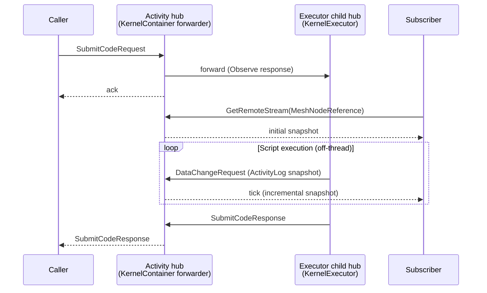

MeshWeaver runs C# scripts on a per-Activity Roslyn kernel hosted inside the mesh. Scripts have first-class access to the live `IMessageHub`, so they can post messages, mutate nodes, and stream results just like compiled hub handlers — but without a recompile cycle.

This page covers three things:

1. **How to launch a script** — from a Code node, from application code, or from an MCP agent.
2. **How to emit progress** — so subscribers see live updates as work unfolds.
3. **The architecture** — how the host hub stays responsive while a script runs.

<svg xmlns="http://www.w3.org/2000/svg" viewBox="0 0 760 340" style="width:100%;max-width:760px;height:auto;display:block;margin:20px auto;">
  <defs>
    <marker id="arr" markerWidth="8" markerHeight="8" refX="7" refY="3.5" orient="auto">
      <path d="M0,0 L8,3.5 L0,7 Z" fill="#90a4ae"/>
    </marker>
    <marker id="arr-b" markerWidth="8" markerHeight="8" refX="7" refY="3.5" orient="auto">
      <path d="M0,0 L8,3.5 L0,7 Z" fill="#42a5f5"/>
    </marker>
    <marker id="arr-g" markerWidth="8" markerHeight="8" refX="7" refY="3.5" orient="auto">
      <path d="M0,0 L8,3.5 L0,7 Z" fill="#66bb6a"/>
    </marker>
  </defs>
  <rect x="0" y="0" width="760" height="340" rx="12" fill="#1a1f2e"/>
  <rect x="16" y="12" width="140" height="44" rx="8" fill="#1e88e5"/>
  <text x="86" y="30" text-anchor="middle" font-family="sans-serif" font-size="11" fill="#fff" font-weight="600">Code Node</text>
  <text x="86" y="46" text-anchor="middle" font-family="sans-serif" font-size="10" fill="#bbdefb">ExecuteScriptRequest</text>
  <rect x="16" y="76" width="140" height="44" rx="8" fill="#5c6bc0"/>
  <text x="86" y="94" text-anchor="middle" font-family="sans-serif" font-size="11" fill="#fff" font-weight="600">App Code</text>
  <text x="86" y="110" text-anchor="middle" font-family="sans-serif" font-size="10" fill="#c5cae9">SubmitCodeRequest</text>
  <rect x="16" y="140" width="140" height="44" rx="8" fill="#8e24aa"/>
  <text x="86" y="158" text-anchor="middle" font-family="sans-serif" font-size="11" fill="#fff" font-weight="600">MCP Agent</text>
  <text x="86" y="174" text-anchor="middle" font-family="sans-serif" font-size="10" fill="#e1bee7">execute_script</text>
  <line x1="156" y1="34" x2="268" y2="106" stroke="#90a4ae" stroke-width="1.5" marker-end="url(#arr)"/>
  <line x1="156" y1="98" x2="268" y2="116" stroke="#90a4ae" stroke-width="1.5" marker-end="url(#arr)"/>
  <line x1="156" y1="162" x2="268" y2="126" stroke="#90a4ae" stroke-width="1.5" marker-end="url(#arr)"/>
  <rect x="268" y="62" width="180" height="130" rx="10" fill="#263238" stroke="#42a5f5" stroke-width="1.5"/>
  <text x="358" y="82" text-anchor="middle" font-family="sans-serif" font-size="12" fill="#42a5f5" font-weight="700">Activity Hub</text>
  <text x="358" y="100" text-anchor="middle" font-family="sans-serif" font-size="10" fill="#90a4ae">KernelContainer forwarder</text>
  <rect x="286" y="110" width="144" height="28" rx="6" fill="#1a237e" opacity="0.8"/>
  <text x="358" y="129" text-anchor="middle" font-family="sans-serif" font-size="10" fill="#90caf9">ActivityLog content</text>
  <rect x="286" y="146" width="144" height="28" rx="6" fill="#1a237e" opacity="0.8"/>
  <text x="358" y="165" text-anchor="middle" font-family="sans-serif" font-size="10" fill="#90caf9">Status: Running / Done</text>
  <line x1="448" y1="127" x2="540" y2="127" stroke="#42a5f5" stroke-width="1.5" marker-end="url(#arr-b)"/>
  <text x="494" y="119" text-anchor="middle" font-family="sans-serif" font-size="9" fill="#90a4ae">forward</text>
  <rect x="540" y="62" width="196" height="130" rx="10" fill="#263238" stroke="#f57c00" stroke-width="1.5"/>
  <text x="638" y="82" text-anchor="middle" font-family="sans-serif" font-size="12" fill="#f57c00" font-weight="700">Executor Hub</text>
  <text x="638" y="100" text-anchor="middle" font-family="sans-serif" font-size="10" fill="#90a4ae">KernelExecutor child hub</text>
  <rect x="557" y="110" width="160" height="28" rx="6" fill="#1b0000" opacity="0.8"/>
  <text x="637" y="129" text-anchor="middle" font-family="sans-serif" font-size="10" fill="#ffcc80">Roslyn kernel runs script</text>
  <rect x="557" y="146" width="160" height="28" rx="6" fill="#1b0000" opacity="0.8"/>
  <text x="637" y="165" text-anchor="middle" font-family="sans-serif" font-size="10" fill="#ffcc80">Log · Mesh · Ct globals</text>
  <line x1="540" y1="155" x2="448" y2="155" stroke="#f57c00" stroke-width="1.5" marker-end="url(#arr)"/>
  <text x="494" y="171" text-anchor="middle" font-family="sans-serif" font-size="9" fill="#90a4ae">DataChangeRequest</text>
  <rect x="268" y="234" width="180" height="44" rx="8" fill="#26a69a"/>
  <text x="358" y="252" text-anchor="middle" font-family="sans-serif" font-size="11" fill="#fff" font-weight="600">Subscriber</text>
  <text x="358" y="268" text-anchor="middle" font-family="sans-serif" font-size="10" fill="#b2dfdb">GetRemoteStream(MeshNodeRef)</text>
  <line x1="358" y1="192" x2="358" y2="234" stroke="#66bb6a" stroke-width="1.5" marker-end="url(#arr-g)"/>
  <text x="388" y="220" text-anchor="middle" font-family="sans-serif" font-size="9" fill="#90a4ae">live ticks</text>
  <text x="380" y="310" text-anchor="middle" font-family="sans-serif" font-size="10" fill="currentColor" fill-opacity="0.5" font-style="italic">All entry points converge on the Activity hub; the Executor child hub runs scripts off-thread and pushes incremental snapshots back.</text>
</svg>
*Script execution architecture: three entry points converge on the Activity hub, which delegates to a child Executor hub and streams progress snapshots back to subscribers.*
> **Lifting an existing operation onto script execution?** Read *[Activity Control Plane → Operations as scripts](/Doc/Architecture/ActivityControlPlane#operations-as-scripts--the-canonical-shape-for-export-import-compile-)* first. That section is the canonical shape for export, import, compile, mirror, and similar operations: form-bound inputs via `JsonPointerReference` → patch `RequestedStatus = Running` → activity-driven progress → result panel subscribes to the same activity. This page documents the lower-level mechanics; that page documents the user-facing pattern.

---

## Launching a script

There are three entry points, all converging on the same Activity hub and the same progress stream.

### 1. From a Code node — `ExecuteScriptRequest`

This is the canonical path. Create a `Code` MeshNode with `IsExecutable = true`, then post `ExecuteScriptRequest` to the node's address. The node's hub:

- Creates a fresh `Activity` MeshNode for this run.
- Submits the script to the kernel hosted at that activity.
- Responds with the activity's path so the caller can subscribe to progress.

```csharp
var meshService = hub.ServiceProvider.GetRequiredService<IMeshService>();
await meshService.CreateNode(new MeshNode("daily-rollup", "rbuergi")
{
    Name = "Daily rollup",
    NodeType = "Code",
    Content = new CodeConfiguration
    {
        Code = @"
            Log.LogInformation(""Starting rollup..."");
            // ... real work ...
            Log.LogInformation(""Done — wrote {Count} rows"", 1234);
        ",
        IsExecutable = true,
    }
});

// Fire it. The response carries the ActivityLog path for live subscription.
hub.Observe<ExecuteScriptResponse>(
        new ExecuteScriptRequest(),
        o => o.WithTarget(new Address("rbuergi/daily-rollup")))
    .Take(1)
    .Subscribe(resp =>
    {
        var activityPath = resp.Message.ActivityLog!;   // e.g. rbuergi/daily-rollup/_Activity/{guid}
        // ... subscribe to progress, see next section ...
    });
```

Each call to `ExecuteScriptRequest` creates a **new** Activity node in the **user's home** partition (e.g. `rbuergi/_Activity/{guid}`) — not nested under the Code node. The originating Code node is preserved on the Activity's `MainNode` and `ActivityLog.HubPath`. Two reasons for this placement:

| Reason | Detail |
|---|---|
| Natural activity log | The user's partition root is the right home for every script run, regardless of which Code node triggered it. |
| Reliable routing | Top-level satellite paths route predictably; deeply nested satellite paths require an extra materialization step that races `CreateNode` → `SubscribeRequest` and frequently times out. |

Historical runs accumulate as siblings under `{partitionRoot}/_Activity/*`, and the Code node's `LastExecutedAt` field is stamped on each run. A **Run** button rendered on Code views (visible when the caller has `Permission.Execute`) wires this exact request.

### 2. From application code — `SubmitCodeRequest` directly

For one-off submissions — interactive markdown cells, REPL-style flows — where you already own an Activity hub address:

```csharp
hub.Post(
    new SubmitCodeRequest(@"Log.LogInformation(""hello""); 1 + 1") { Id = "cell-7" },
    o => o.WithTarget(activityAddress));
```

Progress flows into the activity hub's `ActivityLog` content the same way as for `ExecuteScriptRequest`.

### 3. From an MCP agent — `execute_script`

Agents call the same path as `ExecuteScriptRequest` but through the MCP tool surface. Activity creation and activity-log streaming behave identically. **Agents authoring a new script must follow the same progress conventions below** so a human watching the run sees it unfold in real time.

```jsonc
// Agent-side tool call
{
  "tool": "execute_script",
  "args": { "path": "rbuergi/daily-rollup" }
}
```

---

## Creating typed / restricted-partition nodes — the `execute_script` escape hatch

The MCP `create` and `patch` tools validate a node's `content.$type` against the hub they run on. Some content types are registered **only on a dedicated per-type hub** (via `WithContentType<T>()`), not on the general MCP hub — so raw `create` rejects them. `Invitation` is the canonical example:

```text
Content … carries the polymorphic discriminator '$type': 'Invitation',
which is not a registered content type for the built-in NodeType 'Invitation'
```

The same wall guards writes into a **restricted partition** — e.g. the `Admin` partition, which ordinary identities can't write to directly (see [Access Control](/Doc/Architecture/AccessControl)).

The way through is to run the write **inside the mesh**, through the canonical service, via `execute_script`. The script's `Mesh` global resolves any registered service and the kernel references every loaded assembly — so you call exactly what the GUI calls. The write then routes to the owning hub (which *does* know the type), and the service's `ImpersonateAsSystem()` scope satisfies the partition write-guard.

**Recipe — three MCP calls:**

1. `create` a throwaway executable `Code` node. `CodeConfiguration` *is* a registered content type, so `create` accepts it:

```jsonc
{
  "id": "InviteUsers", "namespace": "rbuergi", "name": "Invite users (delete me)",
  "nodeType": "Code",
  "content": { "$type": "CodeConfiguration", "language": "csharp", "isExecutable": true,
               "code": "/* the script in step 2 */" }
}
```

2. The script body resolves the canonical service and **Subscribes** (the service impersonates System internally to reach the Admin partition):

```csharp
using System.Reactive.Linq;
using System.Reactive.Threading.Tasks;
using MeshWeaver.Messaging;                 // AccessService
using MeshWeaver.Mesh.Services;             // IMeshService
using Microsoft.Extensions.DependencyInjection;
using Memex.Portal.Shared.Authentication;   // InvitationService

var sp  = Mesh.ServiceProvider;
var svc = new InvitationService(
    sp.GetRequiredService<IMeshService>(),
    sp.GetRequiredService<AccessService>());

foreach (var (email, name) in new[]
{
    ("roman.grob@atioz.ch",     "Roman Grob"),
    ("steven.forster@atioz.ch", "Steven Forster"),
})
{
    var node = await svc.CreateInvitation(email, invitedBy: "rbuergi", note: name)
        .FirstAsync().ToTask(Ct);
    Log.LogInformation("Created {Path}", node.Path);
}
```

3. `execute_script` the node, confirm `status: Succeeded` on the returned activity, then `delete` the throwaway node.

The effect is identical to the equivalent GUI action — including any node-driven follow-up (here, the [invitation email](/Doc/Architecture/InvitationOnlyOnboarding) that `InvitationEmailSender` sends for every Pending invitation it hasn't emailed yet).

> **This is a break-glass / admin path, not an application pattern.** Application code, agents, and the GUI write through the typed service or `stream.Update` directly — never raw MCP `create` for these types. Reach for `execute_script` only for one-off operational writes the MCP surface legitimately can't express.

---

## Writing progress in scripts

Every script receives three globals:

| Global | Type | Purpose |
|---|---|---|
| `Mesh` | `IMessageHub` | Full mesh access — post messages, subscribe to streams, mutate nodes. |
| `Log` | `ILogger` | Each call appends to `ActivityLog.Messages` and flushes a snapshot to all subscribers within milliseconds. |
| `Ct` | `CancellationToken` | Rebound per submission. Pass it to every cancellable async API so user-initiated cancellation actually interrupts in-flight work. |

> **Always pass `Ct` to async calls.** `Task.Delay(ms, Ct)`, `HttpClient.GetAsync(url, Ct)`, `FirstAsync(predicate).ToTask(Ct)` — every cancellable API should receive it. Without `Ct`, clicking Cancel in the Activity Control Plane sends the signal but the script can't act on it until the current await returns.

### Reactive waiting

Don't `Thread.Sleep` and don't `Task.Delay(ms)` without the cancellation token. For waiting on external state, the right shape is a **reactive subscription on the workspace** — it's both cancellable and gives you a natural place to log progress:

```csharp
// Wait for a downstream node to flip to a target status — cancellable mid-flight.
Log.LogInformation("Waiting for downstream job to finish…");
await Mesh.GetWorkspace()
    .GetMeshNodeStream("rbuergi/downstream-job")
    .Where(n => (n?.Content as JobContent)?.Status == JobStatus.Succeeded)
    .Take(1)
    .ToTask(Ct);                          // ← Ct propagates Cancel
Log.LogInformation("Downstream finished — proceeding");
```

Don't loop-poll; subscribe and let the workspace push you the next emission.

For longer waits with periodic heartbeats, combine `Observable.Interval` with a linked cancellation source:

```csharp
Log.LogInformation("Crunching…");
using var cts = System.Threading.CancellationTokenSource
    .CreateLinkedTokenSource(Ct);
var heartbeat = System.Reactive.Linq.Observable
    .Interval(TimeSpan.FromSeconds(5))
    .Subscribe(t => Log.LogInformation($"Still working — {t * 5}s elapsed"));
try
{
    await DoLongWork(cts.Token);
}
finally
{
    heartbeat.Dispose();
}
```

### Log calls — what they emit

Every `Log.LogInformation(...)` snapshot lands on the activity log within milliseconds of the call. Console output is captured too — each completed line becomes an `Information`-level entry on the same activity log.

```csharp
Log.LogInformation("Starting import...");
Log.LogWarning("Skipping malformed row {Row}", row);
Log.LogError(ex, "Failed to write {Path}", path);

// Console output is captured — each completed line lands as
// an Information-level entry on the same activity log.
Console.WriteLine("Wrote 42 rows");
```

### Rules of thumb for human-readable progress

- **One log call per logical step.** Don't log every iteration of a tight loop — bundle into a single line per step. Fewer, more meaningful entries beat a flood.
- **Use structured templates** (`"Wrote {Count} rows"` not `"Wrote " + count + " rows"`). Better diagnostics, no string allocation in the hot path.
- **Log at the start of long phases** so a watcher knows what's happening during the silent stretch before the next checkpoint.
- **Log the result, not just "done"** — include counts, paths, durations. The activity log is the primary post-mortem surface.

### Rules for agent-authored scripts

When an agent (Claude, Copilot, etc.) writes a script for an MCP user to run, the agent is responsible for emitting useful progress. Silent scripts are unobservable scripts.

- Begin with `Log.LogInformation("...")` describing what the script is about to do.
- Emit progress at every coarse-grained step — per file processed, per phase entered.
- On failure paths, prefer `Log.LogError(ex, "...")` over throwing. The activity will still flip to `Failed` (terminal log levels are aggregated into status), and the message survives so the user can diagnose what went wrong.
- End with `Log.LogInformation("Completed: {Summary}", summary)` so the user knows the run is finished and isn't still in flight.

---

## Observing progress

Subscribers use the canonical CQRS read pattern: subscribe to the activity hub's `MeshNodeReference` stream and observe the `ActivityLog` content updating live.

```csharp
var workspace = hub.GetWorkspace();
var stream = workspace
    .GetRemoteStream<MeshNode, MeshNodeReference>(
        new Address(activityPath), new MeshNodeReference())
    .Select(change => change.Value?.Content as ActivityLog)
    .Where(log => log is not null);

// Wait for the run to finish and get the terminal snapshot.
var final = await stream
    .Where(log => log!.Status != ActivityStatus.Running)
    .Take(1)
    .Timeout(TimeSpan.FromMinutes(2))
    .FirstAsync();

foreach (var msg in final!.Messages)
    Console.WriteLine($"[{msg.LogLevel}] {msg.Message}");
```

For **live display** — a streaming UI stripe or detail view — don't filter by terminal status. Just project `Messages.Count` and let the subscription tick on every snapshot:

```csharp
var liveMessageCount = stream
    .Select(log => log!.Messages.Count)
    .DistinctUntilChanged();
```

> **Never query for the activity log** with `IMeshService.QueryAsync("path:...")`. The query path is eventually consistent and will lag behind the workspace stream — you may miss intermediate snapshots or read a stale `Status`. `GetRemoteStream` bypasses the index and observes the owning hub's workspace directly. See [CqrsAndContentAccess.md](/Doc/Architecture/CqrsAndContentAccess).

---

## How progress stays timely — the architecture

The Activity hub does **not** run the script itself. When a `SubmitCodeRequest` arrives, a thin `KernelContainer` forwarder spins up a hosted child hub (`{activity}/_KernelExec`) and delegates execution there. Scripts run inside the executor's action block; the Activity hub's action block stays free to accept new submissions and process the `DataChangeRequest`s the script's `Log` writer pushes back.



Because the executor's address is internal and never exposed to clients, every external caller and every subscriber sees the kernel as a single addressable surface — the Activity hub. The forwarding is an implementation detail.

---

## Live demo — script globals available in cells

The same `Log`, `Mesh`, and `Ct` globals available inside a mesh script are also available in interactive markdown cells. This cell renders the names and types of the three globals:

```csharp --render ScriptGlobalsDemo --show-code
var rows = new[]
{
    ("Log",  "ILogger",         "Appends to ActivityLog.Messages; each call flushes a snapshot to all subscribers."),
    ("Mesh", "IMessageHub",     "Full mesh access — post messages, subscribe to streams, mutate nodes."),
    ("Ct",   "CancellationToken", "Rebound per submission. Pass to every cancellable async API."),
};

var header = MeshWeaver.Layout.Controls.Html(
    "<table style='border-collapse:collapse;width:100%'>" +
    "<thead><tr>" +
    "<th style='text-align:left;padding:6px 12px;border-bottom:2px solid #e2e8f0'>Global</th>" +
    "<th style='text-align:left;padding:6px 12px;border-bottom:2px solid #e2e8f0'>Type</th>" +
    "<th style='text-align:left;padding:6px 12px;border-bottom:2px solid #e2e8f0'>Purpose</th>" +
    "</tr></thead><tbody>" +
    string.Join("", rows.Select((r, i) =>
        $"<tr style='background:{( i % 2 == 0 ? "#f8fafc" : "white" )}'>" +
        $"<td style='padding:6px 12px;font-family:monospace;font-weight:600'>{r.Item1}</td>" +
        $"<td style='padding:6px 12px;font-family:monospace;color:#6366f1'>{r.Item2}</td>" +
        $"<td style='padding:6px 12px;color:#374151'>{r.Item3}</td>" +
        "</tr>")) +
    "</tbody></table>");

header
```

---

## Common pitfalls

| Pitfall | What goes wrong | Fix |
|---|---|---|
| `await` inside a click handler wrapping `ExecuteScriptRequest` | Click actions must be synchronous. | Use `hub.Post(...)` (fire-and-forget) or `hub.Observe(...).Subscribe(...)`. See [AsynchronousCalls.md](/Doc/Architecture/AsynchronousCalls). |
| Subscribing only to `SubmitCodeResponse` | That's the completion ack — it carries no progress. | Subscribe to the activity log via `GetRemoteStream`. |
| Polling `IMeshService.QueryAsync` for activity status | Eventually consistent, will lag. | Use `GetRemoteStream` — it observes the owning hub's workspace directly. |
| `Console.WriteLine` from heavy parallel loops | Every line becomes an activity-log message; flooding the log overwhelms subscribers and may DoS the workspace. | Aggregate before logging — one line per step, not per iteration. |
| Long synchronous CPU loops with no log calls | No `Log` call → no snapshot → subscribers see nothing. | Add a heartbeat log if a phase runs longer than ~1 s. |
| Raw MCP `create` rejects a node's `$type` ("not a registered content type") | The type is registered only on a dedicated hub, or the target sits in a restricted partition. | Run the write via `execute_script` through the canonical service — see *Creating typed / restricted-partition nodes* above. |
