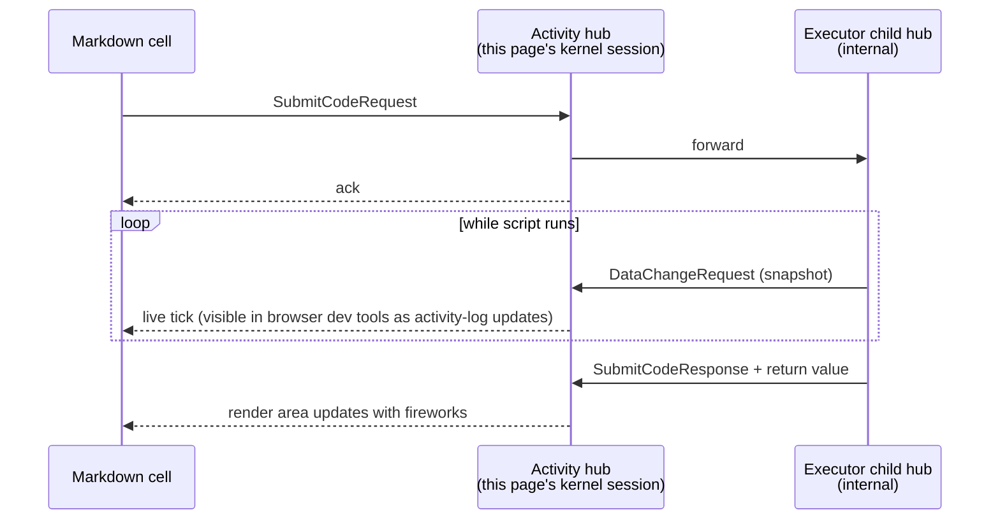

This page is the working companion to the [Script Execution](Doc/Architecture/ScriptExecution) reference. It runs a small **fireworks** script through the same kernel pipeline that powers `ExecuteScriptRequest` on Code nodes — but inline as an interactive markdown cell, so you can see the script source, the progress messages, and the rendered output side by side.

## What you'll observe

When this page loads, the script in the cell below runs once, end-to-end. While it runs:



Because the activity hub is **forwarding** to an internal executor, the activity hub's action block stays free during execution — and so each `Log.LogInformation` call gets pushed to subscribers within milliseconds of being emitted, instead of being batched into a single end-of-run flush.

## Live demo

```csharp --render Fireworks --show-code
Log.LogInformation("Loading fuse...");
System.Threading.Thread.Sleep(80);
Log.LogInformation("Lighting...");
System.Threading.Thread.Sleep(80);
Log.LogInformation("3... 2... 1...");
System.Threading.Thread.Sleep(80);
Log.LogInformation("Boom!");
MeshWeaver.Layout.Controls.Html(
    "<div style='font-size:48px;text-align:center;animation:pulse 1s infinite'>" +
    "🎆 🎇 🎆 🎇 🎆" +
    "</div>")
```

The `--render Fireworks` flag tells the markdown renderer to (a) execute the cell on page load and (b) display the cell's return value in a layout area named `Fireworks` (the area immediately below the cell). The four `Log.LogInformation` calls land on the kernel session's activity log; the final `Controls.Html(...)` becomes the rendered fireworks.

## Two things to call out

- `Log` is one of the two globals every script gets (the other is `Mesh`, an `IMessageHub`). Each `Log.LogInformation(...)` call appends a `LogMessage` to the activity's `ActivityLog.Messages` list and flushes a snapshot through the activity hub's workspace — that's what subscribers react to.
- The expression on the last line is the script's **return value**. It's both stored on the activity log AND rendered in the named layout area (`Fireworks`).

## Where activities live for "real" runs

The interactive markdown cell above runs on the page's transient kernel session. For `ExecuteScriptRequest` on a real Code node — the typical authoring pattern — each click creates a new MeshNode at `{partitionRoot}/_Activity/{guid}` (the user's home), with the originating Code node tracked on `MainNode` and `ActivityLog.HubPath`. The Code node remembers when it was last executed (`LastExecutedAt`); each historical run lives as a sibling under the user's `_Activity` namespace. Browse them via your home's activity feed or via "View activity history" on the Code node page.

## Doing this from your own code or an MCP agent

The same pipeline is available three ways. See [Script Execution](Doc/Architecture/ScriptExecution) for full details, rules of thumb, and progress-emission conventions:

- **From C#:** `hub.Post(new ExecuteScriptRequest(), o => o.WithTarget(codeNodeAddress))`. Subscribe to the `ActivityLog` returned in the response.
- **From an MCP agent:** call the `execute_script` tool with the path of an executable Code node. Same activity creation, same streaming.
- **From interactive markdown:** wrap the script in a code fence with `--render <area>`, as shown above. The cell auto-runs on page load, and the area renders the script's return value live.
