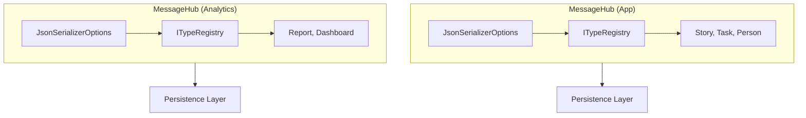
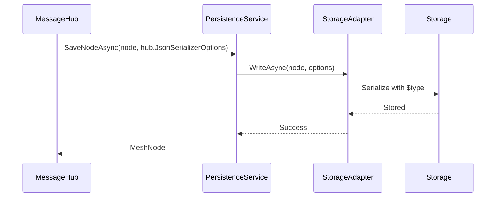

MeshWeaver serializes all mesh node content as polymorphic JSON. Rather than using a single global serializer, every `MessageHub` carries its own `JsonSerializerOptions` instance backed by a dedicated `ITypeRegistry`. This design means each hub serializes only the types it knows about and round-trips them correctly — without coupling unrelated hubs to each other's type systems.

## Architecture Overview

The hub-per-registry model is the foundation. Two hubs running side-by-side can own completely different type sets, and both write to the persistence layer with their own discriminators.



## How Serialization Works

### 1. Register types with the hub

Types are declared during hub configuration. Every type listed here will be given a `$type` discriminator on write and resolved back to its CLR type on read.

```csharp
services.AddMeshWeaver(meshWeaver => meshWeaver
    .AddMesh(mesh => mesh
        .ConfigureHub(hub => hub
            .WithTypes(typeof(Story), typeof(Task), typeof(Person))
        )
    )
);
```

### 2. `$type` discriminators on the wire

When the serializer writes a registered type, it injects a `$type` property. Readers use that property to reconstruct the correct CLR type — even when the declared field is typed as `object` or a base class.

```json
{
  "$type": "Story",
  "id": "story-123",
  "title": "Implement feature",
  "status": "InProgress"
}
```

### 3. Options flow through every persistence call

The hub's `JsonSerializerOptions` travels from the hub through the persistence stack all the way to the storage adapter. No intermediate layer substitutes its own options.



## Key Interfaces

All persistence contracts accept `JsonSerializerOptions` explicitly — there is no global fallback.

### `IMeshStorage`

```csharp
Task<MeshNode?> GetNodeAsync(string path, JsonSerializerOptions options, CancellationToken ct);
Task<MeshNode> SaveNodeAsync(MeshNode node, JsonSerializerOptions options, CancellationToken ct);
IAsyncEnumerable<MeshNode> GetChildrenAsync(string? parentPath, JsonSerializerOptions options);
```

### `IMeshService`

Query and autocomplete operations require options for type resolution during result projection.

```csharp
IAsyncEnumerable<object> QueryAsync(MeshQueryRequest request, JsonSerializerOptions options, CancellationToken ct);
IAsyncEnumerable<QuerySuggestion> AutocompleteAsync(string basePath, string prefix, JsonSerializerOptions options, int limit, CancellationToken ct);
```

### `IStorageAdapter`

Each backend adapter serializes and deserializes using exactly the options it is given.

```csharp
Task<MeshNode?> ReadAsync(string path, JsonSerializerOptions options, CancellationToken ct);
Task WriteAsync(MeshNode node, JsonSerializerOptions options, CancellationToken ct);
```

## Default Configuration

MeshWeaver initializes `JsonSerializerOptions` with these defaults out of the box:

| Setting | Value | Purpose |
|---|---|---|
| `WriteIndented` | `true` | Human-readable stored JSON |
| `PropertyNamingPolicy` | `CamelCase` | JavaScript compatibility |
| `PropertyNameCaseInsensitive` | `true` | Tolerant parsing |
| `DefaultIgnoreCondition` | `WhenWritingNull` | Compact output |

## Best Practices

### Always pass the hub's options

Never create a fresh `JsonSerializerOptions` for persistence calls — a bare instance has no type registry and silently discards `$type` discriminators.

```csharp
// Correct — type registry flows through
await persistence.SaveNodeAsync(node, hub.JsonSerializerOptions);

// Incorrect — loses type information
await persistence.SaveNodeAsync(node, new JsonSerializerOptions());
```

### Register every content type

Any type that appears as `MeshNode.Content` must be registered. Use `WithTypes` for domain types and `WithContentType<T>` for well-known content shapes:

```csharp
hub.WithTypes(typeof(Story), typeof(Task), typeof(Comment))
   .WithContentType<AgentConfiguration>()
```

A missing registration does not throw on write — the discriminator is simply absent, and the object deserializes as `JsonElement` or `object` instead of the expected CLR type. Register early; diagnose by inspecting stored JSON for a missing `$type`.

### Use typed query helpers

The extension methods filter by `$type` and project directly to `T`, avoiding manual casting:

```csharp
// Type-safe query with automatic $type filtering
await foreach (var story in meshQuery.QueryAsync<Story>(query, hub.JsonSerializerOptions))
{
    // story is already typed as Story
}
```

## Storage Backends

All adapters implement the same interface and accept the same options — swapping backends requires no serialization changes.

| Adapter | Description |
|---|---|
| `FileSystemStorageAdapter` | Local `.json` files |
| `CosmosStorageAdapter` | Azure Cosmos DB documents |
| `AzureBlobStorageAdapter` | Azure Blob Storage |
| `InMemoryPersistenceService` | In-memory store for testing |

## Related Topics

- [Data Configuration](../../DataMesh/DataConfiguration) — setting up data sources
- [Message-Based Communication](../MessageBasedCommunication) — hub architecture
