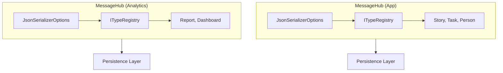
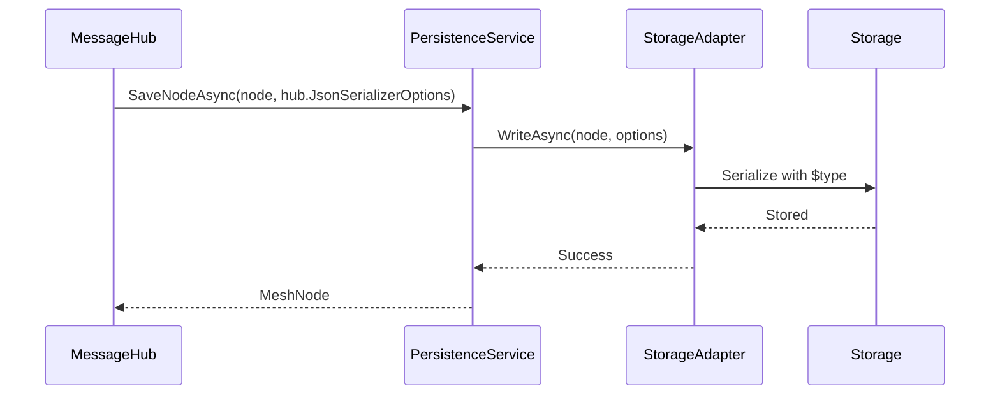

MeshWeaver uses **per-hub JsonSerializerOptions** to handle polymorphic JSON serialization. Each MessageHub has its own type registry, enabling type-safe serialization and deserialization across the persistence layer.

# Architecture Overview

Each MessageHub maintains its own `JsonSerializerOptions` instance with a dedicated `ITypeRegistry`. This design ensures that types registered with a hub are properly serialized with `$type` discriminators and deserialized back to their concrete types.



# How It Works

## 1. Per-Hub Type Registration

Types are registered with a hub during configuration:

```csharp
services.AddMeshWeaver(meshWeaver => meshWeaver
    .AddMesh(mesh => mesh
        .ConfigureHub(hub => hub
            .WithTypes(typeof(Story), typeof(Task), typeof(Person))
        )
    )
);
```

## 2. Type Discriminators

When serializing objects, MeshWeaver adds a `$type` property to enable polymorphic deserialization:

```json
{
  "$type": "Story",
  "id": "story-123",
  "title": "Implement feature",
  "status": "InProgress"
}
```

## 3. Options Flow Through Persistence

The hub's `JsonSerializerOptions` flows through all persistence operations:



# Key Interfaces

## IMeshStorage

All persistence methods accept `JsonSerializerOptions`:

```csharp
Task<MeshNode?> GetNodeAsync(string path, JsonSerializerOptions options, CancellationToken ct);
Task<MeshNode> SaveNodeAsync(MeshNode node, JsonSerializerOptions options, CancellationToken ct);
IAsyncEnumerable<MeshNode> GetChildrenAsync(string? parentPath, JsonSerializerOptions options);
```

## IMeshService

Query methods also require options for proper type resolution:

```csharp
IAsyncEnumerable<object> QueryAsync(MeshQueryRequest request, JsonSerializerOptions options, CancellationToken ct);
IAsyncEnumerable<QuerySuggestion> AutocompleteAsync(string basePath, string prefix, JsonSerializerOptions options, int limit, CancellationToken ct);
```

## IStorageAdapter

Storage adapters use options for serialization/deserialization:

```csharp
Task<MeshNode?> ReadAsync(string path, JsonSerializerOptions options, CancellationToken ct);
Task WriteAsync(MeshNode node, JsonSerializerOptions options, CancellationToken ct);
```

# Configuration Options

MeshWeaver configures `JsonSerializerOptions` with these defaults:

| Setting | Value | Purpose |
|---------|-------|---------|
| `WriteIndented` | `true` | Human-readable output |
| `PropertyNamingPolicy` | `CamelCase` | JavaScript compatibility |
| `PropertyNameCaseInsensitive` | `true` | Flexible parsing |
| `DefaultIgnoreCondition` | `WhenWritingNull` | Compact output |

# Best Practices

## 1. Always Pass Hub Options

When calling persistence methods, use the hub's options:

```csharp
// Correct
await persistence.SaveNodeAsync(node, hub.JsonSerializerOptions);

// Incorrect - loses type information
await persistence.SaveNodeAsync(node, new JsonSerializerOptions());
```

## 2. Register All Types

Ensure all types that need polymorphic serialization are registered:

```csharp
hub.WithTypes(typeof(Story), typeof(Task), typeof(Comment))
   .WithContentType<AgentConfiguration>()
```

## 3. Use Typed Queries

For type-safe queries, use the extension methods:

```csharp
// Type-safe query with automatic $type filtering
await foreach (var story in meshQuery.QueryAsync<Story>(query, hub.JsonSerializerOptions))
{
    // story is already typed as Story
}
```

# Storage Adapters

MeshWeaver supports multiple storage backends, all using the same serialization approach:

| Adapter | Description |
|---------|-------------|
| `FileSystemStorageAdapter` | Local file storage (.json files) |
| `CosmosStorageAdapter` | Azure Cosmos DB documents |
| `AzureBlobStorageAdapter` | Azure Blob Storage |
| `InMemoryPersistenceService` | In-memory storage for testing |

# Related Topics

- [Data Configuration](../../DataMesh/DataConfiguration) - Setting up data sources
- [Message-Based Communication](../MessageBasedCommunication) - Hub architecture
