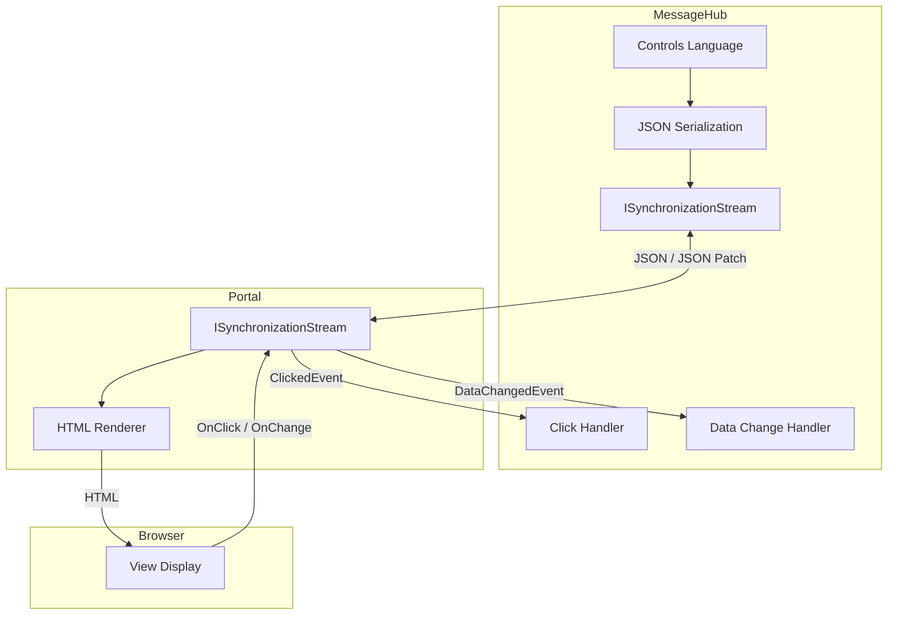
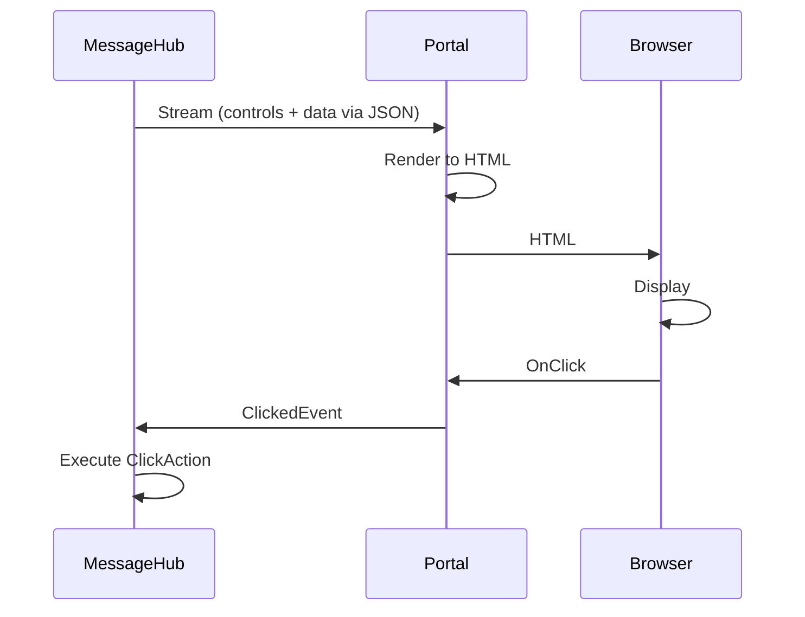

MeshWeaver generates UI where the data lives. Instead of shipping large datasets to clients and rendering them in the browser, computations happen server-side and only the rendered components stream across the wire. The result is dramatically lower network traffic and real-time interactivity without sacrificing data security.
<svg viewBox="0 0 760 220" xmlns="http://www.w3.org/2000/svg" style="width:100%;max-width:760px;height:auto;display:block;margin:20px auto;" font-family="sans-serif" font-size="13">
  <defs>
    <marker id="arr" markerWidth="8" markerHeight="8" refX="6" refY="3" orient="auto">
      <path d="M0,0 L0,6 L8,3 z" fill="#90a4ae"/>
    </marker>
    <marker id="arr-b" markerWidth="8" markerHeight="8" refX="6" refY="3" orient="auto">
      <path d="M0,0 L0,6 L8,3 z" fill="#5c6bc0"/>
    </marker>
  </defs>
  <rect x="20" y="30" width="180" height="160" rx="12" fill="#1e3a5f" stroke="#1e88e5" stroke-width="1.5"/>
  <text x="110" y="55" text-anchor="middle" fill="#1e88e5" font-weight="bold" font-size="14">MessageHub</text>
  <rect x="38" y="68" width="144" height="32" rx="6" fill="#1565c0"/>
  <text x="110" y="88" text-anchor="middle" fill="#fff">Controls Language</text>
  <rect x="38" y="110" width="144" height="32" rx="6" fill="#1565c0"/>
  <text x="110" y="130" text-anchor="middle" fill="#fff">Data &amp; Logic</text>
  <rect x="38" y="152" width="144" height="28" rx="6" fill="#1565c0"/>
  <text x="110" y="170" text-anchor="middle" fill="#fff">Event Handlers</text>
  <rect x="290" y="30" width="180" height="160" rx="12" fill="#1a3a2a" stroke="#43a047" stroke-width="1.5"/>
  <text x="380" y="55" text-anchor="middle" fill="#43a047" font-weight="bold" font-size="14">Portal</text>
  <rect x="308" y="68" width="144" height="32" rx="6" fill="#2e7d32"/>
  <text x="380" y="88" text-anchor="middle" fill="#fff">ISyncStream</text>
  <rect x="308" y="110" width="144" height="32" rx="6" fill="#2e7d32"/>
  <text x="380" y="130" text-anchor="middle" fill="#fff">HTML Renderer</text>
  <rect x="308" y="152" width="144" height="28" rx="6" fill="#2e7d32"/>
  <text x="380" y="170" text-anchor="middle" fill="#fff">Event Forwarder</text>
  <rect x="560" y="30" width="180" height="160" rx="12" fill="#2d1b00" stroke="#f57c00" stroke-width="1.5"/>
  <text x="650" y="55" text-anchor="middle" fill="#f57c00" font-weight="bold" font-size="14">Browser</text>
  <rect x="578" y="68" width="144" height="32" rx="6" fill="#e65100"/>
  <text x="650" y="88" text-anchor="middle" fill="#fff">HTML View</text>
  <rect x="578" y="110" width="144" height="32" rx="6" fill="#e65100"/>
  <text x="650" y="130" text-anchor="middle" fill="#fff">Thin Renderer</text>
  <rect x="578" y="152" width="144" height="28" rx="6" fill="#e65100"/>
  <text x="650" y="170" text-anchor="middle" fill="#fff">User Events</text>
  <line x1="200" y1="95" x2="288" y2="95" stroke="#90a4ae" stroke-width="1.5" marker-end="url(#arr)"/>
  <text x="244" y="89" text-anchor="middle" fill="currentColor" fill-opacity=".6" font-size="11">JSON stream</text>
  <line x1="470" y1="95" x2="558" y2="95" stroke="#90a4ae" stroke-width="1.5" marker-end="url(#arr)"/>
  <text x="514" y="89" text-anchor="middle" fill="currentColor" fill-opacity=".6" font-size="11">HTML</text>
  <line x1="558" y1="165" x2="470" y2="165" stroke="#5c6bc0" stroke-width="1.5" marker-end="url(#arr-b)"/>
  <text x="514" y="159" text-anchor="middle" fill="#7986cb" font-size="11">OnClick/Change</text>
  <line x1="288" y1="165" x2="200" y2="165" stroke="#5c6bc0" stroke-width="1.5" marker-end="url(#arr-b)"/>
  <text x="244" y="159" text-anchor="middle" fill="#7986cb" font-size="11">ClickedEvent</text>
  <text x="380" y="215" text-anchor="middle" fill="currentColor" fill-opacity=".45" font-size="11">JSON Patch travels from Hub → Portal → Browser; user events flow back in reverse</text>
</svg>

*Server-side rendering pipeline: computation and data stay in the Hub; only rendered components and JSON patches travel to the browser.*

## The Data Compression Principle

The design philosophy is easiest to grasp with a concrete example. Suppose you need to display a million-row dataset as a 10 × 10 summary table. The naive approach transfers all one million rows to the client; MeshWeaver transfers only the 100 aggregated numbers:

@@content/data-compression.svg

This pattern applies everywhere — charts, grids, KPI tiles — and becomes especially powerful when data is sensitive or very large.

---

## The Controls Language

Inside a `MessageHub`, UI is described using the **Controls Language**: an immutable, declarative API whose objects serialize naturally to JSON.

```csharp
// Server-side control definition
Controls.Stack
    .WithView(Controls.Text("Welcome!"), "Welcome")
    .WithView(Controls.Button("Click Me").WithClickAction(OnClick), "Button")
    .WithView(Controls.DataGrid(salesData), "Sales")
```

The resulting JSON streams to the Portal, which renders it as HTML for the browser. Because the control tree is plain data, it round-trips cleanly over any transport and is trivial to version or diff.

---

## Two-Way Data Binding

Rendering is only half the story. MeshWeaver uses a **walkie-talkie pattern** where both the hub and the Portal hold a live `ISynchronizationStream`. Changes flow in both directions: control updates push outward to the browser, and user events push inward to the hub.



| Layer | Role |
|---|---|
| **MessageHub** | Defines controls and owns data; processes click and change events |
| **Portal** | Holds the server-side `ISynchronizationStream`; renders controls to HTML |
| **Browser** | Thin display layer — shows HTML and forwards user events back to the Portal |

---

## Control Lifecycle

The sequence below shows a full round trip from hub to browser and back:



### Incremental Updates

After the initial load, only *changes* travel over the wire. MeshWeaver uses **JSON Patch** (RFC 6902) for this:

```json
[{"op": "replace", "path": "/areas/counter/Data", "value": 42}]
```

A counter incrementing once sends a single-operation patch rather than re-sending the entire control tree. This keeps real-time dashboards snappy even under heavy update rates.

---

## Handling User Interactions

User interactions become hub messages. When a button is clicked, the browser sends `OnClick` to the Portal, which forwards a `ClickedEvent` to the hub and invokes the registered action. Click handlers are **synchronous** — compose any follow-up work as an observable and `Subscribe`:

```csharp
Controls.Button("Save")
    .WithClickAction(context =>
    {
        // context.Area    – which control was clicked
        // context.Payload – custom data attached to the event
        // context.Hub     – hub reference for posting messages
        context.Hub.Post(new SaveRequest(data));   // fire-and-forget — no await
        return Task.CompletedTask;
    })
```

> 🚨 **Never `async context => await ...`.** An `await` on a mesh operation inside a click handler runs on the hub's scheduler and deadlocks it. The handler body is synchronous; anything that produces a result is an `IObservable<T>` chain ending in `.Subscribe(...)`. See [AsynchronousCalls.md](/Doc/Architecture/AsynchronousCalls) for the canonical patterns.

---

## Available Controls

MeshWeaver ships a rich control library. The table below lists the most commonly used controls; see the [complete controls reference](AvailableControls) for the full set including advanced layout, charting, and editor controls.

| Control | Purpose |
|---|---|
| `TextFieldControl` | Text input with validation |
| `SelectControl` | Dropdown selection |
| `DataGridControl` | Tabular data display |
| `ButtonControl` | Clickable actions |
| `DialogControl` | Modal dialogs |
| `EditFormControl` | Form containers |
| `LayoutAreaControl` | Nested layout regions |

---

## Live Example

The cell below runs in the kernel and renders a small stack of controls — the same building blocks used throughout the framework:

```csharp --render UIArchExample --show-code
MeshWeaver.Layout.Controls.Stack
    .WithView(MeshWeaver.Layout.Controls.Markdown("### Controls Language — live demo\nEach `.WithView(...)` call adds a child to this stack."))
    .WithView(MeshWeaver.Layout.Controls.Html("<p>A plain HTML paragraph rendered inside a stack control.</p>"))
    .WithView(MeshWeaver.Layout.Controls.Button("Click Me"))
```

---

## Why This Architecture?

| Benefit | How it is achieved |
|---|---|
| **Bandwidth efficiency** | Transfer summaries and patches, never raw datasets |
| **Real-time updates** | JSON Patch (RFC 6902) for incremental control-tree changes |
| **Data security** | Sensitive data never leaves the server unnecessarily |
| **Single source of truth** | All state lives server-side; the browser is a passive renderer |
| **Flexibility** | Any control can be data-bound; controls compose freely |
