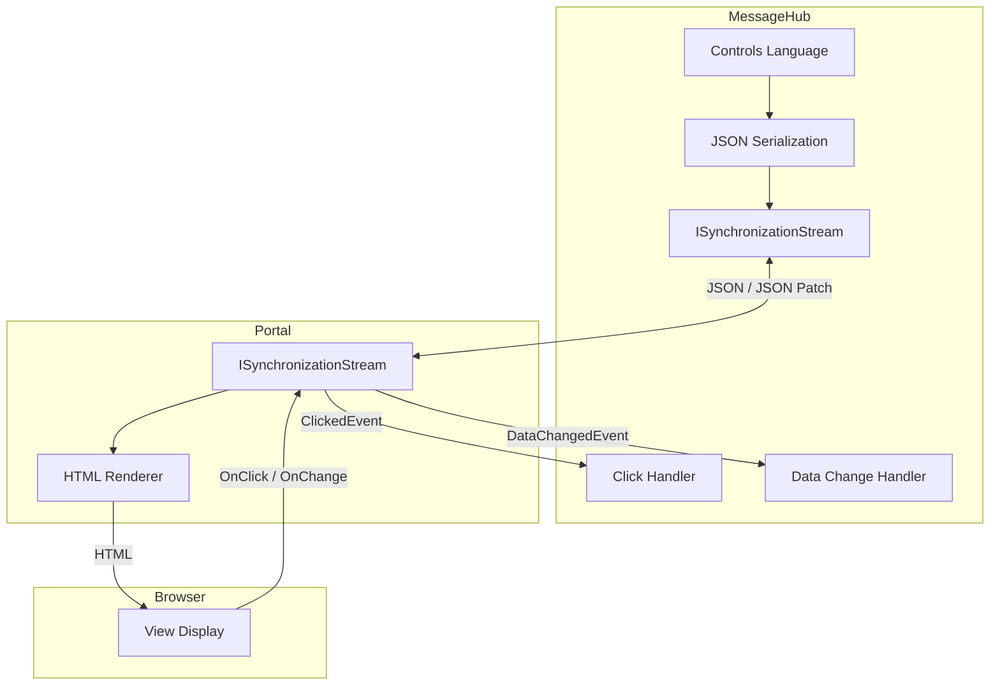
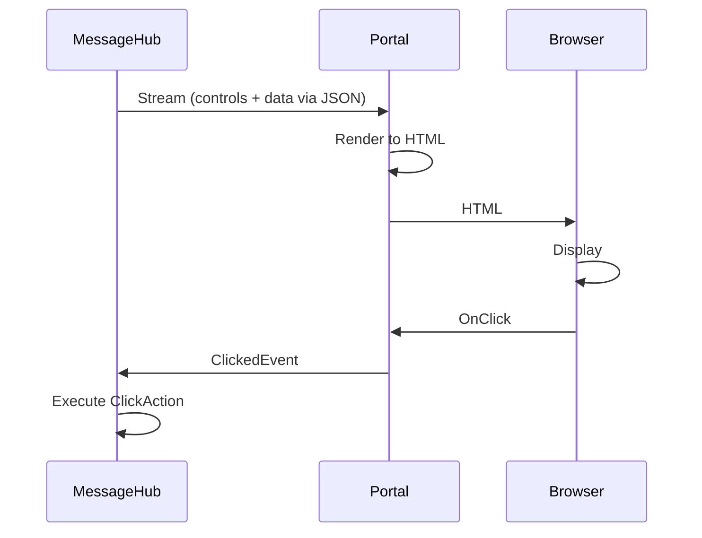

MeshWeaver generates UI where the data lives. Instead of shipping large datasets to clients and rendering them in the browser, computations happen server-side and only the rendered components stream across the wire. The result is dramatically lower network traffic and real-time interactivity without sacrificing data security.

## The Data Compression Principle

The design philosophy is easiest to grasp with a concrete example. Suppose you need to display a million-row dataset as a 10 × 10 summary table. The naive approach transfers all one million rows to the client; MeshWeaver transfers only the 100 aggregated numbers:

@@content:data-compression.svg

This pattern applies everywhere — charts, grids, KPI tiles — and becomes especially powerful when data is sensitive or very large.

---

## The Controls Language

Inside a `MessageHub`, UI is described using the **Controls Language**: an immutable, declarative API whose objects serialize naturally to JSON.

```csharp
// Server-side control definition
Controls.Stack
    .WithView(Controls.Text("Welcome!"), "Welcome")
    .WithView(Controls.Button("Click Me").WithClickAction(OnClick), "Button")
    .WithView(Controls.DataGrid(salesData), "Sales")
```

The resulting JSON streams to the Portal, which renders it as HTML for the browser. Because the control tree is plain data, it round-trips cleanly over any transport and is trivial to version or diff.

---

## Two-Way Data Binding

Rendering is only half the story. MeshWeaver uses a **walkie-talkie pattern** where both the hub and the Portal hold a live `ISynchronizationStream`. Changes flow in both directions: control updates push outward to the browser, and user events push inward to the hub.



| Layer | Role |
|---|---|
| **MessageHub** | Defines controls and owns data; processes click and change events |
| **Portal** | Holds the server-side `ISynchronizationStream`; renders controls to HTML |
| **Browser** | Thin display layer — shows HTML and forwards user events back to the Portal |

---

## Control Lifecycle

The sequence below shows a full round trip from hub to browser and back:



### Incremental Updates

After the initial load, only *changes* travel over the wire. MeshWeaver uses **JSON Patch** (RFC 6902) for this:

```json
[{"op": "replace", "path": "/areas/counter/Data", "value": 42}]
```

A counter incrementing once sends a single-operation patch rather than re-sending the entire control tree. This keeps real-time dashboards snappy even under heavy update rates.

---

## Handling User Interactions

User interactions become hub messages. When a button is clicked, the browser sends `OnClick` to the Portal, which forwards a `ClickedEvent` to the hub and invokes the registered action:

```csharp
Controls.Button("Save")
    .WithClickAction(async context =>
    {
        // context.Area   – which control was clicked
        // context.Payload – custom data attached to the event
        // context.Hub    – hub reference for posting messages
        await context.Hub.Post(new SaveRequest(data));
    })
```

> **Note:** Inside hub-reachable code, prefer the reactive pattern (`IObservable<T>`) over `async`/`await`. The `async` lambda above is shown for illustration; production handlers compose `IObservable` chains and call `Subscribe`. See [AsynchronousCalls.md](AsynchronousCalls) for the canonical patterns.

---

## Available Controls

MeshWeaver ships a rich control library. The table below lists the most commonly used controls; see the [complete controls reference](AvailableControls) for the full set including advanced layout, charting, and editor controls.

| Control | Purpose |
|---|---|
| `TextFieldControl` | Text input with validation |
| `SelectControl` | Dropdown selection |
| `DataGridControl` | Tabular data display |
| `ButtonControl` | Clickable actions |
| `DialogControl` | Modal dialogs |
| `EditFormControl` | Form containers |
| `LayoutAreaControl` | Nested layout regions |

---

## Live Example

The cell below runs in the kernel and renders a small stack of controls — the same building blocks used throughout the framework:

```csharp --render UIArchExample --show-code
MeshWeaver.Layout.Controls.Stack
    .WithView(MeshWeaver.Layout.Controls.Markdown("### Controls Language — live demo\nEach `.WithView(...)` call adds a child to this stack."))
    .WithView(MeshWeaver.Layout.Controls.Html("<p>A plain HTML paragraph rendered inside a stack control.</p>"))
    .WithView(MeshWeaver.Layout.Controls.Button("Click Me"))
```

---

## Why This Architecture?

| Benefit | How it is achieved |
|---|---|
| **Bandwidth efficiency** | Transfer summaries and patches, never raw datasets |
| **Real-time updates** | JSON Patch (RFC 6902) for incremental control-tree changes |
| **Data security** | Sensitive data never leaves the server unnecessarily |
| **Single source of truth** | All state lives server-side; the browser is a passive renderer |
| **Flexibility** | Any control can be data-bound; controls compose freely |
