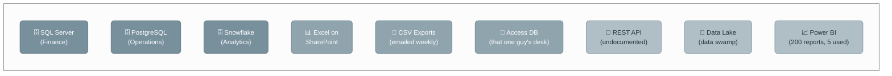
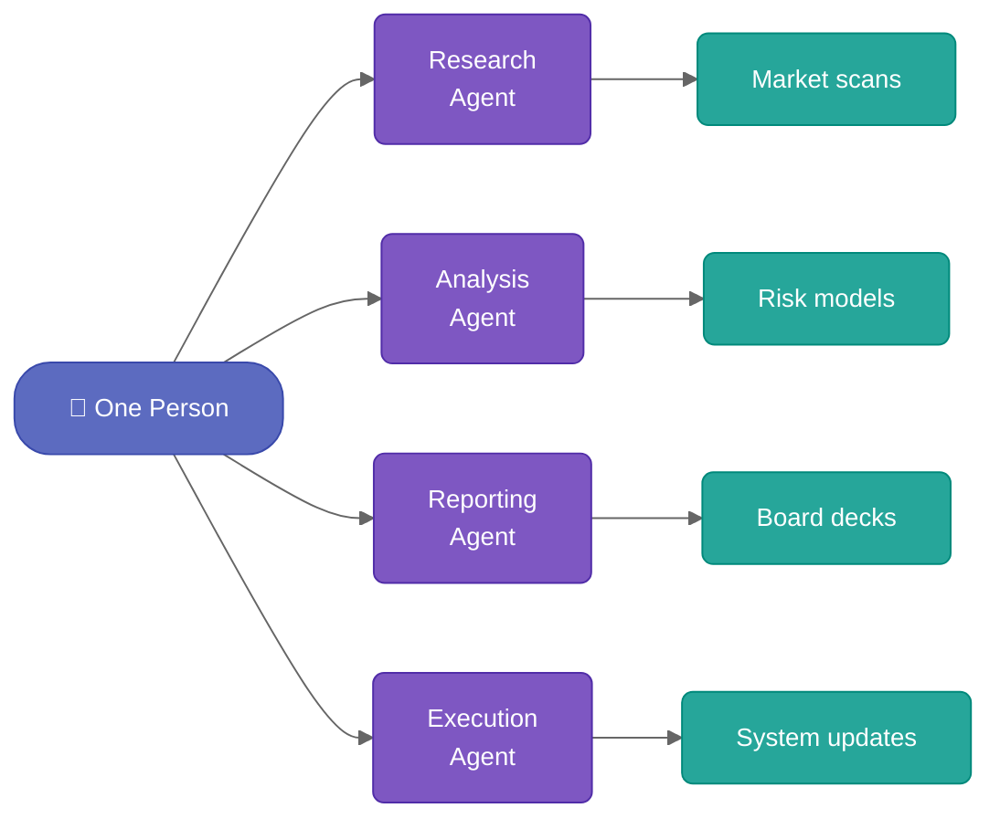
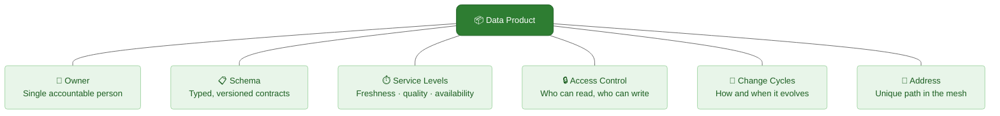
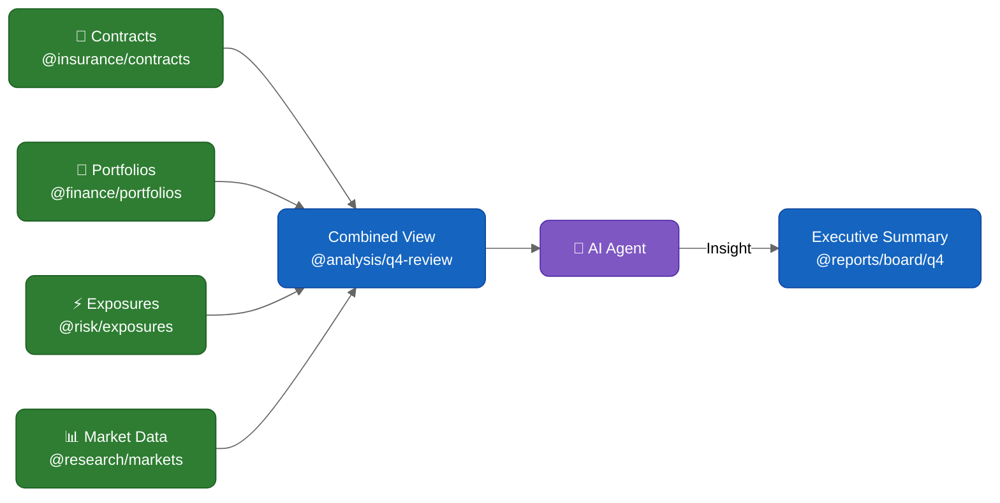

# The Data Problem Nobody Talks About

Every company has the same secret: data is everywhere, owned by nobody, and understood by few.

Databases multiply. Spreadsheets circulate. Reports fossilize. Every team builds its own pipeline, its own truth, its own version of "the numbers."

**Nobody trusts the data, everyone maintains their own copy, and reconciliation is a full-time job.**

---

# Then AI Enters the Picture

Agentic AI does not just answer questions. It acts. It reads data, makes decisions, produces artifacts. One person with AI agents can now do what used to take a team.

This is extraordinary. It is also dangerous.

**More output means more data. More data without structure means more chaos.** AI amplifies whatever system it operates in — organized or not.

---

# The Missing Piece: Combinability

The real value is not in any single dataset. It is in the **combination**.

> Take this contract here, combine it with that portfolio there, overlay this exposure data, and show me the result.

This only works when data is:

- **Addressable** — you can point to it unambiguously
- **Discoverable** — you can find what exists without asking five people
- **Composable** — you can combine pieces without copy-pasting into Excel
- **Governed** — you know who owns it, when it was updated, and whether you can trust it

Scattered data cannot be combined. You need a **mesh**.

---

# Data Products: The Building Block

A data mesh turns your organization into a network of **data products**. Each data product is a self-contained unit with clear boundaries.

| Property | What It Means |
|----------|---------------|
| **Owner** | One person is accountable. Not a team. Not "IT." A name. |
| **Schema** | The data contract is explicit, typed, and versioned. Consumers know exactly what they get. |
| **Service Levels** | Which data, at which time, with which quality. Expectations are set, not hoped for. |
| **Access Control** | Permissions are defined at the product level. Security is not an afterthought. |
| **Change Cycles** | Products evolve on a cadence. Breaking changes are versioned. Consumers are not surprised. |
| **Address** | Every product has a unique, stable path. You can link to it, embed it, query it. |

---

# From Silos to a Mesh

When every dataset becomes a data product, the landscape transforms.

Data products are **nodes in a graph**. Connections between them are explicit. An AI agent can traverse this graph, combine products, and produce new ones — all within governed boundaries.

**The value of the mesh grows exponentially with the number of products.** Each new product creates combination possibilities with every existing one.

---

# How MeshWeaver Implements This

MeshWeaver provides the infrastructure to make data mesh practical:

| Capability | What It Does | Learn More |
|------------|--------------|------------|
| **Node Types** | Define data product schemas with typed properties, validation, and behavior | [Node Type Configuration](Doc/DataMesh/NodeTypeConfiguration) |
| **Addressable Paths** | Every node gets a unique, stable address using hierarchical namespaces | [Unified Path](Doc/DataMesh/UnifiedPath) |
| **Query Language** | GitHub-style syntax to discover and filter across the mesh | [Query Syntax](Doc/DataMesh/QuerySyntax) |
| **CRUD Operations** | Type-safe create, read, update, delete through the message hub | [CRUD Operations](Doc/DataMesh/CRUD) |
| **Data Modeling** | C# records with attributes for schemas, reference data, and relationships | [Data Modeling](Doc/DataMesh/DataModeling) |
| **Satellite Entities** | Comments, approvals, access, and activity tracking attach to any node | [Satellite Entities](Doc/DataMesh/SatelliteEntities) |
| **Interactive Markdown** | Embed live data, charts, and layout areas inside documentation | [Interactive Markdown](Doc/DataMesh/InteractiveMarkdown) |
| **Collaborative Editing** | Real-time co-editing with track changes and annotations | [Collaborative Editing](Doc/DataMesh/CollaborativeEditing) |
| **Data Configuration** | Configure sources, initialization, and hub-to-hub synchronization | [Data Configuration](Doc/DataMesh/DataConfiguration) |

---

# Start Building

1. **Model your data** — Define node types and schemas with [Data Modeling](Doc/DataMesh/DataModeling) and [Node Type Configuration](Doc/DataMesh/NodeTypeConfiguration)
2. **Make it addressable** — Structure your namespace hierarchy with [Unified Path](Doc/DataMesh/UnifiedPath)
3. **Wire up operations** — Implement [CRUD](Doc/DataMesh/CRUD) and [Data Configuration](Doc/DataMesh/DataConfiguration)
4. **Add governance** — Attach [Satellite Entities](Doc/DataMesh/SatelliteEntities) for access control and audit trails
5. **Make it consumable** — Create [Interactive Markdown](Doc/DataMesh/InteractiveMarkdown) documents that combine your data products into actionable views
