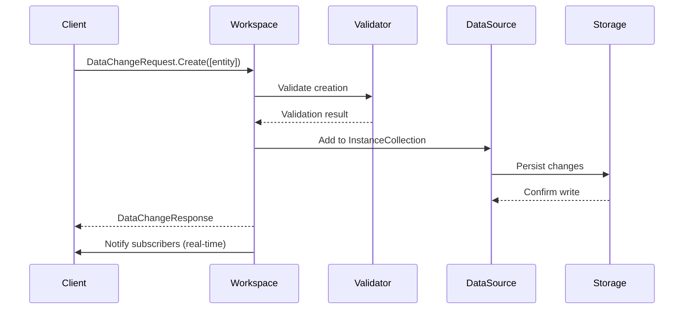
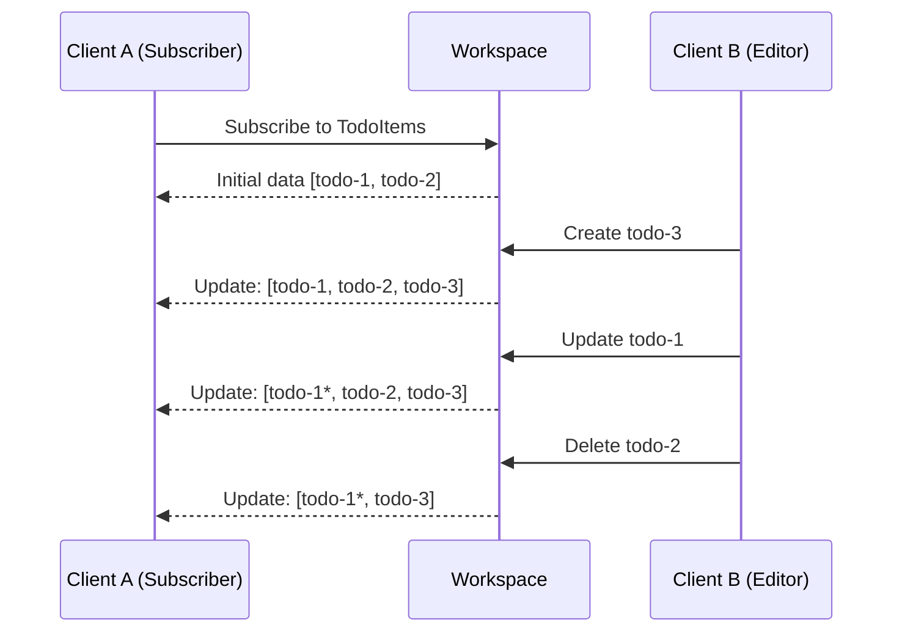

MeshWeaver models data mutations as reactive messages flowing through a typed workspace. Rather than imperative method calls, you describe *what changed* and the workspace propagates the delta to every subscriber automatically — no polling, no manual refresh.

<svg viewBox="0 0 760 260" xmlns="http://www.w3.org/2000/svg" style="width:100%;max-width:760px;height:auto;display:block;margin:20px auto;" font-family="sans-serif" font-size="13">
  <defs>
    <marker id="crud-arrow" markerWidth="8" markerHeight="8" refX="7" refY="3.5" orient="auto">
      <path d="M0,0 L0,7 L8,3.5 Z" fill="#90a4ae"/>
    </marker>
    <marker id="crud-arrow-fan" markerWidth="8" markerHeight="8" refX="7" refY="3.5" orient="auto">
      <path d="M0,0 L0,7 L8,3.5 Z" fill="#43a047"/>
    </marker>
  </defs>
  <rect x="0" y="0" width="760" height="260" rx="12" fill="#1a1f2e" opacity="0.7"/>
  <rect x="20" y="100" width="110" height="60" rx="10" fill="#1e88e5"/>
  <text x="75" y="126" text-anchor="middle" fill="#fff" font-weight="bold">Client</text>
  <text x="75" y="144" text-anchor="middle" fill="#fff" font-size="11">DataChangeRequest</text>
  <rect x="180" y="100" width="110" height="60" rx="10" fill="#e53935"/>
  <text x="235" y="126" text-anchor="middle" fill="#fff" font-weight="bold">Access</text>
  <text x="235" y="144" text-anchor="middle" fill="#fff" font-size="11">Control</text>
  <rect x="340" y="100" width="110" height="60" rx="10" fill="#f57c00"/>
  <text x="395" y="126" text-anchor="middle" fill="#fff" font-weight="bold">Validator</text>
  <text x="395" y="144" text-anchor="middle" fill="#fff" font-size="11">Business Rules</text>
  <rect x="500" y="100" width="110" height="60" rx="10" fill="#5c6bc0"/>
  <text x="555" y="126" text-anchor="middle" fill="#fff" font-weight="bold">Workspace</text>
  <text x="555" y="144" text-anchor="middle" fill="#fff" font-size="11">EntityStore</text>
  <rect x="660" y="100" width="80" height="60" rx="10" fill="#26a69a"/>
  <text x="700" y="126" text-anchor="middle" fill="#fff" font-weight="bold">Storage</text>
  <text x="700" y="144" text-anchor="middle" fill="#fff" font-size="11">Persist</text>
  <line x1="130" y1="130" x2="178" y2="130" stroke="#90a4ae" stroke-width="1.5" marker-end="url(#crud-arrow)"/>
  <line x1="290" y1="130" x2="338" y2="130" stroke="#90a4ae" stroke-width="1.5" marker-end="url(#crud-arrow)"/>
  <line x1="450" y1="130" x2="498" y2="130" stroke="#90a4ae" stroke-width="1.5" marker-end="url(#crud-arrow)"/>
  <line x1="610" y1="130" x2="658" y2="130" stroke="#90a4ae" stroke-width="1.5" marker-end="url(#crud-arrow)"/>
  <text x="154" y="122" text-anchor="middle" fill="#90a4ae" font-size="10" opacity="0.8">check</text>
  <text x="314" y="122" text-anchor="middle" fill="#90a4ae" font-size="10" opacity="0.8">validate</text>
  <text x="474" y="122" text-anchor="middle" fill="#90a4ae" font-size="10" opacity="0.8">apply</text>
  <text x="634" y="122" text-anchor="middle" fill="#90a4ae" font-size="10" opacity="0.8">persist</text>
  <rect x="430" y="195" width="100" height="40" rx="8" fill="#43a047" opacity="0.9"/>
  <text x="480" y="220" text-anchor="middle" fill="#fff" font-size="12">Subscriber A</text>
  <rect x="560" y="195" width="100" height="40" rx="8" fill="#43a047" opacity="0.9"/>
  <text x="610" y="220" text-anchor="middle" fill="#fff" font-size="12">Subscriber B</text>
  <rect x="300" y="195" width="100" height="40" rx="8" fill="#43a047" opacity="0.9"/>
  <text x="350" y="220" text-anchor="middle" fill="#fff" font-size="12">Subscriber C</text>
  <line x1="555" y1="160" x2="480" y2="195" stroke="#43a047" stroke-width="1.5" stroke-dasharray="4,3" marker-end="url(#crud-arrow-fan)"/>
  <line x1="555" y1="160" x2="610" y2="195" stroke="#43a047" stroke-width="1.5" stroke-dasharray="4,3" marker-end="url(#crud-arrow-fan)"/>
  <line x1="555" y1="160" x2="350" y2="195" stroke="#43a047" stroke-width="1.5" stroke-dasharray="4,3" marker-end="url(#crud-arrow-fan)"/>
  <text x="380" y="186" text-anchor="middle" fill="#43a047" font-size="10" opacity="0.9">real-time fan-out</text>
</svg>

*CRUD pipeline: every mutation passes through Access Control and Validation before reaching the Workspace, which persists the change and fans it out to all subscribers in real time.*

---

# Data Model

Every workspace maintains an **EntityStore**: a map of named collections, each holding a set of typed entity instances keyed by their ID.

```
EntityStore
├── Collections["TodoItems"] = InstanceCollection
│   ├── Instances["todo-1"] = TodoItem { Id: "todo-1", Title: "Task 1" }
│   └── Instances["todo-2"] = TodoItem { Id: "todo-2", Title: "Task 2" }
└── Collections["Projects"] = InstanceCollection
    └── Instances["proj-1"] = Project { Id: "proj-1", Name: "Alpha" }
```

An `InstanceCollection` is a container for instances of a specific entity type, mapping IDs to objects.

---

# Create

## DataChangeRequest

The primary way to add new entities is to send a `DataChangeRequest` with the `Creations` payload:

```csharp
var newTodo = new TodoItem
{
    Id = Guid.NewGuid().ToString(),
    Title = "Learn MeshWeaver",
    Status = TodoStatus.Pending
};

var request = DataChangeRequest.Create([newTodo], changedBy: "user-123");
workspace.RequestChange(request, activity, delivery);
```

## Unified Reference API

You can also create entities via the path-based reference API:

```csharp
var request = new UpdateUnifiedReferenceRequest(
    Reference: "data:TodoItems/" + newTodo.Id,
    Data: newTodo
);
await hub.InvokeAsync(request);
```

## Create Flow



---

# Read

MeshWeaver offers both live subscriptions and one-time queries. Prefer subscriptions for UI code — the workspace delivers updates the moment data changes.

## Reactive Subscription

Subscribe to a typed collection as an `IObservable` that emits the full current set on every change:

```csharp
workspace.GetObservable<TodoItem>()
    .Subscribe(todos =>
    {
        Console.WriteLine($"Todos updated: {todos.Count}");
        foreach (var todo in todos)
            Console.WriteLine($"  - {todo.Title}");
    });
```

## One-Time Retrieval

When you need a snapshot without ongoing updates, use `GetDataRequest`:

```csharp
var request = new GetDataRequest(new CollectionReference("TodoItems"));
var response = await hub.InvokeAsync<GetDataResponse>(request);
var todos = response.Data as IEnumerable<TodoItem>;
```

## Reference Types

Choose the right reference type for your query pattern:

| Reference Type | Purpose | Example |
|---|---|---|
| `EntityReference` | Single entity by ID | `new EntityReference("TodoItems", "todo-1")` |
| `CollectionReference` | All entities in a collection | `new CollectionReference("TodoItems")` |
| `CollectionsReference` | Multiple collections at once | `new CollectionsReference("TodoItems", "Projects")` |

## Unified Reference Paths

Path-based references give a uniform addressing scheme across entity, content, and schema resources:

```csharp
var todoRef       = "data:TodoItems/todo-1";   // specific entity
var allTodosRef   = "data/TodoItems";           // entire collection
var fileRef       = "content/uploads/doc.pdf";  // file content
var schemaRef     = "schema/TodoItem";          // JSON schema
```

## Virtual Paths

Define computed data sources that combine or transform real collections:

```csharp
.WithVirtualPath("TodoSummary", (workspace, entityId) =>
{
    var todos = workspace.GetStream(typeof(TodoItem));
    var users = workspace.GetStream(typeof(User));

    return Observable.CombineLatest(todos, users, (t, u) =>
    {
        // Compute summary by joining data
        return new TodoSummary { ... };
    });
})
```

Virtual paths participate in real-time propagation just like ordinary collections.

---

# Update

## DataChangeRequest

Pass updated entity instances in the `Updates` payload. By default, changes are *merged* into the existing record:

```csharp
var updatedTodo = existingTodo with
{
    Title = "Updated Title",
    Status = TodoStatus.InProgress
};

var request = DataChangeRequest.Update([updatedTodo], changedBy: "user-123");
workspace.RequestChange(request, activity, delivery);
```

## Update Options

Control whether a change merges or replaces the entire collection:

```csharp
// Merge (default) — only the supplied instances change
var mergeRequest = DataChangeRequest.Update(
    updates: [updatedTodo],
    changedBy: "user-123",
    options: new UpdateOptions { Snapshot = false }
);

// Snapshot — the entire collection is replaced by the supplied list
var snapshotRequest = DataChangeRequest.Update(
    updates: allTodos,
    options: new UpdateOptions { Snapshot = true }
);
```

## Unified Reference API

```csharp
var request = new UpdateUnifiedReferenceRequest(
    Reference: "data:TodoItems/todo-1",
    Data: updatedTodo
);
await hub.InvokeAsync(request);
```

## Workspace Extension Methods

Convenience wrappers for the most common patterns:

```csharp
// Single entity
workspace.Update(updatedTodo, activity, delivery);

// Multiple entities
workspace.Update([todo1, todo2, todo3], activity, delivery);
```

---

# Delete

## DataChangeRequest

Pass the full entity object (not just the ID) so the workspace can resolve and remove the correct instance:

```csharp
var request = DataChangeRequest.Delete([todoToDelete], changedBy: "user-123");
workspace.RequestChange(request, activity, delivery);
```

## Unified Reference API

```csharp
var request = new DeleteUnifiedReferenceRequest("data:TodoItems/todo-1");
await hub.InvokeAsync(request);
```

## Workspace Extension Methods

```csharp
workspace.Delete(todoToDelete, activity, delivery);
workspace.Delete([todo1, todo2], activity, delivery);
```

---

# Data Validation

Attach validators to enforce business rules before any change is applied. The workspace calls every registered validator and returns `DataValidationResult.Failed(...)` to the caller if any rule is violated.

```csharp
public class TodoValidator : IDataValidator
{
    public List<DataOperation> SupportedOperations =>
        [DataOperation.Create, DataOperation.Update];

    public Task<DataValidationResult> ValidateAsync(
        DataValidationContext context,
        CancellationToken ct)
    {
        if (context.Entity is TodoItem todo && string.IsNullOrEmpty(todo.Title))
            return Task.FromResult(
                DataValidationResult.Failed("Title is required"));

        return Task.FromResult(DataValidationResult.Success());
    }
}
```

Register validators in the data configuration:

```csharp
.AddData(data => data
    .WithValidator<TodoValidator>()
)
```

---

# Access Control

Restrict operations based on user context. Access restrictions run before validation, so unauthorized requests are rejected early.

**Global restriction** — apply a rule to all operations in a data source:

```csharp
.AddData(data => data
    .WithAccessRestriction(
        (action, context, accessCtx) =>
        {
            if (action == AccessAction.Read)
                return Task.FromResult(true);          // anyone can read

            return Task.FromResult(accessCtx.UserContext != null); // writes require login
        },
        "RequireAuthForWrites"
    )
)
```

**Type-specific restriction** — limit access at the entity level:

```csharp
.AddSource(src => src
    .WithType<TodoItem>(type => type
        .WithAccessRestriction((action, ctx, accessCtx) =>
        {
            var todo = ctx as TodoItem;
            // Only the owner may modify their own todos
            return Task.FromResult(
                todo?.OwnerId == accessCtx.UserContext?.UserId
            );
        }, "OwnerOnly")
    )
)
```

---

# Configuration Example

A complete data source setup showing multiple types, a virtual path, a validator, and an access rule:

```csharp
.AddData(data => data
    .AddSource(src => src
        .WithType<TodoItem>(type => type
            .WithKey(todo => todo.Id)
            .WithInitialData(async (ref, ct) =>
                await LoadTodosFromDatabaseAsync(ct))
        )
        .WithType<Project>(type => type
            .WithKey(proj => proj.Id)
        )
    )
    .WithVirtualPath("Dashboard", ComputeDashboard)
    .WithValidator<TodoValidator>()
    .WithAccessRestriction(RequireAuthentication, "Auth")
)
```

---

# Real-Time Synchronization

Every CRUD operation automatically propagates to all current subscribers. Clients never need to re-query; the workspace pushes the updated collection as soon as the change is applied.



---

# Quick Reference

## Message Types

| Message | Purpose |
|---|---|
| `DataChangeRequest` | Create, update, or delete entities |
| `DataChangeResponse` | Outcome of a change operation |
| `GetDataRequest` | One-time data retrieval |
| `GetDataResponse` | Data retrieval result |
| `SubscribeRequest` | Subscribe to live data changes |
| `UpdateUnifiedReferenceRequest` | Create/update via path reference |
| `DeleteUnifiedReferenceRequest` | Delete via path reference |

## Best Practices

1. **Use typed observables** — prefer `GetObservable<T>()` over raw streams for compile-time safety.
2. **Check the response** — inspect `DataChangeResponse.Error` for validation failures before assuming success.
3. **Batch related changes** — group inserts, updates, and deletes into a single `DataChangeRequest` for atomic delivery.
4. **Register validators** — enforce data integrity at the data layer rather than in each call site.
5. **Protect with access restrictions** — declare who may read or write each type alongside the type configuration.
6. **Prefer subscriptions over polling** — reactive streams keep UIs in sync with zero manual refresh logic.

---

# Live Demo

The cell below builds a small in-memory summary table using the reference types described above, rendered directly in this page:

```csharp --render CrudReferenceDemo --show-code
var rows = new[]
{
    new { Type = "EntityReference",      Purpose = "Single entity by ID",         Example = "new EntityReference(\"TodoItems\", \"todo-1\")" },
    new { Type = "CollectionReference",  Purpose = "All entities in collection",   Example = "new CollectionReference(\"TodoItems\")" },
    new { Type = "CollectionsReference", Purpose = "Multiple collections at once", Example = "new CollectionsReference(\"TodoItems\", \"Projects\")" },
};

var header = "<thead><tr><th>Reference Type</th><th>Purpose</th><th>Example</th></tr></thead>";
var bodyRows = string.Join("", rows.Select(r =>
    $"<tr><td><code>{r.Type}</code></td><td>{r.Purpose}</td><td><code>{r.Example}</code></td></tr>"));

MeshWeaver.Layout.Controls.Html(
    $"<table style='width:100%;border-collapse:collapse'>{header}<tbody>{bodyRows}</tbody></table>");
```

---

# See Also

- [Query Syntax](../QuerySyntax) — Search and filter nodes
- [Unified Path](../UnifiedPath) — Path-based data addressing
- [Data Binding](../../GUI/DataBinding) — Connect UI controls to data
- [Editor Control](../../GUI/Editor) — Generate forms from records
