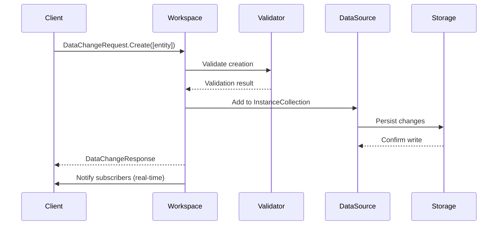
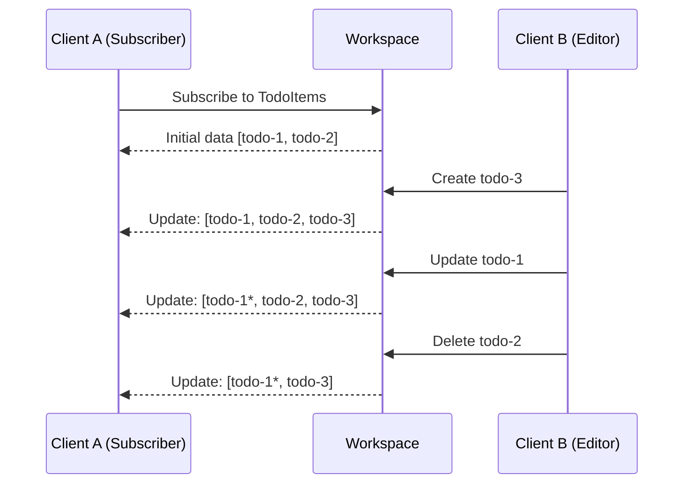

MeshWeaver provides a reactive, type-safe approach to data operations. This guide explains how Create, Read, Update, and Delete (CRUD) operations work in the DataMesh.

# Overview

CRUD operations in MeshWeaver are built on three core concepts:

- **DataChangeRequest**: A message that encapsulates create, update, and delete operations
- **Workspace**: The reactive data context that manages entity state
- **Unified References**: A path-based system for addressing data (`data:Collection/EntityId`)

# Data Model

## EntityStore

The root container holding all collections of entities:

```
EntityStore
├── Collections["TodoItems"] = InstanceCollection
│   ├── Instances["todo-1"] = TodoItem { Id: "todo-1", Title: "Task 1" }
│   ├── Instances["todo-2"] = TodoItem { Id: "todo-2", Title: "Task 2" }
├── Collections["Projects"] = InstanceCollection
│   ├── Instances["proj-1"] = Project { Id: "proj-1", Name: "Alpha" }
```

## InstanceCollection

A container for instances of a specific entity type, mapping IDs to objects.

---

# Create Operations

## Using DataChangeRequest

Create new entities by sending a `DataChangeRequest` with the `Creations` collection:

```csharp
var newTodo = new TodoItem
{
    Id = Guid.NewGuid().ToString(),
    Title = "Learn MeshWeaver",
    Status = TodoStatus.Pending
};

var request = DataChangeRequest.Create([newTodo], changedBy: "user-123");
workspace.RequestChange(request, activity, delivery);
```

## Via Unified Reference API

Create entities using the unified reference path format:

```csharp
var request = new UpdateUnifiedReferenceRequest(
    Reference: "data:TodoItems/" + newTodo.Id,
    Data: newTodo
);
await hub.InvokeAsync(request);
```

## Create Flow



---

# Read Operations

MeshWeaver provides multiple ways to read data, supporting both one-time queries and real-time subscriptions.

## Subscription-based Reading

Get a reactive stream that updates automatically when data changes:

```csharp
// Get all todos as an observable stream
workspace.GetObservable<TodoItem>()
    .Subscribe(todos =>
    {
        Console.WriteLine($"Todos updated: {todos.Count}");
        foreach (var todo in todos)
            Console.WriteLine($"  - {todo.Title}");
    });
```

## One-time Data Retrieval

Fetch data once without subscribing to updates:

```csharp
var request = new GetDataRequest(new CollectionReference("TodoItems"));
var response = await hub.InvokeAsync<GetDataResponse>(request);
var todos = response.Data as IEnumerable<TodoItem>;
```

## Reference Types

Different reference types support various query patterns:

| Reference Type | Purpose | Example |
|----------------|---------|---------|
| `EntityReference` | Single entity by ID | `new EntityReference("TodoItems", "todo-1")` |
| `CollectionReference` | All entities in collection | `new CollectionReference("TodoItems")` |
| `CollectionsReference` | Multiple collections | `new CollectionsReference("TodoItems", "Projects")` |

## Using Unified References

Query data using path-based references:

```csharp
// Get a specific entity
var todoRef = "data:TodoItems/todo-1";

// Get entire collection
var allTodosRef = "data:TodoItems";

// Get file content
var fileRef = "content:uploads/document.pdf";

// Get schema
var schemaRef = "schema:TodoItem";
```

## Virtual Paths

Define computed data sources that combine or transform data:

```csharp
.WithVirtualPath("TodoSummary", (workspace, entityId) =>
{
    var todos = workspace.GetStream(typeof(TodoItem));
    var users = workspace.GetStream(typeof(User));

    return Observable.CombineLatest(todos, users, (t, u) =>
    {
        // Compute summary by joining data
        return new TodoSummary { ... };
    });
})
```

---

# Update Operations

## Using DataChangeRequest

Update existing entities:

```csharp
var updatedTodo = existingTodo with
{
    Title = "Updated Title",
    Status = TodoStatus.InProgress
};

var request = DataChangeRequest.Update([updatedTodo], changedBy: "user-123");
workspace.RequestChange(request, activity, delivery);
```

## Update Options

Control how updates are applied:

```csharp
var request = DataChangeRequest.Update(
    updates: [updatedTodo],
    changedBy: "user-123",
    options: new UpdateOptions { Snapshot = false }  // Merge (default)
);

// With Snapshot = true, the entire collection is replaced
var snapshotRequest = DataChangeRequest.Update(
    updates: allTodos,
    options: new UpdateOptions { Snapshot = true }  // Replace all
);
```

## Via Unified Reference API

```csharp
var request = new UpdateUnifiedReferenceRequest(
    Reference: "data:TodoItems/todo-1",
    Data: updatedTodo
);
await hub.InvokeAsync(request);
```

## Workspace Extension Methods

Convenient methods for common operations:

```csharp
// Update single entity
workspace.Update(updatedTodo, activity, delivery);

// Update multiple entities
workspace.Update([todo1, todo2, todo3], activity, delivery);
```

---

# Delete Operations

## Using DataChangeRequest

Delete entities by passing the full entity object:

```csharp
var request = DataChangeRequest.Delete([todoToDelete], changedBy: "user-123");
workspace.RequestChange(request, activity, delivery);
```

## Via Unified Reference API

```csharp
var request = new DeleteUnifiedReferenceRequest("data:TodoItems/todo-1");
await hub.InvokeAsync(request);
```

## Workspace Extension Methods

```csharp
// Delete single entity
workspace.Delete(todoToDelete, activity, delivery);

// Delete multiple entities
workspace.Delete([todo1, todo2], activity, delivery);
```

---

# Data Validation

Configure validators to enforce business rules:

```csharp
public class TodoValidator : IDataValidator
{
    public List<DataOperation> SupportedOperations =>
        [DataOperation.Create, DataOperation.Update];

    public Task<DataValidationResult> ValidateAsync(
        DataValidationContext context,
        CancellationToken ct)
    {
        if (context.Entity is TodoItem todo)
        {
            if (string.IsNullOrEmpty(todo.Title))
                return Task.FromResult(
                    DataValidationResult.Failed("Title is required"));
        }
        return Task.FromResult(DataValidationResult.Success());
    }
}
```

Register validators in configuration:

```csharp
.AddData(data => data
    .WithValidator<TodoValidator>()
)
```

# Access Control

Restrict CRUD operations based on user context:

```csharp
.AddData(data => data
    .WithAccessRestriction(
        (action, context, accessCtx) =>
        {
            // Allow reads for everyone
            if (action == AccessAction.Read)
                return Task.FromResult(true);

            // Require authentication for writes
            return Task.FromResult(accessCtx.UserContext != null);
        },
        "RequireAuthForWrites"
    )
)
```

Type-specific restrictions:

```csharp
.AddSource(src => src
    .WithType<TodoItem>(type => type
        .WithAccessRestriction((action, ctx, accessCtx) =>
        {
            var todo = ctx as TodoItem;
            // Only owner can modify
            return Task.FromResult(
                todo?.OwnerId == accessCtx.UserContext?.UserId
            );
        }, "OwnerOnly")
    )
)
```

# Configuration Example

Complete data configuration with CRUD support:

```csharp
.AddData(data => data
    .AddSource(src => src
        .WithType<TodoItem>(type => type
            .WithKey(todo => todo.Id)
            .WithInitialData(async (ref, ct) =>
                await LoadTodosFromDatabaseAsync(ct))
        )
        .WithType<Project>(type => type
            .WithKey(proj => proj.Id)
        )
    )
    .WithVirtualPath("Dashboard", ComputeDashboard)
    .WithValidator<TodoValidator>()
    .WithAccessRestriction(RequireAuthentication, "Auth")
)
```

# Real-time Synchronization

All CRUD operations automatically propagate to subscribers:



# Best Practices

1. **Use typed references**: Prefer `GetObservable<T>()` over raw streams for type safety
2. **Handle errors**: Check `DataChangeResponse.Error` for validation failures
3. **Batch operations**: Group related changes in a single `DataChangeRequest`
4. **Configure validators**: Enforce data integrity at the data layer
5. **Use access restrictions**: Protect sensitive operations
6. **Leverage subscriptions**: Use reactive streams for real-time UIs instead of polling

# Message Types Reference

| Message | Purpose |
|---------|---------|
| `DataChangeRequest` | Create, update, or delete entities |
| `DataChangeResponse` | Result of a change operation |
| `GetDataRequest` | One-time data retrieval |
| `GetDataResponse` | Data retrieval result |
| `SubscribeRequest` | Subscribe to data changes |
| `UpdateUnifiedReferenceRequest` | Create/update via unified reference |
| `DeleteUnifiedReferenceRequest` | Delete via unified reference |

# See Also

- [Query Syntax](../QuerySyntax) - Search and filter nodes
- [Unified Path](../UnifiedPath) - Path-based data addressing
- [Data Binding](../../GUI/DataBinding) - Connect UI controls to data
- [Editor Control](../../GUI/Editor) - Generate forms from records
