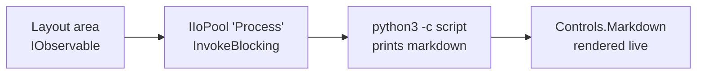

# Calling Python from MeshWeaver

MeshWeaver has **no embedded Python execution engine** — the platform's kernel runs C#. When a view needs something computed in Python, the truthful pattern is to run `python3` as an **external process**: an ordinary sync-blocking I/O leaf, exactly like a Roslyn compile or a `git` call.

That means two non-negotiable rules apply (read them first if you haven't):

1. **[Controlled I/O Pooling](/Doc/Architecture/ControlledIoPooling)** — an external process is a sync-blocking leaf. It runs through `IIoPool.InvokeBlocking` on the bounded `Process` pool, never on a hub's single-threaded action block. The pool caps concurrency (default 4 processes) and cancels the process tree on unsubscribe.
2. **[Asynchronous Calls](/Doc/Architecture/AsynchronousCalls)** — the layout area stays reactive: it returns `IObservable<UiControl?>` and composes with `Select` / `Switch`. No `async`, no `await`, no `Task<T>` anywhere hub-reachable.

The shape, end to end:



Python formats its own output **as markdown** and prints it to stdout; the layout area wraps the captured text in `Controls.Markdown`. No HTML strings, no parsing — the process boundary is plain text.

## Degrade gracefully — production has no Python

The portal's container images do **not** ship a Python interpreter. A view that throws when `python3` is missing is broken in production. The pattern therefore probes the PATH first and renders an informative note instead of erroring — the area is *always* meaningful:

- Python found → the live report.
- Python absent → a markdown notice explaining why (this is what you see on the deployed portal below unless the host has Python).

## Live example

This cell executes on page load. The `Process` pool runs `python3` off the kernel's scheduler; the single top-level `await` at the end is the sanctioned script-edge bridge (interactive cells run in the kernel's hosted exec hub — see [Interactive Markdown](../InteractiveMarkdown)); the blocking work itself happens inside the pool slot:

```csharp --render PythonDemo --show-code
using System.IO;
using System.Diagnostics;
using System.Threading;
using MeshWeaver.Mesh.Threading;
using Microsoft.Extensions.DependencyInjection;

string? FindPython()
{
    var names = OperatingSystem.IsWindows() ? new[] { "python3.exe", "python.exe" } : new[] { "python3" };
    var path = Environment.GetEnvironmentVariable("PATH") ?? "";
    return path.Split(Path.PathSeparator, StringSplitOptions.RemoveEmptyEntries)
        .SelectMany(dir => names.Select(n => Path.Combine(dir, n)))
        .FirstOrDefault(File.Exists);
}

string RunPython(CancellationToken ct)
{
    var python = FindPython();
    if (python is null)
        return "> **Python is not available on this host.** This demo shells out to `python3`, " +
               "which is not installed in the portal's container image. On a host with Python 3 " +
               "on the PATH the cell renders a statistics table computed by Python.";

    var psi = new ProcessStartInfo(python)
    {
        RedirectStandardOutput = true,
        RedirectStandardError = true,
        UseShellExecute = false,
        CreateNoWindow = true,
    };
    psi.ArgumentList.Add("-c");
    psi.ArgumentList.Add("""
        import sys, statistics as st
        xs = [17, 23, 4, 42, 8, 15, 16, 23, 42, 9]
        print(f"### Sample statistics — computed by Python {sys.version.split()[0]}")
        print()
        print("| Statistic | Value |")
        print("|---|---|")
        print(f"| n | {len(xs)} |")
        print(f"| mean | {st.mean(xs):.2f} |")
        print(f"| median | {st.median(xs)} |")
        print(f"| stdev | {st.stdev(xs):.2f} |")
        print(f"| min / max | {min(xs)} / {max(xs)} |")
        """);
    psi.Environment["PYTHONIOENCODING"] = "utf-8";

    using var process = Process.Start(psi)!;
    using var reg = ct.Register(() =>
    {
        try { if (!process.HasExited) process.Kill(entireProcessTree: true); }
        catch { /* already gone */ }
    });
    var outTask = process.StandardOutput.ReadToEndAsync(ct);
    var errTask = process.StandardError.ReadToEndAsync(ct);
    process.WaitForExit();
    return process.ExitCode == 0
        ? outTask.GetAwaiter().GetResult()
        : $"> **Python exited with code {process.ExitCode}:** {errTask.GetAwaiter().GetResult()}";
}

var pool = Mesh.ServiceProvider.GetService<IoPoolRegistry>()?.Get(IoPoolNames.Process) ?? IoPool.Unbounded;
var markdown = await pool.InvokeBlocking(RunPython);
Controls.Markdown(markdown)
```

Points worth noticing in the code:

| Line | Why it matters |
|---|---|
| `pool.InvokeBlocking(RunPython)` | The process runs on the bounded `Process` pool's limited-concurrency scheduler — never on a hub thread. The observable is cold: the slot is taken on subscribe. |
| `ct.Register(... Kill(entireProcessTree: true))` | Cancellation (unsubscribe / navigation away) kills the process tree, so a pool slot is never leaked. |
| stdout/stderr drained **before** `WaitForExit` | A full pipe buffer would deadlock the process otherwise. |
| `FindPython()` probe + notice | The area renders meaningfully on hosts without Python instead of erroring. |
| `ArgumentList` (not `Arguments`) | No shell quoting — the script travels as a single argv entry. |

## The same pattern on a NodeType

In production code the view lives on a **NodeType** so every instance node gets the report as a layout area. The deployed sample is `PythonDemo/PrimeReport` in `samples/Graph/Data` — same probe, same pool, but reactive against the node's content: change `Count` on the node and the area reruns Python.

### Folder layout

```
samples/Graph/Data/
  PythonDemo/
    PrimeReport.json               # NodeType definition
    PrimeReport/
      First25.json                 # sample instance (count: 25)
      Source/
        PrimeReport.cs             # content record
        PrimeReportLayoutAreas.cs  # the Python-calling layout area
```

### `Source/PrimeReport.cs`

```csharp
// <meshweaver>
// Id: PrimeReport
// DisplayName: Prime Report Data Model
// </meshweaver>

using MeshWeaver.Domain;

public record PrimeReport
{
    [Required]
    [MeshNodeProperty(nameof(MeshNode.Name))]
    public string Name { get; init; } = string.Empty;

    /// <summary>How many primes the Python script computes.</summary>
    public int Count { get; init; } = 25;
}
```

### `Source/PrimeReportLayoutAreas.cs` (core)

The area reads the node reactively from the per-node hub's `MeshDataSource` — `host.Workspace.GetStream<MeshNode>()`, the same read the framework's default node areas use — and `Switch`es into a fresh pooled Python run whenever `Count` changes:

```csharp
public static IObservable<UiControl?> Report(LayoutAreaHost host, RenderingContext _)
{
    var hub = host.Hub;
    var hubPath = hub.Address.ToString();
    var nodeStream = host.Workspace.GetStream<MeshNode>();
    if (nodeStream is null)
        return Observable.Return(
            (UiControl?)Controls.Markdown("*Unable to load the prime report node.*"));

    return nodeStream
        .Select(nodes => nodes?.FirstOrDefault(n => n.Path == hubPath))
        .Select(node => Math.Clamp(ExtractReport(node)?.Count ?? 25, 1, 200))
        .DistinctUntilChanged()
        .Select(count => ProcessPool(hub)
            .InvokeBlocking(ct => RunPython(BuildScript(count), ct))
            .Select(markdown => (UiControl?)Controls.Markdown(markdown))
            .StartWith((UiControl?)Controls.Markdown("*Running Python…*")))
        .Switch();
}

private static IIoPool ProcessPool(IMessageHub hub) =>
    hub.ServiceProvider.GetService<IoPoolRegistry>()?.Get(IoPoolNames.Process)
    ?? IoPool.Unbounded;
```

`RunPython` and `FindPython` are the same as in the live cell above; `BuildScript(count)` emits a small Python program that computes the first `count` primes and prints the whole report as a markdown table (see the full source in `samples/Graph/Data/PythonDemo/PrimeReport/Source/PrimeReportLayoutAreas.cs`).

### `PrimeReport.json`

```json
{
  "id": "PrimeReport",
  "namespace": "PythonDemo",
  "name": "Prime Report",
  "nodeType": "NodeType",
  "content": {
    "$type": "NodeTypeDefinition",
    "namespace": "PythonDemo",
    "displayName": "Prime Report",
    "configuration": "config => config
      .WithContentType<PrimeReport>()
      .AddLayout(layout => layout
        .AddPrimeReportLayoutAreas()
        .WithDefaultArea(\"Report\"))"
  }
}
```

### See it run

The deployed sample instance's `Report` area is embedded below (on a host without Python it shows the graceful notice — that is the pattern working, not failing):

@PythonDemo/PrimeReport/First25/Report

## Rules recap — what NOT to do

| Anti-pattern | Why it's wrong | Instead |
|---|---|---|
| `Process.Start` + `WaitForExit` in a handler or layout area body | Blocks the hub's single-threaded action block → the hub stops processing messages | `ProcessPool(hub).InvokeBlocking(...)` |
| `async`/`await`/`Task.Run` around the process | Continuations capture the hub scheduler → deadlock class | Compose `IObservable` + `Subscribe`; the pool bridges the blocking edge |
| `Observable.FromAsync(...)` | Runs the prologue on the subscribing (hub) thread, unbounded | `IIoPool` — the only sanctioned bridge |
| Throwing when `python3` is missing | Breaks every production render (containers ship no Python) | Probe + render a markdown notice |
| Building HTML strings from the process output | Hand-rolled rendering is forbidden | Python prints markdown; wrap in `Controls.Markdown` |

## Related

- [A pandas node in Python](../PythonPandasNode) — the stateful counterpart: a Python **participant** that holds a live `pandas.DataFrame` and renders it back as a real `DataGridControl`.
- [Controlled I/O Pooling](/Doc/Architecture/ControlledIoPooling) — the `IIoPool` contract, pool names and caps.
- [Asynchronous Calls](/Doc/Architecture/AsynchronousCalls) — the no-async rule book for hub-reachable code.
- [Creating Node Types](../CreatingNodeTypes) — the base walkthrough for content records and layout areas.
- [NuGet Packages in Node Types](../NodeTypeWithNuGet) — the sibling sample (`MathDemo/Matrix`) this one mirrors.
- [Testing Node Types](/Doc/DataMesh/NodeTypes/Testing) — the integration-test pattern used by `test/MeshWeaver.PythonDemo.Test`.
