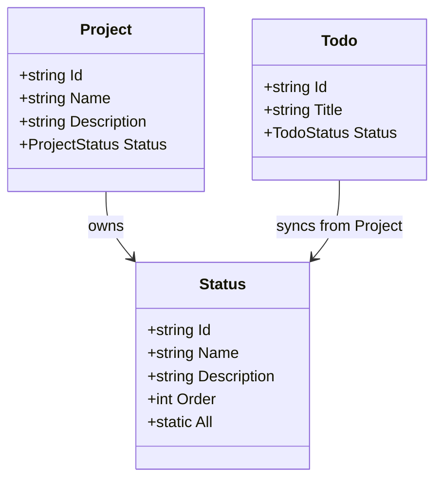
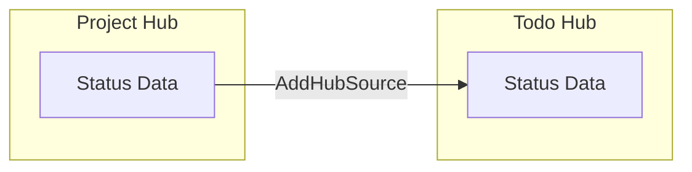
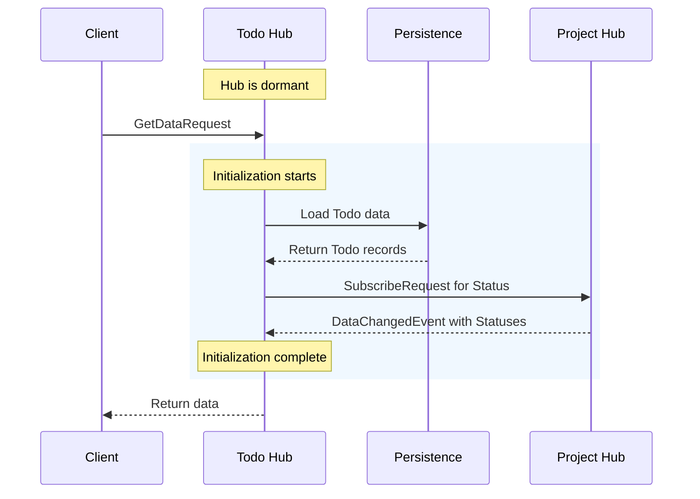

MeshWeaver gives every hub its own data layer — locally owned collections, initial seed data, and live synchronization from related hubs. This guide walks through the three core configuration primitives and shows how they compose into a working cross-hub data pipeline.

<svg viewBox="0 0 760 260" xmlns="http://www.w3.org/2000/svg" style="width:100%;max-width:760px;height:auto;display:block;margin:20px auto;" font-family="sans-serif" font-size="13">
  <defs>
    <marker id="arr" markerWidth="10" markerHeight="7" refX="9" refY="3.5" orient="auto">
      <polygon points="0 0,10 3.5,0 7" fill="#1e88e5"/>
    </marker>
  </defs>
  <rect x="0" y="0" width="760" height="260" rx="12" fill="#111827" opacity="0.6"/>
  <rect x="30" y="30" width="280" height="200" rx="10" fill="#1e3a5f" stroke="#1e88e5" stroke-width="1.5"/>
  <text x="170" y="58" text-anchor="middle" fill="#90caf9" font-size="14" font-weight="bold">Project Hub</text>
  <rect x="55" y="72" width="230" height="50" rx="8" fill="#1565c0"/>
  <text x="170" y="93" text-anchor="middle" fill="#fff" font-size="12" font-weight="bold">AddSource</text>
  <text x="170" y="112" text-anchor="middle" fill="#bbdefb" font-size="11">Registers Status collection</text>
  <rect x="55" y="134" width="230" height="50" rx="8" fill="#0d47a1"/>
  <text x="170" y="155" text-anchor="middle" fill="#fff" font-size="12" font-weight="bold">WithInitialData</text>
  <text x="170" y="174" text-anchor="middle" fill="#bbdefb" font-size="11">Seeds Planning, Active, Done…</text>
  <rect x="55" y="196" width="230" height="22" rx="6" fill="#263238" stroke="#37474f" stroke-width="1"/>
  <text x="170" y="212" text-anchor="middle" fill="#78909c" font-size="11">Status.All → persisted on first start</text>
  <rect x="450" y="30" width="280" height="200" rx="10" fill="#1b3a2f" stroke="#43a047" stroke-width="1.5"/>
  <text x="590" y="58" text-anchor="middle" fill="#a5d6a7" font-size="14" font-weight="bold">Todo Hub</text>
  <rect x="475" y="72" width="230" height="50" rx="8" fill="#2e7d32"/>
  <text x="590" y="93" text-anchor="middle" fill="#fff" font-size="12" font-weight="bold">AddHubSource</text>
  <text x="590" y="112" text-anchor="middle" fill="#c8e6c9" font-size="11">Live sync of Status from parent</text>
  <rect x="475" y="134" width="230" height="50" rx="8" fill="#1b5e20"/>
  <text x="590" y="155" text-anchor="middle" fill="#fff" font-size="12" font-weight="bold">Status (synced)</text>
  <text x="590" y="174" text-anchor="middle" fill="#c8e6c9" font-size="11">No ownership — read-only mirror</text>
  <rect x="475" y="196" width="230" height="22" rx="6" fill="#263238" stroke="#37474f" stroke-width="1"/>
  <text x="590" y="212" text-anchor="middle" fill="#78909c" font-size="11">Address: segments.Take(length − 2)</text>
  <line x1="310" y1="130" x2="448" y2="130" stroke="#1e88e5" stroke-width="2" marker-end="url(#arr)"/>
  <rect x="330" y="112" width="100" height="22" rx="6" fill="#1e3a5f" stroke="#1e88e5" stroke-width="1"/>
  <text x="380" y="127" text-anchor="middle" fill="#90caf9" font-size="11" font-weight="bold">AddHubSource</text>
  <text x="380" y="152" text-anchor="middle" fill="currentColor" fill-opacity="0.5" font-size="10">live subscription</text>
</svg>

*Cross-hub data pipeline: the Project Hub owns and seeds Status records; the Todo Hub pulls a live-synchronized copy via `AddHubSource`.*

## Core Primitives

| API | Purpose |
|-----|---------|
| `AddSource` | Register a local data collection within a hub |
| `WithInitialData` | Seed a collection with predefined records at startup |
| `AddHubSource` | Pull a live-synchronized copy of a collection from another hub |

---

## Data Model Relationships



The `Status` type lives in the Project hub and flows into the Todo hub via `AddHubSource`. Neither hub has to duplicate business logic; the Todo hub simply declares a dependency on the parent's collection.

---

## Data Flow Overview



---

## Configuring a Local Source

### Define the data model

Place your data model in `Source/Status.cs`. Using a record rather than an enum gives you richer metadata — descriptions, display order, and future extensibility without recompilation.

```csharp
public record Status
{
    [Key]
    public string Id { get; init; } = string.Empty;

    [Required]
    public string Name { get; init; } = string.Empty;

    public string? Description { get; init; }

    public int Order { get; init; }

    public static readonly Status Planning = new()
    {
        Id = "Planning", Name = "Planning",
        Description = "Project is in planning phase", Order = 1
    };

    public static readonly Status Active = new()
    {
        Id = "Active", Name = "Active",
        Description = "Project is actively being worked on", Order = 2
    };

    // ... additional status values

    public static IEnumerable<Status> All => new[]
    {
        Planning, Active, OnHold, Completed, Cancelled
    };
}
```

### Wire up the source in the NodeType configuration

```csharp
config => config
    .WithContentType<Project>()
    .AddData(data => data
        .AddSource(source => source
            .WithType<Status>(t => t.WithInitialData(Status.All))))
    .AddLayout(layout => layout.AddDefaultLayoutAreas())
```

`WithInitialData` seeds the collection on first activation. Subsequent starts do not re-insert records that already exist in persistence.

---

## Synchronizing Data from a Parent Hub

### When to use `AddHubSource`

Use `AddHubSource` when a child hub needs read access to reference data owned by a parent. The child hub stays up-to-date automatically — no polling, no duplicated ownership.

### Deriving the parent address

Hub addresses are hierarchical path segments. A Todo instance lives at `ACME/ProductLaunch/Todo/AnalystBriefings`; its owning Project hub is two segments up.

```csharp
// Todo instance at: ACME/ProductLaunch/Todo/AnalystBriefings
// Parent Project at: ACME/ProductLaunch
// Formula: remove the last 2 segments (collection name + instance id)

new Address(config.Address.Segments.Take(config.Address.Segments.Length - 2).ToArray())
```

### Configuration

```csharp
config => config
    .WithContentType<Todo>()
    .AddData(data => data
        .AddHubSource(
            new Address(config.Address.Segments.Take(config.Address.Segments.Length - 2).ToArray()),
            source => source.WithType<Status>()))
```

---

## Initialization and Synchronization Sequence

When a message reaches a dormant Todo hub, the framework wakes it and completes full initialization — including the cross-hub Status sync — before the request is handled.



After initialization, any `DataChangeRequest` that arrives at the Todo hub is persisted to storage and fanned out to all subscribers.

---

## Live Example

The cell below renders a summary of the configuration patterns covered on this page — a quick reference you can keep open alongside your code.

```csharp --render DataConfigSummary --show-code
MeshWeaver.Layout.Controls.Stack
    .WithView(MeshWeaver.Layout.Controls.Markdown("### Data Configuration Quick Reference"))
    .WithView(MeshWeaver.Layout.Controls.Markdown(
        "| Pattern | API | When to use |\n" +
        "|---------|-----|-------------|\n" +
        "| Local collection | `AddSource(...)` | Hub owns the data |\n" +
        "| Seed on startup | `.WithInitialData(records)` | Reference / lookup data |\n" +
        "| Cross-hub sync | `AddHubSource(address, ...)` | Child needs parent's data |\n"))
    .WithView(MeshWeaver.Layout.Controls.Markdown(
        $"*Rendered at {DateTime.Now:HH:mm:ss}*"))
```

---

## Best Practices

> **Use data models instead of enums.** Records provide descriptions, display order, and localization hooks. They can be extended at runtime without a recompile.

> **Initialize reference data at the owner.** Call `WithInitialData` on the hub that owns the type, then let dependent hubs pull via `AddHubSource`. Avoid seeding the same data in multiple places.

> **Derive addresses dynamically.** Use `config.Address.Segments` to compute relative addresses rather than hardcoding path strings. This makes NodeType configurations portable across namespaces.

> **Keep shared model definitions aligned.** When using `AddHubSource`, both hubs must reference the same `Status` type (same assembly or an identical record definition). A future MeshWeaver release will support shared data model assemblies to eliminate this duplication.

---

## Complete NodeType JSON

### Project Hub

```json
{
  "id": "Project",
  "namespace": "ACME",
  "nodeType": "NodeType",
  "content": {
    "$type": "NodeTypeDefinition",
    "configuration": "config => config.WithContentType<Project>().AddData(data => data.AddSource(source => source.WithType<Status>(t => t.WithInitialData(Status.All)))).AddLayout(layout => layout.AddDefaultLayoutAreas())"
  }
}
```

### Todo Hub

```json
{
  "id": "Todo",
  "namespace": "ACME/Project",
  "nodeType": "NodeType",
  "content": {
    "$type": "NodeTypeDefinition",
    "configuration": "config => config.WithContentType<Todo>().AddData(data => data.AddHubSource(new Address(config.Address.Segments.Take(config.Address.Segments.Length - 2).ToArray()), source => source.WithType<Status>())).AddDefaultLayoutAreas()"
  }
}
```

With this configuration the Todo hub accesses live Status reference data from its parent Project hub, ensuring consistent status options across the entire hierarchy.
