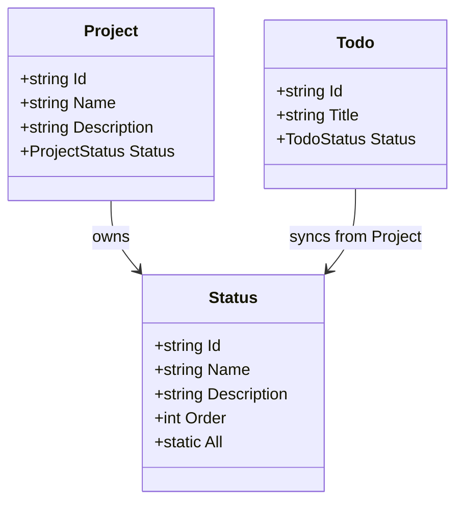
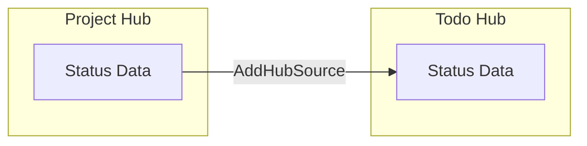
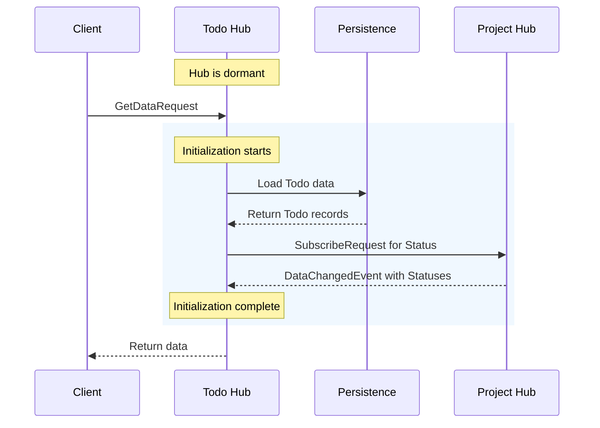

This guide explains how to configure data in message hubs, including data sources with initialization and hub-to-hub data synchronization.

# Overview

MeshWeaver provides flexible data configuration patterns:
- **AddSource**: Configure local data sources with optional initialization
- **AddHubSource**: Synchronize data from parent or related hubs
- **WithInitialData**: Seed data sources with predefined records

# Data Model Relationships



# Data Flow Architecture



# Configuring Data Sources

## AddSource with WithInitialData

Use `AddSource` to configure local data sources. The `WithInitialData` method seeds the source with predefined records.

### Example: Status Data Model

First, define the data model in your `Code/Status.cs` file:

```csharp
public record Status
{
    [Key]
    public string Id { get; init; } = string.Empty;

    [Required]
    public string Name { get; init; } = string.Empty;

    public string? Description { get; init; }

    public int Order { get; init; }

    public static readonly Status Planning = new()
    {
        Id = "Planning", Name = "Planning",
        Description = "Project is in planning phase", Order = 1
    };

    public static readonly Status Active = new()
    {
        Id = "Active", Name = "Active",
        Description = "Project is actively being worked on", Order = 2
    };

    // ... additional status values

    public static IEnumerable<Status> All => new[]
    {
        Planning, Active, OnHold, Completed, Cancelled
    };
}
```

### Configuration in NodeType

Add the data configuration to your NodeType's configuration string:

```csharp
config => config
    .WithContentType<Project>()
    .AddData(data => data
        .AddSource(source => source
            .WithType<Status>(t => t.WithInitialData(Status.All))))
    .AddLayout(layout => layout.AddDefaultLayoutAreas())
```

# Hub-to-Hub Data Synchronization

## AddHubSource

Use `AddHubSource` to synchronize data from a parent or related hub. This is useful when child hubs need access to reference data owned by a parent.

### Address Derivation

When a Todo hub needs to access Status data from its parent Project hub, compute the parent address:

```csharp
// Todo instance at: ACME/ProductLaunch/Todo/AnalystBriefings
// Parent Project at: ACME/ProductLaunch
// Formula: Remove last 2 segments (Todo collection + instance id)

new Address(config.Address.Segments.Take(config.Address.Segments.Length - 2).ToArray())
```

### Configuration Example

```csharp
config => config
    .WithContentType<Todo>()
    .AddData(data => data
        .AddHubSource(
            new Address(config.Address.Segments.Take(config.Address.Segments.Length - 2).ToArray()),
            source => source.WithType<Status>()))
    ```

## Synchronization Flow

This example shows a scenario where the Todo hub is dormant (not in memory). When a message arrives, the hub is woken up and initialized before processing the request.



When a `DataChangeRequest` arrives at the Todo hub, changes are persisted to storage and synced out to subscribers.

# Best Practices

1. **Use data models instead of enums**: Data models provide richer metadata (descriptions, display order) and can be extended without recompilation

2. **Initialize reference data at the source**: Use `WithInitialData` on the hub that owns the data, then sync to dependent hubs

3. **Derive addresses dynamically**: Use `config.Address.Segments` to compute relative addresses between hubs

4. **Keep data models synchronized**: When using `AddHubSource`, ensure the data model definition exists in both hubs

> **Note**: Future versions of MeshWeaver will support shared data model assemblies to avoid duplicating model definitions across hubs.

# Complete Example

## Project Hub Configuration

```json
{
  "id": "Project",
  "namespace": "ACME",
  "nodeType": "NodeType",
  "content": {
    "$type": "NodeTypeDefinition",
    "configuration": "config => config.WithContentType<Project>().AddData(data => data.AddSource(source => source.WithType<Status>(t => t.WithInitialData(Status.All)))).AddLayout(layout => layout.AddDefaultLayoutAreas())"
  }
}
```

## Todo Hub Configuration

```json
{
  "id": "Todo",
  "namespace": "ACME/Project",
  "nodeType": "NodeType",
  "content": {
    "$type": "NodeTypeDefinition",
    "configuration": "config => config.WithContentType<Todo>().AddData(data => data.AddHubSource(new Address(config.Address.Segments.Take(config.Address.Segments.Length - 2).ToArray()), source => source.WithType<Status>())).AddDefaultLayoutAreas()"
  }
}
```

This configuration enables the Todo hub to access Status reference data from its parent Project hub, ensuring consistent status options across the hierarchy.
