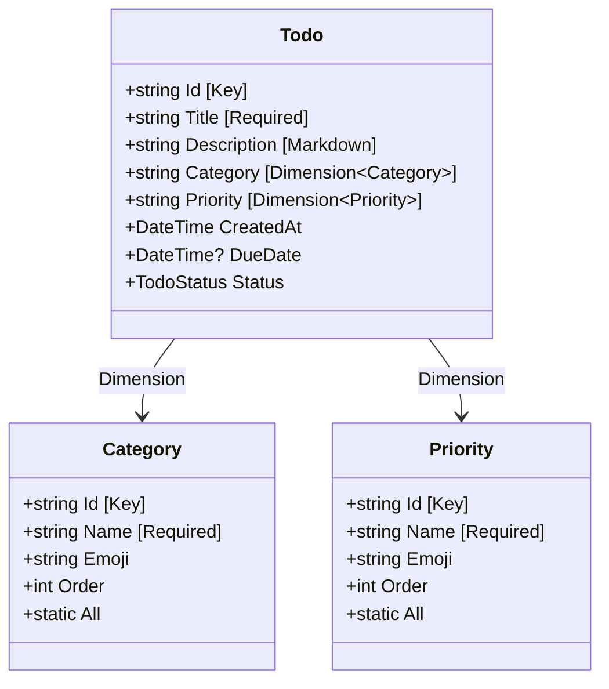
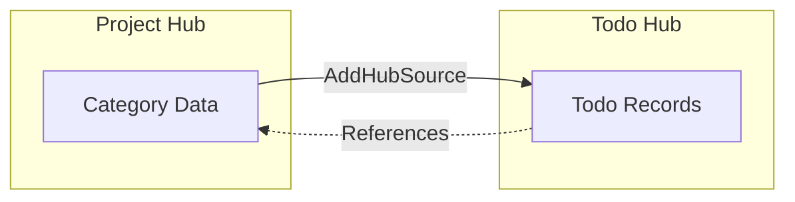

This guide walks through how to define data models in MeshWeaver: from basic C# record definitions and attribute annotations to rich reference data, content initialization, and hub-level configuration.

---

## Overview

MeshWeaver data models are plain C# records that layer three concerns:

| Layer | Mechanism | Purpose |
|---|---|---|
| **Shape** | Record properties + CLR types | Store and transport data |
| **Behavior** | Attributes (`[Key]`, `[Required]`, `[Markdown]`, …) | Drive validation, UI, and persistence |
| **Lookup values** | Static reference-data records | Provide dropdowns, ordering, and rich metadata |

The diagram below shows how a `Todo` entity references `Category` and `Priority` dimension data, both hosted in the same or a parent hub.
<svg viewBox="0 0 760 260" xmlns="http://www.w3.org/2000/svg" style="width:100%;max-width:760px;height:auto;display:block;margin:20px auto;" font-family="sans-serif" font-size="13">
  <defs>
    <marker id="dm-arrow" markerWidth="8" markerHeight="8" refX="6" refY="3" orient="auto">
      <path d="M0,0 L0,6 L8,3 z" fill="#90a4ae"/>
    </marker>
  </defs>
  <rect x="0" y="0" width="760" height="260" rx="12" fill="#1a2030" opacity="0.6"/>
  <rect x="30" y="30" width="200" height="200" rx="10" fill="#1e3a5f" stroke="#1e88e5" stroke-width="1.5"/>
  <rect x="30" y="30" width="200" height="36" rx="10" fill="#1e88e5"/>
  <rect x="30" y="54" width="200" height="12" fill="#1e88e5"/>
  <text x="130" y="54" text-anchor="middle" fill="#fff" font-weight="bold" font-size="14">C# Record</text>
  <text x="50" y="88" fill="#90caf9" font-size="12" font-weight="bold">Layer 1 — Shape</text>
  <text x="50" y="105" fill="#cfd8dc" font-size="11">string Id</text>
  <text x="50" y="120" fill="#cfd8dc" font-size="11">string Title</text>
  <text x="50" y="135" fill="#cfd8dc" font-size="11">DateTime? DueDate</text>
  <text x="50" y="162" fill="#80cbc4" font-size="12" font-weight="bold">Layer 2 — Behavior</text>
  <text x="50" y="178" fill="#cfd8dc" font-size="11">[Key]  [Required]</text>
  <text x="50" y="193" fill="#cfd8dc" font-size="11">[Markdown]  [Dimension&lt;T&gt;]</text>
  <text x="50" y="209" fill="#cfd8dc" font-size="11">[Browsable(false)]</text>
  <rect x="290" y="30" width="200" height="100" rx="10" fill="#1b3a2a" stroke="#43a047" stroke-width="1.5"/>
  <rect x="290" y="30" width="200" height="36" rx="10" fill="#43a047"/>
  <rect x="290" y="54" width="200" height="12" fill="#43a047"/>
  <text x="390" y="54" text-anchor="middle" fill="#fff" font-weight="bold" font-size="14">Category</text>
  <text x="310" y="88" fill="#cfd8dc" font-size="11">string Id  [Key]</text>
  <text x="310" y="103" fill="#cfd8dc" font-size="11">string Name, Emoji</text>
  <text x="310" y="118" fill="#cfd8dc" font-size="11">int Order</text>
  <rect x="290" y="160" width="200" height="100" rx="10" fill="#3a1f2a" stroke="#e53935" stroke-width="1.5"/>
  <rect x="290" y="160" width="200" height="36" rx="10" fill="#e53935"/>
  <rect x="290" y="184" width="200" height="12" fill="#e53935"/>
  <text x="390" y="184" text-anchor="middle" fill="#fff" font-weight="bold" font-size="14">Priority</text>
  <text x="310" y="218" fill="#cfd8dc" font-size="11">string Id  [Key]</text>
  <text x="310" y="233" fill="#cfd8dc" font-size="11">string Name, Emoji</text>
  <text x="310" y="248" fill="#cfd8dc" font-size="11">int Order  +GetById()</text>
  <rect x="550" y="90" width="180" height="80" rx="10" fill="#1e2a3a" stroke="#5c6bc0" stroke-width="1.5"/>
  <rect x="550" y="90" width="180" height="36" rx="10" fill="#5c6bc0"/>
  <rect x="550" y="114" width="180" height="12" fill="#5c6bc0"/>
  <text x="640" y="114" text-anchor="middle" fill="#fff" font-weight="bold" font-size="14">Layer 3 — Lookup</text>
  <text x="568" y="148" fill="#cfd8dc" font-size="11">static readonly All</text>
  <text x="568" y="163" fill="#cfd8dc" font-size="11">WithInitialData(T.All)</text>
  <line x1="230" y1="100" x2="288" y2="82" stroke="#90a4ae" stroke-width="1.5" stroke-dasharray="5,3" marker-end="url(#dm-arrow)"/>
  <text x="252" y="93" fill="#90a4ae" font-size="10">[Dimension]</text>
  <line x1="230" y1="165" x2="288" y2="200" stroke="#90a4ae" stroke-width="1.5" stroke-dasharray="5,3" marker-end="url(#dm-arrow)"/>
  <text x="244" y="197" fill="#90a4ae" font-size="10">[Dimension]</text>
  <line x1="490" y1="80" x2="548" y2="118" stroke="#90a4ae" stroke-width="1.5" stroke-dasharray="5,3" marker-end="url(#dm-arrow)"/>
  <line x1="490" y1="200" x2="548" y2="148" stroke="#90a4ae" stroke-width="1.5" stroke-dasharray="5,3" marker-end="url(#dm-arrow)"/>
</svg>
*The three modeling layers: record properties carry shape, attributes drive framework behavior, and static reference-data records supply lookup values via `[Dimension<T>]`.*



---

## C# Records

Records are the idiomatic carrier for MeshWeaver data models. Compared to classes, they offer:

- **Immutability by default** — `init`-only properties prevent accidental mutation.
- **Value-based equality** — two records with identical property values are equal.
- **`with` expressions** — create modified copies without touching the original.

```csharp
// Define a record
public record Person { public string Name { get; init; } }

// Create an instance
var alice = new Person { Name = "Alice" };

// Create a modified copy — original is unchanged
var bob = alice with { Name = "Bob" };
```

These guarantees simplify change tracking and make records a natural fit for MeshWeaver's reactive, stream-based data layer.

---

## Attributes

Attributes are metadata annotations (`[...]`) that MeshWeaver reads at runtime to drive validation, UI rendering, and persistence decisions. They do not change what the C# code computes — they describe *how* the framework should treat a property.

```csharp
[Key]                       // Marks as primary key
[Required]                  // Validates non-empty value before save
[DisplayName("Due Date")]   // Sets UI label
public DateTime? DueDate { get; init; }
```

---

## Standard CLR Types

| Type | Description | Example values |
|---|---|---|
| `string` | Text | `"Hello"`, `"ACME"` |
| `int` | Whole numbers | `1`, `42`, `-5` |
| `decimal` | Precise decimals | `19.99m`, `0.001m` |
| `bool` | True/false | `true`, `false` |
| `DateTime` | Date and time | `DateTime.UtcNow` |
| `Guid` | Unique identifiers | `Guid.NewGuid()` |

Append `?` to make any type nullable (e.g., `int?`, `DateTime?`) when the value may be absent.

---

## Reference Data Pattern

Reference data — statuses, categories, priorities — benefits from carrying rich metadata that a plain `enum` cannot express: display names, icons, sort order, and per-value UI hints. MeshWeaver models these as record types with static instances.

**Enum (limited):**

```csharp
public enum Priority { Low, Medium, High }
```

**Reference data record (rich):**

```csharp
public record Priority
{
    public string Id    { get; init; }
    public string Name  { get; init; }
    public string Emoji { get; init; }   // Display icon
    public int    Order { get; init; }   // Sort position

    public static readonly Priority High = new() { Id = "High", Name = "High Priority", Emoji = "🔥", Order = 0 };
    public static readonly Priority[] All = [High, Medium, Low];
}
```

This pattern lets every consumer — dropdowns, groupings, data grids — share the same display contract without bespoke mapping code.

---

## Basic Record Structure

### Example: Simple Entity

```csharp
public record Todo
{
    [Key]
    [Browsable(false)]
    public string Id { get; init; } = string.Empty;

    [Required]
    public string Title { get; init; } = string.Empty;

    [Markdown(EditorHeight = "200px", ShowPreview = false)]
    public string? Description { get; init; }

    [DisplayName("Due Date")]
    public DateTime? DueDate { get; init; }

    public TodoStatus Status { get; init; } = TodoStatus.Pending;
}
```

**How the editor renders each field:**

| Field | Rendered as |
|---|---|
| `Id` | Hidden (`Browsable=false`) |
| `Title` | Required text input with validation message |
| `Description` | Markdown editor, 200 px height, no preview pane |
| `DueDate` | Date picker labelled "Due Date" |
| `Status` | Dropdown with enum values |

---

## Key Attribute Reference

### `[Key]`

Marks the primary key. Every data model requires exactly one.

```csharp
[Key]
public string Id { get; init; } = string.Empty;
```

### `[Required]`

Prevents saving until the field contains a non-empty value.

```csharp
[Required]
public string Title { get; init; } = string.Empty;
```

Attempting to save without a `Title` shows: *"Title is required"*.

### `[Browsable(false)]`

Hides the field from editor forms and data grids. Use for:

- Internal identifiers users should not edit
- Computed properties
- System-managed timestamps

```csharp
[Browsable(false)]
public string Id { get; init; } = string.Empty;
```

### `[DisplayName]`

Overrides the property name in all UI surfaces.

```csharp
[DisplayName("Due Date")]
public DateTime? DueDate { get; init; }

[DisplayName("Created At")]
public DateTime CreatedAt { get; init; } = DateTime.UtcNow;
```

### `[Markdown]`

Renders a markdown editor for rich text fields.

```csharp
[Markdown(EditorHeight = "200px", ShowPreview = false)]
public string? Description { get; init; }
```

| Parameter | Default | Purpose |
|---|---|---|
| `EditorHeight` | auto | Height of the edit pane |
| `ShowPreview` | `true` | Show live preview alongside the editor |

### `[Dimension<T>]`

Links a string field to a reference-data type, rendering a dropdown populated from `T.All`.

```csharp
[Dimension<Category>]
public string Category { get; init; } = "General";

[Dimension<Priority>]
public string Priority { get; init; } = "Medium";
```

---

## Reference Data in Depth

### Full Priority Example

```csharp
public record Priority
{
    [Key]
    public string Id { get; init; } = string.Empty;

    [Required]
    public string Name { get; init; } = string.Empty;

    public string Emoji { get; init; } = string.Empty;

    public int Order { get; init; }

    public bool IsExpandedByDefault { get; init; } = true;

    public static readonly Priority Critical = new()
    {
        Id = "Critical", Name = "Critical Priority",
        Emoji = "🚨", Order = 0, IsExpandedByDefault = true
    };

    public static readonly Priority High = new()
    {
        Id = "High", Name = "High Priority",
        Emoji = "🔥", Order = 1, IsExpandedByDefault = true
    };

    public static readonly Priority Medium = new()
    {
        Id = "Medium", Name = "Medium Priority",
        Emoji = "🟡", Order = 2, IsExpandedByDefault = false
    };

    public static readonly Priority Low = new()
    {
        Id = "Low", Name = "Low Priority",
        Emoji = "🟢", Order = 3, IsExpandedByDefault = false
    };

    public static readonly Priority Unset = new()
    {
        Id = "Unset", Name = "Unset Priority",
        Emoji = "❓", Order = 4, IsExpandedByDefault = false
    };

    // Canonical collection used for data initialization
    public static readonly Priority[] All = [Critical, High, Medium, Low, Unset];

    // Safe lookup with fallback
    public static Priority GetById(string? id) =>
        All.FirstOrDefault(p => p.Id == id) ?? Unset;
}
```

### Key Components

| Component | Purpose |
|---|---|
| Static instances | Named constants for type-safe references in code |
| `All` array | Collection passed to `WithInitialData(...)` on hub startup |
| `Order` | Controls dropdown sort order and group-by rendering |
| `GetById` | Safe lookup returning `Unset` for unknown keys |

### Wiring Reference Data into a Hub

Reference data is seeded when configuring the NodeType:

```csharp
config => config
    .WithContentType<Project>()
    .AddData(data => data
        .AddSource(source => source
            .WithType<Status>(t => t.WithInitialData(Status.All))
            .WithType<Category>(t => t.WithInitialData(Category.All))
            .WithType<Priority>(t => t.WithInitialData(Priority.All))))
```

When the hub initialises, it populates its data store with every predefined instance from each `All` array.

---

## Enums vs Reference Data

Choose the right tool for the complexity of your domain.

### When to Use Enums

```csharp
public enum TodoStatus
{
    Pending,
    InProgress,
    InReview,
    Completed,
    Blocked
}
```

**Good fit when:**
- No display metadata needed beyond the member name
- Values are stable and change only with a recompile
- Simple type safety is the goal

**Limitations:** no icons, no ordering hints, no descriptions.

### When to Use Reference Data

```csharp
public record Status
{
    [Key]
    public string Id { get; init; } = string.Empty;

    [Required]
    public string Name { get; init; } = string.Empty;

    public string? Description { get; init; }

    public int Order { get; init; }

    public static readonly Status Planning = new()
    {
        Id = "Planning", Name = "Planning",
        Description = "Project is in planning phase", Order = 1
    };

    // ... additional instances

    public static IEnumerable<Status> All => new[] { Planning, Active, OnHold, Completed };
}
```

**Good fit when:**
- Values carry descriptions, icons, or colors
- Ordering varies by context
- Values are shared across hub boundaries
- Per-value UI customisation (e.g., `IsExpandedByDefault`) is needed

---

## Content Initialization

Implement `IContentInitializable` to transform a record when it is loaded from storage. The common use case is converting stored relative offsets into absolute dates for demo or template data.

```csharp
public record Todo : IContentInitializable
{
    [Key]
    [Browsable(false)]
    public string Id { get; init; } = string.Empty;

    [Required]
    public string Title { get; init; } = string.Empty;

    [DisplayName("Due Date")]
    public DateTime? DueDate { get; init; }

    [Browsable(false)]
    public int? DueDateOffsetDays { get; init; }

    public object Initialize()
    {
        if (DueDateOffsetDays.HasValue)
            return this with { DueDate = DateTime.UtcNow.Date.AddDays(DueDateOffsetDays.Value) };
        return this;
    }
}
```

**JSON stored in the mesh:**
```json
{
  "id": "ReviewDocs",
  "title": "Review documentation",
  "dueDateOffsetDays": 3
}
```

**Record after `Initialize()` runs (today = 2026-01-29):**
```json
{
  "id": "ReviewDocs",
  "title": "Review documentation",
  "dueDate": "2026-02-01T00:00:00Z",
  "dueDateOffsetDays": 3
}
```

---

## Data Relationships

### One-to-Many via `[Dimension<T>]`

`[Dimension<T>]` creates a foreign-key-style reference from a string field to a reference-data type.

```csharp
public record Todo
{
    [Dimension<Category>]
    public string Category { get; init; } = "General";
}
```

Data flow between hubs:



### Parent-Child via `AddHubSource`

A child hub can pull reference data from a parent hub using `AddHubSource` with a computed parent address:

```csharp
// Todo NodeType configuration
config => config
    .WithContentType<Todo>()
    .AddData(data => data
        .AddHubSource(
            new Address(config.Address.Segments.Take(config.Address.Segments.Length - 2).ToArray()),
            source => source
                .WithType<Status>()
                .WithType<Category>()
                .WithType<Priority>()))
```

**Address arithmetic:**

| Path | Value |
|---|---|
| Todo hub | `ACME/ProductLaunch/Todo/AnalystBriefings` |
| Parent hub | `ACME/ProductLaunch` |
| Formula | Remove last 2 segments |

---

## Complete Example

### Project Data Model

```csharp
public record Project
{
    [Key]
    [Browsable(false)]
    public string Id { get; init; } = string.Empty;

    [Required]
    public string Name { get; init; } = string.Empty;

    [Markdown(EditorHeight = "150px")]
    public string? Description { get; init; }

    [Dimension<Status>]
    public string Status { get; init; } = "Planning";

    [DisplayName("Target Date")]
    public DateTime? TargetDate { get; init; }
}
```

### Project NodeType Configuration

```json
{
  "id": "Project",
  "namespace": "ACME",
  "nodeType": "NodeType",
  "content": {
    "$type": "NodeTypeDefinition",
    "configuration": "config => config.WithContentType<Project>().AddData(data => data.AddSource(source => source.WithType<Status>(t => t.WithInitialData(Status.All)).WithType<Category>(t => t.WithInitialData(Category.All)).WithType<Priority>(t => t.WithInitialData(Priority.All)))).AddDefaultLayoutAreas()"
  }
}
```

### Todo Data Model (Full)

```csharp
public record Todo : IContentInitializable
{
    [Key]
    [Browsable(false)]
    public string Id { get; init; } = string.Empty;

    [Required]
    public string Title { get; init; } = string.Empty;

    [Markdown(EditorHeight = "200px", ShowPreview = false)]
    public string? Description { get; init; }

    [Dimension<Category>]
    public string Category { get; init; } = "General";

    [Dimension<Priority>]
    public string Priority { get; init; } = "Medium";

    public string? Assignee { get; init; }

    [DisplayName("Due Date")]
    public DateTime? DueDate { get; init; }

    [Browsable(false)]
    public int? DueDateOffsetDays { get; init; }

    public TodoStatus Status { get; init; } = TodoStatus.Pending;

    public object Initialize()
    {
        if (DueDateOffsetDays.HasValue)
            return this with { DueDate = DateTime.UtcNow.Date.AddDays(DueDateOffsetDays.Value) };
        return this;
    }
}
```

### Todo NodeType Configuration

```json
{
  "id": "Todo",
  "namespace": "ACME/Project",
  "nodeType": "NodeType",
  "content": {
    "$type": "NodeTypeDefinition",
    "configuration": "config => config.WithContentType<Todo>().AddData(data => data.AddHubSource(new Address(config.Address.Segments.Take(config.Address.Segments.Length - 2).ToArray()), source => source.WithType<Status>().WithType<Category>().WithType<Priority>())).AddDefaultLayoutAreas()"
  }
}
```

---

## Attribute Quick Reference

The cell below renders a live summary of the attributes covered in this guide.

```csharp --render AttributeSummaryCard --show-code
MeshWeaver.Layout.Controls.Stack
    .WithView(MeshWeaver.Layout.Controls.Markdown("""
## Common Data Modeling Attributes

| Attribute | Applied to | Effect |
|---|---|---|
| `[Key]` | One property per record | Marks the primary key |
| `[Required]` | Any property | Validates non-empty before save |
| `[Browsable(false)]` | Any property | Hides from forms and grids |
| `[DisplayName("…")]` | Any property | Overrides the UI label |
| `[Markdown(…)]` | `string?` properties | Renders a markdown editor |
| `[Dimension<T>]` | `string` FK properties | Dropdown from `T.All` |

> **Tip:** Combine `[Key]` with `[Browsable(false)]` on your `Id` field so the primary key is managed by the framework but never shown to end users.
"""))
```

---

## Best Practices

1. **Use records, not classes.** Records give you immutability and value semantics for free.

2. **Always provide sensible defaults** to avoid null surprises at runtime:
   ```csharp
   public string Status { get; init; } = "Pending";
   ```

3. **Hide internal fields** with `[Browsable(false)]` — IDs, system timestamps, and computed properties should not appear in editor forms.

4. **Prefer reference data over enums** whenever values need metadata, ordering, or UI customisation.

5. **Define `Order` explicitly** in reference data so dropdown and grouping order is deterministic and independent of declaration order.

6. **Always include a `GetById` fallback** to handle unknown or legacy values gracefully:
   ```csharp
   public static Priority GetById(string? id) =>
       All.FirstOrDefault(p => p.Id == id) ?? Unset;
   ```

7. **Document complex fields with XML comments:**
   ```csharp
   /// <summary>
   /// Offset in days from today used to compute DueDate at load time.
   /// </summary>
   public int? DueDateOffsetDays { get; init; }
   ```

8. **Prefer `Category` over `CategoryId`** when naming `[Dimension<T>]` properties — the string stores the key, so the `Id` suffix is redundant and clutters the UI label.
