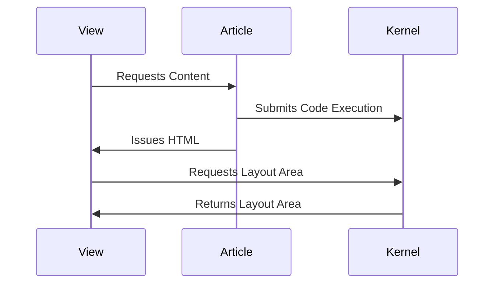

Interactive Markdown brings the spirit of [Literate Programming](https://en.wikipedia.org/wiki/Literate_Programming) — championed by [Donald Knuth](https://en.wikipedia.org/wiki/Donald_Knuth) and popularized in data science by tools like [R Markdown](https://rmarkdown.rstudio.com/) — to the MeshWeaver platform. The idea is simple: code lives alongside the prose that explains it, and that code actually runs.

## How It Works

MeshWeaver extends standard Markdown fenced code blocks with a small set of flags in the block header, much like command-line arguments. The most important flag is `--render`:

```
--render <area>
```

`area` is the name of the layout area that will be injected into the rendered document at the location of the code block. When the document loads, MeshWeaver allocates a lightweight kernel, executes the block, and streams the result back into the page.

### Displaying the Code

Two flags control whether readers see the source alongside the output:

| Flag | Effect |
|---|---|
| `--show-header` | Displays the full fenced block, including its header line |
| `--show-code` | Displays the code body only (without the header line) |

**Example — full header visible:**

```csharp --render HelloWorld --show-header
"Hello World " + DateTime.Now.ToString()
```

**Example — code visible, header hidden:**

```csharp --render HelloWorld2 --show-code
"Hello World " + DateTime.Now.ToString()
```

## Execution Pipeline

When a page containing executable blocks is opened, the following sequence runs automatically:



The kernel runs each block in document order, stores every named result as a layout area, and the Markdown component replaces each `--render` placeholder with the live output. No page reload is needed.

## Mermaid Diagrams

Mermaid diagrams are supported natively — just declare them as a fenced code block with the `mermaid` language tag. The diagram above was produced this way:

````

````

Refer to the [Mermaid documentation](https://mermaid.js.org/) for the full range of supported diagram types (flowcharts, class diagrams, Gantt charts, and more).

## Live Example

The cell below runs on page load and renders a small layout control into the document — a minimal demonstration of the `--render` + `--show-code` combination in action:

```csharp --render InteractiveMdDemo --show-code
MeshWeaver.Layout.Controls.Markdown($"**Interactive Markdown is live.** This cell executed at {DateTime.Now:HH:mm:ss} on {DateTime.Now:yyyy-MM-dd}.")
```

> **Why this matters.** Documentation that executes its own examples can never silently drift out of date — a broken example is a build failure, not a future support ticket.
