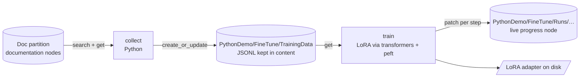

# Fine-tuning an LLM on mesh content

The mesh is not just where data lives — it is where **training data** lives. This example teaches a language model MeshWeaver by fine-tuning it on MeshWeaver's own documentation, and every artifact of the loop is a mesh node:

1. **Collect** — a Python participant queries the documentation pages over the mesh, distills each page into chat-format instruction records, and writes the JSONL back to the mesh as **a file kept in content**: `PythonDemo/FineTune/TrainingData`. The dataset is reviewable, hand-editable and versioned like any other node.
2. **Train** — Python pulls that training file from the mesh, runs a LoRA fine-tune (`transformers` + `peft`), and **streams per-step progress back onto a run node** — open it in the portal and watch the loss fall, live.



The working code is `clients/python/meshweaver/examples/finetune.py`; every mesh-facing step is pinned by `clients/python/tests/test_finetune.py` (the heavy trainer is injectable, so the orchestration is tested without `torch`).

## 1 — Collect: the docs become a dataset in content

```bash
cd clients/python
pip install -e ".[dev]"
python -m meshweaver.examples.finetune collect \
    --url https://memex.meshweaver.cloud --token mw_… \
    --query "namespace:Doc nodeType:Markdown" \
    --target PythonDemo/FineTune/TrainingData
```

`collect` runs `mesh.search(query)`, reads each hit's **full** content with `mesh.get` (search hits are summaries), and distills deterministically — no generator model in the loop:

- one record per page: *“Explain \<title> in MeshWeaver.”* → the page text,
- one record per `##` section: *“In MeshWeaver's \<title>: how does \<section> work?”* → the section text.

Each record is standard chat format, so any chat-template-aware trainer consumes it directly:

```json
{"messages": [
  {"role": "system", "content": "You are the MeshWeaver assistant. …"},
  {"role": "user", "content": "In MeshWeaver's Message Routing: how does address partitioning work?"},
  {"role": "assistant", "content": "Every hub has an address; deliveries route by target…"}
]}
```

The result is written with `mesh.create_or_update` as a Markdown node whose body carries the JSONL in a fenced block — the same *file kept in content* convention the [pandas node](../PythonPandasNode) uses for its CSV. Open `PythonDemo/FineTune/TrainingData` in the portal to review (or prune) the dataset before training on it.

## 2 — Train: pull from the mesh, stream progress back

```bash
pip install -e ".[finetune]"          # torch + transformers + peft + datasets (heavy, train-only)
python -m meshweaver.examples.finetune train \
    --url https://memex.meshweaver.cloud --token mw_… \
    --data PythonDemo/FineTune/TrainingData \
    --model Qwen/Qwen2.5-0.5B-Instruct --epochs 3
```

`train` reads the training file back off its node (`text_from_node` extracts the fenced JSONL), then LoRA-fine-tunes the base model. Two things are worth copying into your own jobs:

- **The trainer never blocks the mesh connection.** `Trainer.train()` blocks for minutes, so it runs on a worker thread (`asyncio.to_thread`); the gRPC participant connection stays responsive on the event loop.
- **Progress is a mesh write, not a log file.** A `TrainerCallback` forwards every logged step to the event loop, which patches the run node:

```python
async def report(line):
    lines.append(line)
    await mesh.patch(run_path, {"content": {"content": "\n".join(lines)}})

def on_progress(line):                      # called from the trainer thread
    asyncio.run_coroutine_threadsafe(report(f"- {line}"), loop).result()
```

The run node `PythonDemo/FineTune/Runs/<stamp>` fills up live — data + model header, one line per logged step, and a final **Succeeded** (loss, step count, adapter path) or **Failed** (the exception) verdict. Anyone watching the node in the portal sees the training as it happens; nothing is hidden in a terminal.

The adapter lands in `--output-dir` (default `./meshweaver-lora`) — load it with `peft`'s `PeftModel.from_pretrained` on top of the base model.

## Why the dataset lives in the mesh

| Property | What it buys |
|---|---|
| Reviewable | open the node, read the records, delete bad ones in the editor |
| Reproducible | the run node records exactly which data node the adapter came from |
| Shared | agents and colleagues query it like any node (`path:PythonDemo/FineTune/*`) |
| Composable | re-run `collect` after doc changes — `create_or_update` refreshes in place |

## Related

- [A pandas node in Python](../PythonPandasNode) — the same *file kept in content* convention, feeding a live DataFrame.
- [A standalone hub in Python](../PythonStandaloneHub) — the participant model this example's mesh I/O builds on.
- [Calling Python](../CallingPython) — the stateless subprocess pattern.
- [Query Syntax](../QuerySyntax) — the `--query` language `collect` uses to select the docs.
