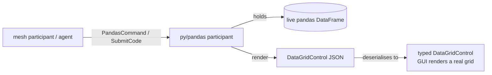
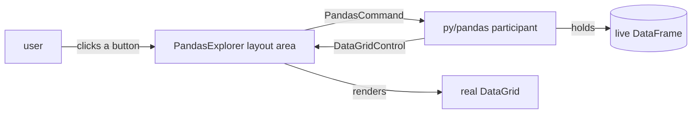

# A pandas node in Python

[Calling Python](../CallingPython) runs `python3` as a **stateless external process**: the mesh shells out, Python prints, the process dies. This page is the interactive counterpart. Here a Python process **connects to the mesh as a participant** (over gRPC, exactly like the MAUI / Blazor-WASM clients) and **owns a live object** — a `pandas.DataFrame` — that the mesh can drive over many round trips. The frame is real, long-lived Python state; the mesh creates it, mutates it, queries it, and renders its **current** state back as a genuine `DataGridControl`.

| | [Calling Python](../CallingPython) | This page |
|---|---|---|
| Python is a… | short-lived process | connected mesh **participant** (`py/pandas`) |
| State | none (fresh each call) | a **live DataFrame held in the participant** |
| Output | markdown text | a real **`DataGridControl`** (sortable, formatted) |

The working code lives in the Python client package: `clients/python/meshweaver/examples/pandas_node.py` (tests: `clients/python/tests/test_pandas_node.py`). The participant model itself is in `clients/python/README.md`.

## Two ways to control the frame

Both surfaces act on the **same** held DataFrame:

1. **Typed `PandasCommand` messages** — `load` / `append` / `reset` (mutate), `render` / `groupby` / `describe` / `rolling` (analyse). The mesh routes them to the participant's address by *target*; the message type is opaque to the mesh (it round-trips as `RawJson`), so nothing needs server-side registration.
2. **`SubmitCodeRequest`** — pandas code run against a **persistent** namespace where the frame lives as `df`. Unlike the stateless kernel worker (`meshweaver.worker.execute_python`, a fresh namespace per call), this namespace *survives* across calls, so `df["margin"] = df["sales"] - df["units"]` in one submission is visible to the next. That persistent `df` **is** "an object created and controlled in Python".



## pandas → DataGrid: the wire contract

The node never emits markdown or an HTML string. `frame_to_datagrid` maps the frame's dtypes to typed `PropertyColumnControl<T>` columns (with .NET numeric formats) and its records to JSON-safe rows — the **exact** shape `Controls.DataGrid(rows).WithColumn(new PropertyColumnControl<double>{ Property = "sales" }.WithFormat("N2"))` produces on the C# side:

```python
def _column(name, dtype):
    if pdt.is_bool_dtype(dtype):            clr, fmt = "Boolean", None
    elif pdt.is_integer_dtype(dtype):       clr, fmt = "Int64", "N0"
    elif pdt.is_float_dtype(dtype):         clr, fmt = "Double", "N2"
    elif pdt.is_datetime64_any_dtype(dtype): clr, fmt = "DateTime", "yyyy-MM-dd"
    else:                                    clr, fmt = "String", None
    col = {"$type": f"PropertyColumnControl`1[{clr}]", "property": name,
           "title": name.replace("_", " ").title()}
    if fmt is not None:
        col["format"] = fmt
    return col

def frame_to_datagrid(df):
    columns = [_column(str(n), d) for n, d in df.dtypes.items()]
    data = json.loads(df.to_json(orient="records", date_format="iso"))  # NaN→null, ints/floats, ISO dates
    return {"data": data, "columns": columns}
```

The ``$type`` for a column is the discriminator the mesh's type registry resolves to a `PropertyColumnControl<T>`: a constructed generic serialises as ``Name`1[Arg]`` (the open generic's `Type.Name` + the registered short name of the argument — `Double`, `Int64`, …). C# emits the same string with the backtick JSON-escaped as ```; both decode to the identical value.

## The participant that owns the frame

```python
class PandasNode:
    def __init__(self, connection, frame=None):
        self._c = connection
        self._df = pd.DataFrame() if frame is None else frame.copy()
        connection.serve(self.handle)          # register as the inbound handler

    async def handle(self, delivery):
        if delivery.message_type == "PandasCommand":
            await self._handle_command(delivery)
        elif delivery.message_type == "SubmitCodeRequest":
            await self._handle_code(delivery)   # runs against the PERSISTENT namespace

    def _apply(self, command, msg):
        if command == "load":     self._df = pd.DataFrame(msg.get("data") or []);            return "ack", self._summary()
        if command == "append":   self._df = pd.concat([self._df, pd.DataFrame(msg["rows"])], ignore_index=True); return "ack", self._summary()
        if command == "render":   return "grid", frame_to_datagrid(self._df)
        if command == "groupby":  return "grid", frame_to_datagrid(self._df.groupby(msg["by"]).agg(msg.get("agg","sum"), numeric_only=True).reset_index())
        if command == "rolling":
            view = self._df.copy()
            view[f"{msg['column']}_rolling_mean"] = view[msg["column"]].rolling(int(msg.get("window",3))).mean()
            return "grid", frame_to_datagrid(view)
        raise ValueError(f"unknown command '{command}'")
```

A `render` (or any analytical command) replies with the grid **as a `DataGridControl`** — `respond(delivery, "DataGridControl", payload)` — so a receiving hub deserialises it straight into `MeshWeaver.Layout.DataGrid.DataGridControl` and the Blazor / React renderer shows a live grid.

## The interactive frontend — the `PandasExplorer` node

The Python participant is the backend. **A .NET NodeType is the frontend that drives it.** `PandasExplorer` (`samples/Graph/Data/PythonDemo/PandasExplorer/`) is an ordinary mesh NodeType whose layout area (`PandasExplorerLayoutAreas.Explorer`) is a toolbar of **real framework controls** above a **live `DataGridControl`** — no hand-rolled HTML, no markdown for the data.



Every control maps to one `PandasCommand` posted to `py/pandas`; the grid then re-renders from whatever the participant returns:

| Control | Posts | Effect |
|---|---|---|
| **Load sample sales** | `load` (6 rows) | replaces the held frame, then re-renders |
| **Append 2 rows** | `append` | grows the held frame, then re-renders |
| **Group by** + text input | `groupby` (by = the typed column, default `region`) | grouped sum view |
| **Rolling mean (3)** | `rolling` (column `sales`, window 3) | adds a rolling-mean column |
| **Describe** | `describe` | descriptive statistics |
| **Refresh** | `render` | re-renders the current frame |
| **Reset** | `reset` | clears the held frame |

The whole flow is **reactive, never `async`** (a rule of the actor-model mesh): a click flips a trigger in the layout-area data store, the grid sub-area re-observes it, `Hub.Post(command, o => o.WithTarget("py/pandas"))` fires and `Hub.Observe(delivery)` awaits the reply — composed with `Timeout` + `Catch`, so the grid degrades gracefully instead of hanging. Mutations (`load`/`append`/`reset`) chain their re-render off the participant's ack, so the grid always reflects the new frame state (race-free).

**Graceful when no Python node is attached** (the default in prod / CI): the post times out or fails to route, `Catch` routes to an informative notice — *"No Python pandas node attached — run `python -m meshweaver.examples.pandas_node …`"* — plus a disabled empty grid. It never hangs and never surfaces a raw error. So the `PandasExplorer` node renders meaningfully everywhere; start the Python participant and the grid comes alive.

The frontend↔backend contract is pinned by tests in `test/MeshWeaver.Layout.Test/PandasExplorerAreaTest.cs`: driving the area against an in-process fake `py/pandas` responder, the grid renders **from the backend's `DataGridControl`**, the *Group by* button posts a real `groupby` `PandasCommand`, and the no-participant path renders the notice — all bounded, no hang.

## Can an entire node type live in Python?

Partly — and this sample shows exactly where the line is today. A MeshWeaver NodeType is three things: a **content model**, a **behaviour** (holding state, computing), and a **view** (a `UiControl` tree). The Python participant already owns the **behaviour and the state** — the live `DataFrame` *is* the node's state, controlled entirely from Python — and it even authors part of the **view** by emitting a real `DataGridControl` (not markdown). What still lives in .NET is the **layout area that wires controls to commands** and the **NodeType registration** (`WithContentType` / `AddLayout`). So the pattern is a thin C# frontend over an arbitrarily rich Python backend: the object is *created and controlled in Python*, and the .NET side is just the reactive shell that drives it and renders what it returns.

## Run it

Self-contained showcase — create a frame, append two rows over the mesh, render it, then group + roll (no mesh needed; prints the DataGrid JSON the GUI would render):

```bash
cd clients/python
pip install -e ".[dev,examples]"
scripts/gen_proto.sh
python -m meshweaver.examples.pandas_node --demo
```

Serve as a real participant other participants / agents drive over gRPC:

```bash
python -m meshweaver.examples.pandas_node --url https://memex.meshweaver.cloud --token mw_… --address py/pandas
```

## Proof it's a real grid, not markdown

The bytes `--demo` emits are checked end to end:

- **Python** (`tests/test_pandas_node.py`) — appending over the mesh grows the *held* frame (6 → 8 rows), the rendered grid reflects the mutation, and `groupby` / `rolling` compute real pandas values.
- **C#** (`test/MeshWeaver.Layout.Test/PandasDataGridWireTest.cs`) — those **exact captured bytes** deserialise, through the mesh's own `JsonSerializerOptions`, into a real `DataGridControl` whose columns are typed `PropertyColumnControl<string>` / `<double>` / `<long>` carrying `N2` / `N0` formats, over 8 data rows. Same wire contract a hand-written C# `Controls.DataGrid(...)` produces.

## Related

- [Calling Python](../CallingPython) — the stateless process pattern (a layout area shells out to `python3`).
- [Controlled I/O Pooling](/Doc/Architecture/ControlledIoPooling) — why the C# side bridges every async/blocking edge through `IIoPool`.
- [Query Syntax](../QuerySyntax) — the query language a participant uses to find nodes to feed a frame.
