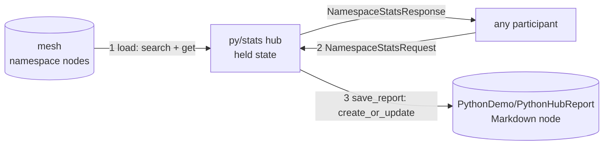

# A standalone hub in Python

A hub on the mesh is three things: an **address** deliveries route to, **message handlers** keyed by message type, and **state** the handlers own. None of that is .NET-specific — this page programs a complete hub in Python, connects it to the mesh over gRPC, and runs the full read–compute–serve–write loop from there. There is no C# in this example at all.

The working code is `clients/python/meshweaver/examples/standalone_hub.py` (tests: `clients/python/tests/test_standalone_hub.py`).

## The hub programming model, in Python

`PyHub` is the in-language mirror of the C# `MessageHubConfiguration`:

| C# hub | Python hub |
|---|---|
| `WithHandler<TRequest>((hub, req) => …)` | `hub.register("TRequest", handler)` |
| `hub.Post(response, o => o.ResponseFor(request))` | return `("TResponse", payload)` from the handler |
| `hub.Observe<TResponse>(request, o => o.WithTarget(addr))` | `await connection.observe(addr, "TRequest", {...})` |
| `hub.Post(message, o => o.WithTarget(addr))` | `await connection.post(addr, "TMessage", {...})` |
| single-threaded action block | the connection's read loop serialises dispatch |
| errors forward to the caller, never wedge | a raising handler answers `ErrorResponse` |

```python
class PyHub:
    def __init__(self, connection):
        self._c = connection
        self._handlers = {}
        connection.serve(self.handle)              # register as the inbound dispatcher

    def register(self, message_type, handler):     # the C# WithHandler<T>
        self._handlers[message_type] = handler
        return self

    async def handle(self, delivery):
        handler = self._handlers.get(delivery.message_type)
        if handler is None:
            return                                  # not ours — ignore quietly
        try:
            reply = await handler(delivery)
        except Exception as ex:                     # errors PROPAGATE — the hub never wedges
            await self._c.respond(delivery, "ErrorResponse", {"error": f"{type(ex).__name__}: {ex}"})
            return
        if reply is not None:
            await self._c.respond(delivery, *reply) # correlated response to the sender
```

The message types are the hub's own protocol — unregistered on the mesh, they round-trip as `RawJson` and route purely by target address, so a Python hub needs **no server-side registration** to define its surface.

## The working hub: load → serve → save

`NamespaceStatsHub` puts state and mesh I/O on that skeleton. It owns one namespace's worth of knowledge:



1. **Load info from the mesh** — on start the hub reads every node of its namespace into hub state: `mesh.search(f"namespace:{ns}")`, then `mesh.get(path)` per hit for full content.
2. **Serve** — `NamespaceStatsRequest` answers with statistics over the held state (node count, per-nodeType counts, words of content); `ReloadRequest` re-reads the namespace first. Any mesh participant — a C# hub, an agent, another Python process — can `observe` these.
3. **Save info back to the mesh** — `save_report()` writes the computed statistics as a readable Markdown node, `{namespace}/PythonHubReport`, via `mesh.create_or_update`. The hub's knowledge is itself mesh content, browsable in the portal.

```python
class NamespaceStatsHub(PyHub):
    def __init__(self, connection, mesh, namespace):
        super().__init__(connection)
        self._mesh, self.namespace, self.nodes = mesh, namespace, []
        self.register("NamespaceStatsRequest", self._on_stats)
        self.register("ReloadRequest", self._on_reload)

    async def load(self):                                   # mesh -> Python
        hits = await self._mesh.search(f"namespace:{self.namespace}", limit=500)
        self.nodes = [await self._mesh.get(h["path"]) for h in hits]
        return self.stats()

    async def _on_stats(self, delivery):                    # the served surface
        return "NamespaceStatsResponse", self.stats()

    async def save_report(self):                            # Python -> mesh
        await self._mesh.create_or_update({... "nodeType": "Markdown", ...})
```

## Run it

Self-contained showcase (no mesh needed — an in-memory namespace stands in):

```bash
cd clients/python
pip install -e ".[dev]"
scripts/gen_proto.sh
python -m meshweaver.examples.standalone_hub --demo
```

Attach to a live mesh:

```bash
python -m meshweaver.examples.standalone_hub \
    --url https://memex.meshweaver.cloud --token mw_… \
    --namespace PythonDemo --address py/stats
```

> **Transport note.** The participant connection is bidirectional gRPC (HTTP/2) at the ordinary
> portal URL — the deployment routes `meshweaver.v1.Mesh/Open` natively (helm `values.grpc`; a
> same-host ingress path proxies it to the portal's dedicated h2c port with `backend-protocol:
> GRPC`, so no extra DNS or certs). All three hosted portals serve it. For a self-signed local
> portal pass the CA to `connect(..., root_certificates=...)`.
>
> **Trusted gates.** A service that ships *in the same deployment* as the portal (the co-located
> node / bun / python gates) connects to the **trusted loopback endpoint** instead —
> `http://127.0.0.1:8082` inside the pod. Reachability is the authentication (only same-pod
> containers share loopback): no API token, nothing to rotate. Deliveries from a trusted gate may
> carry the requesting user's `AccessContext` through (the SDK's `respond`/`post` echo it), so the
> gate acts under that user's identity — exactly like the in-process C# kernel. External
> participants keep using API tokens and are always re-stamped server-side.

The hub loads the namespace, writes `PythonDemo/PythonHubReport` (open it in the portal), and then serves requests until stopped. Drive it from any other participant:

```python
resp = await connection.observe("py/stats", "NamespaceStatsRequest", {})
print(resp.message["nodeCount"])
```

Identity works like every participant: the API token is validated server-side and every write the hub makes is stamped with that identity — a Python hub is subject to exactly the same access control as any user or C# hub.

## Where the other Python patterns fit

| Pattern | What Python is | Page |
|---|---|---|
| Shell out to `python3` from a layout area | a short-lived subprocess | [Calling Python](../CallingPython) |
| Python worker executing `python` Code nodes | the mesh kernel's Python half | `Doc/Architecture/PythonCodeNodes` |
| Live pandas DataFrame behind a C# GUI | a stateful backend participant | [A pandas node in Python](../PythonPandasNode) |
| Fine-tune an LLM on mesh content | a batch job with mesh-visible progress | [Fine-tuning an LLM on mesh content](../PythonFineTuning) |
| **A complete hub — this page** | **a first-class mesh hub** | — |

## Related

- [A pandas node in Python](../PythonPandasNode) — a Python participant behind a C# frontend.
- [Fine-tuning an LLM on mesh content](../PythonFineTuning) — mesh-orchestrated Python batch work.
- [Query Syntax](../QuerySyntax) — the query language `load()` uses.
