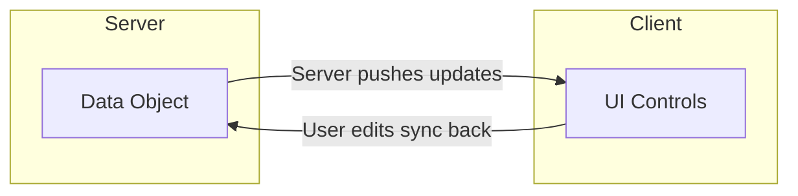
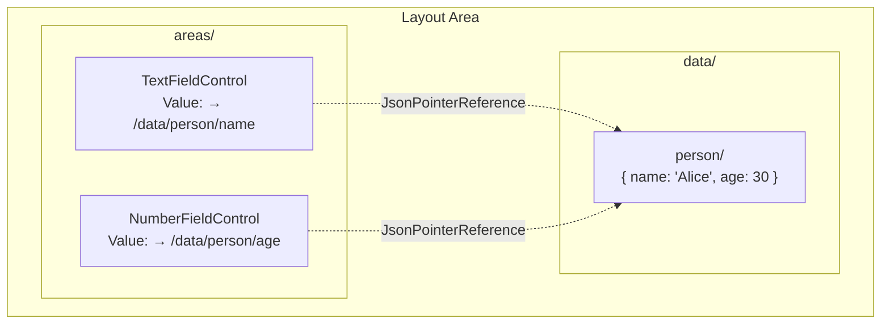
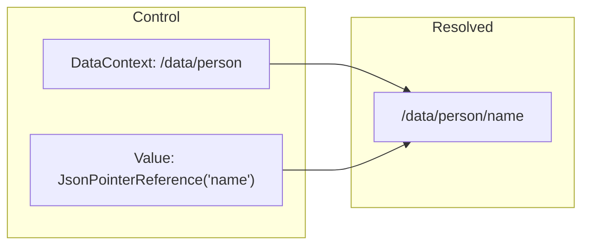
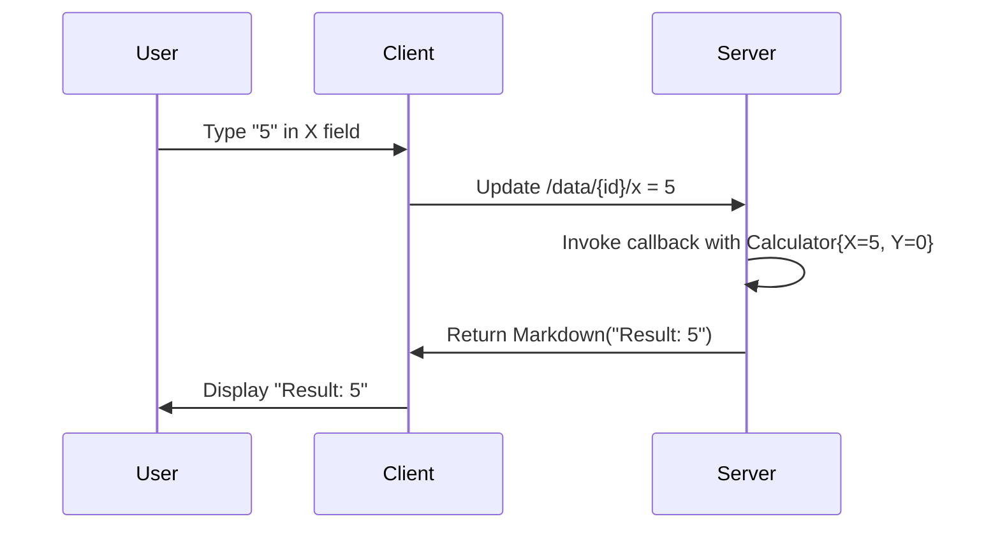

Data binding in MeshWeaver connects your data objects to UI controls reactively and bidirectionally. The server pushes updates to the GUI; user edits flow back to the server. The whole pipeline is **live** — when the underlying node changes anywhere in the mesh, every subscribed view re-renders without a page refresh.



---

# The Golden Rule: the GUI is fully data-bound

> **🚨 Backend layout areas declare *what* to render — they never fetch instances and never put concrete values into controls.** All value resolution, every read of a `MeshNode`'s content, and every write-back of user input happens on the GUI side via a per-node `IMeshNodeStreamCache` subscription.

This is non-negotiable, for three reasons:

1. **No deadlocks.** Backend rendering stays purely synchronous — no `await`, no `Task<T>`, no `IAsyncEnumerable`. Every `async`/`await`/`QueryAsync` chain put in a layout area has eventually deadlocked the hub or returned stale content. Removing the backend fetch removes the entire problem class.
2. **Live updates.** The GUI subscription stays open for the lifetime of the component. Backend-loaded values freeze on first render; cache-subscribed views never go stale.
3. **CQRS-correct reads.** `Hub.GetMeshNodeStream(path)` (backed by the process-wide `IMeshNodeStreamCache`) is the **authoritative** read path — it goes to the owning hub's workspace, never through the lagged read-side index. See [CQRS — Queries, Reads, Writes, Operations](/Doc/Architecture/CqrsAndContentAccess).

## Responsibility split

| Side | Responsibility |
|---|---|
| **Backend layout area** | Build a `UiControl` tree. Pass *paths* (or `JsonPointerReference`s) into controls. Never call `meshQuery.QueryAsync(...)`, never `await` data, never `await PermissionHelper.GetEffectivePermissions(...)` (compose its `IObservable<Permission>` with `CombineLatest` instead). |
| **GUI Blazor view (.razor.cs)** | Hold an `IMeshNodeStreamCache` field. In `BindData()`, subscribe via `_cache.GetStream(NodePath)` using `AddBinding(...)`. Write user edits back via `_cache.Update(NodePath, fn)`. |

---

## Backend: declare the binding, don't fetch the data

```csharp
// ❌ ANTI-PATTERN — backend loads node, builds control with concrete values
var userNode = await meshQuery.QueryAsync<MeshNode>($"path:{userPath}").FirstOrDefaultAsync();
var card = MeshNodeThumbnailControl.FromNode(userNode, userPath);

// ✅ CORRECT — backend declares the binding path; GUI loads + displays
var card = new MeshNodeThumbnailControl { NodePath = userPath };
```

The backend layout-area method **must not** be `async Task<UiControl>`. Return `UiControl` directly. If it needs to rebuild reactively on workspace changes, return `IObservable<UiControl?>` and compose with `Observable.Return` / `Select` — never `SelectMany(async ...)`, never `await`.

---

## GUI: subscribe via the cache, re-render on emission

The canonical Blazor view template — all reads go through the process-wide `IMeshNodeStreamCache`. Multiple views on the same path share **one** upstream subscription; writes through `_cache.Update(path, fn)` are visible to every reader.

> **Access-checked.** `cache.GetStream(path)` is gated by the current user's effective Read permission on the node. The cache asks the owning hub via `GetPermissionRequest`, caches the answer per `(path, userId)` for 30 s, and terminates the observable with `UnauthorizedAccessException` if Read is not granted. Subscribers should handle that error (toast, navigate to AccessDenied, render empty state) rather than letting it propagate. See [AccessContextPropagation.md](/Doc/Architecture/AccessContextPropagation).

```csharp
public partial class MyView : BlazorView<MyControl, MyView>
{
    private IMeshNodeStreamCache? _cache;
    public string? Title { get; private set; }
    public string? ImageUrl { get; private set; }

    protected override void BindData()
    {
        base.BindData();

        // 1. Declare bindings from the control's own properties (DataContext / refs)
        DataBind(ViewModel.NodePath, x => x.NodePath);

        if (string.IsNullOrEmpty(NodePath)) return;

        // 2. Resolve the cache — singleton on the mesh hub's service provider
        _cache = Hub.ServiceProvider.GetRequiredService<IMeshNodeStreamCache>();

        // 3. Subscribe — every emission re-renders this component
        AddBinding(_cache.GetStream(NodePath)
            .Where(node => node is not null)
            .DistinctUntilChanged()
            .Subscribe(node =>
            {
                Title = node.Name;
                ImageUrl = MeshNodeThumbnailControl.GetImageUrlForNode(node);
                InvokeAsync(StateHasChanged);
            }));
    }
}
```

Key points to remember:

- `_cache` is a **field**, not a local. Writers call `_cache.Update(NodePath, fn)` to push edits; the cache routes through the same shared handle so the read subscription receives the echo.
- `AddBinding(...)` registers the subscription with the base class — it auto-disposes on component teardown. The cache's upstream handle stays alive for the process.
- **No `.Take(1)`** — that snapshots once and the view freezes. Stay subscribed for the lifetime of the component.
- **Never** open `workspace.GetRemoteStream<MeshNode, MeshNodeReference>(addr, ...)` directly in a Blazor view. That bypasses the cache; writes through the cache won't be observed by views that went around it.
- No `try`/`catch` swallowing — let errors propagate via `Subscribe(onNext, onError)` or the framework's binding error handler.

---

## Writing user edits back

The same `_cache` is the write path. Its `Update` takes a `MeshNode → MeshNode` lambda and returns `IObservable<MeshNode>` — subscribe to observe completion or errors:

```csharp
private void OnTitleChanged(string newTitle)
{
    if (_cache == null || string.IsNullOrEmpty(NodePath)) return;
    _cache.Update(NodePath, current => current with { Name = newTitle })
        .Subscribe(_ => { }, ex => Logger.LogWarning(ex,
            "Title update failed for {Path}", NodePath));
}
```

Because the write routes through the **same shared upstream handle** every reader is subscribed to:

1. The owning hub applies the patch and persists.
2. This view's `_cache.GetStream(NodePath)` subscription receives the echo and re-renders.
3. Every other GUI watching the same path sees the patch through their own subscription.

No separate `DataChangeRequest` is needed for own-node edits inside a bound view.

> **Server-side mirror.** The same rule holds server-side: every mesh-node mutation goes through `workspace.GetMeshNodeStream(path).Update(...)` — which internally routes through the same `IMeshNodeStreamCache`. State machines (compile, thread execution, satellite operations) flip a `RequestedX` field on the node's content; the owning hub's watcher reacts. Full reference: **[Requesting Work via stream.Update()](/Doc/Architecture/RequestViaStreamUpdate)**.

---

# 🚨 ABSOLUTE: edit node content by binding to the node stream — NEVER replicate into `/data` + a save subscription

**Editing a mesh node's content means binding the GUI client to the node's own stream and writing edits straight back to it.** There is exactly ONE source of truth — `Hub.GetMeshNodeStream(path)` (the process-wide `IMeshNodeStreamCache`). Reads come from it; edits write back through `GetMeshNodeStream(path).Update(...)`.

**The forbidden antipattern** (it has appeared in many editors and must not be added to new ones):

```csharp
// ❌ FORBIDDEN — replicate-then-save. Two sources of truth glued by a debounced loop.
host.UpdateData(dataId, node.Content);                          // 1. copy the node into a /data replica
// ... controls bound to /data/{dataId} ...                      // 2. edit the replica
host.Stream.GetDataStream<object>(dataId)                        // 3. a SERVER-SIDE save subscription
    .Debounce(...).Subscribe(c => GetMeshNodeStream(path).Update(n => n with { Content = c }));
```

Why it's wrong: the `/data/{id}` copy and the node stream are two stores that drift (an out-of-band write to the node — e.g. a status field — never reaches the replica), and the debounced `Subscribe(...Update...)` is a hidden save loop that fires spurious writes, races the echo, and clobbers fields it didn't edit. **`OverviewLayoutArea.SetupAutoSave` is this antipattern; do not call it and do not write your own variant** (`SetupNodeMetadataAutoSave`, `SetupNodeTypeConfigAutoSave`, a hand-rolled `GetDataStream(id).Throttle().Subscribe(...Update...)`, or a "Save" button that reads `/data` and writes the node).

**The correct pattern — a node-bound editor.** The backend layout area only DECLARES the editor with a node path; a Blazor view binds it to the node stream:

```csharp
// ✅ Backend layout area — declare the binding, compute the fields from the content type:
stack.WithView(MeshNodeContentEditorControl.ForType(nodePath, typeof(MyContent)));

// ✅ The Blazor view (the ONLY place reads/writes live) — bind to the node stream:
AddBinding(Hub.GetMeshNodeStream(NodePath)
    .Where(n => n is not null)
    .Subscribe(node => { LoadValues(node); InvokeAsync(StateHasChanged); }));   // reads

// edit -> per-field read-modify-write straight to the node (set ONLY the edited field):
Hub.GetMeshNodeStream(NodePath)
    .Update(node => node with { Content = PatchOneField(node.Content, key, value) })
    .Subscribe(_ => { }, ex => Logger.LogWarning(ex, "persist failed for {Path}", NodePath));
```

No `/data` replica, no `SetupAutoSave`, no Save button, no debounce-and-save subscription. `MeshNodeContentEditorControl` (control in `MeshWeaver.Graph`, view `MeshNodeContentEditorView` in `MeshWeaver.Blazor`) is the reusable generic editor for simple scalar/bool content. For rich content (markdown, mesh-node picking) use the dedicated already-node-bound controls — `MarkdownEditorControl.WithAutoSave(hubAddress, nodePath)` (writes via the cache), `MeshNodePickerControl`, `CollaborativeMarkdownView`. Reference editor: `MeshNodeEditorView` (`MeshWeaver.Blazor.Graph`) via the `MeshNodeEditor`/`IMeshNodeEditor` client wrapper.

The same rule covers create-on-absent: a node the editor binds to must EXIST first — create it with `meshService.CreateNode(...)` (read existence via `GetQuery`, empty-on-absent), NEVER `GetMeshNodeStream(path).Update` on an absent path (it NotFound-storms).

## Node-bound `DataContext` — reuse the rich form-gen, bound to the node

For a RICH editor (text + number + checkbox + markdown + `[MeshNode]` picker + `[Dimension]` select), you don't hand-roll controls — you let the framework's form generator (`EditLayoutArea.BuildPropertyForm` / `MapToToggleableControl` / the `Edit` macro) build them, then point their **`DataContext` at the node** instead of a `/data/{id}` replica. The generated controls then read each field straight from the node stream and write each edit straight back — ONE source of truth, no replica, no save subscription.

Encode the node-bound DataContext with `LayoutAreaReference.GetMeshNodeDataContext(...)`:

```csharp
// Field pointers resolve against the node's Content JSON (content-typed editors):
var ctx = LayoutAreaReference.GetMeshNodeDataContext(node.Path);                    // bindContent: true (default)

// Field pointers resolve against the WHOLE node JSON — for top-level fields
// (Name / Description / Icon / Category / Order — the "metadata" editors):
var ctx = LayoutAreaReference.GetMeshNodeDataContext(node.Path, bindContent: false);

// …optionally nested one level deeper (e.g. a Thread's inline composer object):
var ctx = LayoutAreaReference.GetMeshNodeDataContext(node.Path, bindContent: false, subPath: "content/composer");

// Pass it to the standard form generator (or set it as a control's DataContext directly):
stack.WithView(EditLayoutArea.BuildContentView(host, new ContentViewOptions {
    DataId = dataId, ContentType = contentType, CanEdit = canEdit, BoundDataContext = ctx }));
```

Mechanics (so you know what's load-bearing):

- The encoding is a reserved DataContext shape `/$meshNode/{base64url(path)}/{c|n}[/base64url(subPath)]` (`LayoutAreaReference.MeshNodePrefix`). It carries no `/`, `.`, or `%9Y`, so it survives the `DispatchView` decode hop and JSON-pointer parsing untouched.
- The GUI seams `BlazorView.DataBind` (read) and `BlazorView.UpdatePointer` (write) branch on it: reads come from `Hub.GetMeshNodeStream(path)` and writes are a per-field read-modify-write through `.Update(...)` that touches ONLY the edited field (see `MeshNodeBinding`). Every form control inherits this automatically — `TextField`, `NumberField`, `CheckBox`, `DateTime`, `Select`, `MeshNodePicker`, `MarkdownEditor`, `Code`.
- Field-pointer resolution against the node is **case-insensitive**, so a metadata DTO's PascalCase pointer (`Name`, `Description`) and a content editor's camelCase pointer (`harness`, `messageContent`) both bind without the layout area knowing the JSON casing.
- **Edit-state stays in `/data`.** The click-to-edit toggle (`editState_…`) is transient view state, not node content — it is never written to the node. Only field VALUES are node-bound.
- A few read-only display controls (the `[Dimension]` / options / formatted-date toggle *labels*) derive their text from the layout-area `/data` stream rather than a value pointer. When you node-bind a toggleable form, keep `/data/{dataId}` as a **one-way live projection** of the node content (`GetMeshNodeStream(path).Select(n => n.Content).Subscribe(c => host.UpdateData(dataId, c))`) so those labels stay correct. This is a pure read mirror — it follows the node, has no save loop, and never writes back, so it is NOT the forbidden replicate-then-save pattern.

## Anti-patterns — never do these

| ❌ Wrong | Why | ✅ Right |
|---|---|---|
| `await meshQuery.QueryAsync<MeshNode>($"path:{x}").FirstOrDefaultAsync()` in a layout area | Lagged index, deadlock-prone, freezes view | Pass path; GUI subscribes via `IMeshNodeStreamCache.GetStream(path)` |
| `SelectMany(async nodes => await ...)` for data resolution | async lambda inside an observable chain — same deadlock surface | Pass paths; bind in GUI via the cache |
| `MeshNodeThumbnailControl.FromNode(loadedNode, ...)` after a backend fetch | Concrete values frozen at render time | `new MeshNodeThumbnailControl { NodePath = path }` |
| `.Take(1)` on a display stream | View stops updating after first emission | Stay subscribed for the lifetime of the component |
| `await PermissionHelper.GetEffectivePermissions(...).FirstAsync()` in a layout area | Hub deadlock candidate | Compose the `IObservable<Permission>` via `CombineLatest`; bind permissions on the GUI side |
| `try { ... } catch { /* swallowed */ }` around backend reads | Errors disappear, debugging impossible | Propagate via `OnError`; framework handles it |
| `workspace.GetRemoteStream<MeshNode, MeshNodeReference>(addr, ...)` directly in a Blazor view | Opens a per-view upstream handle; bypasses `IMeshNodeStreamCache`; multiplies subscriptions; writes through the cache aren't observed | `Hub.ServiceProvider.GetRequiredService<IMeshNodeStreamCache>().GetStream(path)` — shared, write-coherent |
| `host.UpdateData(id, node.Content)` + `GetDataStream(id).Debounce().Subscribe(...GetMeshNodeStream(path).Update...)` to edit node content (a.k.a. `SetupAutoSave`) | Replicate-then-save: two stores drift, the save loop races the echo and clobbers unedited fields | `MeshNodeContentEditorControl.ForType(path, typeof(T))` — the GUI view binds to `GetMeshNodeStream(path)` and writes per-field via `.Update(...)`; no replica, no save subscription |
| A "Save" button that reads `/data/{id}` and writes the node | The edit should already be on the node via the bound stream | Node-bound editor; edits persist on change through `GetMeshNodeStream(path).Update(...)` |

---

## Where to look for working examples

- **`src/MeshWeaver.Blazor/Components/MeshNodeThumbnailView.razor`** — the minimal read-only reference: one `IMeshNodeStreamCache.GetStream(NodePath)` subscription.
- **`src/MeshWeaver.Blazor/Components/CollaborativeMarkdownView.razor.cs`** — read + write reference: cache subscription for the markdown body; `_cache.Update(BoundNodePath, fn)` to push edits.
- **`src/MeshWeaver.Blazor/Components/MarkdownEditorView.razor`** — auto-save via `_cache.Update` from a debounced editor stream; canonical write-path pattern.
- **`src/MeshWeaver.Blazor/Components/ThreadMessageBubbleView.razor.cs`** — multiple sub-fields (Text, ToolCalls, UpdatedNodes, Role) extracted from `node.Content` as `JsonElement` inside the cache `Subscribe(...)`.
- **`src/MeshWeaver.Blazor/BlazorView.razor.cs`** — the base class. Key API: `AddBinding`, `DataBind<T>`, `BindData()` lifecycle.

---

# Layout Area Structure

A layout area has two conceptual sections: **areas** (the rendered UI controls) and **data** (the bound objects). Controls reference data locations using `JsonPointerReference`.



When the user types in the `TextFieldControl`, the value at `/data/person/name` updates. When server code calls `UpdateData(...)`, every bound control reflects the new value automatically.

---

# DataContext

`DataContext` sets the base path for data binding. All `JsonPointerReference` values are resolved relative to it.

```csharp
// EditorControl with DataContext pointing to /data/person
new EditorControl { DataContext = "/data/person" }
```

When you call `Edit(instance, "person")`, the data is stored at `/data/person` and the generated controls automatically receive `DataContext = "/data/person"`.

---

# JsonPointerReference

`JsonPointerReference` points a control's value to a location in the data section. The pointer is **relative to DataContext**:

```csharp
// TextFieldControl bound to the "name" property
new TextFieldControl(new JsonPointerReference("name"))

// NumberFieldControl bound to the "age" property
new NumberFieldControl(new JsonPointerReference("age"))
```

With `DataContext = "/data/person"`:

- `JsonPointerReference("name")` resolves to `/data/person/name`
- `JsonPointerReference("age")` resolves to `/data/person/age`



---

# Updating Data from the Server

To push new data to bound controls from server code, use `UpdateData`:

```csharp
// Push new data to the stream — all bound controls update automatically
host.UpdateData("person", new Person { Name = "Bob", Age = 25 });
```

This updates `/data/person`, and every control bound to that path reflects the change immediately.

---

# The Edit Macro

`Edit` is the fastest way to create a data-bound editor. It inspects the object's properties and generates the appropriate controls automatically — no manual `JsonPointerReference` wiring required.

```csharp
// Creates a fully bound editor for a Calculator record
host.Hub.Edit(new Calculator(), "calc");
```

## Property-to-control mapping

| Property Type | Generated Control |
|---|---|
| `double`, `int`, numeric types | `NumberFieldControl` |
| `string` | `TextFieldControl` |
| `DateTime` | `DateTimeControl` |
| `bool` | `CheckBoxControl` |
| `[Dimension<T>]` | `SelectControl` (options from workspace) |
| `[UiControl<T>]` | Custom control specified by the attribute |

## Example

```csharp
public record Calculator
{
    [Description("The X value")]
    public double X { get; init; }

    [Description("The Y value")]
    public double Y { get; init; }
}

// Produces an EditorControl with two NumberFieldControls
// bound to /data/calc/x and /data/calc/y
host.Hub.Edit(new Calculator(), "calc");
```

## Live demo

The cell below shows the property-type mapping in action — a `Calculator` record rendered as a table of controls, with a computed result:

```csharp --render EditMacroDemo --show-code
var rows = new[]
{
    ("X", "double", "NumberFieldControl", "/data/calc/x"),
    ("Y", "double", "NumberFieldControl", "/data/calc/y"),
};

var header = "<tr><th>Property</th><th>Type</th><th>Generated Control</th><th>Bound path (DataContext = /data/calc)</th></tr>";
var body = string.Join("", System.Linq.Enumerable.Select(rows, r =>
    $"<tr><td><code>{r.Item1}</code></td><td><code>{r.Item2}</code></td><td><code>{r.Item3}</code></td><td><code>{r.Item4}</code></td></tr>"));

MeshWeaver.Layout.Controls.Html($"<table>{header}{body}</table>")
```

---

# Edit with a Result Callback

Add a result callback to compute derived values whenever user input changes:

```csharp
// Editor that displays X + Y as the user types
host.Hub.Edit(new Calculator(), c => Controls.Markdown($"Result: {c.X + c.Y}"));
```

This creates:
1. Editor controls for X and Y (bound to `/data/{id}/x` and `/data/{id}/y`)
2. A result area that recalculates whenever either value changes



---

# Two-Way Sync Details

Changes travel as JSON Patch (RFC 6902) for efficient delta updates:

```json
[{"op": "replace", "path": "/data/calc/x", "value": 5}]
```

- **Client → Server**: User edits create patches sent to the server.
- **Server → Client**: Server updates create patches sent to all subscribed clients.

---

# Control-Specific Bindings

## Dimension Attribute

Properties marked `[Dimension]` generate a `SelectControl` whose options are loaded from the workspace:

```csharp
public record MyForm
{
    [Dimension<Country>]
    public string CountryCode { get; init; }
}
```

## Custom Control Attribute

Use `[UiControl<T>]` to override which control type is generated for a property:

```csharp
public record MyForm
{
    [UiControl<RadioGroupControl>(Options = new[] { "chart", "table" })]
    public string DisplayMode { get; init; }

    [UiControl<TextAreaControl>]
    public string Notes { get; init; }
}
```

---

# Best Practices

1. **Use records.** Immutable records with `init` properties work best for data binding.
2. **Add metadata.** `[Description]` and `[Display]` attributes improve generated UIs.
3. **Prefer `Edit` for forms.** Let `Edit` generate controls automatically — write `JsonPointerReference` by hand only for non-standard layouts.
4. **Use callbacks for computed values.** The result-callback pattern is the right way to derive values from user input.
5. **Never fetch in the backend.** Pass paths; subscribe in the GUI. See [The Golden Rule](#the-golden-rule-the-gui-is-fully-data-bound) above.
