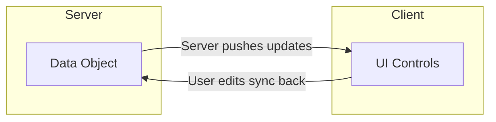
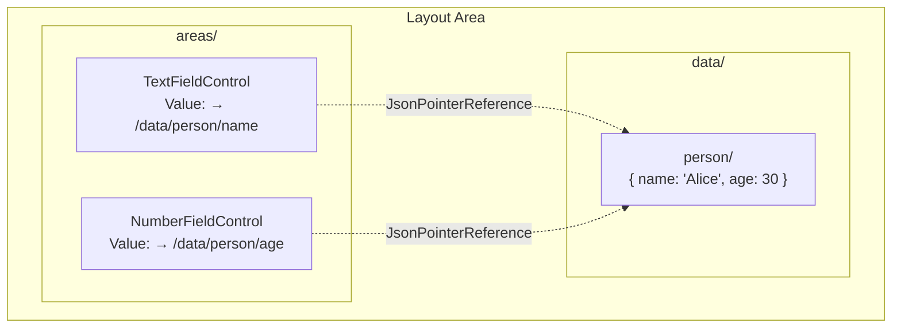
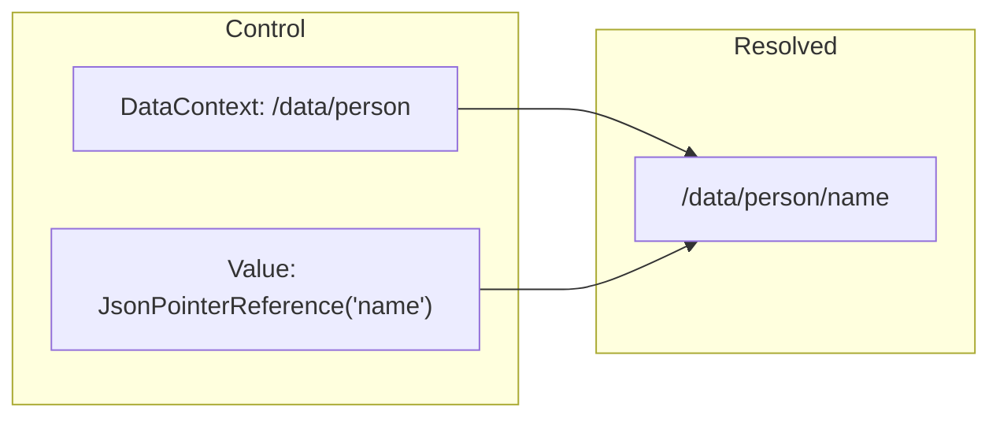
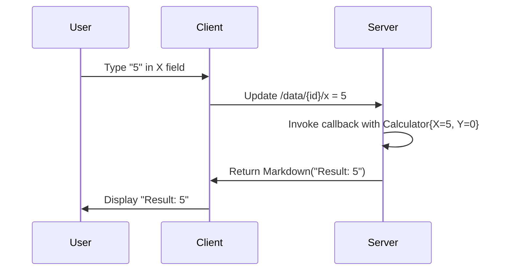

Data binding connects your data objects to UI controls. You bind an object to the UI, the user edits it, and changes sync back to the server. The binding is **two-way**: the server can push updates to the UI, and user input flows back to the server.



# 🚨 The GUI is fully data-bound (read this first)

**Backend layout areas declare *what* to render — they never load instances and they never put concrete values into controls.** All value resolution, every read of a `MeshNode`'s content, and every write-back of user input happens on the GUI side via a per-node `GetRemoteStream<MeshNode, MeshNodeReference>` subscription.

This is non-negotiable, for three reasons:

1. **No deadlocks.** Backend rendering stays purely synchronous (no `await`, no `Task<T>`, no `IAsyncEnumerable`). Every async/await/QueryAsync chain we've put in a layout area has eventually deadlocked the hub or returned stale content. Removing the backend fetch removes the entire problem class.
2. **Live updates.** The GUI subscription stays subscribed for the lifetime of the component. When the underlying node changes anywhere in the mesh, the view re-renders without a refresh. Backend-loaded values freeze on first render.
3. **CQRS-correct.** `GetRemoteStream<MeshNode, MeshNodeReference>(addr, new MeshNodeReference())` is the **authoritative** read path — it goes to the owning hub's workspace, never through the lagged read-side index. See [CQRS — Queries, Reads, Writes, Operations](xref:Architecture/CqrsAndContentAccess).

## The contract

| Side | Responsibility |
|---|---|
| **Backend layout area** | Build a `UiControl` tree. Pass *paths* (or `JsonPointerReference`s) into controls. Never call `meshQuery.QueryAsync(...)`, never `await` data, never `await` `PermissionHelper.GetEffectivePermissions(...)` (compose its `IObservable<Permission>` with `CombineLatest` instead) to gate rendering. |
| **GUI Blazor view (.razor.cs)** | Hold an `ISynchronizationStream<MeshNode>` field. In `BindData()`, set it to `workspace.GetRemoteStream<MeshNode, MeshNodeReference>(new Address(path), new MeshNodeReference())`. Subscribe via `AddBinding(...)` and call `InvokeAsync(StateHasChanged)` on emissions. Write user edits back via `_nodeStream.Update(current => ...)`. |

## Backend: declare-only, no fetch

```csharp
// ❌ ANTI-PATTERN — backend loads node, builds control with concrete values
var userNode = await meshQuery.QueryAsync<MeshNode>($"path:{userPath}").FirstOrDefaultAsync();
var card = MeshNodeThumbnailControl.FromNode(userNode, userPath);

// ✅ CORRECT — backend declares the binding, GUI loads + displays
var card = new MeshNodeThumbnailControl { NodePath = userPath };
```

The backend layout-area method **must not** be `async Task<UiControl>`. Return `UiControl` directly. If it needs to reactively rebuild on workspace changes, return `IObservable<UiControl?>` and use `Observable.Return` / `Select` only — no `SelectMany(async ...)`, no `await`.

## GUI: subscribe via the cache, re-render on emission

The canonical Blazor view template — all reads go through the process-wide
`IMeshNodeStreamCache`. Multiple views on the same path share ONE upstream
subscription; writes through `cache.Update(path, fn)` are visible to every
reader.

> **Access-checked.** `cache.GetStream(path)` is gated by the current user's
> effective Read permission on the node — the cache asks the owning hub via
> `GetPermissionRequest`, caches the answer per `(path, userId)` for 30 s,
> and terminates the returned observable with
> `UnauthorizedAccessException` if Read is not granted. Subscribers should
> handle that error (toast, navigate to AccessDenied, render empty state)
> rather than letting it propagate. See
> [AccessContextPropagation.md](../Architecture/AccessContextPropagation.md).

```csharp
public partial class MyView : BlazorView<MyControl, MyView>
{
    private IMeshNodeStreamCache? _cache;
    public string? Title { get; private set; }
    public string? ImageUrl { get; private set; }

    protected override void BindData()
    {
        base.BindData();

        // 1. Declare bindings from the control's own properties (DataContext / refs)
        DataBind(ViewModel.NodePath, x => x.NodePath);

        if (string.IsNullOrEmpty(NodePath)) return;

        // 2. Resolve the cache — singleton on the mesh hub's service provider
        _cache = Hub.ServiceProvider.GetRequiredService<IMeshNodeStreamCache>();

        // 3. Subscribe — every emission re-renders this component
        AddBinding(_cache.GetStream(NodePath)
            .Where(node => node is not null)
            .DistinctUntilChanged()
            .Subscribe(node =>
            {
                Title = node.Name;
                ImageUrl = MeshNodeThumbnailControl.GetImageUrlForNode(node);
                InvokeAsync(StateHasChanged);
            }));
    }
}
```

Key points:
- `_cache` is a **field**, not a local. Writers (see "Writing user edits back" below) call `_cache.Update(NodePath, fn)` to push edits; the cache routes through the same shared handle, so the read subscription receives the echo.
- `AddBinding(...)` registers the subscription with the base class — it auto-disposes on component teardown. The cache's upstream handle stays alive for the process.
- **No `.Take(1)`** — that snapshots once and the view freezes. Stay subscribed.
- No `try`/`catch` swallowing — let errors propagate; they surface in `Subscribe(onNext, onError)` or in the framework's binding error handler.
- **Never** open `workspace.GetRemoteStream<MeshNode, MeshNodeReference>(addr, ...)` directly. That bypasses the cache; writes through the cache won't be observed.

## Writing user edits back

The same `_cache` is the write path. The cache's `Update` takes a simple
`MeshNode → MeshNode` lambda and returns `IObservable<MeshNode>` (subscribe to
observe completion / errors):

```csharp
private void OnTitleChanged(string newTitle)
{
    if (_cache == null || string.IsNullOrEmpty(NodePath)) return;
    _cache.Update(NodePath, current => current with { Name = newTitle })
        .Subscribe(_ => { }, ex => Logger.LogWarning(ex,
            "Title update failed for {Path}", NodePath));
}
```

The cache routes the patch through the SAME shared upstream handle every reader is subscribed to, so:
- The owning hub applies the patch and persists.
- This view's `_cache.GetStream(NodePath)` subscription receives the echo and re-renders.
- Every other GUI watching the same path sees the patch through their own subscription on the same handle.

No separate `DataChangeRequest` needed for own-node edits inside a bound view.

> **Server-side mirror.** The same rule holds on the server: every mesh-node mutation goes through `workspace.GetMeshNodeStream(path).Update(...)` (which internally routes through the SAME `IMeshNodeStreamCache` — the cache opens its upstream against `meshHub.GetWorkspace().GetMeshNodeStream(path)`), never through a bespoke `IRequest` handler. State machines (compile, thread execution, satellite operations) flip a `RequestedX` field on the node's content; the owning hub's watcher reacts. Full reference: **[Requesting Work via stream.Update()](xref:Architecture/RequestViaStreamUpdate)** — the default pattern, applies to threads, NodeType compile, Code edits, every annotation flow.

## Anti-patterns — never do these

| ❌ Wrong | Why | ✅ Right |
|---|---|---|
| `await meshQuery.QueryAsync<MeshNode>($"path:{x}").FirstOrDefaultAsync()` in a layout area | Lagged index, deadlock-prone, freezes view | Pass path; GUI subscribes via `IMeshNodeStreamCache.GetStream(path)` |
| `SelectMany(async nodes => await ...)` for data resolution | async lambda inside an observable chain — same deadlock surface | Pass paths; bind in GUI via the cache |
| `MeshNodeThumbnailControl.FromNode(loadedNode, ...)` after a backend fetch | Concrete values frozen at render time | `new MeshNodeThumbnailControl { NodePath = path }` |
| `.Take(1)` on a display stream | View stops updating after first emission | Stay subscribed for the lifetime of the component |
| `await PermissionHelper.GetEffectivePermissions(...).FirstAsync()` in a layout area | Hub deadlock candidate | Compose the `IObservable<Permission>` via `CombineLatest` with the rest of the layout's reactive chain; bind permissions on the GUI side via the user's permission stream |
| `try { ... } catch { /* swallowed */ }` around backend reads | Errors disappear, debugging impossible | Propagate via `OnError`; framework handles it |
| `workspace.GetRemoteStream<MeshNode, MeshNodeReference>(addr, ...)` directly in a Blazor view | Opens a per-view upstream handle; bypasses `IMeshNodeStreamCache`; multiplies subscriptions; writes through the cache aren't observed by views that went around it | `Hub.ServiceProvider.GetRequiredService<IMeshNodeStreamCache>().GetStream(path)` — shared process-wide handle, write-coherent with the rest of the mesh |

## Where to look for working examples

- **`src/MeshWeaver.Blazor/Components/MeshNodeThumbnailView.razor`** — the minimal reference: one `IMeshNodeStreamCache.GetStream(NodePath)` subscription, read-only render. Smallest possible cache-bound view.
- **`src/MeshWeaver.Blazor/Components/CollaborativeMarkdownView.razor.cs`** — read + write reference: cache subscription for the markdown body; `_cache.Update(BoundNodePath, fn)` to push edits. Same cache handle on both sides → the echo flows back to the read subscription, no extra fetch.
- **`src/MeshWeaver.Blazor/Components/MarkdownEditorView.razor`** — auto-save via `_cache.Update` from a debounced editor stream; canonical write-path pattern.
- **`src/MeshWeaver.Blazor/Components/ThreadMessageBubbleView.razor.cs`** — extracts multiple fields (Text, ToolCalls, UpdatedNodes, Role) from `node.Content` as a `JsonElement` inside the cache `Subscribe(...)` — pattern for views that read several sub-fields off the bound MeshNode without a strong reference to the content type's assembly.
- **`src/MeshWeaver.Blazor/BlazorView.razor.cs`** — the base class. Read it once. Key API: `AddBinding`, `DataBind<T>`, `BindData()` lifecycle.


# Layout Area Structure

A layout area consists of two parts: **areas** (the UI controls) and **data** (the bound objects). Controls reference data locations using `JsonPointerReference`.



When the user types in the TextFieldControl, the value at `/data/person/name` updates. When server code updates the data, the TextFieldControl displays the new value.

# DataContext

The `DataContext` property sets the base path for data binding. All `JsonPointerReference` values are resolved relative to this path.

```csharp
// EditorControl with DataContext pointing to /data/person
new EditorControl { DataContext = "/data/person" }
```

When you call `Edit(instance, "person")`, the data is stored at `/data/person` and the generated controls have `DataContext = "/data/person"`.

# JsonPointerReference

`JsonPointerReference` points a control's value to a location in the data section. The pointer is **relative to DataContext**:

```csharp
// TextFieldControl bound to the "name" property
new TextFieldControl(new JsonPointerReference("name"))

// NumberFieldControl bound to the "age" property
new NumberFieldControl(new JsonPointerReference("age"))
```

With `DataContext = "/data/person"`:
- `JsonPointerReference("name")` → `/data/person/name`
- `JsonPointerReference("age")` → `/data/person/age`



# Updating Data

To update the bound data from server code, use `UpdateData`:

```csharp
// Push new data to the stream
host.UpdateData("person", new Person { Name = "Bob", Age = 25 });
```

This updates `/data/person` and all bound controls automatically reflect the change.

# The Edit Macro

The `Edit` method is the easiest way to create a data-bound editor. It generates controls for each property automatically:

```csharp
// Create an editor for a Calculator
host.Hub.Edit(new Calculator(), "calc");
```

## Property Type Mapping

| Property Type | Generated Control |
|---------------|-------------------|
| `double`, `int`, numeric | `NumberFieldControl` |
| `string` | `TextFieldControl` |
| `DateTime` | `DateTimeControl` |
| `bool` | `CheckBoxControl` |
| `[Dimension<T>]` | `SelectControl` |
| `[UiControl<T>]` | Custom control |

## Example

```csharp
public record Calculator
{
    [Description("The X value")]
    public double X { get; init; }

    [Description("The Y value")]
    public double Y { get; init; }
}

// Creates EditorControl with two NumberFieldControls
// bound to /data/calc/x and /data/calc/y
host.Hub.Edit(new Calculator(), "calc");
```

# Edit with Result Callback

Add a result callback to compute derived values from user input:

```csharp
// Editor that displays X + Y as the user types
host.Hub.Edit(new Calculator(), c => Controls.Markdown($"Result: {c.X + c.Y}"));
```

This creates:
1. Editor controls for X and Y
2. A result area that recalculates whenever either value changes



# Two-Way Sync Details

Changes are synchronized using JSON Patch (RFC 6902) for efficient delta updates:

```json
[{"op": "replace", "path": "/data/calc/x", "value": 5}]
```

- **Client → Server**: User edits create patches sent to the server
- **Server → Client**: Server updates create patches sent to clients

# Control-Specific Bindings

## Dimension Attribute

Properties with `[Dimension]` create select controls with options loaded from the workspace:

```csharp
public record MyForm
{
    [Dimension<Country>]
    public string CountryCode { get; init; }
}
```

## Custom Control Attribute

Use `[UiControl<T>]` to specify which control type to generate:

```csharp
public record MyForm
{
    [UiControl<RadioGroupControl>(Options = new[] { "chart", "table" })]
    public string DisplayMode { get; init; }

    [UiControl<TextAreaControl>]
    public string Notes { get; init; }
}
```

# Best Practices

1. **Use Records**: Immutable records with `init` properties work best for data binding
2. **Add Metadata**: Use `[Description]` and `[Display]` attributes for better generated UIs
3. **Use Edit for Forms**: Let Edit generate controls automatically for standard forms
4. **Callbacks for Computed Values**: Use the result callback pattern for derived values
