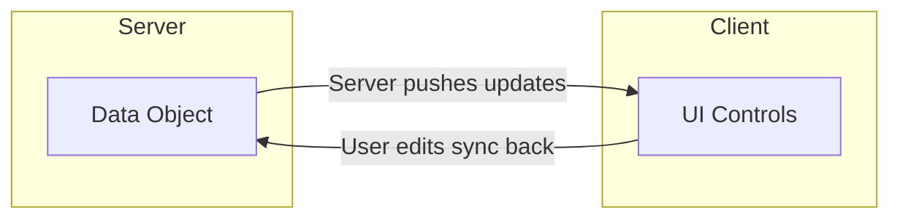
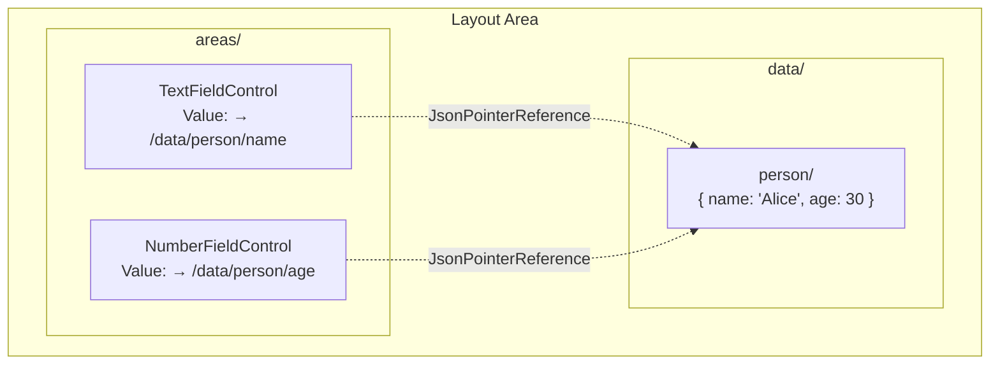
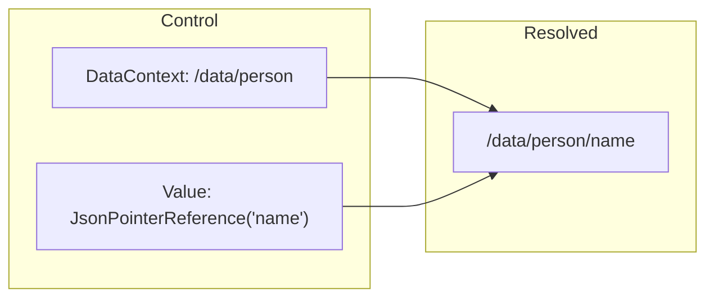
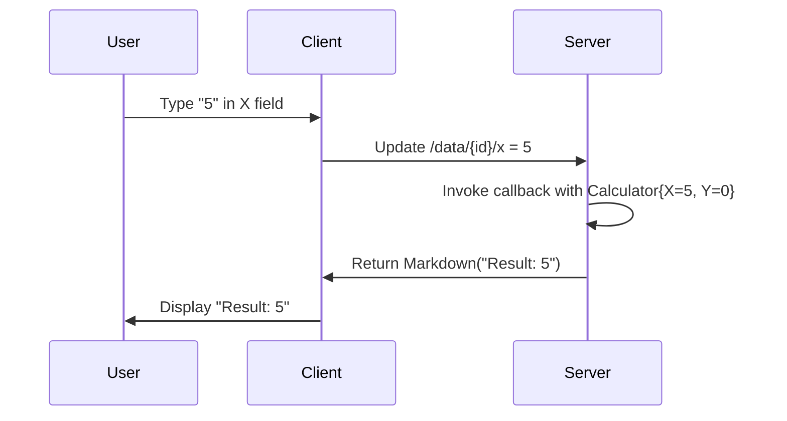

Data binding in MeshWeaver connects your data objects to UI controls reactively and bidirectionally. The server pushes updates to the GUI; user edits flow back to the server. The whole pipeline is **live** — when the underlying node changes anywhere in the mesh, every subscribed view re-renders without a page refresh.

> **Native clients bind the same way.** An external participant client (the React Native app, a SignalR/gRPC participant) reads with `hub.GetMeshNodeStream(path)` and writes with `.Update(...)` — identical rule, just marshalled to the device UI thread over the participant socket.


```mermaid
flowchart LR
    subgraph Server
        D[Data Object]
    end
    subgraph Client
        UI[UI Controls]
    end
    D -->|"Server pushes updates"| UI
    UI -->|"User edits sync back"| D
```

---

# The Golden Rule: the GUI is fully data-bound

> **🚨 Backend layout areas declare *what* to render — they never fetch instances and never put concrete values into controls.** All value resolution, every read of a `MeshNode`'s content, and every write-back of user input happens on the GUI side via a per-node `IMeshNodeStreamCache` subscription.

This is non-negotiable, for three reasons:

1. **No deadlocks.** Backend rendering stays purely synchronous — no `await`, no `Task<T>`, no `IAsyncEnumerable`. Every `async`/`await`/`QueryAsync` chain put in a layout area has eventually deadlocked the hub or returned stale content. Removing the backend fetch removes the entire problem class.
2. **Live updates.** The GUI subscription stays open for the lifetime of the component. Backend-loaded values freeze on first render; cache-subscribed views never go stale.
3. **CQRS-correct reads.** `Hub.GetMeshNodeStream(path)` (backed by the process-wide `IMeshNodeStreamCache`) is the **authoritative** read path — it goes to the owning hub's workspace, never through the lagged read-side index. See [CQRS — Queries, Reads, Writes, Operations](/Doc/Architecture/CqrsAndContentAccess).

## Responsibility split

| Side | Responsibility |
|---|---|
| **Backend layout area** | Build a `UiControl` tree. Pass *paths* (or `JsonPointerReference`s) into controls. Never call `meshQuery.QueryAsync(...)`, never `await` data, never `await PermissionHelper.GetEffectivePermissions(...)` (compose its `IObservable<Permission>` with `CombineLatest` instead). |
| **GUI Blazor view (.razor.cs)** | In `BindData()`, subscribe via `Hub.GetMeshNodeStream(NodePath)` using `AddBinding(...)`. Write user edits back via `Hub.GetMeshNodeStream(NodePath).Update(fn).Subscribe(...)`. |

---

## Backend: declare the binding, don't fetch the data

```csharp
// ❌ ANTI-PATTERN — backend loads node, builds control with concrete values
var userNode = await meshQuery.QueryAsync<MeshNode>($"path:{userPath}").FirstOrDefaultAsync();
var card = MeshNodeThumbnailControl.FromNode(userNode, userPath);

// ✅ CORRECT — backend declares the binding path; GUI loads + displays
var card = new MeshNodeThumbnailControl { NodePath = userPath };
```

The backend layout-area method **must not** be `async Task<UiControl>`. Return `UiControl` directly. If it needs to rebuild reactively on workspace changes, return `IObservable<UiControl?>` and compose with `Observable.Return` / `Select` — never `SelectMany(async ...)`, never `await`.

---

## Templates first, data later

> **A layout area is a TEMPLATE. It emits its whole control tree on the first render, shows a loading shape where data has not arrived, and BINDS its data — it never loads the data on the hub and bakes the values into controls.**

The wrong shape, and why it is slow: the area subscribes to the node (or a query) on the hub, waits for the answer, and only then builds controls out of the values. The page shows nothing but the area's spinner until the slowest read has answered — the owning hub activating, a cold NodeType compile, a partition fan-out — and what finally renders is a snapshot that an edit made elsewhere never reaches. The tells:

- the area returns `GetMeshNodeStream(...)` / `GetQuery(...)` / `Query(...)` / `Workspace.GetStream<T>()` `.Select(x => Controls…)`, interpolating values into `Markdown` / `Html` / labels / grid rows;
- a `WithView((h, c) => stream.Select(…))` child that is the only thing in the container, so the first render is empty;
- `.Take(1)` / `FirstAsync` on data inside an area, then `WithValue(snapshot)`;
- a `DataGrid` built from a materialized list.

### The reference conversion: the Markdown Edit page

**Before** — the page waited for the node, then froze its markdown into the editor:

```csharp
private static UiControl BuildArea(LayoutAreaHost host, bool trackChanges)
    => Controls.Stack
        .WithView((h, ctx) => host.Workspace.GetMeshNodeStream().Take(1).Select(node =>
            BuildEditContent(host, node, hubPath, hubAddress,
                MarkdownOverviewLayoutArea.GetMarkdownContent(node),   // ← value baked in on the hub
                trackChanges)));
// … inside BuildEditContent:
new MarkdownEditorControl().WithValue(initialContent).WithAutoSave(hubPath, hubPath);
```

**After** — every control is declared up front and bound by PATH; nothing on the hub reads the node (`MarkdownEditLayoutArea.BuildTemplate`):

```csharp
public static UiControl BuildTemplate(string nodePath, bool trackChanges, string? locale)
{
    // Title: the node's Name, read and written by the GUI through the node stream.
    var title = new TextFieldControl(new JsonPointerReference(nameof(MeshNode.Name)))
    {
        DataContext = LayoutAreaReference.GetMeshNodeDataContext(nodePath, bindContent: false)
    };
    // Body: a POINTER into the node's MarkdownContent, not the text.
    var editor = new MarkdownEditorControl
        {
            Value = new JsonPointerReference("content"),
            DataContext = LayoutAreaReference.GetMeshNodeDataContext(nodePath)
        }
        .WithAutoSave(nodePath, nodePath);
    return Controls.Stack.WithView(/* header with title */).WithView(editor);   // all STATIC views
}
```

The editor view resolves the pointer through `MeshNodeBindingExtensions.Bind` (`IMeshNodeStreamCache` underneath) and stays subscribed, so the page renders at once and follows the node live. `test/MeshWeaver.Graph.Test/MarkdownEditIsATemplateTest` pins both halves: every view in the template is a control (no deferred view the first render leaves empty), and the template's pointer reads the node's markdown and then follows a later edit.

### The toolkit — use these, never a new one

| You need to show | Declare | Resolved |
|---|---|---|
| A field of a node (title, description, a content property) | Any form/display control with a `JsonPointerReference` and `DataContext = LayoutAreaReference.GetMeshNodeDataContext(path[, bindContent: false])` | GUI, `MeshNodeBindingExtensions.Bind` |
| A node's markdown body | `MarkdownEditorControl { Value = pointer, DataContext = nodeCtx }` (edit) · `CollaborativeMarkdownControl { NodePath }` (read) | GUI |
| A node as a card | `MeshNodeThumbnailControl.ForPath(path)` / `MeshNodeCardControl` with the PATH — never `FromNode(loadedNode)` | GUI, per-node cache |
| A list of nodes | `Controls.MeshSearch.WithHiddenQuery(…)` · `MeshNodeCollectionControl.WithQueries(…)` — the GUI runs the query | GUI |
| A grid of rows only the hub can compute (a query projected to rows) | `rowsFeed.BindGrid(id, emptyText, failedText)` (`MeshWeaver.Layout.DataGrid.DataGridBinding`) — the `DataGridControl` is returned AT ONCE, bound to `/data/{id}`; `Loading` is bound until the first row set, `EmptyContent` carries the empty or failure text | hub → `/data`, bound by pointer |
| Text only the hub can compute (a status line, a rendered digest) | `markdownFeed.BindMarkdown(id, loading, failed)` (`MeshWeaver.Layout.FeedBinding`) | hub → `/data`, bound by pointer |
| Rows computed on the hub (a projection, an aggregate) | `stream.BindMany(id, row => template)` / `stream.Bind(x => template, id)` (`Template` in `MeshWeaver.Layout`) — the control is returned AT ONCE and the stream feeds `/data/{id}` | hub → `/data`, bound by pointer |
| One text computed on the hub (a serialization, a rendered fragment) | `textStream.BoundMarkdown(id)` / `htmlStream.BoundHtml(id)` (`BoundProjections` in `MeshWeaver.Layout`) — the `Template.Bind` row above for the common single-text case | hub → `/data`, bound by pointer |
| Something that decides the page's STRUCTURE (which catalog, which type) | Read it from the hub's CONFIGURATION, never the node: `NodeTypePathHolder` (the type the hub was bound to), `MeshDataSource.ContentType`, the hub's own markers (`NodeTypeCatalogMode`) | hub configuration — no wait |
| A whole sub-page that genuinely must compute | A nested `LayoutAreaControl` with `.WithSpinnerType(SpinnerType.Skeleton)` — the parent page renders, the slot shows the skeleton | hub, deferred to the slot only |

### The default node page's secondary areas (converted)

These areas of every node hub are templates; each pins its shape in `test/MeshWeaver.Graph.Test/NodePageAreasAreTemplatesTest`:

| Area | Template |
|---|---|
| `Thumbnail` (default and Markdown) | `MeshNodeThumbnailControl.ForPath(hubPath)` — the card's view binds title and image from the node. |
| `NodeTypes` | Own type from `NodeTypePathHolder` as a card by path; the types at this level as a `MeshSearch` the GUI runs. It used to take a one-shot query snapshot that never showed a type added later. |
| `Search` | The ordinary catalog is emitted at once; whether to show a NodeType's instance catalog is read from configuration. A NodeType DEFINITION's catalog is emitted at once too: the breadcrumb trail plus the `NodeTypeInstances` slot with a skeleton, carrying the page's query string (`?groupBy`, `?q`, …). Only that slot reads the node, because the instance list's query and create link are built from the definition's `DefaultNamespace` and `RestrictedToNamespaces` (`NodeTypeCatalogQuery.From`, pure). It is a STRUCTURE read like `NodeContentForm` below: the list itself is still a `MeshSearch` the GUI runs, and the slot re-renders only when the query or the create link changes, so an edit of the definition reaches the open page. Binding `MeshSearch.HiddenQuery` by pointer would remove the slot; the views resolve it as a literal string today. The ratchet's text scan does not count the slot, because its controls are built by pure helpers (`BuildNodeTypeSearch`, `BuildCatalog`); unlike `NodeContentForm`, it has left the inventory, and it is a structure read all the same. |
| `Notebook` (Markdown) | Header with the name bound by pointer; the cells — parsed from the markdown — render in the `NotebookCells` slot with a skeleton. |
| `$Schema` (self) | The content type the hub's `MeshDataSource` was configured with; no read. |
| `$Data`, `$Content` (self) | A markdown/HTML control bound to a projection of the node, following later edits. On a node hub the layout's `DataPathViews` renderer also matches `$Data` and, running after the named renderer, overwrites it — a client sees that one there. |

### The default node page itself (converted)

The main page and its siblings are templates as well. `test/MeshWeaver.Graph.Test/NodePageIsATemplateTest` pins their shape:

| Area | Template |
|---|---|
| `Overview`, `Data` (`BuildDetailsTemplate`) | The page is emitted once the viewer's permissions are known. Permissions are STRUCTURE: they decide the page or the denial, and whether fields are click-to-edit. The header binds its title, icon and provenance line to a projection the hub feeds into `/data/nodeHeader` (`NodePageProjections.Header`). A node excluded from the header context hides the header through its bound style. The property form is the configured content type's form (`ConfiguredContentType`: the `MeshDataSource`'s, else the type the mesh registered for the NodeType), with every field bound to the node. The markdown body is a `MarkdownControl` bound to `/data/nodeBody`, and it is hidden while the node has no body. A NodeType definition's description is bound the same way. |
| The provenance strip `WithNodePage` composes (`ComposeProvenance`) | Emitted with the page. Its line is bound to `/data/nodeProvenance` (`NodePageProjections.Meta`). The viewer's zone and language are captured on the render turn. |
| `Edit` (`BuildEditTemplate`) | The header template, plus the configured content type's form in pure edit mode, bound to the node. |
| `NodeContentForm` (`OverviewLayoutArea.ContentForm`) | The fallback slot, rendered with a skeleton, for a hub whose configuration names no content type. The form's SHAPE can then only come from the node's own `$type`. It is the one place the default page still reads the node on the hub, and that read decides structure only, so it stays in the ratchet's inventory. |

Every projection is a pure `Select` over the hub's own node, published with `Template`'s stream `Bind`. That `Bind` subscribes in the control's buildup and is disposed with its area, so the page is never rebuilt on an edit. The one-way `/data` mirror of the node's Content, which a few read-only labels of the property form read, is opened the same way (`NodePageProjections.MirrorContent`). The ratchet's text scan does not see a load that sits in another file. Keeping the projections in `NodePageProjections.cs` therefore relies on that blind spot, so the file's contract is narrow: projections and the mirror, never a control.

**Consumers that read these controls' values server-side must resolve pointers.** The document export (`AreaMarkupRenderer`, MeshWeaver.Plugins) resolves a node-bound pointer through `MeshNodeBindingExtensions.Bind` and a `/data` pointer through `LayoutClientExtensions.DataBind`, with the control's own data context or the one its container cascades. That change landed before this conversion went live.

### The loading shape

- **A deferred slot** already has one: `NamedAreaView` draws the `SpinnerType` of its `LayoutAreaControl` / `NamedAreaControl` until the slot's first control arrives — `SpinnerType.Skeleton` is the ghost-box shape, and it is what a template's data-dependent sub-area should ask for.
- **A bound field** draws EMPTY until its value arrives (`MeshNodeBindingExtensions.Bind` emits `null` for "absent / not yet"), and the per-control shape is not yet a skeleton. 🚨 That gap is a PLATFORM gap, to be closed once in `BlazorView` (render the skeleton, and keep an editable control read-only, until the first bound emission) — never per view. An editor bound by pointer accepts input before its first value has arrived; the window is short (the cache replays a held node at once) but it is real, and closing it in the base view closes it for every bound control at the same time.

### Two more shapes, from the framework's own areas

- **A projection the GUI cannot compute — split the TEMPLATE from the FEED.** The `$Data` area (`DataPathViews`) has to serialise arbitrary workspace data to JSON, which only the hub can do. Its control tree (`BuildTemplate`) reads nothing: a `MarkdownControl` and a "Load all" button whose text, label and even visibility (`Style`) are `JsonPointerReference`s into `/data/{viewId}`. The feed (`FeedDataView`) is a separate function that builds no control; it starts in the template's `WithBuildup` — the seam `Template.Bind` uses — so its subscription belongs to the rendered area and ends with it, and it is ONE subscription that emits the loading line first (`StartWith`) and the projection after, so the loading line can never overwrite data that arrived first. 🚨 Registering the feed on `host.RegisterForDisposal(ctx.Area, …)` from the area function itself does NOT work: the area's disposables are cleared when its first control is rendered, so the feed is gone before the data arrives (measured: the slot stayed on the loading line). `test/MeshWeaver.Layout.Test/DataReferenceAreaIsATemplateTest` pins it with a data source held silent until the test releases it.
- **Another node's live state — embed THAT node's own area.** The GitHub-sync tab's activity panel used to subscribe the activity node twice and rebuild hand-made HTML plus a Cancel button on every progress tick. It now embeds `new LayoutAreaControl(new Address(activityPath), new LayoutAreaReference(ActivityLayoutAreas.ProgressArea)).WithSpinnerType(SpinnerType.Skeleton)`: the activity's hub renders its log, status and Cancel, and the tab reads nothing.
- `LayoutTemplate.DeferredViews` / `Descendants` (`MeshWeaver.Layout`) is the shared form of the reference test's check: an empty list means the tree is a template.

- **A list with a per-row action (archive, revoke, rotate)** — a fed grid plus SELECTION: `WithClickAction` on the grid reads the clicked row from `DataGridCellClick` with `.As<TRow>(…)` and writes it to a `/data` slot (seeded with a "nothing selected" row whose label is the hint); a bound label shows the selection and the action buttons below the grid act on it, refusing — and saying so — when nothing actionable is selected. The settings tabs Inbox, Invitations and Service identities use it; a bound row whose button carries its row ([Row-scoped actions](#row-scoped-actions)) is the shape that replaces it. Keep the feed in its own function (it takes the host, builds no control) and the action in its own function, so the template function reads nothing.

**Not convertible at the helper:** `LayoutHelperExtensions.StreamView<T>` hands the caller's `viewFactory` the loaded items, so its contract IS the bake; it retires when its callers (`MeshNodeLayoutAreas.Thumbnail`/`Metadata` here, three `MeshWeaver.Graph.Views` areas in MeshWeaver.Plugins) are templates. **A list with a per-row action** (revoke, archive, rotate) is a bound list too: a button inside a bound row (`ItemTemplateControl`, `TemplateColumnControl`) posts a `ClickedEvent` that carries its row — see [Row-scoped actions](#row-scoped-actions) below; `DataGridControl.WithClickAction` + `DataGridCellClick` (the row arrives as the payload — `GitHistoryTab`) remains the shape for a click on the cell itself. The coupon admin list, which opens the clicked coupon, is a fed grid with that cell click; the registration-key and instance-grant lists are fed grids that bind columns only (no row acts).

### The authoring samples — what a NodeType author copies

The in-mesh samples are converted, so copy them rather than the framework areas still on the inventory:

| Sample | Shape it shows |
|---|---|
| `samples/Graph/Data/Northwind/{Customer,Supplier}` | Stored fields only — every value a `JsonPointerReference` into the content, `DataContext = GetMeshNodeDataContext(path)`; the area is `(host, _) => OverviewTemplate(host.Hub.Address.ToString())` |
| `samples/Graph/Data/Northwind/Employee` · `…/Product` | Stored fields bound by pointer **and** a value only the hub can compute (dates in the viewer's format, a stock status) — a FEED function that builds no control, bound with `feed.Bind(x => Controls.Markdown(x), id)` (`Template.Bind`) |
| `samples/Graph/Data/{Northwind,ACME}/Article` | Title and body as pointers into the node; the composed metadata line as a feed; the `Thumbnail` area as `new MeshNodeThumbnailControl(path, path)` — the thumbnail view reads name, abstract and image itself |
| `samples/Graph/Data/Northwind/ReportsCatalog` | Children as `Controls.MeshSearch.WithHiddenQuery(…)` — the GUI runs the query; the hub reads neither the catalog nor its reports |
| `samples/Graph/Data/PythonDemo/PrimeReport` | A whole view that must compute (a Python run) — one markdown control bound to `/data`, fed by an `IIoPool`-backed feed |

Each sample's `Test/` folder asserts its template on the mesh: the template is built from a PATH (and, for a fed control, an `Observable.Never` feed — the template must be whole while its feed is silent), and `LayoutTemplate.DeferredViews(template)` must be empty — `LayoutTemplate` (`MeshWeaver.Layout`) is the platform's reading of a control tree, public so in-mesh C# can use it. The cases also pin which pointers are bound against which context. A feed's own subscription is opened by `Template.Bind`'s build-up, so it belongs to the rendered area and ends with it; a feed reports a failure as text and a log line, never by going quiet.

### A decision over several fields: publish a projection, bind the template to it

Some of what a page shows is not a FIELD of a node but a DECISION over several — a compile panel whose chip, colour and button label depend on status × build presence × dirty flag, in the viewer's language. A field binding cannot express that, and computing it in a `GetMeshNodeStream().Select(…)` that builds controls is the bake. The shape the NodeType pages use:

1. A **pure record** of the decided values (`NodeTypeStatusView` — title, status lines, panel style, button label, links), made by a pure `From(node, definition, path, locale)` that tests pin without a renderer.
2. A **projection** — the ONE read of the node — `GetMeshNodeStream().Select(NodeTypeStatusView.From…)`, a function that builds no control.
3. A **template** whose controls carry `DataContext = LayoutAreaReference.GetDataPointer(id)` and pointers into the record (`Controls.Body(pointer)`, `Style = pointer`, a button's `Disabled = pointer`), with the projection attached by `control.PublishingTo(id, projection)` (`MeshWeaver.Graph.LayoutProjection`): a buildup that publishes to `/data/{id}` for as long as the AREA lives and is disposed with it.

The template is emitted at once and the values fill in; nothing is ever interpolated into a control. Lists go further and leave the hub entirely: the NodeType release history, the Settings Groups tab and the Admin Data Sources tab are `Controls.MeshSearch.WithHiddenQuery(…)`, run by the viewer's client.

Two things a template cannot close from the server side — both live in the Blazor layer:

- **A code editor reads a node field only through `CodeEditorControl.BindToNode`** ("Binding a rich control to a node field" below), whose view half ships with the Blazor client; a `Value` pointer handed to the layout stream is never resolved against a node-bound DataContext. The NodeType configuration preview does not need it: its text is a DECISION (the lambda, or a localized placeholder when there is none), so it binds to a `/data` projection like the rest of the page.
- **`NodeExportView` reads `NodeName` / `AvailableSatelliteTypes` straight off the view model**, so the Export area still loads them on the hub; the conversion is the view resolving both from `SourcePath` itself.

### The ratchet

`test/MeshWeaver.Documentation.Test/LayoutAreaDataBakeRatchetGuard` counts, per file under `src/`, `memex/` and `samples/`, the layout-area units (methods, local functions, lambdas taking a `LayoutAreaHost`) that both READ data and BUILD controls. The seeded inventory is `test/LayoutAreaDataBakeSites.allow`; it may only shrink. Converting an area means lowering its line (and `TotalBudget`) in the same change. It is a text heuristic, and it says so: a load reached through another file's helper is missed, and an area that reads data only to choose its STRUCTURE (a permission gate) is counted — so the file is an inventory to work down, not a verdict on every line.

---

## GUI: subscribe via the cache, re-render on emission

The canonical Blazor view template. Reads and writes both go through `Hub.GetMeshNodeStream(path)`, which returns a `MeshNodeStreamHandle` backed by the process-wide `IMeshNodeStreamCache`. Multiple views on the same path share **one** upstream subscription; writes through the handle's `.Update(...)` are visible to every reader.

> **Access-checked.** The stream is gated by the current user's effective Read permission on the node. The cache asks the owning hub via `GetPermissionRequest`, caches the answer per `(path, userId)` for 30 s, and terminates the observable with `UnauthorizedAccessException` if Read is not granted. Subscribers should handle that error (toast, navigate to AccessDenied, render empty state) rather than letting it propagate. See [AccessContextPropagation.md](/Doc/Architecture/AccessContextPropagation).

```csharp
public partial class MyView : BlazorView<MyControl, MyView>
{
    public string? Title { get; private set; }
    public string? ImageUrl { get; private set; }

    protected override void BindData()
    {
        base.BindData();

        // 1. Declare bindings from the control's own properties (DataContext / refs)
        DataBind(ViewModel.NodePath, x => x.NodePath);

        if (string.IsNullOrEmpty(NodePath)) return;

        // 2. Subscribe — every emission re-renders this component
        AddBinding(Hub.GetMeshNodeStream(NodePath)
            .Where(node => node is not null)
            .DistinctUntilChanged()
            .Subscribe(node =>
            {
                Title = node.Name;
                ImageUrl = MeshNodeThumbnailControl.GetImageUrlForNode(node);
                InvokeAsync(StateHasChanged);
            }));
    }
}
```

Key points to remember:

- **Go through `Hub.GetMeshNodeStream(path)`, not the raw cache.** The handle supplies the hub's `JsonSerializerOptions` for you, so `node.Content` arrives as its registered domain type. The bare `IMeshNodeStreamCache.GetStream(path)` / `Update(path, fn)` overloads **were deleted**: without options the cache hands back Content as a raw `JsonElement`, so `node.Content as MyType` is `null` and the consumer silently no-ops — the wedged-thread / never-dispatching-watcher bug class. If you do resolve `IMeshNodeStreamCache` directly, you must pass `Hub.JsonSerializerOptions` to every call.
- Writers call `Hub.GetMeshNodeStream(NodePath).Update(fn).Subscribe(...)` to push edits; the write routes through the same shared handle, so the read subscription receives the echo. `Update` returns a **cold** observable — without `Subscribe` the write never happens.
- `AddBinding(...)` registers the subscription with the base class — it auto-disposes on component teardown. The cache's upstream handle stays alive for the process.
- **No `.Take(1)`** — that snapshots once and the view freezes. Stay subscribed for the lifetime of the component.
- **Never** open `workspace.GetRemoteStream<MeshNode, MeshNodeReference>(addr, ...)` directly in a Blazor view. That bypasses the cache; writes through the cache won't be observed by views that went around it.
- No `try`/`catch` swallowing — let errors propagate via `Subscribe(onNext, onError)` or the framework's binding error handler.

---

## Writing user edits back

The same handle is the write path. Its `Update` takes a `MeshNode → MeshNode` lambda and returns a **cold** `IObservable<MeshNode>` — the write only happens on `Subscribe`:

```csharp
private void OnTitleChanged(string newTitle)
{
    if (string.IsNullOrEmpty(NodePath)) return;
    Hub.GetMeshNodeStream(NodePath).Update(current => current with { Name = newTitle })
        .Subscribe(_ => { }, ex => Logger.LogWarning(ex,
            "Title update failed for {Path}", NodePath));
}
```

Because the write routes through the **same shared upstream handle** every reader is subscribed to:

1. The owning hub applies the patch and persists.
2. This view's `Hub.GetMeshNodeStream(NodePath)` subscription receives the echo and re-renders.
3. Every other GUI watching the same path sees the patch through their own subscription.

No separate `DataChangeRequest` is needed for own-node edits inside a bound view.

> **Server-side mirror.** The same rule holds server-side: every mesh-node mutation goes through `workspace.GetMeshNodeStream(path).Update(...)` — which internally routes through the same `IMeshNodeStreamCache`. State machines (compile, thread execution, satellite operations) flip a `RequestedX` field on the node's content; the owning hub's watcher reacts. Full reference: **[Requesting Work via stream.Update()](/Doc/Architecture/RequestViaStreamUpdate)**.

---

# 🚨 ABSOLUTE: edit node content by binding to the node stream — NEVER replicate into `/data` + a save subscription

**Editing a mesh node's content means binding the GUI client to the node's own stream and writing edits straight back to it.** There is exactly ONE source of truth — `Hub.GetMeshNodeStream(path)` (the process-wide `IMeshNodeStreamCache`). Reads come from it; edits write back through `GetMeshNodeStream(path).Update(...)`.

**The forbidden antipattern** (it has appeared in many editors and must not be added to new ones):

```csharp
// ❌ FORBIDDEN — replicate-then-save. Two sources of truth glued by a debounced loop.
host.UpdateData(dataId, node.Content);                          // 1. copy the node into a /data replica
// ... controls bound to /data/{dataId} ...                      // 2. edit the replica
host.Stream.GetDataStream<object>(dataId)                        // 3. a SERVER-SIDE save subscription
    .Debounce(...).Subscribe(c => GetMeshNodeStream(path).Update(n => n with { Content = c }));
```

Why it's wrong: the `/data/{id}` copy and the node stream are two stores that drift (an out-of-band write to the node — e.g. a status field — never reaches the replica), and the debounced `Subscribe(...Update...)` is a hidden save loop that fires spurious writes, races the echo, and clobbers fields it didn't edit. **`OverviewLayoutArea.SetupAutoSave` is this antipattern; do not call it and do not write your own variant** (`SetupNodeMetadataAutoSave`, `SetupNodeTypeConfigAutoSave`, a hand-rolled `GetDataStream(id).Throttle().Subscribe(...Update...)`, or a "Save" button that reads `/data` and writes the node).

**The correct pattern — a node-bound editor.** The backend layout area only DECLARES the editor with a node path; a Blazor view binds it to the node stream:

```csharp
// ✅ Backend layout area — declare the binding, compute the fields from the content type:
stack.WithView(MeshNodeContentEditorControl.ForType(nodePath, typeof(MyContent)));

// ✅ The Blazor view (the ONLY place reads/writes live) — bind to the node stream:
AddBinding(Hub.GetMeshNodeStream(NodePath)
    .Where(n => n is not null)
    .Subscribe(node => { LoadValues(node); InvokeAsync(StateHasChanged); }));   // reads

// edit -> per-field read-modify-write straight to the node (set ONLY the edited field):
Hub.GetMeshNodeStream(NodePath)
    .Update(node => node with { Content = PatchOneField(node.Content, key, value) })
    .Subscribe(_ => { }, ex => Logger.LogWarning(ex, "persist failed for {Path}", NodePath));
```

No `/data` replica, no `SetupAutoSave`, no Save button, no debounce-and-save subscription. `MeshNodeContentEditorControl` (control in `MeshWeaver.Graph`, view `MeshNodeContentEditorView` in `MeshWeaver.Blazor`) is the reusable generic editor for simple scalar/bool content. For rich content (markdown, mesh-node picking) use the dedicated already-node-bound controls — `MarkdownEditorControl.WithAutoSave(hubAddress, nodePath)` (writes via the cache), `MeshNodePickerControl`, `CollaborativeMarkdownView`. Reference editor: `MeshNodeEditorView` (`MeshWeaver.Blazor.Graph`) via the `MeshNodeEditor`/`IMeshNodeEditor` client wrapper.

The same rule covers create-on-absent: a node the editor **writes** to must EXIST first — create it with `meshService.CreateNode(...)` (read existence via `GetQuery`, empty-on-absent), NEVER `GetMeshNodeStream(path).Update` on an absent path (it NotFound-storms). `Update` mutates; only a create brings a node into being.

🚨 **READING is a different obligation, and it is the framework's, not yours.** "Create it first" cannot cover the two states that actually happen: a bound node **deleted while the page is still open**, and one **deliberately not written until the user acts** (a learner's answers node, written by the first answer — creating it on render would write a node for everyone who merely looked). So `MeshNodeBindingExtensions.Bind` — the seam every node-bound control reads through — gates its point read on a live exact-path existence query and simply **draws the control empty** while the node is absent, staying subscribed so the node appearing populates it. You do not code around an absent node on the read side, and you must not `catch` the fault if one ever surfaces: swallowing it leaves the storm-breaker window open on the path, and that breaker fast-fails WRITES too — so the suppressed read suppresses the write your form is about to make. See [CQRS and Content Access → An OPTIONAL node](/Doc/Architecture/CqrsAndContentAccess) (Systemorph/MeshWeaver#3517).

## Node-bound `DataContext` — reuse the rich form-gen, bound to the node

For a RICH editor (text + number + checkbox + markdown + `[MeshNode]` picker + `[Dimension]` select), you don't hand-roll controls — you let the framework's form generator (`EditLayoutArea.BuildPropertyForm` / `MapToToggleableControl` / the `Edit` macro) build them, then point their **`DataContext` at the node** instead of a `/data/{id}` replica. The generated controls then read each field straight from the node stream and write each edit straight back — ONE source of truth, no replica, no save subscription.

Encode the node-bound DataContext with `LayoutAreaReference.GetMeshNodeDataContext(...)`:

```csharp
// Field pointers resolve against the node's Content JSON (content-typed editors):
var ctx = LayoutAreaReference.GetMeshNodeDataContext(node.Path);                    // bindContent: true (default)

// Field pointers resolve against the WHOLE node JSON — for top-level fields
// (Name / Description / Icon / Category / Order — the "metadata" editors):
var ctx = LayoutAreaReference.GetMeshNodeDataContext(node.Path, bindContent: false);

// …optionally nested one level deeper (e.g. a Thread's inline composer object):
var ctx = LayoutAreaReference.GetMeshNodeDataContext(node.Path, bindContent: false, subPath: "content/composer");

// Pass it to the standard form generator (or set it as a control's DataContext directly):
stack.WithView(EditLayoutArea.BuildContentView(host, new ContentViewOptions {
    DataId = dataId, ContentType = contentType, CanEdit = canEdit, BoundDataContext = ctx }));
```

Mechanics (so you know what's load-bearing):

- The encoding is a reserved DataContext shape `/$meshNode/{base64url(path)}/{c|n}[/base64url(subPath)]` (`LayoutAreaReference.MeshNodePrefix`). It carries no `/`, `.`, or `%9Y`, so it survives the `DispatchView` decode hop and JSON-pointer parsing untouched.
- The binding primitive is `MeshNodeBindingExtensions` (in `MeshWeaver.Mesh.Contract`, next to `GetMeshNodeStream` — a control-level static extension, NOT a Blazor type, so it is unit-testable without a render host: see `MeshNodeBindingExtensions.ResolveField` and `test/MeshWeaver.Layout.Test/MeshNodeBindingExtensionsTest`). The GUI seams `BlazorView.DataBind` (read) and `BlazorView.UpdatePointer` (write) branch on a node-bound context via `MeshNodeBindingExtensions.IsNodeBound`: reads come from `Hub.GetMeshNodeStream(path)` and writes are a per-field read-modify-write through `.Update(...)` that touches ONLY the edited field. Every form control inherits this automatically — `TextField`, `NumberField`, `CheckBox`, `DateTime`, `Select`, `MeshNodePicker`, `MarkdownEditor`, `Code`.
- **🚨 A control that binds its `Value` pointer itself (the Monaco editor views — `MarkdownEditorView` / `CodeEditorView` / `NotebookEditorView`) must ALSO route node-bound reads through `MeshNodeBindingExtensions` (`IsNodeBound` + `Bind`), not through `Stream.DataBind`.** A node-bound pointer fed to the layout `Stream` reaches `LayoutExtensions.GetStream<T>`, which treats the pointer's second segment as a JSON-encoded id and calls `JsonSerializer.Deserialize<string>(segment)`. The segment is the Base64Url of the node path (e.g. `QWdlbnRpY1BlbnNpb24` for `AgenticPension`) — a bare token, not a JSON-quoted string — so it throws **`'Q' is an invalid start of a value'`** and tears down the whole Blazor circuit. The node's content lives on the node stream, not the layout-area `/data` store, so reading it via the layout `Stream` would be wrong even if it didn't crash. (Root-caused from the AgenticPension Settings → Display Description editor, 2026-06-14.)
- Field-pointer resolution against the node is **case-insensitive**, so a metadata DTO's PascalCase pointer (`Name`, `Description`) and a content editor's camelCase pointer (`harness`, `messageContent`) both bind without the layout area knowing the JSON casing.
- **Edit-state stays in `/data`.** The click-to-edit toggle (`editState_…`) is transient view state, not node content — it is never written to the node. Only field VALUES are node-bound.
- A few read-only display controls (the `[Dimension]` / options / formatted-date toggle *labels*) derive their text from the layout-area `/data` stream rather than a value pointer. When you node-bind a toggleable form, keep `/data/{dataId}` as a **one-way live projection** of the node content (`GetMeshNodeStream(path).Select(n => n.Content).Subscribe(c => host.UpdateData(dataId, c))`) so those labels stay correct. This is a pure read mirror — it follows the node, has no save loop, and never writes back, so it is NOT the forbidden replicate-then-save pattern.
- **🚨 Editability follows the VIEWER'S effective `Update` on the node a box writes, and the PLATFORM enforces it, not each area (#5600).** A node-bound field writes as the viewer, and the owning hub refuses a viewer without `Update` on the node. So the GUI does not offer such a box at all: `BlazorView` resolves the node the view writes (`EditedNodePath`, by default the node of a `$meshNode` data context; an editor with an auto-save target or a `NodePath` overrides it), subscribes the viewer's effective permissions on it, and exposes `EditedNodeUpdateDenied`. Every node-bound editor folds that in. Form controls (text area, text field, number, date, switch) render `Readonly`. Inputs with no read-only mode (checkbox, radio group, select, list box, combo box, node picker) render disabled. `MarkdownEditor`, the `Code` editor and `MeshNodeContentEditor` turn read-only. The `Edit` macro's node-bound forms inherit it through those controls. Three properties of the rule:
  - **Fail closed.** The box stays read-only until the answer is in, and also if the check faults.
  - **Live.** The permission fold re-emits on every grant change, so a grant given or revoked under an open page flips the box without a reload.
  - **Asked of the MESH hub.** A circuit's portal hub carries no permission evaluator of its own and would answer `Permission.All` for everyone, so it is never ASKED. It never OWNS an edited node either: every node is owned by its per-node hub behind the mesh's access pipeline, which runs the same evaluator the mesh hub carries. A mesh built without row-level security has no evaluator anywhere, and there `Permission.All` is the correct answer on both sides.

  An area may still set `Readonly` / `CanEdit` itself, for example to show WHERE writing works (the course wish books, Education#363). A box is read-only when the platform finds no `Update` OR the area sets `Readonly` (or clears `CanEdit`): read-only wins from either side, so nothing an area sets can make a box editable for a viewer without `Update`. **A write that is refused anyway** (a grant revoked between the answer and the keystroke) reaches the view as an `UnauthorizedAccessException`. `BlazorView.UpdatePointer` classifies it as a REFUSAL, not a fault: the person sees the localized `ui.fieldWriteRefused` sentence and the log carries a Warning, not an Error line for the incident filer. Pinned by `NodeBoundEditabilityFollowsUpdateTest` (MeshWeaver.Plugins, `MeshWeaver.Blazor.EntityViews.Test`) and `NodeBoundWriteRefusalTest`.

## Binding a rich control to a node field

The Monaco controls carry their text in a bindable slot too, so an area that shows or edits a node's text renders the control AT ONCE and never loads the node. Each has a `BindToNode` builder that sets a relative pointer and the node-bound DataContext above in one call:

| Control | Bindable slot(s) | Builder | What the renderer does |
|---|---|---|---|
| `CodeEditorControl` | `Value` | `.BindToNode(nodePath, "instructions")` | reads the field live off the node stream, writes each edit straight back to THAT field (per-field read-modify-write) |
| `DiffEditorControl` | `Original`, `Modified` | `.BindToNode(nodePath, "baselineText", "text")` | binds both panes; redraws when either field changes. Read-only |

```csharp
// ✅ Agent Edit — the instructions editor IS the node field. No /data copy, no Save button.
stack.WithView(new CodeEditorControl().WithLanguage("markdown").WithHeight("400px")
    .BindToNode(agentPath, "instructions"));

// ✅ Post Changes — the diff compares two fields of the post, live.
stack.WithView(new DiffEditorControl { Language = "plaintext", Height = "560px" }
    .BindToNode(postPath, "baselineText", "text"));
```

- `bindContent: false` resolves the field against the node's TOP-LEVEL fields (`Description`, `Name`) instead of its `Content`.
- The field is a RELATIVE JSON pointer, not a bare property name: `"instructions"`, or a `/`-separated path to a nested field (`"review/notes"`). A property whose NAME contains `/` or `~` is written escaped (`~1`, `~0`); each segment resolves case-insensitively. A leading `/` would make it absolute — bound to the layout area's data instead of the node — so `BindToNode` refuses it (`ArgumentException`), and an empty field with it.
- A pane whose text is not on that node: set `Original` / `Modified` to an ABSOLUTE pointer (`new JsonPointerReference("/data/previousVersion")`) — absolute pointers always read the layout area's data, even under a node-bound DataContext — and feed that entry from a stream.
- `DiffEditorControl.OriginalContent` / `ModifiedContent` stay as LITERAL strings for text the area genuinely holds already; `Original` / `Modified` win when set.
- `CodeEditorControl.WithAutoSave(nodePath)` remains the Code-node shape (it writes `CodeConfiguration.Code`); `BindToNode` is the general one — any field, any node. **An editor has ONE write target, so the two are mutually exclusive:** `BindToNode` clears an auto-save address set earlier, and `WithAutoSave` on a node-bound editor throws `InvalidOperationException` (dropping the binding instead would leave the editor with no text). Never set `AutoSaveAddress` next to a node-bound `Value` through an initializer or a `with` — both writes would fire on every edit.
- Pinned by `NodeBoundEditorControlsTest` (MeshWeaver.Graph.Test): the bound value renders, follows a change made by someone else, an edit writes only its field; an absolute pointer under the node-bound context is NOT node-bound while its relative sibling is; the field is pointer syntax (nested, escaped); auto-save and a node binding exclude each other — and the negative controls (a baked literal has nothing to follow; a pointer against the wrong root stays empty through the change).

## Anti-patterns — never do these

| ❌ Wrong | Why | ✅ Right |
|---|---|---|
| `await meshQuery.QueryAsync<MeshNode>($"path:{x}").FirstOrDefaultAsync()` in a layout area | Lagged index, deadlock-prone, freezes view | Pass path; GUI subscribes via `Hub.GetMeshNodeStream(path)` |
| `SelectMany(async nodes => await ...)` for data resolution | async lambda inside an observable chain — same deadlock surface | Pass paths; bind in GUI via the cache |
| `MeshNodeThumbnailControl.FromNode(loadedNode, ...)` after a backend fetch | Concrete values frozen at render time | `new MeshNodeThumbnailControl { NodePath = path }` |
| `.Take(1)` on a display stream | View stops updating after first emission | Stay subscribed for the lifetime of the component |
| `await PermissionHelper.GetEffectivePermissions(...).FirstAsync()` in a layout area | Hub deadlock candidate | Compose the `IObservable<Permission>` via `CombineLatest`; bind permissions on the GUI side |
| `try { ... } catch { /* swallowed */ }` around backend reads | Errors disappear, debugging impossible | Propagate via `OnError`; framework handles it |
| `workspace.GetRemoteStream<MeshNode, MeshNodeReference>(addr, ...)` directly in a Blazor view | Opens a per-view upstream handle; bypasses `IMeshNodeStreamCache`; multiplies subscriptions; writes through the cache aren't observed | `Hub.GetMeshNodeStream(path)` — shared, write-coherent |
| `host.UpdateData(id, node.Content)` + `GetDataStream(id).Debounce().Subscribe(...GetMeshNodeStream(path).Update...)` to edit node content (a.k.a. `SetupAutoSave`) | Replicate-then-save: two stores drift, the save loop races the echo and clobbers unedited fields | `MeshNodeContentEditorControl.ForType(path, typeof(T))` — the GUI view binds to `GetMeshNodeStream(path)` and writes per-field via `.Update(...)`; no replica, no save subscription |
| A "Save" button that reads `/data/{id}` and writes the node | The edit should already be on the node via the bound stream | Node-bound editor; edits persist on change through `GetMeshNodeStream(path).Update(...)` |

### The "load, then bake" shape is ratcheted in every repository

A layout area that reads data on its hub (a node stream, a query, a workspace stream) and builds controls out of the values is counted, and the count may only go down:

- **Core**: the test `LayoutAreaDataBakeRatchetGuard` checks `test/LayoutAreaDataBakeSites.allow`.
- **Node repositories** (MeshWeaver.Plugins, .Education, .Reinsurance, .SocialMedia, .Manufacturing, .Crm, .FundReporting): the shared `node-repo-validate.yml` lane fetches `.github/scripts/check-layout-area-data-bake.py` at its scripts ref. The script runs against the caller's `layout-area-data-bake.allow`, a `<file><TAB><units>` list at the repository root. The script ports the core guard's scanner line for line, and its self-test plants the guard's own cases.

The satellite allow-file is shrink-only. These verdicts fail the `Validate node repos` check:

| Verdict | Meaning |
|---|---|
| `NEW` | A file bakes data and has no line in the allow-file. |
| `MORE` | A file holds more baking units than its line allows. |
| `MISSING` | The repository has no allow-file. This is red, never skipped. |
| `ADDED` | On a pull request, the tree holds more baking units than the base did. Adding an area together with its line is therefore caught. Moving an existing unit to another file keeps the total, so it passes. |
| `GREW` / `RAISED` | On a pull request, the allow-file's total, or one of its lines, is higher than in the base's copy. |
| `STALE` | On a pull request, a file this PR converted now holds fewer units than its line. Lower the line or delete it in the same PR. |

A stale line that the pull request did not cause is a warning, not a failure. This happens when the line was already above its file at the base, for example after two converting PRs merged at the same time. Failing it would turn every unrelated PR red. `ADDED` already stops anyone from re-using the spare allowance, and any PR may carry the one-line tidy.

To print the current inventory in allow-file form, run `python3 <core>/.github/scripts/check-layout-area-data-bake.py --root . --report`.

---

## Where to look for working examples

- **`src/MeshWeaver.Blazor/Components/MeshNodeThumbnailView.razor`** — the minimal read-only reference: one `Hub.GetMeshNodeStream(NodePath)` subscription.
- **`src/MeshWeaver.Blazor/Components/CollaborativeMarkdownView.razor.cs`** — read + write reference: a node-stream subscription for the markdown body, and `.Update(fn)` on the same handle to push edits.
- **`src/MeshWeaver.Blazor/Components/MarkdownEditorView.razor`** — auto-save via `.Update(fn)` on the node-stream handle from a debounced editor stream; canonical write-path pattern.
- **`src/MeshWeaver.Blazor/Components/ThreadMessageBubbleView.razor.cs`** — multiple sub-fields (Text, ToolCalls, UpdatedNodes, Role) extracted from `node.Content` as `JsonElement` inside the cache `Subscribe(...)`.
- **`src/MeshWeaver.Blazor/BlazorView.razor.cs`** — the base class. Key API: `AddBinding`, `DataBind<T>`, `BindData()` lifecycle.

---

# Layout Area Structure

A layout area has two conceptual sections: **areas** (the rendered UI controls) and **data** (the bound objects). Controls reference data locations using `JsonPointerReference`.


```mermaid
flowchart TB
    subgraph LayoutArea["Layout Area"]
        subgraph Areas["areas/"]
            TF1["TextFieldControl<br/>Value: → /data/person/name"]
            TF2["NumberFieldControl<br/>Value: → /data/person/age"]
        end
        subgraph Data["data/"]
            P["person/<br/>{ name: 'Alice', age: 30 }"]
        end
    end
    TF1 -.->|JsonPointerReference| P
    TF2 -.->|JsonPointerReference| P
```

When the user types in the `TextFieldControl`, the value at `/data/person/name` updates. When server code calls `UpdateData(...)`, every bound control reflects the new value automatically.

---

# DataContext

`DataContext` sets the base path for data binding. All `JsonPointerReference` values are resolved relative to it.

```csharp
// EditorControl with DataContext pointing to /data/person
new EditorControl { DataContext = "/data/person" }
```

When you call `Edit(instance, "person")`, the data is stored at `/data/person` and the generated controls automatically receive `DataContext = "/data/person"`.

---

# JsonPointerReference

`JsonPointerReference` points a control's value to a location in the data section. The pointer is **relative to DataContext**:

```csharp
// TextFieldControl bound to the "name" property
new TextFieldControl(new JsonPointerReference("name"))

// NumberFieldControl bound to the "age" property
new NumberFieldControl(new JsonPointerReference("age"))
```

With `DataContext = "/data/person"`:

- `JsonPointerReference("name")` resolves to `/data/person/name`
- `JsonPointerReference("age")` resolves to `/data/person/age`


```mermaid
flowchart LR
    subgraph Control
        DC["DataContext: /data/person"]
        Ref["Value: JsonPointerReference('name')"]
    end
    subgraph Resolved
        Path["/data/person/name"]
    end
    DC --> Path
    Ref --> Path
```

## 🚨 An ABSENT `DataContext` does not disable the binding — it RE-ROOTS it

Worth knowing before you read the stack trace in
[#3711](https://github.com/Systemorph/MeshWeaver/issues/3711), because the exception there names a
JSON parse and the fault is a lost context.

`LayoutClientExtensions.GetPointer` resolves a relative pointer against the data context — and when
there is no context it does **not** refuse. It promotes the pointer to an absolute one:

```csharp
if (pointer.StartsWith('/'))
    return pointer.TrimEnd('/');
if (string.IsNullOrWhiteSpace(dataContext))
    return string.IsNullOrEmpty(pointer) ? "/" : $"/{pointer}";   // ← relative becomes ABSOLUTE
return $"{dataContext}/{pointer.TrimEnd('/')}";
```

`LayoutExtensions.GetStream` then reads segment 0 as a COLLECTION and segment 1 as a **JSON-encoded
id**. So what happens next depends on how many segments the pointer has, and the two cases are
opposites:

| pointer, context absent | resolves to | outcome |
|---|---|---|
| `answers/q1` (2 segments) | `/answers/q1` | `Deserialize<string>("q1")` **throws** — *'q' is an invalid start of a value* |
| `answers` (1 segment) | `/answers` | `SegmentCount == 1` ⇒ no id decode ⇒ **binds silently against the layout stream's own root** |

🚨 **The crash is the lucky case.** The one-segment form reports nothing and reads — and through
`BlazorView.UpdatePointer`, writes — against a ROOT path of the layout stream's own document
(`/answers`, treated as a root collection) instead of the node the view was meant to be bound to.

Be precise about which wrong place that is: it is **not** the area's `/data/{id}` replica.
`LayoutAreaReference.GetDataPointer` builds `/data/"{id}"/…`, so a value in the data section is two
segments deeper and JSON-encoded. A context-less relative pointer lands beside `/areas` and `/data`,
at a root key the layout stream does not define — which is why the read yields nothing and the write
creates a sibling of the document's real sections. Same class as the replicate-then-save outcome
this page forbids above (a write that leaves the node it was bound to untouched), reached by
accident rather than by design — but a different address, and diagnosing it against the `/data`
storage model sends the reader to the wrong place.

Two consequences:

1. **Never "fix" such a crash by making the id decode tolerant.** It converts the loud case into the
   silent one — for the quiz in #3711 that means a learner's pick written into the layout replica
   instead of their answer sheet.
2. **A bind that reads nothing, or reads the wrong thing, with no error, is a `DataContext`
   question first.** Check that the control's context reached the CLIENT — it is a
   `[CascadingParameter]` supplied by `DispatchView`, not a property the view reads off the control
   it renders — before you look at the pointer.

---

# Updating Data from the Server

To push new data to bound controls from server code, use `UpdateData`:

```csharp
// Push new data to the stream — all bound controls update automatically
host.UpdateData("person", new Person { Name = "Bob", Age = 25 });
```

This updates `/data/person`, and every control bound to that path reflects the change immediately.

## When a fed stream faults

A stream feeding a binding — `stream.Bind(template, id)`, `stream.BindMany(id, template)`,
`host.SubscribeToDataStream(id, stream)` — can fault: a query stall, a projection that throws on an
empty cube, a denied read. The framework subscribes every such feed WITH an error arm
(`LayoutAreaHost.FeedData`), so a fault never escapes to Rx's default `OnError`, which rethrows on the
producer's thread and, off the thread pool, kills the process (the #5650 crash shape). Instead:

- the fault is logged with the area and the data id — at Error for an engineering fault, at Warning
  for a denial or a missing node, at Debug for a hub-disposal race;
- the bound control is replaced by the standard localized error frame carrying the cause (the same
  frame a faulting view renders); siblings keep rendering;
- the area recovers by being rendered again (a parent re-emission or the client's resubscribe), which
  re-subscribes the feed. There is no automatic retry — re-subscribing a stream that just stalled is
  the storm shape.

So do not wrap a fed stream in `.Catch(...)` to "protect" the view, and do not subscribe a feed by
hand with `stream.Subscribe(x => host.UpdateData(id, x))`: that bare `Subscribe` is exactly the
missing error arm. Inside `MeshWeaver.Layout`, use `host.FeedData(area, id, stream)`; everywhere else,
`Bind`/`BindMany`/`SubscribeToDataStream`. Pinned by `BindFeedFaultTest`.

---

# The Edit Macro

`Edit` is the fastest way to create a data-bound editor. It inspects the object's properties and generates the appropriate controls automatically — no manual `JsonPointerReference` wiring required.

```csharp
// Creates a fully bound editor for a Calculator record
host.Hub.Edit(new Calculator(), "calc");
```

## Property-to-control mapping

| Property Type | Generated Control |
|---|---|
| `double`, `int`, numeric types | `NumberFieldControl` |
| `string` | `TextFieldControl` |
| `DateTime` | `DateTimeControl` |
| `bool` | `CheckBoxControl` |
| `[Dimension<T>]` | `SelectControl` (options from workspace) |
| `[UiControl<T>]` | Custom control specified by the attribute |

## Example

```csharp
public record Calculator
{
    [Description("The X value")]
    public double X { get; init; }

    [Description("The Y value")]
    public double Y { get; init; }
}

// Produces an EditorControl with two NumberFieldControls
// bound to /data/calc/x and /data/calc/y
host.Hub.Edit(new Calculator(), "calc");
```

## Live demo

The cell below shows the property-type mapping in action — a `Calculator` record rendered as a table of controls, with a computed result:

```csharp --render EditMacroDemo --show-code
var rows = new[]
{
    ("X", "double", "NumberFieldControl", "/data/calc/x"),
    ("Y", "double", "NumberFieldControl", "/data/calc/y"),
};

var header = "<tr><th>Property</th><th>Type</th><th>Generated Control</th><th>Bound path (DataContext = /data/calc)</th></tr>";
var body = string.Join("", System.Linq.Enumerable.Select(rows, r =>
    $"<tr><td><code>{r.Item1}</code></td><td><code>{r.Item2}</code></td><td><code>{r.Item3}</code></td><td><code>{r.Item4}</code></td></tr>"));

MeshWeaver.Layout.Controls.Html($"<table>{header}{body}</table>")
```

---

# Edit with a Result Callback

Add a result callback to compute derived values whenever user input changes:

```csharp
// Editor that displays X + Y as the user types
host.Hub.Edit(new Calculator(), c => Controls.Markdown($"Result: {c.X + c.Y}"));
```

This creates:
1. Editor controls for X and Y (bound to `/data/{id}/x` and `/data/{id}/y`)
2. A result area that recalculates whenever either value changes


```mermaid
sequenceDiagram
    participant User
    participant Client
    participant Server

    User->>Client: Type "5" in X field
    Client->>Server: Update /data/{id}/x = 5
    Server->>Server: Invoke callback with Calculator{X=5, Y=0}
    Server->>Client: Return Markdown("Result: 5")
    Client->>User: Display "Result: 5"
```

---

# Row-scoped actions

A bound row template is declared ONCE and rendered by the client once per row: `BindMany` (an `ItemTemplateControl`) and a data grid's `TemplateColumnControl`. On the owner the template's controls exist once, at the template's area, so a button in it cannot say which row it is by its area. The click carries the row instead: the client stamps the row it rendered on the `ClickedEvent` (`ClickedEvent.Row`, a `RowContext`), and the action reads it from `UiActionContext.Row`.

```csharp
// A list — one Archive button per row, one action for all of them.
mail.BindMany("mail", m => Controls.Stack
    .WithView(Controls.Label(m.Subject))
    .WithView(Controls.Button("🗃️").WithClickAction(ctx => Archive(ctx))));

static Task Archive(UiActionContext ctx)
{
    var row = ctx.RowAs<MailRow>();   // the row as the client rendered it (MeshWeaver.Mesh)
    var path = ctx.RowPath();         // its node path, for a node row (a `path` property)
    // … write as the clicking user; the write's own access check is the guard …
    return Task.CompletedTask;
}

// A grid (any bound DataGridControl) — the template column's button acts on its row.
grid.WithColumn(new PropertyColumnControl<string> { Property = "code" })
    .WithColumn(new TemplateColumnControl(
        Controls.Button("➡️").WithClickAction(ctx => Open(ctx))));
```

What `RowContext` holds:

| Field | Meaning |
|---|---|
| `Value` | The row's value as the client rendered it — JSON. Read it with `ctx.RowAs<T>()`, never a cast. |
| `NodePath()` / `ctx.RowPath()` | `Path` when the client set it, else the value's own `path` property. Null for a row that is not a node. |
| `Pointer` | The row's data context (`/data/"mail"/3`) for a `BindMany` row; null for a grid row, which the client sorts and pages. |
| `Index` | The row's position when it was rendered. Diagnostic only. |

The rules:

- 🚨 **The row is the one the person CLICKED, never a position re-read at click time.** A list that changed between the render and the click (a row added above, one removed) would hand an index-based action whatever row moved into that slot — the wrong mail archived, the wrong token revoked. `Value` is what the person saw, so it is the identity; never re-resolve the row through `Pointer` or `Index`.
- 🚨 **The row is USER INPUT**, like any click payload. The action writes as the clicking user and the write's own access check decides whether the user may act on that row; a field of the row is never proof of anything.
- **Inside a `BindMany` expression a click action is an expression-bodied lambda or a method group** (`ctx => Archive(ctx)`), because the template is an expression tree; put the body in a method.
- **A grid template column's template is rendered into its own sub-area** (`DataGridControl.TemplateColumnArea(i)`, i.e. `{grid}/Column{i}`), which is where its controls — and their click actions — are found. Do not also give the grid a row-click action (`DataGridCellClick`) for the same cells: a click on the button is a click on its cell too.
- 🚨 **An action that runs as System resolves the row's IDENTITY against the server's own state, never the row's other fields.** The plugin catalog's cards are the reference (`CatalogLayoutAreas.CatalogTemplate`): the page is ONE template — frame, category tiles, a `BindMany` card list and the orphaned-record list, each section shown or hidden by a bound style — fed by `CatalogFeed`, and each card's Install / Update button, its three update-policy choices and each orphan's Remove are declared once. Those actions install, re-pin or remove under System, so the row only says WHICH package (`CatalogCardRow.Id`); the package itself, and whether the card currently offers the action at all, come from the latest page the server computed (`CatalogActionContext`). A row from before a refresh therefore acts on the package that was clicked, and a package that has since left the listing or been installed — or a row forged by hand — acts on nothing. Pinned by `test/MeshWeaver.Layout.Test/CatalogActionIdentityTest` (row k installs package k; a refresh between render and click; a package that left the listing; a no-row negative control; the first render waits on no data) and `test/Memex.Portal.Shared.Test/CatalogOrphanActionIdentityTest` (Remove and the policy choices against real install records).
- **`MeshSearch` rows need none of this.** Each result renders through the node's OWN item area (`WithItemArea(…)`), so a button there lives on that node's hub, which already knows its path.
- A `BlurEvent` carries the row the same way; inputs in a row need nothing extra, since they are bound by pointer to the row they edit.

**A worked example with sections, group actions and status-dependent menus — the Todo sample** (`samples/Todo`, `TodoLayoutAreas`). All seven areas used to wait for the todos and bake one menu per todo, its todo captured in the closure. Each is now ONE page (title, "Add New Todo", one bound list) fed by a pure projection (`TodoProjections`) into rows of ONE record, `TodoEntry`: a row is either a heading (a section title, a summary line, an empty state — optionally with a group action such as "Start All") or a todo (card + action menu, or the assignment menu). The parts a row lacks are hidden by a bound style, and so are the secondary actions its status does not offer — the template's shape never depends on data. Every button is declared once and reads `ctx.RowAs<TodoEntry>()` (`TodoRowActions`): an item action acts on the row's `Item`, and a group action on the row's `Group` exactly as rendered — what the closure used to capture now travels with the click. Pinned by `test/MeshWeaver.Layout.Test/TodoRowScopedActionsTest` (every area is a template; the page renders before any todo arrives; row k's Start / Delete / Assign act on todo k for every k, also after the list changed; a heading's group action acts on its group; a no-row negative control).

Where it is wired: core `MeshWeaver.Layout` (`RowContext`, `ClickedEvent.Row`, `UiActionContext.Row`, `DataGridControl.RenderSelf`) and `MeshWeaver.Mesh.Contract` (`RowAs<T>`); the Blazor views in MeshWeaver.Plugins cascade the row (`ItemTemplate`, `DataGridView`) and `BlazorView` stamps it on every click and blur. Pinned by `test/MeshWeaver.Layout.Test/RowScopedClickActionTest` (N rows, row k acts on row k; a no-row negative control; the list changing between render and click; a grid template column) and, for the client half, Plugins' `RowScopedActionsFromViewsTest`.

---

# Two-Way Sync Details

Changes travel as JSON Patch (RFC 6902) for efficient delta updates:

```json
[{"op": "replace", "path": "/data/calc/x", "value": 5}]
```

- **Client → Server**: User edits create patches sent to the server.
- **Server → Client**: Server updates create patches sent to all subscribed clients.

---

# Control-Specific Bindings

## Dimension Attribute

Properties marked `[Dimension]` generate a `SelectControl` whose options are loaded from the workspace:

```csharp
public record MyForm
{
    [Dimension<Country>]
    public string CountryCode { get; init; }
}
```

## Custom Control Attribute

Use `[UiControl<T>]` to override which control type is generated for a property:

```csharp
public record MyForm
{
    [UiControl<RadioGroupControl>(Options = new[] { "chart", "table" })]
    public string DisplayMode { get; init; }

    [UiControl<TextAreaControl>]
    public string Notes { get; init; }
}
```

---

## Node cards: a bindable title and description

`MeshNodeThumbnailControl` and `MeshNodeCardControl` take their caption from data without the area loading anything. `NodePath` still names the node the card shows (its avatar, its click target); `TitleBinding` / `DescriptionBinding` caption it from a pointer:

```csharp
// ✅ An access-assignment row: the SUBJECT's card, captioned from the ASSIGNMENT — live.
new MeshNodeThumbnailControl(subjectPath, subjectId)
    .BindToNode(assignmentPath, titleField: "displayName", descriptionField: "note");

// ✅ A card whose subtitle follows its own node's top-level Description.
new MeshNodeCardControl(path).BindToNode(path, titleField: null, descriptionField: "Description", bindContent: false);

// ✅ Or any pointer, e.g. into a fed /data entry.
new MeshNodeCardControl(path).BindTitle(new JsonPointerReference(LayoutAreaReference.GetDataPointer("caption")));
```

The controls carry the binding; the card views draw it. The precedence is the renderers' contract — a bound value that resolves non-empty wins over the literal `Title`/`Description` and over the node's own name, and while it has no value the card falls back to them, so the literal is the loading shape. That half ships with the card views (the Blazor `MeshNodeThumbnailView` / `MeshNodeCardView` and the React card, MeshWeaver.Plugins#2677) and is pinned there; a portal whose views predate it ignores the slots and shows the literal title and the node's name. The pointer is read under the VIEWER's identity through the same node-bound seam every form control uses (`MeshNodeBindingExtensions.Bind` → `GetMeshNodeStream`, whose per-viewer gate refuses a viewer without Read on that node), so binding a caption to a node never shows its fields to a viewer who cannot read it.

`FromNode(node, …)` remains the shape for a node the caller ALREADY holds (a row of a query result) — never load a node in order to call it. `NodeBoundCardControlsTest` (MeshWeaver.Graph.Test) pins the control half: the pointers resolve through the renderer seam and follow a change, `FromNode` carries no binding, a change to a different node does not reach the card, and pointers and literals survive the wire (a literal string arrives as a `string`).

## Charts: series and labels are already bindable

`ChartControl.Series` and `ChartControl.Labels` are `object?` slots that both renderers resolve through the generic binding (Blazor `RadzenChartView` via `DataBind`, React `chart.tsx` via `useResolve`) — so a chart area is a template today. Declare the chart with pointers, and feed the data entry from a stream:

```csharp
// ✅ The chart renders at once; the series follow the feed.
stream.Select(rows => BuildSeries(rows)).Subscribe(series => host.UpdateData("economics", series));
return new ChartControl
{
    Series = new JsonPointerReference(LayoutAreaReference.GetDataPointer("economics")),
    Labels = new JsonPointerReference(LayoutAreaReference.GetDataPointer("economicsLabels")),
}.WithTitle(host.Localize("<your title key>"));
```

The bound value must be the WHOLE series list (`ImmutableList<ChartSeries>`), and its series types must be registered on the hub that receives them — an unregistered `BarSeries` drops to its base and draws empty. Pinned by `BoundChartSeriesTest` (MeshWeaver.Layout.Test): the series render from the feed, follow a change to it, and a pointer to a different entry does not move.

# Best Practices

1. **Use records.** Immutable records with `init` properties work best for data binding.
2. **Add metadata.** `[Description]` and `[Display]` attributes improve generated UIs.
3. **Prefer `Edit` for forms.** Let `Edit` generate controls automatically — write `JsonPointerReference` by hand only for non-standard layouts.
4. **Use callbacks for computed values.** The result-callback pattern is the right way to derive values from user input.
5. **Never fetch in the backend.** Pass paths; subscribe in the GUI. See [The Golden Rule](#the-golden-rule-the-gui-is-fully-data-bound) above.
