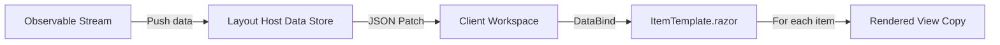

`ItemTemplateControl` is MeshWeaver's declarative for-each renderer. Give it a collection and a view template, and it stamps out one copy of that template per item — reactively, keeping the DOM in sync as the collection changes.
<svg xmlns="http://www.w3.org/2000/svg" viewBox="0 0 760 300" style="width:100%;max-width:760px;height:auto;display:block;margin:20px auto;">
  <defs>
    <marker id="arrow" markerWidth="8" markerHeight="8" refX="6" refY="3" orient="auto">
      <path d="M0,0 L0,6 L8,3 z" fill="currentColor" fill-opacity=".6"/>
    </marker>
  </defs>
  <rect x="20" y="30" width="148" height="46" rx="10" fill="#1e88e5"/>
  <text x="94" y="49" text-anchor="middle" font-family="sans-serif" font-size="12" fill="#fff">1. Static Collection</text>
  <text x="94" y="66" text-anchor="middle" font-family="sans-serif" font-size="11" fill="#cce" fill-opacity=".85">T[] / IEnumerable&lt;T&gt;</text>
  <rect x="20" y="102" width="148" height="46" rx="10" fill="#43a047"/>
  <text x="94" y="121" text-anchor="middle" font-family="sans-serif" font-size="12" fill="#fff">2. Observable Stream</text>
  <text x="94" y="138" text-anchor="middle" font-family="sans-serif" font-size="11" fill="#cec" fill-opacity=".85">IObservable&lt;IEnumerable&lt;T&gt;&gt;</text>
  <rect x="20" y="174" width="148" height="46" rx="10" fill="#8e24aa"/>
  <text x="94" y="193" text-anchor="middle" font-family="sans-serif" font-size="12" fill="#fff">3. Template.Bind</text>
  <text x="94" y="210" text-anchor="middle" font-family="sans-serif" font-size="11" fill="#e8d" fill-opacity=".85">Nested parent + children</text>
  <rect x="20" y="246" width="148" height="46" rx="10" fill="#f57c00"/>
  <text x="94" y="265" text-anchor="middle" font-family="sans-serif" font-size="12" fill="#fff">4. Workspace Stream</text>
  <text x="94" y="282" text-anchor="middle" font-family="sans-serif" font-size="11" fill="#fed" fill-opacity=".85">GetStream&lt;T&gt;() TypeSource</text>
  <line x1="168" y1="53" x2="268" y2="140" stroke="currentColor" stroke-opacity=".45" stroke-width="1.5" marker-end="url(#arrow)"/>
  <line x1="168" y1="125" x2="268" y2="148" stroke="currentColor" stroke-opacity=".45" stroke-width="1.5" marker-end="url(#arrow)"/>
  <line x1="168" y1="197" x2="268" y2="158" stroke="currentColor" stroke-opacity=".45" stroke-width="1.5" marker-end="url(#arrow)"/>
  <line x1="168" y1="269" x2="268" y2="170" stroke="currentColor" stroke-opacity=".45" stroke-width="1.5" marker-end="url(#arrow)"/>
  <rect x="272" y="120" width="156" height="60" rx="10" fill="#26a69a"/>
  <text x="350" y="145" text-anchor="middle" font-family="sans-serif" font-size="13" fill="#fff" font-weight="bold">BindMany</text>
  <text x="350" y="163" text-anchor="middle" font-family="sans-serif" font-size="11" fill="#cfe" fill-opacity=".9">ItemTemplateControl</text>
  <line x1="428" y1="150" x2="524" y2="112" stroke="currentColor" stroke-opacity=".45" stroke-width="1.5" marker-end="url(#arrow)"/>
  <line x1="428" y1="150" x2="524" y2="188" stroke="currentColor" stroke-opacity=".45" stroke-width="1.5" marker-end="url(#arrow)"/>
  <rect x="528" y="82" width="156" height="52" rx="10" fill="#5c6bc0"/>
  <text x="606" y="103" text-anchor="middle" font-family="sans-serif" font-size="12" fill="#fff">TemplateBuilderVisitor</text>
  <text x="606" y="120" text-anchor="middle" font-family="sans-serif" font-size="11" fill="#ddf" fill-opacity=".85">Compile expression tree</text>
  <rect x="528" y="162" width="156" height="52" rx="10" fill="#e53935"/>
  <text x="606" y="183" text-anchor="middle" font-family="sans-serif" font-size="12" fill="#fff">ItemTemplate.razor</text>
  <text x="606" y="200" text-anchor="middle" font-family="sans-serif" font-size="11" fill="#fdd" fill-opacity=".85">Render one copy per item</text>
  <line x1="606" y1="134" x2="606" y2="162" stroke="currentColor" stroke-opacity=".35" stroke-width="1.5" marker-end="url(#arrow)"/>
</svg>

*Four data-supply patterns converge into `BindMany` → `ItemTemplateControl`, which compiles the expression tree and stamps one rendered copy per item.*

# Usage Patterns

There are four ways to supply data to `BindMany`, depending on where your collection lives.

## 1. Static Collection

The simplest case: you already have an in-memory array or list.

```csharp
var items = new[] { new User("Alice"), new User("Bob") };
var control = items.BindMany(item => Controls.Label(item.Name));
```

MeshWeaver's `TemplateBuilderVisitor` analyses the expression tree at build time and rewrites property accessors — `item.Name` becomes a `JsonPointerReference("name")` binding. The resulting template is entirely data-driven and renders correctly on the client without any runtime reflection.

## 2. Observable Stream

For collections that change over time, pass an `IObservable<IEnumerable<T>>`. The client re-renders automatically whenever the stream emits.

```csharp
IObservable<IEnumerable<AccessAssignment>> assignmentStream = ...;

var control = assignmentStream.BindMany("assignments", a =>
    Controls.Stack
        .WithOrientation(Orientation.Horizontal)
        .WithView(Controls.Label(a.DisplayLabel))
        .WithView(Controls.Switch(a.IsActive))
);
```

The `id` parameter (`"assignments"`) names the data stream inside the layout host's store. New emissions from the observable propagate to the client as JSON Patch operations — only the changed elements update.

## 3. Nested Inside `Template.Bind`

When you need to bind both a parent object and a child collection within it, combine `Template.Bind` with `Template.BindMany`:

```csharp
return Template.Bind(
    filterEntity,
    x => Template.BindMany(x.Items, y => Controls.CheckBox(y.Value)),
    "myFilter"
);
```

This creates an `ItemTemplateControl` whose `DataContext` points to the parent object's stream, and whose `Data` property is a `JsonPointerReference` into the `items` sub-path of that context. The parent and children share a single coherent data tree.

## 4. Workspace Stream

When your data is already registered as a workspace type (via `WithTypeSource` on a `DataSource`), retrieve it through the workspace and bind with `BindMany`:

```csharp
var stream = host.Workspace.GetStream<MyType>()
    ?.Select(items => items?.AsEnumerable() ?? Enumerable.Empty<MyType>())
    ?? Observable.Return(Enumerable.Empty<MyType>());

var control = stream.BindMany("my_stream_id", item =>
    Controls.Stack.WithView(Controls.Label(item.Name))
);
```

> **Tip:** Unlike the plain observable pattern above, you do not call `SetData` manually here. The workspace's `TypeSource` handles loading from the backing store on initialization and syncing changes whenever a `DataChangeRequest` arrives. The whole persistence and change-tracking pipeline is automatic.

# How Data Binding Works

When `BindMany` compiles the expression tree, `TemplateBuilderVisitor` replaces every property accessor with a `JsonPointerReference`:

```
Expression:  item => Controls.Label(item.DisplayLabel)
Compiled to: Controls.Label(new JsonPointerReference("displayLabel"))
```

On the Blazor client, `ItemTemplate.razor` iterates over the bound collection and renders one copy of the `View` template per item. Each item receives a scoped `DataContext` path:

```
/data/"assignments"/0    -- first item
/data/"assignments"/1    -- second item
```

The template's `JsonPointerReference("displayLabel")` resolves relative to each item's `DataContext`, producing paths like `/data/"assignments"/0/displayLabel`. Pointer resolution is entirely client-side — no round-trip per item.

# Data Flow



| Step | What happens |
|------|-------------|
| 1 | The server-side observable pushes data into the layout host via `SetData` |
| 2 | Changes propagate to the client as JSON Patch operations |
| 3 | `ItemTemplate.razor` subscribes to the data at `DataContext` via `DataBind` |
| 4 | For each element in the array, a copy of `View` is rendered with an item-scoped `DataContext` |

# Live Demo

The cell below builds a small static collection and renders it with `BindMany`, so you can see the template expansion in action:

```csharp --render ItemTemplateDemo --show-code
record UserRow(string Name, string Role);

var rows = new[]
{
    new UserRow("Alice",   "Admin"),
    new UserRow("Bob",     "Editor"),
    new UserRow("Charlie", "Viewer"),
};

MeshWeaver.Layout.Controls.Stack
    .WithView(MeshWeaver.Layout.Controls.Html("<b>Users</b>"))
    .WithView(
        rows.BindMany(u =>
            MeshWeaver.Layout.Controls.Html($"<div>{u.Name} — <em>{u.Role}</em></div>")
        )
    )
```

# Reference

| Resource | Path |
|----------|------|
| `Template.BindMany` methods | `src/MeshWeaver.Layout/Template.cs` |
| `ItemTemplateControl` record | `src/MeshWeaver.Layout/ItemTemplateControl.cs` |
| Blazor renderer | `src/MeshWeaver.Blazor/Components/ItemTemplate.razor` |
| Layout test examples | `test/MeshWeaver.Layout.Test/LayoutTest.cs` — see `TestItemTemplate`, `TestDataBoundCheckboxes` |
