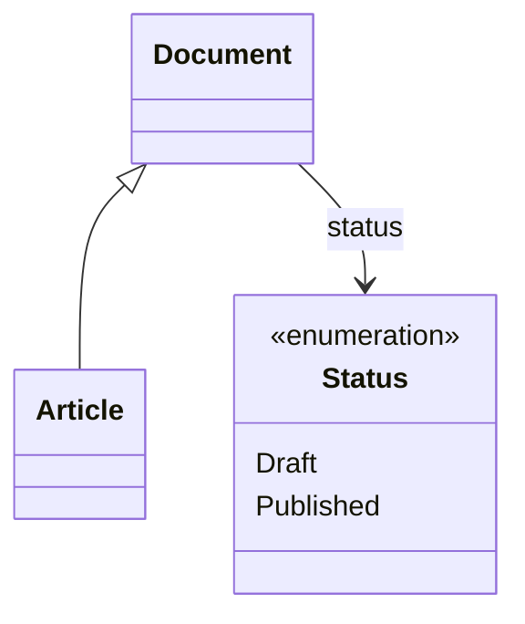

The **data model view** renders a set of domain types as a [Mermaid](https://mermaid.js.org/) class diagram — classes with their properties, and relationship arrows between types a property references — with clickable nodes that drill into a per-type detail page (properties table, inherited vs declared, derived types). The same view backs two places:

- the **`DataModel`** layout area for a data domain, and
- a node type's **`$Model`** area, which shows the data model of that type's *instances* as a diagram with a **toggle to the JSON schema** and back.

---

# The Mermaid ⇄ JSON toggle

On a node type's `$Model` area (and in the Overview's *Data model* section), the view is a [Tabs](/Doc/GUI/ContainerControl/Tabs) control:

- **Diagram** — the Mermaid class diagram of the instance types.
- **JSON** — the JSON schema of the content type.

When only one representation is available (no schema, or no diagrammable types), it renders that one bare without tabs.

For a dynamically-compiled node type, the instance model is resolved *passively* — from the type's latest published assembly via the assembly store — so opening `$Model` never triggers a compile. Static types resolve from their registered hub configuration.

---

# Reusable cores

Two public helpers on `DataModelLayoutArea` produce the markdown, parameterized by a `linkBase` so the same code serves `/DataModel` and `/{nodeType}/$Model`:

```csharp
// Mermaid classDiagram for an explicit set of types.
string diagram = DataModelLayoutArea.BuildMermaidDiagram(
    seedTypes,         // the types to seed each diagram group with
    allDomainTypes,    // lookup used to resolve property targets / derived types
    linkBase: "/MyNode/$Model");   // href prefix for clickable class nodes

// Per-type detail page (properties table + derived types), links under linkBase.
UiControl detail = DataModelLayoutArea.RenderTypeDetails(typeDef, allDomainTypes, "/MyNode/$Model");
```

The diagram seeds from the given types and grows the group to include the domain types reached through their properties, so a single seed type pulls in the types it references. Reference properties become relationship arrows labelled by the property name; each class gets a `click … href` into the detail view under `linkBase`.

---

# Mermaid class diagrams in markdown

Class diagrams use characters that are also HTML syntax — the stereotype markers `<<enumeration>>` / `<<interface>>` and the inheritance arrow `<|--`. When a ```` ```mermaid ```` block is rendered, the diagram body is **HTML-escaped** into its `<div class='mermaid'>` host, so those `<` characters survive the HTML round-trip (the browser and the server-side parser decode the entities back to the literal mermaid source before Mermaid reads them). Authoring a diagram in markdown therefore needs no special treatment — write normal Mermaid:

````markdown

````

> Writing the diagram body unescaped was a real defect: the browser parsed `<enumeration>` as a tag and the stereotype line vanished, so every diagram with a stereotype or inheritance arrow failed to render. The renderer now escapes the body and decodes it back on the way to Mermaid.

---

# See Also

- [Tabs](/Doc/GUI/ContainerControl/Tabs) — the Diagram/JSON toggle container
- [Layout Areas](/Doc/GUI/LayoutAreas) — how `$Model` and `DataModel` areas are composed
- [The Node Settings Page](/Doc/GUI/SettingsPage) — the Node Types tab embeds the same model view
