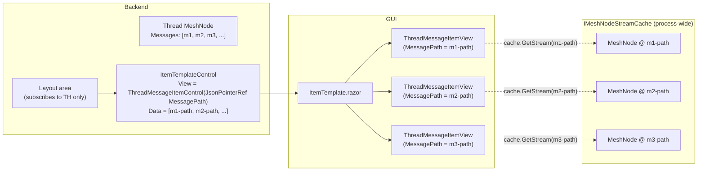

This doc extends [Data Binding in MeshWeaver Layout](xref:GUI/DataBinding) from "one Blazor view bound to one MeshNode" to "a *list* of MeshNodes, each rendered by one Blazor view that binds itself to its own MeshNode stream". The canonical consumer is the thread chat view; the same pattern applies to any list-of-content-cells GUI surface (search results, related-nodes panels, audit trails, etc.).

# The problem

A naive list-of-MeshNodes render emits one `LayoutAreaControl({path}, area)` per id in a `foreach`. The portal then fetches each item's layout area from its per-node hub — **N grain activations, N round-trips before the user sees text**. Streaming content (a chat response cell whose `Text` grows token by token) is even worse: every chunk forces a re-render of the wrapping list area, every time fanning back out to N per-node fetches.

The MeshWeaver chat view shipped with this shape originally; on a cold open of a 20-message thread the user waited ~2-3 s for cells to materialise. Submitting a new message held the input visible for 200-500 ms (until the satellite cell's layout area replied) before the typed text became readable in chat history.

# The pattern



Read it as three layered subscriptions:

1. **Backend ⇄ thread.** ONE `IMeshNodeStreamCache.GetStream(threadPath)` on the thread's MeshNode. The layout area re-emits the `Messages` id-list every time it changes. Cost: one upstream subscription per *thread*, not per message.
2. **Backend ⇄ ItemTemplate.** The layout area emits a single `ItemTemplateControl` whose `Data` is the id-list (in fact a list of `{ MessagePath, PendingText }` records) and whose `View` is a static `ThreadMessageItemControl` with `JsonPointerReference`s for the per-item fields. The wire format is small; the portal renders one Blazor view per item.
3. **Client ⇄ per-message MeshNode.** Each per-item Blazor view (`ThreadMessageItemView`) opens its own `IMeshNodeStreamCache.GetStream(MessagePath)` and re-renders on every emission. Multiple visible views on the same path share **one** upstream cache handle, so there is no subscription multiplication.

Result:

- **One thread subscription** (not N) at the layout area.
- **N cache subscriptions** at the client — but cached: N upstream handles total, regardless of how many views are visible.
- **Zero per-message hub round-trips for display.** Writes anywhere in the mesh land via the cache emission instantly.
- **Pending text renders immediately.** `PendingText` is shipped in the item record; the view renders it while the satellite cell is being created server-side, then swaps to the live `ThreadMessage.Text` on the first cache emission — same Blazor component, no flicker.

# The contract

| Side | Responsibility |
|---|---|
| **Backend layout area** | Subscribe to the *parent* MeshNode (the thread node) via `IMeshNodeStreamCache.GetStream(parentPath)`. On each emission, recompute the id-list and emit a single `ItemTemplateControl(View = ItemControl with JsonPointerReferences, Data = idList)`. **Never** fetch per-item content. **Never** open one stream per id at the backend. |
| **Per-item static `UiControl`** | Holds the *path* (and any other lookup keys), nothing more. No concrete `Text`, no `ToolCalls`, no `Status`. Properties typed as `object?` so they accept both concrete `string`s (when used outside an ItemTemplate) and `JsonPointerReference`s (when used inside one). |
| **Per-item Blazor view** | Holds `string MessagePath` resolved from the per-item DataContext. In `BindData()`, calls `Hub.ServiceProvider.GetRequiredService<IMeshNodeStreamCache>().GetStream(MessagePath)` and registers the subscription with `AddBinding(...)` so it auto-disposes. On each emission, extracts the fields it renders, sets local fields, calls `InvokeAsync(StateHasChanged)`. Writes back via `cache.Update(MessagePath, fn)`. |

# Worked example — the chat view

## Per-item static control

```csharp
// src/MeshWeaver.Layout/ThreadMessageItemControl.cs
public record ThreadMessageItemControl()
    : UiControl<ThreadMessageItemControl>(ModuleSetup.ModuleName, ModuleSetup.ApiVersion)
{
    public object? MessagePath { get; init; }
    public object? PendingText { get; init; }
}
```

`object?` lets the backend pass either a concrete `string` (`new ThreadMessageItemControl { MessagePath = "User/x/_Thread/t/msg" }`) or a `JsonPointerReference("messagePath")` resolved against the item's slice of the data section.

## Backend layout area

```csharp
// Subscribe to the thread, emit the id-list as an ItemTemplate
return cache.GetStream(threadPath)
    .Select(node =>
    {
        var thread = node.Content as Thread;
        var items = thread.Messages
            .Select(id => new { MessagePath = $"{threadPath}/{id}", PendingText = (string?)null })
            .Concat(thread.PendingUserMessages.Values
                .Select(p => new { MessagePath = (string?)null, PendingText = p.Text }))
            .ToList();

        return items.BindMany(item => new ThreadMessageItemControl
        {
            MessagePath = item.MessagePath,
            PendingText = item.PendingText
        });
    });
```

`BindMany` (from `src/MeshWeaver.Layout/Template.cs`) replaces the property accesses with `JsonPointerReference`s and wraps in an `ItemTemplateControl`. Each rendered item's DataContext is `/data/{id}/{i}` so the resolved references resolve to that item's record.

## Per-item Blazor view

```csharp
// src/MeshWeaver.Blazor.Portal/Chat/ThreadMessageItemView.razor.cs
public partial class ThreadMessageItemView
    : BlazorView<ThreadMessageItemControl, ThreadMessageItemView>
{
    private string? messagePath;
    private string? pendingText;
    private bool isPending;
    private string Role = "user";
    private string? messageText;
    private IReadOnlyList<ToolCallEntry>? toolCalls;

    protected override void BindData()
    {
        base.BindData();
        DataBind(ViewModel.MessagePath, x => x.messagePath, (v, _) => v as string ?? v?.ToString());
        DataBind(ViewModel.PendingText, x => x.pendingText, (v, _) => v as string ?? v?.ToString());

        if (string.IsNullOrEmpty(messagePath))
        {
            isPending = !string.IsNullOrEmpty(pendingText);
            return;
        }

        var cache = Hub.ServiceProvider.GetRequiredService<IMeshNodeStreamCache>();
        isPending = !string.IsNullOrEmpty(pendingText);  // pending fallback until the cache emits

        AddBinding(cache.GetStream(messagePath)
            .Where(n => n?.Content is not null)
            .Select(n => ToJsonElement(n.Content!))
            .Subscribe(je =>
            {
                if (isPending) { isPending = false; }  // first emission → drop pending fallback
                Role = je.GetProperty("role").GetString() ?? "user";
                messageText = je.TryGetProperty("text", out var t) ? t.GetString() : null;
                toolCalls = je.TryGetProperty("toolCalls", out var tc)
                    ? tc.Deserialize<List<ToolCallEntry>>(Hub.JsonSerializerOptions)
                    : null;
                InvokeAsync(StateHasChanged);
            }));
    }
}
```

The Razor markup branches on `Role` to pick the input or output sub-render:

```razor
@if (isPending && string.IsNullOrEmpty(messageText))
{
    <div class="chat-item chat-item-pending">@pendingText</div>
}
else if (Role.Equals("user", StringComparison.OrdinalIgnoreCase))
{
    <div class="chat-item chat-item-user">@messageText</div>
}
else
{
    <div class="chat-item chat-item-assistant">
        @messageText
        @foreach (var call in toolCalls ?? [])
        {
            @if (!string.IsNullOrEmpty(call.DelegationPath))
            {
                <DelegationToolCallCardView ViewModel="@CardFor(call)" Stream="@Stream" Area="@($"{Area}/del-{call.DelegationPath}")" />
            }
            else
            {
                <span class="chat-item-toolcall">@call.DisplayName</span>
            }
        }
    </div>
}
```

One Blazor component handles both branches. The chronological order of `Thread.Messages` is preserved because we don't split the list at the backend.

# `JsonPointerReference` for sub-fields

When the per-item body needs to bind a *nested* field (a specific tool call's `Result`, a specific node-change's `Path`), use `JsonPointerReference` with a `DataContext` that points at the item's path in the data section — same shape as `EditorControl` in [DataBinding.md](xref:GUI/DataBinding). The framework resolves the reference at render time against the per-item slice.

For most consumers, the per-item Blazor view's cache subscription already gives you the full `MeshNode.Content` (a `ThreadMessage`, in our case). You read sub-fields directly off that object in the `Subscribe(...)` callback — no further `JsonPointerReference` needed. `JsonPointerReference` is useful when the sub-field comes from a *different* data shape than the bound MeshNode (e.g., the layout area's own derived state).

# The `IMeshNodeStreamCache` invariant

> All cross-hub MeshNode reads in the GUI go through `IMeshNodeStreamCache`. Never open `workspace.GetRemoteStream<MeshNode, MeshNodeReference>(addr, ...)` directly in a Blazor view.

Why:

- **Shared upstream.** The cache opens *one* `SubscribeRequest` per path, under `ImpersonateAsSystem`, with `Replay(1)` + eager `Connect()`. Every downstream subscriber — your view, the routing layer, NodeType enrichment, anywhere else in the process — joins the same observable. Going around the cache opens a *separate* handle; writes through one are not seen by readers of the other. This was the bug behind compile-state-never-landing in 2026-Q2.
- **Write coherence.** `cache.Update(path, fn)` writes through the same shared handle. Every reader observes the patch through their own subscription on that handle, in order.
- **Identity stability.** Eager `Connect()` under System impersonation means the cache's upstream identity is fixed at process startup. Downstream subscribers apply their own `AccessContext` at consumption — RLS still applies on the read side; the cache is the infrastructure layer.

Resolution in Blazor:

```csharp
var cache = Hub.ServiceProvider.GetRequiredService<IMeshNodeStreamCache>();
```

The cache is registered on the mesh hub by `services.AddPartitionedInMemoryPersistence` / `AddPartitionedPostgreSqlPersistence` (`src/MeshWeaver.Hosting/Persistence/PersistenceExtensions.cs:682-683`). In Blazor server, the Blazor circuit's `Hub.ServiceProvider` is the mesh hub's service provider — same instance.

# Anti-patterns

| ❌ Wrong | Why | ✅ Right |
|---|---|---|
| `foreach (var id in ids) { ... new LayoutAreaControl($"{thread}/{id}", area) ... }` | N grain activations, N round-trips on cold open | `items.BindMany(i => new ItemControl { Path = i.Path })` once; per-item Blazor view binds locally |
| `workspace.GetRemoteStream<MeshNode, MeshNodeReference>(addr, ...)` in a Blazor `BindData()` | Opens a per-view handle, bypasses the cache, multiplies upstream subscriptions, write coherence breaks | `cache.GetStream(path)` — shared upstream, write-coherent, identity-stable |
| `.Take(1)` on a display subscription | Snapshot once, view freezes; any later emission ignored | Stay subscribed for the component's lifetime via `AddBinding(...)` |
| Backend baking concrete values: `Controls.Html("<pre>" + body + "</pre>")` | Frozen at render time; no reactive updates | Per-item Blazor view reads fields from the cache emission and dispatches markup locally |
| `await meshQuery.QueryAsync<MeshNode>(path)` inside `BindData()` / `OnInitializedAsync` | Lagged index, deadlock-prone | `cache.GetStream(path)` |

# Migration: from `LayoutAreaControl`-per-message to `ItemTemplate`-once

The chat view was the first consumer:

```diff
- @foreach (var msgId in ThreadMessages)
- {
-     var cell = new LayoutAreaControl(
-         $"{threadPath}/{msgId}",
-         new LayoutAreaReference(ThreadMessageNodeType.OverviewArea));
-     <LayoutAreaView ViewModel="@cell" Stream="@Stream" Area="@($"msg-{msgId}")" />
- }
- @foreach (var pendingText in pendingTexts)
- {
-     <div class="thread-chat-pending-message">@pendingText</div>
- }

+ @* One LayoutAreaView for the whole chat list — the backend emits an
+    ItemTemplateControl whose per-item view subscribes to its own cache
+    stream and renders both branches (input / output) inline. *@
+ <LayoutAreaView ViewModel="@GetChatListArea()" Stream="@Stream" Area="@($"chat-list-{threadPath}")" />
```

Network impact: cold open of a 50-message thread went from 50 round-trips ≈ 1.8 s to **one** layout-area emission ≈ 40 ms; subsequent message arrivals just patch the per-message cache and the relevant `ThreadMessageItemView` re-renders. Pending input is visible the instant the user clicks send — there's no waiting on the satellite cell.

# Working example to read

[`src/MeshWeaver.Blazor.Portal/Chat/ThreadMessageItemView.razor.cs`](xref:Blazor.Portal/Chat/ThreadMessageItemView) — single cache subscription on `MessagePath`, role-dispatched render, pending-text fallback.

[`src/MeshWeaver.Blazor.Portal/Chat/DelegationToolCallCardView.razor.cs`](xref:Blazor.Portal/Chat/DelegationToolCallCardView) — *two* cache subscriptions in one view (parent's response cell for the tool call's live `Status`/`Result`, sub-thread for the live `Name`). Demonstrates how to compose multiple cache streams cleanly in `BindData()`.

# Related

- **[Data Binding in MeshWeaver Layout](xref:GUI/DataBinding)** — the single-MeshNode pattern this generalises. Read first.
- **[CQRS — Queries, Reads, Writes, Operations](xref:Architecture/CqrsAndContentAccess)** — why `cache.GetStream(path)` is the canonical read primitive for live displays. Authoritative; never lags.
- **[Requesting Work via stream.Update()](xref:Architecture/RequestViaStreamUpdate)** — the write side of the same primitive. `cache.Update(path, fn)` is how the GUI writes back; the framework propagates the patch through the same shared handle every reader is subscribed to.
- **[Thread Execution Streaming](xref:Architecture/ThreadExecutionStreaming)** — server side of the chat: how `PushToResponseMessage` writes the live text + tool calls that the per-item views render here.
