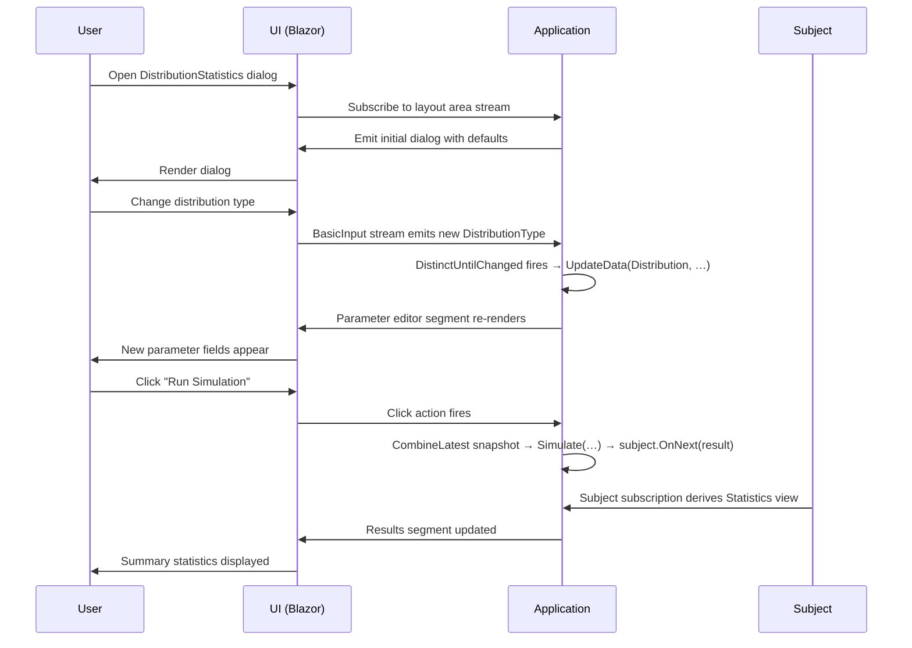

Business dialogs rarely stay simple. They accumulate conditions: switch a section based on a dropdown, trigger a calculation when the user clicks a button, display a spinner while work runs on the server. The imperative approach — `if/else` trees, manual state flags, callbacks wired to callbacks — scales poorly and quickly becomes a maintenance burden.

**Reactive programming** offers a cleaner contract: model the dialog as a graph of data streams and let the framework propagate changes automatically. This page shows how MeshWeaver's `LayoutAreaHost` makes that pattern concrete.

---

# Reactive Programming in Brief

Reactive programming treats application state as a composition of observable streams. Every user action, network message, or timer tick is an event; the application declares how those events transform into new state or side effects.

In MeshWeaver, `IObservable<T>` is the universal currency. The host's `GetDataStream<T>` call exposes any named piece of data as a stream — and any LINQ-style operator (`Select`, `DistinctUntilChanged`, `CombineLatest`, …) can be used to derive new state from it.

> **Background reading:** [Reactive Manifesto](https://reactivemanifesto.org/) · [Reactive Extensions](http://reactivex.io/) · [React](https://react.dev/)

---

# Worked Example: Distribution Statistics Dialog

The example below implements a simulation dialog. A user picks a statistical distribution and a sample count, clicks **Run Simulation**, and sees summary statistics computed entirely on the server.

```csharp --render DistributionDialogPreview --show-code
MeshWeaver.Layout.Controls.Stack
    .WithView(MeshWeaver.Layout.Controls.Markdown("## Distribution Statistics\n\nThis page documents how to build reactive dialogs. See the code blocks below for the full implementation pattern."))
    .WithView(MeshWeaver.Layout.Controls.Html(
        "<table><thead><tr><th>Control</th><th>Bound to</th><th>Reactive trigger</th></tr></thead>" +
        "<tbody>" +
        "<tr><td>Sample count</td><td><code>BasicInput.Samples</code></td><td>—</td></tr>" +
        "<tr><td>Distribution selector</td><td><code>BasicInput.DistributionType</code></td><td>Swaps the parameter editor</td></tr>" +
        "<tr><td>Parameter editor</td><td><code>Distribution</code></td><td>Re-rendered on type change</td></tr>" +
        "<tr><td>Run button</td><td>Click action</td><td>Emits to <code>Subject&lt;(double[], TimeSpan)&gt;</code></td></tr>" +
        "<tr><td>Results area</td><td>Subject subscription</td><td>Updated on each emission</td></tr>" +
        "</tbody></table>"))
```

## Domain Model

Define distributions as immutable records with sensible parameter defaults. Linking to Wikipedia articles for each distribution keeps reference material close to the type:

```csharp
/// <summary>Distribution base class</summary>
public abstract record Distribution;

/// <summary>
/// Pareto distribution <see ref="https://en.wikipedia.org/wiki/Pareto_distribution"/>
/// </summary>
public record Pareto(double Alpha = 2, double X0 = 1) : Distribution;

/// <summary>
/// Log-normal distribution <see ref="https://en.wikipedia.org/wiki/Log-normal_distribution"/>
/// </summary>
public record LogNormal(double Mu = 1, double Sigma = 1) : Distribution;
```

Immutable records are ideal here: each edit produces a new value, streams can use `DistinctUntilChanged()` reliably, and there is no accidental shared-state mutation between subscribers.

## View Model

The view model holds dialog-specific transient state — it is never persisted to the database:

```csharp
/// <summary>Basic input section for the simulation</summary>
public record BasicInput
{
    /// <summary>Number of samples used in the simulation</summary>
    public int Samples { get; init; } = 1000;

    /// <summary>The chosen distribution type</summary>
    [Dimension<string>(Options = nameof(DistributionTypes))]
    public string DistributionType { get; init; } = "Pareto";
}
```

The `[Dimension<string>(Options = …)]` attribute wires the property to a named options list, automatically rendering it as a dropdown in the generated editor.

## Layout Area Setup

The heart of the dialog is the `DistributionStatistics` method. Read it top-to-bottom as a series of declarations:

```csharp
public static object DistributionStatistics(LayoutAreaHost host, RenderingContext context)
{
    // 1. Seed the dropdown options list.
    host.UpdateData(nameof(DistributionTypes), DistributionTypes);

    // 2. Whenever the user picks a different distribution type, swap out the
    //    parameter record so the parameter editor re-renders with fresh defaults.
    host.RegisterForDisposal(host.GetDataStream<BasicInput>(nameof(BasicInput))
        .Select(x => x.DistributionType)
        .DistinctUntilChanged()
        .Subscribe(t => host.UpdateData(nameof(Distribution), Distributions[t])));

    // 3. A Subject holds the heavyweight simulation result on the server.
    //    Only the rendered markdown summary is pushed to the client.
    var subject = new Subject<(double[] Samples, TimeSpan Time)>();

    return Controls.Stack
        .WithView(host.Edit(new BasicInput(), nameof(BasicInput)), nameof(BasicInput))
        .WithView(host.GetDataStream<Distribution>(nameof(Distribution))
            .Select(x => x.GetType())
            .DistinctUntilChanged()
            .Select(t => host.Edit(t, nameof(Distribution))))
        .WithView(Controls.Button("Run Simulation")
            .WithClickAction(ctx =>
            {
                // Read the latest form values synchronously from both streams, then
                // run the simulation. CombineLatest + Take(1) gives us a snapshot of
                // the current state without any async plumbing.
                host.Stream.GetDataStream<BasicInput>(nameof(BasicInput))
                    .CombineLatest(host.Stream.GetDataStream<Distribution>(nameof(Distribution)))
                    .Take(1)
                    .Subscribe(t => subject.OnNext(Simulate(t.First, t.Second)));
                return Task.CompletedTask;
            }))
        .WithView(subject
            .Select(x => x.Statistics())
            .StartWith(Controls.Markdown("### Click to run simulation")));
}
```

---

# Key Patterns

## LayoutAreaHost — the dialog's "island"

`LayoutAreaHost` is the server-side container that backs a layout area. It owns the named data slots that the UI is synchronized with. Three responsibilities emerge naturally:

| Responsibility | How |
|---|---|
| Seed reference data (dropdown options) | `host.UpdateData(name, value)` |
| React to form changes | `host.GetDataStream<T>(name)` + LINQ operators + `Subscribe` |
| Hold heavyweight results server-side | `Subject<T>` — only derived views reach the client |

All subscriptions created inside the host must be registered for disposal with `host.RegisterForDisposal(...)` so they are cleaned up when the layout area closes.

## Subject — server-side result bus

`Subject<T>` is an observable that you push values into explicitly (it implements both `IObserver<T>` and `IObservable<T>`). Storing the raw `double[]` sample array in a Subject rather than in a named data slot means:

- **No serialization cost** — the array never crosses the SignalR wire.
- **Clean separation** — the button's click handler is a pure producer; the results view is a pure consumer.
- **Composability** — you can pipe the Subject through additional operators (throttle, buffer, error-handling) before connecting to the view.

## Declarative composition

The return value of the layout area method is a static description of what the dialog looks like as a function of its data streams. The framework re-evaluates view segments automatically when the underlying streams emit:

1. Identify which data the segment depends on.
2. Express the segment as a stream transformation (`Select`, `CombineLatest`, …).
3. Return the composition — no manual `if/else` re-render triggers required.

---

# Interaction Flow



---

# Why Reactive?

| Concern | Imperative approach | Reactive approach |
|---|---|---|
| **Complexity** | Grows with each conditional | Declared once as a stream graph |
| **State consistency** | Requires careful synchronization | Streams guarantee order and freshness |
| **Maintainability** | Business logic scattered in callbacks | Logic lives next to the domain model |
| **Testability** | Mocking UI interactions is fragile | Pure stream-to-stream transformations are trivially testable |
| **Server/client split** | Manual serialization decisions | Subject keeps heavy data server-side automatically |
