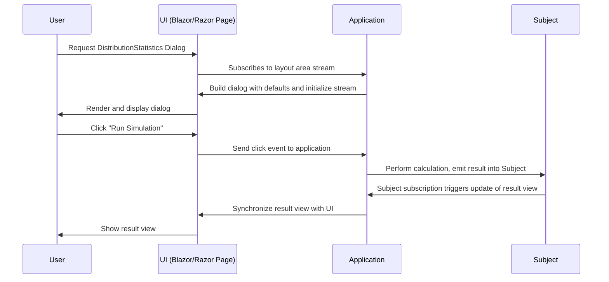

In typical business applications, we often encounter dialogs which contain complex business logic. We need to react on user interaction, switch parts depending on certain settings, compute results and display them. Reactive design is a low-complexity way of achieving this.

# Reactive Programming Concepts

Reactive programming was made popular in the early 2010s by the [Reactive Manifesto](https://reactivemanifesto.org/) and libraries such as [Reactive Extensions](http://reactivex.io/) and [React](https://react.dev/).

The basic idea is to model applications as a stream of events:
- User interactions (clicks, text changes)
- Network messages
- Timer events

The application reacts to these events by executing actions - updating the UI, computing values, or sending messages.

---

# Example: Distribution Statistics Dialog

This example demonstrates a dialog for simulating statistical distributions:

```csharp --render Dialog
using static MeshWeaver.Layout.Controls;
using MeshWeaver.Mesh;
LayoutArea(new ApplicationAddress("Documentation"), "DistributionStatistics")
```

---

# Domain Model

Define distributions as immutable records with sensible defaults:

```csharp
/// <summary>
/// Distribution base class
/// </summary>
public abstract record Distribution;

/// <summary>
/// Pareto distribution <see ref="https://en.wikipedia.org/wiki/Pareto_distribution"/>
/// </summary>
public record Pareto(double Alpha = 2, double X0 = 1) : Distribution;

/// <summary>
/// LogNormal distribution <see ref="https://en.wikipedia.org/wiki/Log-normal_distribution"/>
/// </summary>
public record LogNormal(double Mu = 1, double Sigma = 1) : Distribution;
```

Linking to Wiki articles for parameter definitions keeps documentation close to the model. Defaults specified here are used directly in the dialog.

---

# View Model

The view model captures dialog-specific state (not persisted to database):

```csharp
/// <summary>
/// Basic input section for the simulation
/// </summary>
public record BasicInput
{
    /// <summary>
    /// Number of samples used in the simulation
    /// </summary>
    public int Samples { get; init; } = 1000;

    /// <summary>
    /// The choice of the distribution type
    /// </summary>
    [Dimension<string>(Options = nameof(DistributionTypes))]
    public string DistributionType { get; init; } = "Pareto";
}
```

---

# Layout Area Setup

The reactive dialog wires together inputs, distribution selection, and results:

```csharp
public static object DistributionStatistics(LayoutAreaHost host, RenderingContext context)
{
    host.UpdateData(nameof(DistributionTypes), DistributionTypes);

    host.RegisterForDisposal(host.GetDataStream<BasicInput>(nameof(BasicInput))
        .Select(x => x.DistributionType)
        .DistinctUntilChanged()
        .Subscribe(t => host.UpdateData(nameof(Distribution), Distributions[t])));

    var subject = new Subject<(double[] Samples, TimeSpan Time)>();

    return Controls.Stack
        .WithView(host.Edit(new BasicInput(), nameof(BasicInput)), nameof(BasicInput))
        .WithView(host.GetDataStream<Distribution>(nameof(Distribution)).Select(x => x.GetType())
            .DistinctUntilChanged()
            .Select(t => host.Edit(t, nameof(Distribution))))
        .WithView(Controls.Button("Run Simulation")
            .WithClickAction(
                async _ =>
                {
                    var input = await host.Stream.GetDataAsync<BasicInput>(nameof(BasicInput));
                    var distribution = await host.Stream.GetDataAsync<Distribution>(nameof(Distribution));
                    subject.OnNext(Simulate(input, distribution));
                }))
        .WithView(subject.Select(x => x.Statistics()).StartWith(Controls.Markdown("### Click to run simulation")));
}
```

---

# Key Patterns

## LayoutAreaHost

The host is an "island" where the layout area lives, synchronized with the view:

1. **Initialize reference data** - `UpdateData` sets options for dropdowns
2. **React to changes** - Subscribe to data streams with `GetDataStream<T>`
3. **Use Subject for computation results** - Keeps large results server-side

## Subject (Publish-Subscribe)

The `Subject<T>` implements the [Publish-Subscribe Pattern](https://en.wikipedia.org/wiki/Publish%E2%80%93subscribe_pattern):

- Stores simulation results on the server
- Only the rendered markdown table is synchronized to the UI
- Avoids sending large data arrays to the client

## Declarative Composition

No imperative specification needed:
1. Know what data you need
2. Get it from the layout area or subject
3. Do your computation
4. Update the layout area

---

# Interaction Flow



---

# Benefits

| Aspect | Reactive Approach |
|--------|------------------|
| **Complexity** | Lower - declare what should happen, not how |
| **Robustness** | Events are processed in order, state is explicit |
| **Maintainability** | Business logic stays close to domain model |
| **Testability** | Pure functions transform streams to streams |
