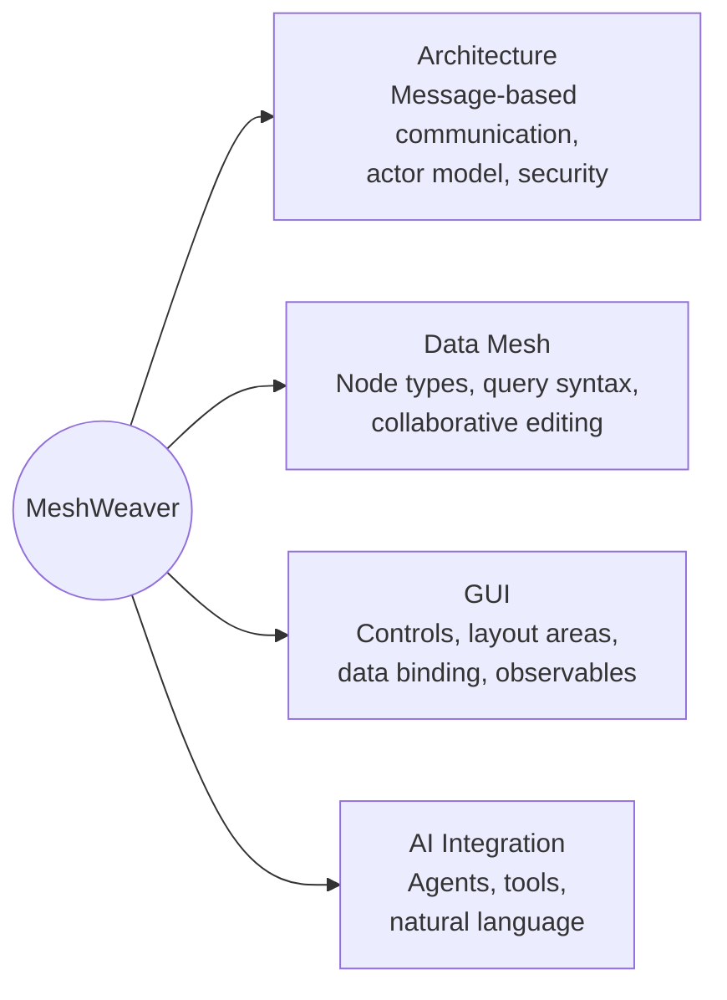

  
Welcome to MeshWeaver

  

    Your data, your mesh, your AI. Every piece of data is an addressable node you can query, transform, and collaborate on — with AI agents ready to help at every step.
  

  
New here? Open the chat and ask anything — the assistant knows the platform inside out.

> **The fastest way to learn MeshWeaver is to ask.** The chat connects you to an AI assistant that understands the entire platform. Try *"What is a data mesh?"*, *"How do node types work?"*, or *"Explain the query syntax."*

---

## Platform at a glance

MeshWeaver is organized around four interconnected pillars. Each section below opens onto its own table of contents — pick a topic that interests you, or scroll down to browse everything.

| Pillar | What you'll find |
|---|---|
| **[Architecture](Architecture)** | Message-based communication, the actor model, access control, and deployment patterns |
| **[Data Mesh](DataMesh)** | Node types, the query syntax, collaborative editing, and data modeling |
| **[GUI](GUI)** | Controls, layout areas, data binding, and reactive observables |
| **[AI Integration](AI)** | Agents, MCP tools, and natural-language access to your mesh |

New to the vocabulary? The **[Glossary](Glossary)** defines every core term in one breath each — mesh node, partition, satellite, hub, stream, and friends.
