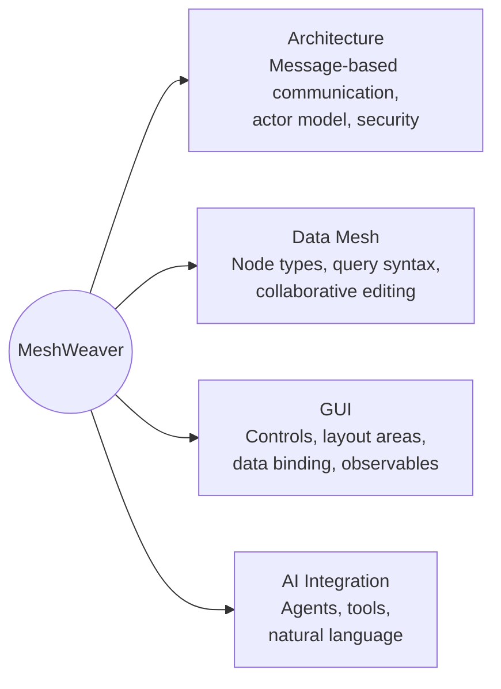

# Welcome to MeshWeaver

**Your data, your mesh, your AI.** MeshWeaver is a distributed data mesh platform where every piece of data is a node you can query, transform, and collaborate on — with AI agents ready to help at every step.

> **New here?** Just open the chat below and ask anything. Our AI assistant knows the platform inside out and will guide you through whatever you need.

---

## Platform Overview

---

## Explore by Topic

### [Architecture](Architecture)
The backbone of MeshWeaver: message-based communication, actor model, partitioned persistence, access control, and UI streaming. Start here to understand how the platform works under the hood.

### [Data Mesh](DataMesh)
Everything about nodes: node types, query syntax, unified content references, interactive markdown, collaborative editing, and CRUD operations. The data layer that powers all of MeshWeaver.

### [GUI](GUI)
Build reactive UIs from C# code: editors, data grids, layout areas, data binding, observables, container controls, and attributes. No frontend framework required.

### [AI Integration](AI)
MeshPlugin tools, agent definitions, model selection, remote control, and natural language interfaces. Let AI agents work alongside your data mesh.

---

## Get Started in Seconds

You don't need to read pages of documentation. Just **ask**. Here are some things you can try:

- *"What is a data mesh?"*
- *"Show me how node types work"*
- *"How do I create a custom node type?"*
- *"Explain the query syntax"*
- *"How does access control work?"*

---

## Ask Anything

Don't search — just ask. The chat below connects you to an AI assistant that understands the entire MeshWeaver platform.
