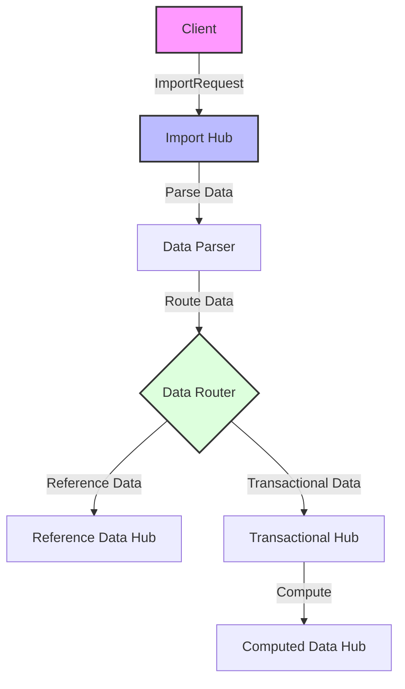

# MeshWeaver.Import

MeshWeaver.Import is a powerful module for importing data into the MeshWeaver data ecosystem. It supports complex data import scenarios with distributed processing capabilities, allowing data to be imported, transformed, and distributed across multiple message hubs.

## Overview

The library provides:
- Flexible data import from various sources
- Support for multiple data types in a single import
- Distributed processing through message hubs
- Activity logging and status tracking
- Data transformation and routing

## Architecture

### Import Flow


## Usage Examples

### Basic Import
Import reference data (e.g., Lines of Business):

```csharp
// Define import data
var importData = @"@@LineOfBusiness
SystemName,DisplayName
1,LoB_one
2,LoB_two";

// Create and send import request
var client = GetClient();
var importRequest = new ImportRequest(importData);
var importResponse = await client.AwaitResponse(
    importRequest,
    o => o.WithTarget(new ImportAddress(2024))
);

// Check import status
importResponse.Message.Log.Status.Should().Be(ActivityStatus.Succeeded);
```

### Multiple Types Import
Import multiple data types in a single request:

```csharp
var multiTypeData = @"@@LineOfBusiness
SystemName,DisplayName
1,LoB_one
2,LoB_two

@@BusinessUnit
SystemName,DisplayName
BU1,BU_one
2,BU_two";

var importRequest = new ImportRequest(multiTypeData);
var response = await client.AwaitResponse(
    importRequest,
    o => o.WithTarget(new ImportAddress(2024))
);
```

### Distributed Import Processing
Example of a complex distributed import scenario that processes transactional data and computes derived values:

```csharp
// Define distributed import data
var distributedData = @"@@TransactionalData
Id,Year,LoB,BusinessUnit,Value
1,2024,1,1,1.5
2,2024,1,2,2
3,2024,2,1,3
4,2024,2,2,4";

// Configure import with format
var importRequest = new ImportRequest(distributedData) {
    Format = "CashflowImport"  // Specify import format
};

// Send to import hub
var importResponse = await client.AwaitResponse(
    importRequest,
    o => o.WithTarget(new ImportAddress(2024))
);

// Data is automatically distributed and processed:
// 1. Transactional data is stored in TransactionalDataHub
// 2. Computed values are generated in ComputedDataHub
```

## Configuration

### Message Hub Setup
Configure routing for distributed processing:

```csharp
configuration.WithRoutes(forward =>
    forward
        .RouteAddressToHostedHub<ReferenceDataAddress>(c => 
            c.ConfigureReferenceDataModel())
        .RouteAddressToHostedHub<TransactionalDataAddress>(c => 
            c.ConfigureTransactionalModel((TransactionalDataAddress)c.Address))
        .RouteAddressToHostedHub<ComputedDataAddress>(c => 
            c.ConfigureComputedModel((ComputedDataAddress)c.Address))
        .RouteAddressToHostedHub<ImportAddress>(c => 
            c.ConfigureImportHub((ImportAddress)c.Address))
);
```

## Features

1. **Data Type Support**
   - Reference data (e.g., LineOfBusiness, BusinessUnit)
   - Transactional data
   - Computed data
   - Custom data types

2. **Import Formats**
   - CSV with type headers (@@TypeName)
   - Multiple types in single import
   - Custom format handlers

3. **Distributed Processing**
   - Message-based routing
   - Parallel processing
   - Computed value generation
   - Data aggregation

4. **Activity Tracking**
   - Import status monitoring
   - Error handling
   - Activity logging
   - Progress tracking

## Best Practices

1. **Data Organization**
   ```csv
   @@DataType1
   field1,field2
   value1,value2
   
   @@DataType2
   field1,field2
   value1,value2
   ```

2. **Error Handling**
   ```csharp
   try
   {
       var response = await client.AwaitResponse(importRequest, options);
       if (response.Message.Log.Status != ActivityStatus.Succeeded)
       {
           // Handle import failure
       }
   }
   catch (Exception ex)
   {
       // Handle errors
   }
   ```

3. **Data Validation**
   - Validate data before import
   - Check for required fields
   - Verify data relationships
   - Handle duplicates

## Integration

### With Message Hub
```csharp
services.AddMessageHub(hub => hub
    .ConfigureServices(services => services
        .AddImport()
        .AddReferenceData()
        .AddTransactionalData()
        .AddComputedData()
    )
);
```

## Related Projects

- MeshWeaver.Data - Core data framework
- MeshWeaver.Messaging.Hub - Message routing and processing
- MeshWeaver.Activities - Activity tracking and logging
