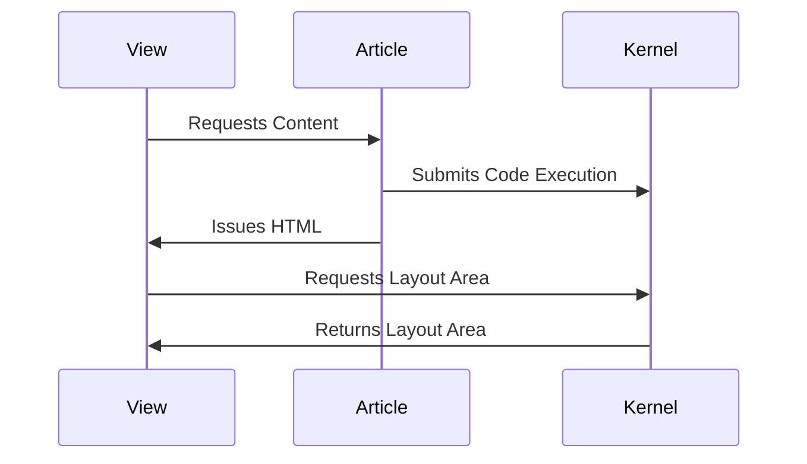

# MeshWeaver.Markdown

## Overview
MeshWeaver.Markdown is a powerful component of the MeshWeaver ecosystem that provides advanced markdown processing with interactive capabilities. This library enables rendering of standard markdown along with executable code blocks, diagrams, and integration with the MeshWeaver layout system for dynamic content visualization.

## Features
- Interactive markdown with executable code blocks
- Code execution via kernel integration
- Metadata and frontmatter support
- Mermaid diagram rendering
- Custom code block rendering options
- Layout area integration for displaying results
- Markdown to HTML conversion
- Code syntax highlighting
- Extensible markdown processing pipeline
- Customizable rendering options

## Interactive Markdown Capabilities

### Metadata (Frontmatter)
Interactive markdown supports YAML frontmatter at the beginning of the file:

```yaml
---
Title: "Interactive Markdown: The Next Generation Reporting"
Abstract: "A brief description of the article content"
Thumbnail: "images/InteractiveMarkdown.png"
VideoUrl: "https://www.youtube.com/embed/6J16W9qcZFY"
Published: "2025-01-26"
Authors:
  - "Roland Bürgi"
Tags:
  - "Documentation"
  - "Conceptual"
  - "Markdown"
---
```

### Executable Code Blocks
Code blocks can be executed and their results displayed:

````markdown
```csharp --render HelloWorld --show-header
"Hello World " + DateTime.Now.ToString()
```
````

Options for code blocks:
- `--render <area>`: Renders the output to the specified layout area
- `--show-header`: Shows the complete code block including the header
- `--show-code`: Shows only the code without the header

### Mermaid Diagrams
Create diagrams using Mermaid syntax:

````markdown

````

## Usage

This component is primarily used in conjunction with the [MeshWeaver.Articles](../MeshWeaver.Articles/README.md) library, which provides a complete solution for managing and displaying markdown-based content. Please refer to the Articles documentation for configuration and implementation details.

### Interactive Markdown Process Flow
The execution flow for interactive markdown:

1. Markdown with code blocks is parsed
2. Code blocks with execution flags are extracted
3. Code is sent to appropriate language kernel for execution
4. Results are captured and rendered in specified layout areas
5. Final HTML with interactive elements is returned


## Key Concepts
- **Interactive Markdown**: Markdown with executable code blocks
- **Code Execution**: Running code within markdown documents
- **Kernel Integration**: Connection to language execution engines
- **Layout Areas**: Named regions for displaying execution results
- **Markdown Metadata**: YAML frontmatter for document properties
- **Rendering Pipeline**: Extensible process for transforming markdown to HTML

## Integration with MeshWeaver
- Works with MeshWeaver.Kernel for code execution
- Integrates with MeshWeaver.Layout for displaying results
- Supports MeshWeaver.Articles for documentation
- Used by MeshWeaver notebooks and reporting features

## Related Projects
- [MeshWeaver.Kernel](../MeshWeaver.Kernel/README.md) - Kernel execution engine
- [MeshWeaver.Articles](../MeshWeaver.Articles/README.md) - Article management
- [MeshWeaver.Layout](../MeshWeaver.Layout/README.md) - Layout rendering

## See Also
Refer to the [main MeshWeaver documentation](../../Readme.md) for more information about the overall project.
