# Specifying User Interfaces

Even for experienced software architects, it is not easy to specify user interfaces. For users, it is even more complex, especially if they have never worked with software projects before.

The current notebook frameworks provide very little interactivity and are not very useful. On the other hand, the tools to provide mockups for user interface designers are not easy to use by non-technical persons and don't allow to include business logic. This makes the process of designing artificial data and views cumbersome. 

Mesh Weaver provides interactive user interfaces even in notebook environments thus allowing for a highly agile way of specifying user interfaces.

## Building a Simple Calculator

In this example, we will program a simple calculator. We will start off by programming the business logic:

```csharp
record Calculator(double Summand1, double Summand2);
static object CalculatorSum(Calculator c) => $"**Sum**: {c.Summand1 + c.Summand2}";
```

Testing the business logic:

```csharp
CalculatorSum(new(1,2))
// Output: **Sum**: 3
```

Now let's create an interactive UI for our calculator:

```csharp
Mesh.Edit(new Calculator(1,2))
.WithStyle(style => style.WithHeight("150px"))
```

We can also display the result as formatted markdown:

```csharp
static object MarkdownSum(Calculator c) => Markdown(CalculatorSum(c));
Mesh.Edit(new Calculator(1,2), MarkdownSum)
    .WithStyle(style => style.WithHeight("200px"))
```

## Architecture Benefits

The business logic is kept on the server and will not be visible or deployed to the client. This is important for business logic, as it can be changed centrally and only view data is exchanged.

### Data Flow

```mermaid
%%{init: {'theme': 'base', 'themeVariables': { 'primaryColor': '#ffcc00', 'edgeLabelBackground':'#ffffff', 'tertiaryColor': '#ffcc00'}}}%%
graph TD
    subgraph Notebook
        A[Data Changed Summand1]
    end

    subgraph Mesh
        B[Route]
        E[Route]
    end

    subgraph Kernel
        C[Compute Sum]
        D[Data Changed Sum]
    end

    A -->|Post| B
    B -->|Route| C
    C -->|Handle| D
    D -->|Post| E
    E -->|Route| A
```



## Key Features

- **Interactive Controls**: Real-time editing with immediate feedback
- **Server-side Logic**: Business rules remain secure and centralized
- **Reactive Updates**: Changes propagate automatically through the mesh
- **Rich Formatting**: Support for markdown, HTML, and custom controls
- **Notebook Integration**: Works seamlessly in Jupyter/Polyglot notebooks

## Use Cases

1. **Rapid Prototyping**: Quickly mock up interfaces with real business logic
2. **User Requirements**: Allow non-technical users to interact with actual functionality
3. **Design Validation**: Test user workflows before full implementation
4. **Documentation**: Create interactive examples in documentation
5. **Training**: Provide hands-on learning experiences

## Getting Started

To use interactive UI specification in MeshWeaver:

1. Install the MeshWeaver Connection package:
   ```
   #r "nuget:MeshWeaver.Connection.Notebook, 2.0.0-preview1"
   ```

2. Connect to your MeshWeaver instance:
   ```
   #!connect mesh https://localhost:65260/kernel --kernel-name mesh
   ```

3. Import the necessary namespaces:
   ```csharp
   using MeshWeaver.Layout;
   using MeshWeaver.Mesh;
   using static MeshWeaver.Layout.Controls;
   using Microsoft.DotNet.Interactive.Formatting;
   ```

4. Start building interactive controls with `Mesh.Edit()` and other layout controls

This approach enables a new level of collaboration between technical and non-technical stakeholders in the software development process.
